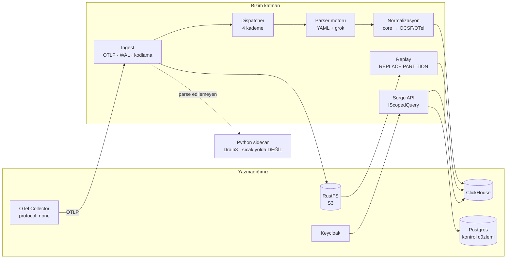

# F1 kapanışı

On iki ticket'ın hepsi kapandı. Bu belge **kodun bugünkü hâlini** anlatıyor;
[F1 teknik plan](../f1-teknik-plan/index.md) yazıldığı günkü niyeti anlatıyor ve
ikisi birkaç yerde ayrışıyor. Ayrıştığı yerler aşağıda gerekçesiyle yazılı.

F2'ye başlarken okunacak belge budur.

## Ne çalışıyor



| Ticket | Sonuç |
| --- | --- |
| T01 İskelet + CI | 14 proje, net10.0, Testcontainers, üç işli CI |
| T02 Depolama + kapsam kapısı | ClickHouse `events`/`change_events`, `IScopedQuery`, mimari testler |
| T03 Ingest | OTLP/HTTP, WAL, backpressure, kodlama tespiti + NFC |
| T04 Ham arşiv | RustFS yazıcı, Postgres manifest, scrub |
| T05 Parser motoru | YAML şema, kendi grok derleyicimiz, `lint`/`test`/`try`/`coverage` |
| T06 Dispatcher | Dört kademe, Aho-Corasick ön filtre, kaynak→grup ataması |
| T07 Normalizasyon | `core` alanları, OCSF ve OTel türetme |
| T08 Vendor kataloğu | FortiGate, Cisco ASA, MikroTik, nginx + altın örnekler |
| T09 Kimlik | Keycloak realm-as-code, OIDC, collector servis hesabı |
| T10 API | events · raw · sources · changes · health · replay · parsers |
| T11 Replay | Gölge tablo, `REPLACE PARTITION`, kuru koşu fark raporu |
| T12 Sidecar | Drain3 + pySigma imajı, devre kesici, canlı ölçüm |

## Planla ayrıştığı yerler

| Konu | Plan | Sevk edilen | Neden |
| --- | --- | --- | --- |
| Syslog ayrıştırma | Collector RFC modunda ayrıştırsın | Collector yalnızca çerçeveliyor (`protocol: none`), ayrıştırmanın tamamı YAML motorunda | OTel syslog receiver ham satırı koruyamıyor; ham arşiv+replay hedefiyle doğrudan çelişiyordu. Yan kazanç: replay'de birebir aynı kod koşuyor |
| Grok | Hazır kütüphane | ~350 satır kendi derleyicimiz | `grok.net` PCRE.NET üstünde ve orada `NonBacktracking` karşılığı yok. Parser YAML'ı 50 kişilik kurumdan geliyor; dikkatsiz tek pattern ingest'i durdurur |
| Pattern seti | Logstash `legacy` | `legacy` + `bizigo-v1` kaplaması | Upstream'in `IPV4`/`TIME`'ındaki lookaround her ağ pattern'ine bulaşıyordu; doğrusal motor fiilen hiç kullanılmıyordu |
| `POST /v1/parsers` | Uçtan parser yayınlama | Okuma + `POST /v1/parsers/try` | Yayın ucu, taslak→inceleme→yayın akışı olmadan kataloğu tek isteğin bozabileceği yere çevirirdi. O akış F2'nin |
| RCA kanıt sağlayıcıları | F3 | F5 | "Kanıt kapsamı: hepsi" cevabı metrik+trace+topoloji getiriyor; her biri tek başına F1 büyüklüğünde. Sözleşme F3'te beşini de tanıyor, sağlayıcılar ertelendi |

## Ölçümler

CI'da temiz makinede (`31986261907`):

| Ölçü | Değer |
| --- | --- |
| Birim testleri | **427** geçti, 2 atlandı (canlı sidecar ölçümü) |
| Entegrasyon testleri | **54** geçti |
| Katalog GROK003 | **0** — varsayılan pattern yolunda, bayrak gerekmeden |
| Altın örnek kapsamı | **86/1/0** |
| Birim paketi süresi | CI'da ~17 sn · **yerelde 9 sn** (yüklü makinede; önce 6,5 dk) |

Gerçek yığında ölçülenler (1M satır, yerel compose):

| Sorgu şekli | Sayfa 1 | Derin sayfa |
| --- | --- | --- |
| Filtresiz | 40,7 ms / 377k satır | 38,8 ms / **1M satır** |
| `owner_group` | 45,9 ms / 155k | 57,1 ms / 286k |
| `owner_group` + `source_id` | 17,8 ms / 57k | **13,7 ms / 57k** |

Tam metin: eşleşmeyen sorgu **0 satır** okuyor (indeks sağlam), ama seçicilik
~10-11 karakterden sonra başlıyor — `kullanıcı` (9) atlamıyor,
`用户登录失败，请检查凭据` (12) atlıyor. `idx_body` 13,3 MiB, tablo 29,4 MiB:
**indeks tablonun %45'i**.

**GROK003 zinciri:** 21 → 8 (`IPV4`+`TIME`) → 4 (`YEAR`) → 2 (ASA adres daraltması)
→ **0** (nginx sayı daraltması). Kapsam boyunca 86/1/0 sabit kaldı.

Kaplama varsayılan yola bağlandığında test paketi **45–75 sn'den 11 sn'ye** düştü.
Sebep beklenmedik ama net: geri izlemeye düşen pattern'ler `matchTimeout` ödüyordu
ve o timeout pattern davranışını değil **duvar saatini** ölçüyor.

## Bu fazın en pahalı dersi

Aynı hata sınıfı üç ayrı yerde çıktı ve üçünde de belirtisi "test kararsız"dı:

<user_quoted_section>Duvar saati bütçesi, ölçmek istediğin şeyi ölçmez. Yüklü bir makinedesağlıklı kod bütçeyi aşar; hızlı bir makinede bozuk kod bütçeye sığar.</user_quoted_section>

1. **Grok `matchTimeout`** — geri izlemeye düşen pattern'de zaman aşımı
`parse_status=failed` üretiyordu, yani "motor meşguldü" ile "bu satır uymuyor"
ayırt edilemiyordu. Sağlıklı bir parser karantinaya girebiliyordu.
2. **`MaskCatalog` 250 ms** — `Signature()` zaman aşımında **boş** dönüyor, olay
sessizce etiketsiz kalıyor ve keşif kuyruğuna hiç girmiyor. Format keşif döngüsü
yüklü makinede fark edilmeden bozuluyordu.
3. **`DiscoveryWorker`** — devre açılana kadarki pencerede geri adım yoktu; ölü
sidecar bağlantıyı mikrosaniyede reddettiği için işçi sıkı döngüye giriyordu.
Canlı ölçüm etiketleme yolunun **2,7× yavaşladığını** gösterdi ve sebep
etiketleme değil, o döngünün çaldığı CPU'ydu.

Çözüm her seferinde aynı yöne gitti: **doğrusal zaman garantisi al, zaman aşımını**
**kaldır** — ya da ölçüyü mutlak değil, aynı süreçte alınan bir tabana **göreli**
yap.

Dördüncüsü testlerdeydi: `VendorCatalogTests` `legacy`'yi tek başına yüklüyordu,
yani **sevk edilmeyen** bir yapılandırmayı sınıyordu — ve tam da geri izleyen o.
Artık üretimin kütüphanesini kullanıyor, ve yeni bir bekçi kataloğun sıfır
GROK003 verdiğini `dotnet test` içinde sabitliyor.

Beşincisi de testlerdeydi ve en pahalısıydı: `DiscoveryWorkerTests` arka plan
görevini başlatıp etkiyi **10 saniyelik duvar saati bütçesiyle yokluyordu**. Aynı
commit CI'da 14 saniye, yerelde **6,5 dakika** sürüyordu ve her koşumda başka bir
test düşüyordu. Çözüm zamanlamayı ayarlamak değil, denklemden çıkarmak oldu:
`ExecuteAsync` artık `RunTurnAsync`'e devrediyor ve testler turu doğrudan
çağırıyor. Paket **9 saniyeye** indi, sekiz ardışık koşum temiz.

Bu beşinin ortak dersi, her seferinde aynı yöne çıktı: **doğrusal zaman garantisi**
**al ve zaman aşımını kaldır**, ya da ölçüyü mutlak değil aynı süreçte alınan bir
tabana göreli yap, ya da beklemeyi bir sinyalle değiştir. Duvar saati hiçbirinde
doğru cevap değildi.

## Bilerek yapılmayanlar

| Ne | Neden |
| --- | --- |
| `bizigo replay` CLI komutu | CLI'nin tüm DI grafiğini (ClickHouse + Postgres + S3 + katalog) barındırması gerekiyordu; API ucu aynı yeteneği veriyor |
| Uçtan parser yayınlama | Gözden geçirme akışı olmadan katalog kırılganlaşır — F2 |
| Kataloğun geri kalanı (PAN-OS, Juniper, F5, HAProxy) | Motor dört vendor'la gerçek yükü gördü; kalanı F2'deki editörle daha ucuz |
| `BASE10NUM`'un paylaşılan sette daraltılması | Atomik grup `YEAR`'daki gibi etkisiz **değil**: kaldırmak `%{NUMBER}\\.%{NUMBER}` davranışını **genişletiyor**. Bağlama özel çözüldü |

## Doğrulama turu — yedi iddia sınandı, beş hata çıktı

Bu bölüm önce "yazıldı ama ölçülmedi" listesiydi. Liste kapatıldı, ve kapatma
işleminin kendisi bu fazın en değerli çıktısı oldu: **doğrulanmamış her katman**
**kırıktı.**

| İddia | Sonuç |
| --- | --- |
| Uçtan uca bayt sadakati | ✅ 103 bayt girdi, 103 bayt çıktı, sha256 birebir — ama yol **beş kez** kırıldı (aşağıda) |
| Keycloak giriş akışı | ✅ `analyst.core` → `/network/core`, `analyst.edge` → `/network/edge`; collector yalnızca `ingest` |
| Keyset sayfalama | ⚠️ **koşullu** — sıralama anahtarının tam öneki gerekiyor |
| Çok dilli tam metin | ⚠️ **koşullu** — ~10-11 karakter eşiği var, alfabeden bağımsız |
| OpenAPI şeması | ✅ 3.1.1, 18 yol, zorunlu alanlar tam |
| Replay canlı ingest'i bozmuyor | ⏸ hâlâ ölçülmedi — yük altında sınanmadı |
| Kuru koşu = gerçek çalıştırma | ⏸ hâlâ uçtan uca tek testte gösterilmedi |

### Uçtan uca ilk deneme beş kez kırıldı

Her biri bir öncekini düzeltmeden **görünmüyordu** — hata mesajları da sırayla
yanlış yere işaret ediyordu.

| # | Katman | Hata | Belirti |
| --- | --- | --- | --- |
| 1 | Keycloak | `KC_HOSTNAME` yok, issuer istek host'undan türüyor | Collector `keycloak:8080` alıyor, API `localhost:8180` bekliyor → **401** |
| 2 | Keycloak | Servis hesabı token'ında `aud` hiç yok | 401 |
| 3 | API | `MapInboundClaims` varsayılan `true` | `roles` görünmez → **403**. Kod yorumu "düz adlarla okunuyor" diyordu ama anahtar çevrilmemişti |
| 4 | API | gzip açılmıyor | OTLP dışa aktarıcısı **varsayılan** gzip → "invalid wire type"; mesaj sıkıştırmadan hiç bahsetmiyor |
| 5 | Ham okuma | Manifest mikrosaniye, ClickHouse `DateTime64(3)` | Kırpılan `ts` daima `ts_from`'dan küçük → tek olaylı nesne **hiç bulunamıyor**; 404 "henüz yüklenmemiş olabilir" diyerek yanlış yere yönlendiriyor |

Ayrıca realm dosyası **iki kez** Keycloak'ı hiç başlatmadı (`_comment`,
`postLogoutRedirectUris`), `admin.bizigo` `firstName`/`lastName` eksikliğinden
giriş yapamıyordu, ve `ClickHouseEventSink.DisposeAsync` atılmış semaforu
kullanıp **açılış hatasının yerine geçiyordu**.

### En sessiz olan: denetim kimliği

Realm JSON'unda `clientScopes` dizisi verildiği için Keycloak **yerleşik**
**scope'ları hiç oluşturmuyor**; import sonrası realm'de yalnızca `bizigo-claims`
ve `offline_access` vardı. İstemcilerin `defaultClientScopes` listesindeki
`profile`/`email`/`roles` **sessizce düşmüştü**.

Keycloak 24+ `sub`'ı `basic` scope'una taşıdığı için kullanıcı token'ında `sub`
yoktu, `preferred_username` hiçbir token'da yoktu. **Yetkilendirme çalışmaya devam**
**ediyordu** — roller yerindeydi — dolayısıyla hiçbir belirti üretmiyordu. Kırılan
şey "bu isteği kim yaptı" sorusunun cevabıydı.

Çözüm yerleşik scope'ları dosyaya kopyalamak değil, ihtiyacımız olan claim'leri
kendi scope'umuza yazmak oldu: Keycloak sürümlerinden bağımsız ve dosyanın var
olma sebebiyle tutarlı.

### Beş bekçi — hepsi kırmızı yanabildiği doğrulanmış

Bir bekçi testinin değeri kırmızı yanabilmesinde. Her biri hata geri konularak
sınandı, sonra geri alındı.

| Test | Ne tutuyor | Konteyner? |
| --- | --- | --- |
| `KeycloakRealmTests` (9) | Yorum alanı, `postLogoutRedirectUris`, hayalet scope, ad/soyad, `KC_HOSTNAME`, claim mapper'ları | ❌ gerekmiyor |
| `ClaimMappingTests` (3) | `MapInboundClaims` kapalı; issuer/audience doğrulaması açık | ❌ |
| `OtlpBodyReadTests` (6) | gzip açma, zip bomb sınırı, bilinmeyen kodlama | ❌ |
| `RawEventLocatorTests` (4) | Mikrosaniye/milisaniye kırpılması, payın dar kalması | ✅ |

**Beş hatanın dördü konteyner gerektirmeden yakalanabiliyordu** — baştan beri
dosyada okunabilir birer sözleşme ihlaliydiler.

## Kapanan iki tasarım kararı

### Maskelerde duvar saati yerine uzunluk sınırı

`MaskCatalog`'un 250 ms zaman aşımı **kaldırıldı**, yerine 16 KB'lık girdi
uzunluğu sınırı geldi. Sekiz maske doğrusal motorda; kalan dördü (`IPV6`, `IPV4`,
`BASE16NUM`, `NUMBER`) lookaround taşıdığı için geri izlemede kalıyor ama artık
zaman aşımına tabi değil.

Gerekçe ölçüldü: bu dördünde **sınırsız iç içe niceleyici yok** — hepsi sınırlı
tekrar (`{1,4}`, `{1,3}`) ya da tek düzey `+`. Felaket geri izleme bu yapılarla
mümkün değil, maliyet girdi uzunluğunda doğrusal. Yani korunması gereken tek şey
dev bir satır ve onu uzunluk **deterministik** olarak durduruyor.

Yol boyunca bir yanlış alarm çıktı ve öğreticiydi: ilk syntactic kontrol
`WINPATH`, `UNIXPATH`, `HOSTNAME` ve `IPV4`'ü işaretledi. Ölçünce görüldü ki
felaket geri izleme için ambigü grubun ardından **başarısız olabilecek zorunlu**
**bir parça** gerekiyor; `WINPATH` ve `UNIXPATH`'te öyle bir parça yok. Kontrol
artık yalnızca motorun doğrusal garantisi olmayan maskelere uygulanıyor.

Sınırı aşan satır **sayılıyor** (`SkippedTooLong`) — sessizce boş dönmek,
kaldırılan zaman aşımının en kötü yanıydı. Python tarafında karşılık gerekmedi:
`TemplateAnnotator` boş imzada duruyor, yani uzun satır kuyruğa hiç girmiyor.

### `time_source` kolonu ve etiketler

İkisi de eklendi.

`events` tablosunda **`time_source`** (`parsed` / `observed` / `received`):
`EventNormalizer` zaman damgasını ve nereden geldiğini artık birlikte döndürüyor.
`ReplayDiff` bunu **karşılaştırıyor** — replay'in en değerli kazançlarından biri,
zamanı çözemeyen bir parser'ın düzeltilip `observed` → `parsed` geçişi yapması.
Geçmiş satırlar boş kalıyor: 'parsed' demek onları olduğundan güvenilir,
'received' demek olmadığı kadar şüpheli gösterirdi.

Parser etiketleri **`attrs['bizigo.tags']`** olarak iniyor. Tek anahtarda
birleştiriliyor, etiket başına anahtar açılmıyor — `mapKeys` bloom filtresi anahtar
kümesi üzerinde ve her etiketi ayrı anahtar yapmak o indeksi seyreltirdi.

## F2'ye devredilenler

- React/Next UI, parser editörü ve alert bildirim kanalları
- Kataloğun geri kalanı ve parser yayın akışı (taslak→inceleme→yayın)
- T08'in bulduğu ve ertelenen iki format eksiği — ikisi de
[T08 → T05 geri beslemesi](../t08-motor-geri-beslemesi/index.md)'nde kayıtlı:
`map` dallanamıyor (#5, `extends:` ile çözülecek) ve `expect` "alan yok"
diyemiyor (#6, negatif alan testi yazılamıyor)

### F2'nin arayüzünü doğrudan bağlayan iki ölçüm

Bunlar F2 için "iyi bilgi" değil, **tasarım kısıtı**:

1. **Arama kutusu kısa sorguda tabloyu tarıyor.** İndeks ~10-11 karakterden sonra
seçici. Ya minimum sorgu uzunluğu dayatılmalı, ya `sparseGrams` parametreleri
yeniden ölçülüp indeks büyümesi göze alınmalı. Sessizce bırakmak, kullanıcının
yazdığı her kısa kelimede tam tarama demek.
2. **Kaynak filtresi teşvik edilmeli.** Keyset sayfalama ancak sıralama
anahtarının tam öneki (`owner_group` + `source_id`) verildiğinde sabit; kapsam
kapısı `owner_group`'u zaten ekliyor, eksik olan `source_id`.

### Doğrulanması F2'ye kalan iki iddia

- **Replay sırasında canlı ingest bozulmuyor.** `REPLACE PARTITION` atomik
olduğu için beklenen doğru davranış, ama yük altında sınanmadı.
- **Kuru koşu gerçek çalıştırmayla aynı sonucu veriyor.** Parçalar ayrı test
edildi; uçtan uca tek testte gösterilmedi.

Bu turun dersi ikisini de aciliyetli kılıyor: doğrulanmamış her katman kırık
çıktı, ve hiçbiri kendini belli etmedi.

### Karşılanmayan tek altın örnek — ve arkasındaki gerçek soru

86/1/0'daki **1**, Cisco ASA `network.log` içindeki tek satır:

```
<166>10.1.1.1 %ASA-6-302020: Built outbound ICMP connection for faddr ...
```

Eksik olan parser değil, **satırın kendisi**: PRI ve host var, zaman damgası yok.
`date` adımı `alan 'log_timestamp' yok` diyor ve sonuç `partial` oluyor. Katalog
yazarı bunu biliyor, satırı `_asa_no_timestamp` etiketiyle işaretlemiş.

Yani `partial` burada **doğru** cevap. Boru hattı da doğru davranıyor:
`EventNormalizer.ResolveTimestamp` sırayla `Parsed.Timestamp` → `Raw.ObservedAt`
→ `Raw.ReceivedAt` deniyor, dolayısıyla ClickHouse'a `ts` **null inmiyor**.

Bu satırı kovalarken asıl açık bulundu ve **kapatıldı**: `ParseResult.Tags`
normalizasyonda hiçbir yere yazılmıyordu, yani `_asa_no_timestamp` etiketi
ClickHouse'a ulaşmadan kayboluyordu ve aşağı akışta bir olayın zamanının gerçek
mi gözlem zamanı mı olduğu anlaşılamıyordu. Artık hem `time_source` kolonu hem
`attrs['bizigo.tags']` var (yukarıya bkz.).
