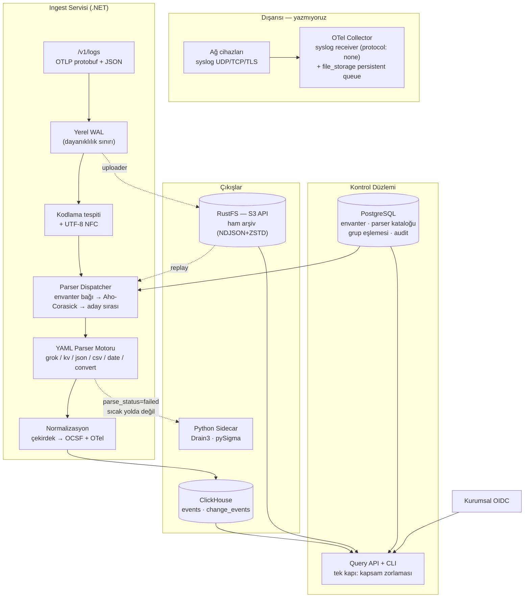

# F1 — Boru Hattı: Teknik Plan

[Mimari kararlar](../mimari-kararlar/index.md) K1–K24 üzerine. Kapsam: syslog/OTLP
ingest → YAML parser motoru → OCSF+OTel mapping → ClickHouse → ham arşiv + replay,
üstüne `owner_group` kapsamı, OIDC ve Python sidecar sözleşmesi.

## 0. Bitti tanımı

F1 şu cümle doğru olduğunda biter:

<user_quoted_section>Gerçek bir FortiGate, Cisco ASA, MikroTik ve nginx akışı syslog'dan girer;normalize olarak ClickHouse'ta aranabilir; ham hali kaybolmadan saklanır;parser'ı düzeltip son 7 günü yeniden işleyebilirim; başka grubun cihazınıgöremem; bunların hepsi OIDC ile giriş yapmış bir kullanıcı olarak API'den olur.</user_quoted_section>

Ölçülebilir kabul kriterleri:

| Kriter | Hedef |
| --- | --- |
| Ham sadakat | Her olay ham baytına geri götürülebilir; byte-for-byte doğrulanır |
| Parse doğruluğu | 4 vendor için altın örnek dosyalarının %100'ü testte geçer |
| Replay | 7 günlük veri, düzeltilmiş parser sürümüyle yeniden işlenir; eski satır kalmaz |
| Kapsam | Kapsam dışı sorgu **hiçbir** yoldan (REST, replay okuma, CLI) veri döndürmez |
| Dayanıklılık | Süreç `kill -9` ile öldürülür; ack'lenen hiçbir olay kaybolmaz. RustFS durdurulur; ingest devam eder |
| Arşiv bütünlüğü | Manifest'ten silinen nesne replay'de **sessizce atlanmaz**, hata olur |
| Çok dillilik | Türkçe/Arapça/Çince gövdeli log doğru kodlamayla saklanır ve aranır |

## 1. Bileşen haritası



## 2. Ingest sözleşmesi

### 2.1 Tek kapı: OTLP/HTTP

**Karar:** .NET servisinin **tek** ingest arayüzü `POST /v1/logs` — OTLP/HTTP,
hem `application/x-protobuf` hem `application/json`.

Gerekçe: OTel Collector'ın `otlp_http` exporter'ı (eski adı `otlphttp`, artık
kullanımdan kaldırılıyor) tam olarak bunu konuşuyor. Böylece **protokol çeşitliliğinin**
**tamamı** (syslog, filelog, EVTX, HTTP, cloud, Kafka) collector'ın işi olur; biz tek
sözleşme bakarız. SigNoz, HyperDX ve OpenObserve'un yaptığı da bu.

- .NET tarafında hazır bir OTLP **alıcı** paketi yok — `opentelemetry-proto`'dan
`logs_service.proto` üretilir (`Grpc.Tools`), tek bir `LogsData` çözücü yazılır.
Tahmini iş: yarım gün. Alternatif "kendi JSON formatımız" olurdu; kabul edilmedi
çünkü collector'a özel exporter yazmak (Go) gerekirdi.
- gRPC (`:4317`) **v1'de yok**, kaçış kapısı olarak açık. HTTP tek başına yeterli.

### 2.2 Syslog ham sadakati — doğrulanmış bulgu

OTel syslog receiver'ında **`preserve_to` benzeri bir ham saklama seçeneği yok.**
RFC3164/5424 modunda mesajı alanlara ayırır ve orijinal satırı geri veremez. Bu, ham
arşiv + replay hedefiyle (K12) doğrudan çelişir.

**Karar:** collector `protocol: none` ile çalışır.

```yaml
receivers:
  syslog:
    tcp:
      listen_address: "0.0.0.0:5140"
      encoding: nop         # ZORUNLU — aşağıdaki nota bakın
    protocol: none          # deneysel; çerçeveleme (octet counting) korunur,
                            # PRI çözülür, gövde OLDUĞU GİBİ kalır
```

<user_quoted_section>protocol: none tek başına yetmiyor (T03'te bulundu, K27). Receiver'ınencoding varsayılanı utf-8 ve geçersiz baytları U+FFFD ile değiştiriyor.Yani none mesajı alanlara ayırmasa bile, windows-1254 bir FortiGate satırıcollector'ın içinde bozuluyor ve bize ulaşan bayt dizisi orijinal değil.encoding: nop ("treats the file as a stream of raw bytes") ham baytlarıkoruyor; gövde OTLP'ye bytes_value olarak giriyor. Bu ayar olmadan §2.4'tekikodlama tespiti de §7.2'deki replay de anlamsız — düzeltilecek bir orijinalkalmıyor.</user_quoted_section>

Sonuçları:

| Etki | Değerlendirme |
| --- | --- |
| Ham satır bize bozulmadan gelir | ✅ Ham arşiv + replay çalışır |
| Syslog başlık ayrıştırması bize düşer | ✅ **İstediğimiz bu** — ayrıştırmanın tamamı tek yerde (YAML motoru), replay'de aynı kod koşar |
| `protocol: none` "experimental" etiketli | ⚠️ Risk. Azaltma: collector sürümü sabitlenir; kaybolursa `protocol: rfc3164` + OTTL ile gövdeyi kopyalamak yedek plan |
| RFC5424 structured-data | Kendi grok/kv adımlarımızla çözülür; hazır pattern var |

### 2.3 Dayanıklılık sınırı ve backpressure

```
istek → doğrula → ham batch'i yerel WAL'a yaz + fsync → 200 OK
                                    ↓ (asenkron)
                          parser boru hattı → ClickHouse
                          uploader → object storage
```

- **Ack, ham veri WAL'a yazıldıktan sonra verilir.** Parse başarısız olsa bile veri
kayıp değil — bu, ham arşivin varlık sebebi.
- WAL doluysa `503 + Retry-After` → collector'ın `file_storage` kalıcı kuyruğu
yeniden dener. Backpressure zinciri budur; kendi kuyruğumuzu yazmıyoruz (K5).
- Batch arayüzü baştan **çoklu kayıt** alır (K5 riski #5) — sonradan Kafka
eklendiğinde imza değişmez.

### 2.4 Kodlama ve çok dillilik (K4)

Ağ cihazlarının çoğu UTF-8 garanti etmez; Türkçe kurulumda `windows-1254`,
eski cihazlarda `iso-8859-9` yaygın.

1. **Ham arşive orijinal baytlar yazılır** — çözülmüş string değil. Kodlama tespiti
yanlışsa replay ile düzeltilebilsin diye.
2. Tespit sırası: kaynak envanterindeki `encoding` alanı → UTF-8 doğrulaması →
kaynak için tanımlı yedek kod sayfası → `latin1` (kayıpsız geri dönüş).
3. .NET'te legacy kod sayfaları için `Encoding.RegisterProvider(CodePagesEncodingProvider.Instance)`
**zorunlu** — yoksa `windows-1254` çalışma anında patlar.
4. Depolamadan önce **UTF-8 NFC** normalizasyonu.
5. `encoding_detected` kolonu saklanır.

<user_quoted_section>Türkçe tuzağı: arama/eşleştirme normalizasyonunda ToLower() kullanılmaz,ToLowerInvariant() kullanılır. tr-TR kültüründe I → ı ve i → İ dönüşümüINTERFACE gibi kelimeleri sessizce eşleşmez hale getirir. Bu, kültür duyarlıkarşılaştırmanın en sık yakalanmayan hatası; lint kuralı olarak CI'a eklenmeli.</user_quoted_section>

## 3. YAML parser plugin formatı (K3)

```yaml
apiVersion: bizigo.dev/v1
kind: Parser
metadata:
  id: fortinet.fortigate.traffic
  version: 1.3.0
  vendor: Fortinet
  product: FortiGate
  license: Apache-2.0

match:                                  # dispatcher ipuçları — ucuzdan pahalıya
  transport: [syslog]
  contains: ["devname=", "type=traffic"]     # literal ön filtre (Aho-Corasick)
  source_labels: { vendor: fortinet }        # envanterden gelir; en güçlü bağ

pipeline:
  - kv:      { field: message, separator: " ", assign: "=", quoted: true }
  - grok:    { field: message, patterns: ["%{SYSLOG5424PRI}%{GREEDYDATA:kv}"],
               on_failure: continue }
  - date:    { field: eventtime, formats: ["UNIX_MS", "yyyy-MM-dd HH:mm:ss"],
               timezone_field: tz, default_timezone: "Europe/Istanbul" }
  - convert: { fields: { srcport: int, dstport: int, sentbyte: long } }
  - drop:    { fields: [logid_raw] }

map:
  core:                                  # ortak çekirdek — sıcak kolonlar
    src_ip: "{{ srcip }}"
    dst_ip: "{{ dstip }}"
    src_port: "{{ srcport }}"
    dst_port: "{{ dstport }}"
    action: "{{ action }}"
  ocsf:
    class_uid: 4001                      # Network Activity
    activity_id: { from: action, table: ocsf_network_activity }
  otel:
    "network.protocol.name": "{{ proto }}"
    "network.peer.address": "{{ dstip }}"

tests:                                   # ZORUNLU — testsiz parser yayınlanamaz
  - name: allowed traffic
    input: '<189>date=2026-08-01 time=10:00:00 devname="FG100" type=traffic
            srcip=10.0.0.5 dstip=8.8.8.8 srcport=51514 dstport=53 action=accept'
    expect:
      core.src_ip: "10.0.0.5"
      core.dst_port: 53
      ocsf.class_uid: 4001
      parse_status: ok
```

Bilinçli kararlar:

| Karar | Gerekçe |
| --- | --- |
| **Test zorunlu** — en az 1 geçen test olmadan yayın yok | Kalite için tek en ucuz kaldıraç. Elastic integrations'ın da modeli |
| `map` üç bölümlü: `core` / `ocsf` / `otel` | K8'in mapping katmanı. `core` sıcak kolonlara, diğer ikisi türetilir |
| `match` üç katmanlı, en ucuz önce | Yüzlerce parser varken her satıra hepsini denemek olanaksız |
| `on_failure: continue \| fail \| tag` | Kısmi ayrıştırma meşru: `parse_status=partial` gerçek bir durum |
| Yürütme sırası `pipeline` sırasıdır | Deklaratif ama deterministik; koşul/döngü **yok** (kaçış kapısı .NET assembly) |

## 4. Parser motoru

### 4.1 Grok derleyicisi — kendi ince katmanımız

| Seçenek | Artı | Eksi | Karar |
| --- | --- | --- | --- |
| `grok.net` 2.0 (PCRE.NET) | Hazır; PCRE2 JIT hızlı | **Native bağımlılık** (RID başına ikili), AOT/trim belirsiz, pattern kayıt defteri/sürümleme yok, ReDoS koruması sınırlı | Referans + pattern kaynağı |
| **Kendi derleyicimiz** (`System.Text.RegularExpressions`) | `RegexOptions.NonBacktracking` ile **doğrusal zaman garantisi**, `matchTimeout`, derleme önbelleği, sürümleme, tek native bağımlılık yok | ~300–400 satır; NonBacktracking lookaround/backref desteklemez | ✅ **Seçilen** |

Grok derlemesi aslında küçük bir iş: `%{PATTERN:alan:tip}` özyinelemeli genişletme +
adlandırılmış grup üretimi. Asıl kazanç yazmakta değil, **kontrolü elde tutmakta**:

- **ReDoS savunması.** Parser YAML'ı kullanıcıdan geliyor (K16 — 50 kişilik kurum).
Kötü bir pattern ingest'i durdurabilir. Strateji:
  1. Önce `NonBacktracking` ile derlemeyi dene → **girdi uzunluğunda doğrusal**, felç
imkânsız.
  2. Pattern lookaround/backref içeriyorsa (Logstash'in `IPV4` pattern'i `(?<![0-9])`
kullanır) geri izlemeli motora düş, ama `matchTimeout = 50ms` ve derleme
zamanı linter (iç içe niceleyici, `(a+)+` deseni) ile.
  3. Sürekli timeout veren parser **karantinaya** alınır ve sahibi uyarılır.
- Pattern kütüphanesi Logstash/Elastic grok setinden **veri olarak** alınır (kod
değil) ve repoda sürümlenir.
- Derlenmiş `Regex` nesneleri `parser_id + version` anahtarıyla önbelleklenir.

### 4.2 Dispatcher

Yüzlerce parser varken her satıra hepsini denemek olanaksız. Dört kademe:

1. **Envanter bağı** — `source_id → parser_id` tanımlıysa doğrudan o parser. En hızlı
ve en doğru yol; hedef, üretimdeki trafiğin >%95'inin buradan geçmesi.
2. **Literal ön filtre** — tüm parser'ların `match.contains` literalleri tek bir
Aho-Corasick otomatına derlenir. Satır **bir kez** taranır, aday kümesi çıkar.
3. **Aday denemesi** — kalan adaylar `specificity` sırasıyla denenir; ilk `ok` kazanır.
4. **Düşüş** — hiçbiri tutmazsa `parse_status=failed`; olay ham arşive gider ve
sidecar keşif kuyruğuna düşer (§9).

Kademe 1'in oranı (`bound_ratio`) bir sağlık metriğidir: düşüyorsa envanter
bakımsız kalmış demektir.

### 4.3 Eşzamanlılık

`System.Threading.Channels` ile sınırlı kapasiteli boru hattı; parser worker sayısı
`Environment.ProcessorCount`. Her batch içi ayrıştırma paralel, ClickHouse'a yazım
tek yazar + `ClickHouse.Driver` binary bulk insert (10k satır / 2 sn, hangisi önce).

## 5. Normalizasyon — OCSF + OTel (K8)

Üç katman, tek yön:

```
ayrıştırılmış alanlar  →  core (sıcak kolonlar)  →  ocsf_* / otel_* türevleri
```

- **`core`** yazılan tek gerçek: `ts, host, src_ip, dst_ip, src_port, dst_port, proto, action, user_name, severity_num, outcome`. Sorguların %90'ı bunlara vurur.
- **OCSF** ve **OTel** alanları `core` + `attrs` üzerinden **türetilir**; ayrı ayrı
saklanmaz. Saklanan tek OCSF alanı `ocsf_class_uid` + `ocsf_activity_id` (filtre
için ucuz ve gerekli).
- Türetme kuralları YAML `map` bloğunda ve merkezi eşleme tablolarında
(`ocsf_network_activity` gibi) durur — kodda değil.

Gerekçe: iki şemayı da tam materyalize etmek depolamayı ~2 katına çıkarır ve
mapping bakımını iki katına. Türetme, K8'in "mapping katmanı bakım işi çıkarır"
riskini tek yere hapsediyor.

## 6. ClickHouse şeması

### 6.1 `events`

```sql
CREATE TABLE events
(
    ts               DateTime64(3, 'UTC')      CODEC(Delta, ZSTD(1)),
    ingested_at      DateTime64(3, 'UTC')      CODEC(Delta, ZSTD(1)),
    event_id         UUID,                                  -- ham arşive geri bağ
    owner_group      LowCardinality(String),                -- K17
    source_id        LowCardinality(String),
    host             LowCardinality(String),
    vendor           LowCardinality(String),
    product          LowCardinality(String),

    parser_id        LowCardinality(String),
    parser_version   LowCardinality(String),
    parse_status     Enum8('ok'=1,'partial'=2,'failed'=3),
    parse_generation UInt32,                                -- replay kuşağı
    encoding_detected LowCardinality(String),
    template_id      LowCardinality(String),                -- Drain3 (F1'de boş olabilir)

    severity_num     UInt8,
    ocsf_class_uid   UInt32,
    ocsf_activity_id UInt16,

    src_ip           IPv6,        -- IPv4 → ::ffff:a.b.c.d olarak eşlenir
    dst_ip           IPv6,
    src_port         UInt16,
    dst_port         UInt16,
    proto            LowCardinality(String),
    action           LowCardinality(String),
    user_name        String,
    outcome          LowCardinality(String),

    attrs            Map(LowCardinality(String), String),
    body             String                    CODEC(ZSTD(3)),
    raw_ref          String,                                -- obj_key#offset:len

    INDEX idx_ts        ts             TYPE minmax      GRANULARITY 4,
    INDEX idx_attr_keys mapKeys(attrs) TYPE bloom_filter GRANULARITY 4,
    INDEX idx_body      body           TYPE text(tokenizer = 'sparseGrams') GRANULARITY 1
)
ENGINE = MergeTree
PARTITION BY toYYYYMMDD(ts)
ORDER BY (owner_group, source_id, ts)
TTL toDateTime(ts) + INTERVAL 90 DAY;
```

### 6.2 `ORDER BY` kararı — bir kez seçilir (K17 notu)

| Aday | Artı | Eksi |
| --- | --- | --- |
| **`(owner_group, source_id, ts)`** ✅ | Her sorgu zaten `owner_group` filtresi taşıyor (§10) → daima ön-ek taraması. `source_id` gruplaması sıkıştırmayı belirgin iyileştirir | "Son 15 dk, tüm grubum" sorgusu bölüm içinde çok granüle dokunur — `idx_ts` minmax bunu kapatıyor |
| `(owner_group, toStartOfHour(ts), source_id, ts)` | Geniş zaman taraması daha ucuz | Tek cihazın uzun geçmişi pahalılaşır; ağ tarafında en sık sorgu bu |
| `(ts, owner_group, source_id)` | Saf zaman sorgusu en hızlı | Kapsam filtresi her sorguda tam tarama — K17 ile taban tabana zıt |

**Seçim:** `(owner_group, source_id, ts)` + `PARTITION BY toYYYYMMDD(ts)` +
`INDEX idx_ts minmax`. Günlük bölümleme zaten zaman aralığını budar; minmax indeksi
bölüm içindeki granülleri atlar. `owner_group` kardinalitesi düşük (onlarca), bu
yüzden ön-eke koymak sonraki kolonların sıkıştırmasını bozmuyor.

Yüksek hacme geçilirse (K5) tek değişiklik: bölümleme `toYYYYMMDDhhmmss(ts)` yerine
`toStartOfHour(ts)`. Sıralama anahtarı **değişmez** — bu yüzden bir kez doğru
seçilmesi gerekiyordu.

### 6.3 `change_events` — RCA için, F1'de açılıyor

RCA F3'te geliyor (K22) ama tablo F1'de açılmalı: F3'te geçmiş yoksa özellik boş
doğar. Ham arşivle aynı mantık.

```sql
CREATE TABLE change_events
(
    ts          DateTime64(3, 'UTC'),
    change_id   UUID,
    owner_group LowCardinality(String),
    target_kind Enum8('device'=1,'service'=2,'config'=3,'inventory'=4,'maintenance'=5),
    target_id   String,
    change_kind LowCardinality(String),   -- config_push, firmware, acl_change, deploy, window_open
    actor       String,
    summary     String,
    details     Map(LowCardinality(String), String),
    source      LowCardinality(String),   -- manual, api, git, netbox, ansible
    external_ref String
)
ENGINE = MergeTree
PARTITION BY toYYYYMM(ts)                 -- düşük hacim → aylık
ORDER BY (owner_group, ts, target_id);
```

F1'de sadece tablo + `POST /v1/changes` yazma ucu. Beslemeler F2'de bağlanır.

### 6.4 Açık kalem — `attrs` için `Map` mi `JSON` mü?

ClickHouse'un yeni `JSON` tipi dinamik alt kolonlar veriyor; `Map(String,String)`
her değeri string'e düzleştiriyor (sayısal filtre için `toFloat64OrNull` gerekir).
`JSON` tipinin **hedef ClickHouse sürümündeki olgunluğu doğrulanmalı**; şema
göçü ucuz olduğu için F1 `Map` ile başlar, ölçüm sonrası değiştirilebilir.

## 7. Ham arşiv + replay

### 7.0 Object storage: RustFS — karar ve olgunluk kısıtı

**Karar (K25): RustFS.** Apache 2.0, S3 uyumlu, MinIO ikilisinin yerine doğrudan
geçiyor (mevcut bucket/veri korunuyor). MinIO'nun 2025 sonunda bakım moduna
geçmesinden sonra bu alandaki en hareketli proje.

<user_quoted_section>Söylemem gereken şey: RustFS 1.0.0-beta serisinde ve GA'ya yaklaşıyor;geliştiricilerin kendi tavsiyesi 1.0 stable öncesi üretimde kullanmamak yönünde.Dağıtık mod (distributed) ve KMS hâlâ "under testing". Ham arşiv bu ürünündayanıklılık omurgası — replay'in tek kaynağı. Kararı değiştirmiyorum, amatasarımı RustFS'in veri kaybetmesi ihtimalini varsayarak kuruyorum.</user_quoted_section>

Beş korumanın hepsi bağımsız çalışıyor:

| # | Koruma | Ne sağlar |
| --- | --- | --- |
| 1 | **Yalnızca S3 API** — `AWSSDK.S3` + özel endpoint. RustFS'e özel hiçbir çağrı yok | Garage / SeaweedFS / gerçek S3'e geçiş **config değişikliği** olur, kod değil |
| 2 | **Dayanıklılık sınırı WAL'dır, RustFS değil** (§2.3) | Ack anında veri yerel diskte. RustFS kesintisi ingest'i durdurmaz, veri kaybettirmez |
| 3 | **WAL kuyruğu**: segment, yüklendiği **doğrulandıktan** sonra + 48 saat daha tutulur | RustFS son 48 saatte veri kaybederse yerelden yeniden yüklenir |
| 4 | **Manifest Postgres'te**: `object_key, sha256, byte_size, event_count, ts_from, ts_to, verified_at` | Nesne kaybolursa **ne kaybolduğu bilinir**. Replay sessizce kısa dönmez, eksik aralığı bildirir |
| 5 | **Periyodik scrub**: örneklenmiş nesneler indirilip sha256 manifest'e karşı doğrulanır | Sessiz bozulma replay anında değil, olduğu gün fark edilir |

Koruma #4 tek başına en değerlisi: manifest olmadan "replay 7 gün yerine 5 gün
döndü" durumu **fark edilmez**. Manifest'le bu bir hata mesajı olur.

MVP dağıtımı **tek düğüm** (distributed mod "under testing"). Düğüm seviyesi
dayanıklılık RAID/ZFS'e bırakılır. Sürüm **tam olarak sabitlenir**; beta serisinde
sürüm takibi yapılmaz.

Kaçış planı, öncelik sırasıyla: SeaweedFS (Apache 2.0) → kurumun mevcut S3 uyumlu
depolaması → Garage (lisansı AGPL, kullanılacaksa hukuki teyit gerekir). Koruma #1
sayesinde geçiş maliyeti bir config satırı + veri kopyalama.

### 7.1 Ham kayıt

RustFS'e (S3 API) NDJSON + ZSTD, ~64 MB'lık nesneler:

```jsonc
{ "event_id": "…", "received_at": "…", "source_id": "fg-ankara-01",
  "transport": { "proto": "syslog-tcp", "peer": "10.1.2.3:41022" },
  "encoding_declared": "windows-1254",
  "raw_b64": "PDE4OT5kYXRlPTIwMjYt…" }        // ORİJİNAL BAYTLAR
```

`raw_b64` bilinçli: string değil bayt saklanır. Kodlama tespiti yanlış çıkarsa
replay düzeltir — K4'ün gerçek karşılığı bu.

Nesne anahtarı: `raw/{owner_group}/{yyyy}/{MM}/{dd}/{hh}/{source_class}/{ulid}.ndjson.zst`.
`owner_group` yolun içinde çünkü **ham okuma da kapsam filtresinden geçmeli** (§10).

### 7.2 Replay

Akış: `ham nesneleri seç → sabitlenmiş parser sürümüyle yeniden ayrıştır → gölge tabloya yaz → bölümü değiştir`.

| Seçenek | Değerlendirme |
| --- | --- |
| **`ALTER TABLE … REPLACE PARTITION`** ✅ | Atomik, sorgu tarafında sıfır maliyet. Granülerlik = 1 gün. Replay zaten "parser düzeldi, geçmişi yeniden işle" işi olduğu için gün granülerliği yeterli |
| `ReplacingMergeTree(parse_generation)` | Satır granülerliğinde şık, ama her sorguya `FINAL` maliyeti biner |

`parse_generation` kolonu yine de tutulur — hangi satırın kaçıncı kuşaktan geldiği
denetlenebilsin diye.

CLI: `bizigo replay --from 2026-08-01 --to 2026-08-07 --parser fortinet.fortigate.traffic@1.4.0 --dry-run`

`--dry-run` önce **fark raporu** basar: kaç satır değişecek, kaç `failed` → `ok`
olacak. Bu olmadan replay korkutucu bir düğmedir ve kimse basmaz.

## 8. Envanter, kontrol düzlemi ve `owner_group` ataması

**Karar: PostgreSQL kontrol düzlemi.** ClickHouse veri düzlemi, Postgres mutasyona
uğrayan operasyonel durum. Değişken durumu ClickHouse'ta tutmak bilinen bir
anti-pattern; EF Core + Postgres neredeyse kod yazdırmıyor.

Postgres'te duran: `sources` (envanter), `source_groups`, `idp_group_mapping`,
`parsers` (katalog + sürüm + yayın durumu), `audit_log`, F3+ için `rca_reports`,
`evidence_bundles`, `alert_rules`, `scenarios`.

`owner_group` ataması (K17 §6.1): grup olayın kendisinden değil **kaynağından** gelir.

```
kaynak kimliği (syslog peer IP / hostname / cihaz etiketi)
        → sources tablosu → owner_group
```

- Eşleşmeyen kaynak: `owner_group = '_unassigned'`. **Reddedilmez** — veri kaybı,
eksik envanterden daha kötü. `_unassigned` yalnızca yöneticiye görünür ve bir
sağlık uyarısı üretir.
- Envanter yükleme: CSV/API. NetBox entegrasyonu F2 adayı.

## 9. Python sidecar sözleşmesi (K14)

Tek imaj: `drain3` (git SHA sabitli, PyPI 0.9.11 **değil**) + `pysigma`.
**Sıcak yolda değil** — ölürse ingest çalışmaya devam eder.

```
POST /v1/mine/batch    { source_key, messages:[{id,text}] }
                    →  { api_version, masks_version,
                         results:[{id, template_id, template, masked,
                                   params:[{value, mask}], is_new}] }
POST /v1/mine/match    (öğrenmeden eşleştirir)
GET  /v1/clusters/{source_key}  → şablonlar + sayaçlar + mask isimleri
POST /v1/sigma/compile { rule_yaml, target:"clickhouse", table? }
                    →  { queries:[…], table, warnings }
GET  /healthz  /readyz
```

<user_quoted_section>Sözleşme T12'de uygulamayla düzeltildi. Üç ayrışma çıktı:
params[] düz string listesi olarak yazılmıştı; F4'ün grok taslağı için gereken şey mask adı. [{value, mask}] oldu — &lt;IPV4&gt; → %{IPV4:…} köprüsü ancak böyle kuruluyor.sigma/compile tek sql döndürmüyor: bir Sigma dosyası birden çok kural içerebiliyor (queries[]). Ayrıca backend tabloyu logs, tam metin kolonunu full_log diye sabitliyor; bizde events/body. Varsayılanla bırakmak, gözden geçirmede kusursuz görünüp çalıştırıldığında "böyle tablo yok" diyen SQL üretirdi.Sürüm uyumunun nasıl tespit edileceği yazmıyordu. api_version + masks_version her yanıtta; ikisi de eşiği beklemeden devreyi açıyor. masks_version özellikle kritik: farklı maske = farklı imza = yanlış template_id.</user_quoted_section>

.NET tarafı kuralları:

| Konu | Kural |
| --- | --- |
| Çağrı yolu | Yalnızca `parse_status=failed` olaylar + örneklenmiş trafik |
| Kuyruk | Sınırlı kapasite, **dolunca düşür** — asla ingest'i bloklama |
| Devre kesici | Ardışık N hata → 5 dk kapalı; sağlık ekranında görünür |
| Zaman aşımı | 2 sn; aşan istek iptal edilir |
| Durum | Kaynak sınıfı başına ayrı miner; Redis persistence; `max_clusters` **zorunlu** |
| Sürüm | `/v1` yolda; uyumsuz `api_version`/`masks_version` → devre kesici açık |
| Miner sayısı | `max_miners` (64, LRU) — plan yalnızca miner **içindeki** küme sayısını sınırlıyordu; kaç miner olacağı sınırsızdı ve kaynak sınıfı sayısı envanterle büyüdüğü için bu ikinci bir sızıntı kapısıydı |
| Redis arızası | Sidecar **açılır**, bellek içi çalışır, `/readyz` `degraded` der. Drain3'ün kendi `RedisPersistence`'ı hatayı yakalamıyor: Redis düşünce mining de düşerdi. 503 dönüp restart olmak öğrenilenin tamamını götürürdü |
| Örnekleme | `SampleRate` 0.01, yalnızca **başarılı** olaylar için. `failed` olanlar örneklenmez, hepsi gider |

**`max_clusters`'ın kayda geçmesi gereken yan etkisi:** Drain3 sınırı LRU ile
uyguluyor ve küme kimliklerini **yeniden kullanmıyor**. Bir küme tahliye
edildiğinde .NET önbelleğindeki `template_id` artık var olmayan bir kümeyi
gösteriyor. Bu "yanlış olay etiketi" değil, "katalogda karşılığı olmayan kimlik" —
F3 `/v1/clusters` ile eşleşmeyen `template_id` görebilir. Zararsız ama beklenmedik
olmamalı.

**Maskeleme sinerjisi:** Drain3'ün mask regex'leri ile grok pattern kütüphanesi
**tek kaynaktan** üretilir. Böylece mined template + mask isimleri doğrudan grok
taslağına dönüşür — F4'teki format keşfi senaryosunun çıktı kalitesi buradan gelir.
F1'de yapılacak iş: ortak pattern tanımını tek dosyada tutmak ve sidecar imajına
oradan enjekte etmek.

## 10. Sorgu API, OIDC ve kapsam zorlaması

### 10.1 Kimlik (K18) — IdP seçimi: Keycloak (K26)

**Seçilen: Keycloak 26.7.x.** Apache 2.0, tek konteyner, ve zaten çalıştırdığımız
PostgreSQL'i (K23) ayrı bir veritabanıyla kullanıyor — yeni bağımlılık yok.

Seçim gerekçesi, sırayla:

1. **Atılacak bir MVP parçası değil.** Diğer adayların hepsi "geliştirme için kur,
üretimde kurumun IdP'siyle değiştir" demek. Keycloak **LDAP/AD federasyonunu**
** yerel olarak** yapıyor — büyük bir kurumda neredeyse kesin olan AD'nin önüne
geçip üretimde de kalabilir. MVP kurulumu üretim yolunun ilk adımı oluyor.
2. **Grup/rol modeli hazır.** K17'nin `owner_group` kapsamını gerçek gruplarla
göstermek için tek satır kod yazılmıyor.
3. **Lisans tuzağı yok.** Duende IdentityServer belli ciro üstünde ücretli;
Keycloak Apache 2.0.
4. **Servis hesapları var** — collector'ın ve F4 senaryolarının kimliği için gerekli
(aşağıda).

Değerlendirilip elenenler: **Zitadel** (Go tek ikili, hoş; ama org/project/grant
modeli bizim düz `owner_group`'umuza fazladan eşleme işi çıkarıyor ve kurumda
karşılığı yok), **Authentik** (4 konteyner: server + worker + redis + postgres),
**Dex** (kullanıcı deposu yok — RBAC'ı gerçekçi biçimde gösteremez),
**OpenIddict** (kendi auth sunucumuzu yazmak demek; K18'e aykırı).

Keycloak'ın bedeli dürüstçe: JVM, ~500 MB imaj, ve yoğun bir yönetim konsolu.

**Kurulum kararı:** `start-dev` **kullanılmaz** — bellek içi H2 ile çalışır ve her
yeniden başlatmada veriyi kaybeder. MVP dahil her ortamda:

```yaml
keycloak:
  image: quay.io/keycloak/keycloak:26.7.1
  command: ["start", "--optimized", "--import-realm"]
  environment:
    KC_DB: postgres
    KC_DB_URL: jdbc:postgresql://postgres:5432/keycloak
  volumes:
    - ./deploy/keycloak/realm-bizigo.json:/opt/keycloak/data/import/realm.json:ro
```

**Realm-as-code.** `realm-bizigo.json` repoda durur ve `--import-realm` ile yüklenir.
Böylece herkesin ortamı aynı olur ve **hangi claim'lere ihtiyacımız olduğu belgeye**
**değil dosyaya yazılmış** olur. Bu olmazsa grup claim eşlemesi herkesin makinesinde
farklı davranır ve nedeni günlerce bulunamaz.

### 10.1.1 Claim sözleşmesi — IdP'den bağımsız

Ürünün IdP'den beklediği tek şey bu dört claim. Keycloak → Entra ID geçişi, IdP
tarafında mapper ayarı + `idp_group_mapping` satırları demek; **kodda değişiklik yok.**

| Claim | Kullanım | Keycloak karşılığı |
| --- | --- | --- |
| `sub` | Kararlı kullanıcı kimliği, audit | yerleşik |
| `preferred_username` / `email` | Görüntüleme, sahiplik | yerleşik |
| `roles` | `reader` / `analyst` / `author` / `admin` | realm role → `realm_access.roles` (mapper ile düz `roles`'a çekilir) |
| `groups` | `owner_group` eşlemesinin girdisi (K17) | Group Membership mapper |

<user_quoted_section>Keycloak tuzağı: Group Membership mapper varsayılan olarak tam yol basarve başında eğik çizgi olur: /network/core, network/core değil. full pathseçeneği kapatılabilir ama kapatılırsa iç içe gruplarda ad çakışması olur.Karar: tam yol açık kalır, idp_group_mapping tablosu tam yolu saklar, veeşleme yapılırken giriş TrimStart('/') ile normalize edilir.</user_quoted_section>

**Grup eşlemesi Postgres'te kalır** (`idp_group_mapping`): IdP grubu → `owner_group`.
Claim'i doğrudan `owner_group` saymak, bir ekibin kapsamını değiştirmek için IdP'ye
dokunmayı gerektirirdi; kabul edilemez.

### 10.1.2 UI ve makine kimlikleri

- **React/Next UI (K11): BFF deseni** — token tarayıcıda saklanmaz. ASP.NET Core
`AddOpenIdConnect` (authorization code + PKCE) + cookie + YARP ters vekil.
Duende.BFF lisans maliyeti nedeniyle tercih edilmedi; gereken parça küçük.
- **API: `AddJwtBearer()`** — Keycloak'ın imzaladığı erişim token'ı doğrulanır.
Ürün **kendi kullanıcı tablosunu tutmaz**.
- **F4 senaryo kimlikleri** aynı mekanizmayı kullanacak (senaryo sahibinin
`owner_group`'uyla sınırlı servis hesabı). F1'de sadece kalıp kuruluyor.

### 10.2 Tek kapı

K17 §6.1'in üçüncü maddesi: kapsam filtresi **sorgu API'sinde** uygulanır,
ClickHouse row policy'de değil. Somut karşılığı:

```csharp
// Her sorgu — REST, CLI, replay okuma, F3 kanıt toplama, F4 MCP — buradan geçer.
IScopedQuery q = _scope.For(user);      // owner_group IN (...) enjekte edilir
```

- Ham ClickHouse bağlantısı **hiçbir** uygulama katmanına sızmaz; tek bir iç assembly
`IDbConnection`'a erişir.
- Mimari test (NetArchTest) bunu **derleme zamanında** zorlar: `Bizigo.Query.Internal`
dışındaki hiçbir tip `ClickHouse.Driver`'a referans veremez. Bu kural olmadan
kapsam ayrımı ilk aceleci PR'da delinir.
- Ham arşiv okuma da aynı kapıdan: nesne anahtarındaki `owner_group` segmenti
doğrulanmadan indirme yok.
- Her sorgu `audit_log`'a düşer: kim, hangi kapsam, hangi filtre, kaç satır.

### 10.3 Uçlar (F1)

```
POST /v1/logs                     OTLP ingest
POST /v1/changes                  değişiklik olayı yaz
GET  /v1/events                   arama: zaman, kapsam, alan filtreleri, tam metin
GET  /v1/events/{id}/raw          ham bayta iniş (kapsam doğrulanır)
GET  /v1/sources                  envanter
POST /v1/parsers  /v1/parsers/{id}/test   katalog + canlı test
POST /v1/replay                   replay işi başlat (dry-run destekli)
GET  /v1/health/pipeline          bound_ratio, parse_status dağılımı, WAL derinliği
```

## 11. CLI

```
bizigo parser lint <file.yaml>          # şema + ReDoS linter
bizigo parser test <file.yaml>          # gömülü testleri koştur
bizigo parser try <file.yaml> --input <log>   # tek satır dene, alanları göster
bizigo ingest file <path> --source <id> # dosyadan besle (geliştirme/test)
bizigo replay --from … --to … --parser …@… [--dry-run]
bizigo schema migrate
```

`parser try` en çok kullanılacak komut — F2'deki UI editörü bunun üstüne oturacak.

## 12. Çözüm düzeni

```
src/
  Bizigo.Contracts/          # ortak tipler, plugin şemaları
  Bizigo.Ingest/             # OTLP uç, WAL, kodlama, boru hattı
  Bizigo.Parsing/            # YAML şema, grok derleyici, dispatcher, adım tipleri
  Bizigo.Normalization/      # core → OCSF/OTel eşleme tabloları
  Bizigo.Storage.ClickHouse/ # şema, bulk writer, INTERNAL — dışarı sızmaz
  Bizigo.Storage.Raw/        # object storage yazıcı/okuyucu, replay okuyucu
  Bizigo.ControlPlane/       # EF Core, envanter, katalog, audit
  Bizigo.Query/              # IScopedQuery — tek kapı
  Bizigo.Api/                # ASP.NET Core, OIDC, uçlar
  Bizigo.Cli/
sidecar/                     # Python: drain3 + pysigma
catalog/parsers/             # YAML parser'lar + altın örnek dosyaları
tests/
```

## 13. Test stratejisi

| Katman | Yaklaşım |
| --- | --- |
| Parser | Her YAML'ın gömülü testleri CI'da koşar. `catalog/` altındaki **altın örnek dosyaları** gerçek cihaz çıktısı olmalı, elde uydurulmuş değil |
| Grok derleyici | Property test: rastgele pattern → derlenir veya anlamlı hata; ReDoS corpus'u ile timeout doğrulaması |
| Kodlama | TR/AR/CJK + windows-1254 + bozuk bayt dizisi fixture'ları; tur-gidiş (round-trip) bayt eşitliği |
| Kapsam | **Negatif test zorunlu**: her uç için "başka grubun verisi" testi. NetArchTest ile katman kuralı |
| Dayanıklılık | `kill -9` altında ack'lenmiş olayların kaybolmadığı entegrasyon testi |
| Replay | Kasten bozuk parser → veri yükle → düzelt → replay → beklenen satırlar; eski kuşak kalmadığı doğrulanır |
| **Ham arşiv bütünlüğü** | Manifest'teki bir nesne kasten silinir → replay **sessizce kısa dönmez**, eksik aralığı bildirir. Scrub sha256 uyuşmazlığını yakalar |
| **RustFS kesintisi** | RustFS durdurulur → ingest devam eder, WAL büyür, ack'ler sürer; RustFS dönünce birikmiş segmentler yüklenir ve doğrulanır |
| Uçtan uca | Testcontainers: ClickHouse + Postgres + **RustFS** + Keycloak + sidecar |

## 14. İş sırası

1. İskelet: çözüm, Testcontainers, CI, şema göçleri
2. ClickHouse şeması + bulk writer + `IScopedQuery`
3. OTLP uç + WAL + ham arşiv yazıcı + **manifest + scrub** (ilk uçtan uca: ham veri kaybolmadan iniyor ve kaybolursa haber veriyor)
4. Kodlama tespiti + NFC
5. Grok derleyici + `pipeline` adım tipleri + `parser lint/test/try`
6. Dispatcher + envanter + `owner_group` ataması
7. Normalizasyon eşlemesi (`core` → OCSF/OTel)
8. 4 vendor parser'ı + altın örnek dosyaları — **motorun asıl sınavı**
9. Keycloak realm-as-code + OIDC/BFF + collector servis hesabı + REST uçları + audit
10. Replay + `--dry-run` fark raporu
11. Sidecar + devre kesici
12. `change_events` tablosu + yazma ucu
13. Sağlık/metrik uçları, yük testi

Adım 8 kasten ortada: motor tamamlanmadan gerçek vendor logu görülmezse formatın
eksikleri sona kalır ve pahalıya patlar.

## 15. Açık kalemler

| # | Konu | Kararlaştırma anı |
| --- | --- | --- |
| 1 | `attrs` için `Map` vs yeni `JSON` tipi (§6.4) | Adım 2, hedef ClickHouse sürümü doğrulandığında |
| 2 | `protocol: none` deneysel — collector sürüm sabitleme + yedek plan | Adım 3 |
| 3 | Retention/TTL gerçek değeri (90 gün varsayıldı) — K5 belirsiz | F1 sonu, gerçek hacim ölçüldüğünde |
| 4 | `sparseGrams` `min_length`/`max_length` ayarı — TR/AR/CJK'de indeks boyutu ölçülmeli | Adım 2, gerçek gövdelerle |
| 5 | ~~Object storage seçimi~~ | ✅ **Kapandı — RustFS** (K25). Olgunluk kısıtı §7.0'da beş korumayla sarıldı |
| 6 | ~~IdP seçimi~~ | ✅ **Kapandı — Keycloak 26.7.x** (K26). Claim sözleşmesi §10.1.1 |
| 7 | RustFS sürüm sabitleme + tek düğüm dayanıklılık (RAID/ZFS) kararı | Adım 3'ten önce |
| 8 | Kurumun gerçek IdP'si Entra ID ise: Keycloak AD federasyonu mu, doğrudan Entra mı? Claim sözleşmesi (§10.1.1) ikisinde de çalışıyor, karar operasyonel | F1 sonrası — F1'i bloklamıyor |

## Kaynaklar

- [OTel syslog receiver README](https://github.com/open-telemetry/opentelemetry-collector-contrib/blob/main/receiver/syslogreceiver/README.md) — `protocol: none`, ham saklama seçeneği yok
- [OTLP HTTP exporter](https://github.com/open-telemetry/opentelemetry-collector/tree/main/exporter/otlphttpexporter) — `otlphttp` → `otlp_http` yeniden adlandırması
- [OTLP Exporter spec](https://opentelemetry.io/docs/specs/otel/protocol/exporter/) — http/protobuf ve http/json
- [ClickHouse — Full-text Search with Text Indexes](https://clickhouse.com/docs/engines/table-engines/mergetree-family/textindexes)
- [ClickHouse — Full-text Search GA duyurusu](https://clickhouse.com/blog/full-text-search-ga-release) — 26.2'de GA
- [ClickHouse 26.1 sürüm notları](https://clickhouse.com/blog/clickhouse-release-26-01) — `sparseGrams` beta
- [system.tokenizers](https://clickhouse.com/docs/operations/system-tables/tokenizers)
- [Marusyk/grok.net](https://github.com/Marusyk/grok.net) — v2.0'dan itibaren PCRE.NET
- [ClickHouse.Driver 1.0](https://clickhouse.com/blog/clickhouse-driver-1_0_0-official-dotnet-client)
- [rustfs/rustfs](https://github.com/rustfs/rustfs) — Apache 2.0, S3 uyumlu; dağıtık mod ve KMS "under testing"
- [Sealos — What Is RustFS? Apache 2.0 MinIO Alternative (2026)](https://sealos.io/blog/what-is-rustfs/) — 1.0 stable öncesi üretim tavsiyesi yok
- [MinIO alternatifleri karşılaştırması — RustFS / SeaweedFS / Garage](https://blog.elest.io/rustfs-vs-seaweedfs-vs-garage-which-minio-alternative-should-you-pick/)
- [Keycloak 26.7.0 duyurusu](https://www.keycloak.org/2026/07/keycloak-2670-released)
- [Keycloak — Docker ile başlangıç](https://www.keycloak.org/getting-started/getting-started-docker) — `start-dev` bellek içi H2 uyarısı
- [OTel `oauth2clientauthextension`](https://github.com/open-telemetry/opentelemetry-collector-contrib/blob/main/extension/oauth2clientauthextension/README.md) — client_credentials, otomatik token yenileme
