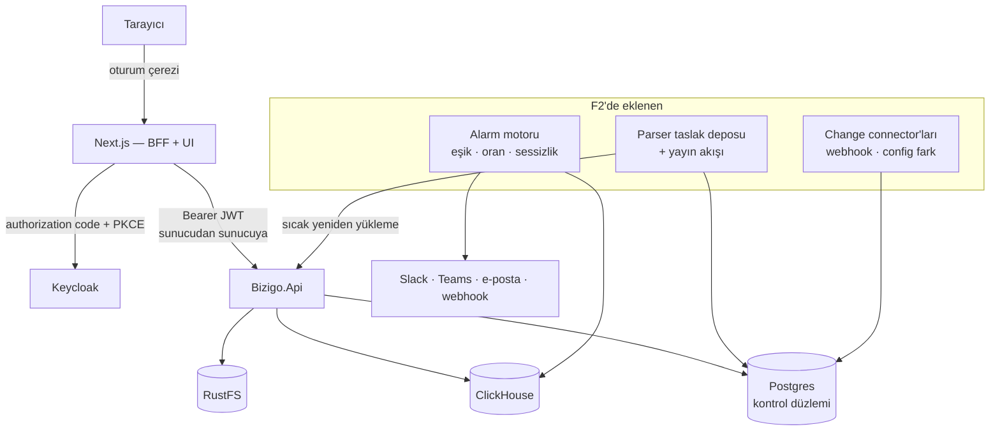
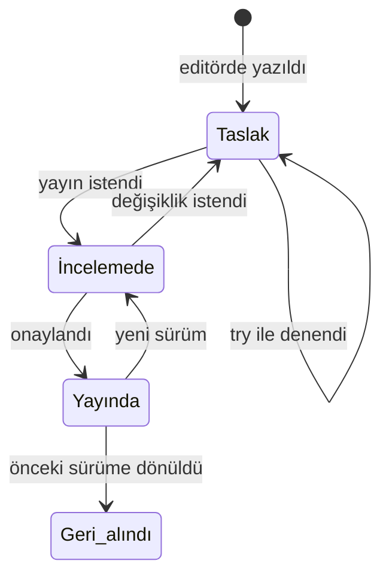

# F2 — Görünürlük

F1 boru hattını kurdu: log giriyor, ham hâli kaybolmadan arşivleniyor, normalize
oluyor, kapsam ayrımıyla sorgulanabiliyor. Ama ürünün **yüzü yok** — her şey
`curl` ile yapılıyor ve parser yazmak repoda dosya düzenlemek demek.

F2 bunu kapatıyor: arayüz, parser editörü ve yayın akışı, alarm, değişiklik
beslemesi.

**Giriş noktası:** [F1 kapanışı](../f1-kapanis/index.md) — özellikle
"F2'nin arayüzünü doğrudan bağlayan iki ölçüm" bölümü.

## Kararlar

| # | Konu | Karar | Gerekçe |
| --- | --- | --- | --- |
| **K31** | BFF nerede | **Next.js sunucusu** | OIDC akışı ve oturum çerezi Next'te; API'ye sunucudan sunucuya. `Bizigo.Api` saf kaynak sunucusu olarak kalıyor (yalnızca JWT). Bedeli: Node dağıtıma giriyor |
| **K32** | Alarm kapsamı | **Eşik + oran + sessizlik** | Sessizlik ağ tarafında en değerlisi: susan cihaz, gürültü yapan cihazdan tehlikeli. Sigma'nın SQL'i F3'te aynı motora takılıyor |
| **K33** | Parser yayını | **Taslak → inceleme → yayın, üründe** | Editör yazmadan işe yaramaz. `ParserCatalog` sıcak yeniden yükleme zaten atomik; eksik olan taslak deposu ve onay |
| **K34** | Change feed | **Üç kaynak birden, ekrandan yapılandırılabilir** | API/elle + CI/CD webhook + cihaz config fark tespiti. Üçüncüsü tek başına bir alt sistem — sıralaması aşağıda |

### K31'in sonucu: `Bizigo.Api` sadeleşiyor

Cookie ve OIDC işleyicisi API'de duruyor (`AuthEndpoints`, `/auth/login`). BFF
Next'e geçtiğine göre bunlar **API'den çıkmalı** — iki yerde oturum yönetimi,
kullanıcının hangi yoldan girdiğine göre farklı davranan bir kapsam demek.

API'de kalan: JWT bearer doğrulaması, `/auth/me` (BFF'in kimlik sorgusu için).

<user_quoted_section>⚠️ F1'de ölçülen tuzak: iki işleyicinin claim sözleşmesi ayrışırsa kapsamkullanıcının giriş yoluna göre değişir. OIDC işleyicisi kaldırılırkenClaimMappingTests de sadeleşmeli — ama JWT tarafındakiMapInboundClaims = false kalmalı, o olmadan roller görünmez oluyor.</user_quoted_section>

## Mimari

## Arayüzü bağlayan iki ölçüm

F1'de gerçek veriyle ölçüldü; bunlar tercih değil **kısıt**:

**1. Kısa sorgu tabloyu tarıyor.** Tam metin indeksi ~10-11 karakterden sonra
seçici. `kullanıcı` (9 karakter) 1M satırın tamamını okutuyor,
`用户登录失败，请检查凭据` (12) %71 atlıyor. Arama kutusu ya minimum uzunluk
dayatmalı ya kısa sorguda kullanıcıyı uyarmalı. Sessizce bırakmak, yazılan her
kelimede tam tarama demek.

**2. Kaynak filtresi sayfalamayı sabitliyor.** Keyset ancak sıralama anahtarının
tam öneki (`owner_group` + `source_id`) verildiğinde sabit süreli. Kapsam kapısı
`owner_group`'u zaten ekliyor; UI `source_id`'yi teşvik etmeli.

| Sorgu şekli | Sayfa 1 | Derin sayfa |
| --- | --- | --- |
| Filtresiz | 377k satır | **1M satır** |
| `owner_group` | 155k | 286k |
| `owner_group` + `source_id` | 57k | **57k** |

## Parser yayın akışı (K33)

**Zorunlu kapılar** — hiçbiri isteğe bağlı değil:

- Taslak, yayın istenmeden önce `parser lint`ten geçmeli (şema + ReDoS). F1'in
`GROK003 = 0` değişmezi kataloğa yeni parser girdiği gün kırılmamalı.
- Gömülü `tests` bloğu boş olamaz — F1'de şema düzeyinde zaten zorunlu.
- Yayın **atomik**: `ParserCatalog` yeni kataloğu tamamen kurup tek referans
değişimiyle geçiriyor. Bozuk bir katkı çalışan sistemi bozamıyor.
- Geri alma tek tıkla, çünkü yayın sonrası fark ancak üretim trafiğinde görülür.

Kim yayınlayabilir: `author` ve `admin` (F1'in rol tablosu). K16'daki 50 kişilik
kurumda bu ayrım anlam kazanıyor — herkes taslak yazar, yayını sınırlı kişi yapar.

## Alarm motoru (K32)

Üç kural tipi, tek değerlendirici:

| Tip | Soru | Örnek |
| --- | --- | --- |
| **Eşik** | Sayı bir sınırı aştı mı | "5 dk'da `action=deny` > 100" |
| **Oran** | Değişim hızlandı mı | "hata oranı önceki saate göre 3× arttı" |
| **Sessizlik** | Beklenen veri **gelmedi mi** | "`fw-core-01` 15 dk'dır log göndermiyor" |

**Sessizlik en zoru ve en değerlisi.** Diğer ikisi veri üzerinde çalışıyor, bu
**verinin yokluğu** üzerinde: envanterdeki her kaynak için "en son ne zaman görüldü"
tutulmalı ve eşik aşıldığında tetiklenmeli. Ağ tarafında susan bir cihaz, gürültü
yapandan tehlikelidir — ve F1'in `/v1/health/pipeline` göstergeleri bunun yarısını
zaten hesaplıyor.

Kural değerlendirmesi **kapsam altında** koşuyor: bir ekibin kuralı başka ekibin
verisini sayamaz. Bu, kuralın sahibinin kapsamıyla çalıştırılması demek —
`IScopedQuery` zaten tek kapı.

## Change feed (K34) — üç kaynak, üç ayrı büyüklük

Kullanıcı üçünü de istedi ve ekrandan yapılandırılabilir olmasını. Kapsamı
daraltmıyorum, **sıralıyorum** — çünkü üçüncüsü diğer ikisinin toplamından büyük.

| Kaynak | İş | Not |
| --- | --- | --- |
| **Elle giriş + API** | Küçük | `POST /v1/changes` zaten var; UI formu ve liste |
| **CI/CD webhook** | Orta | İmzalı webhook alıcısı, sağlayıcı başına yük eşlemesi (GitHub Actions, Jenkins, GitLab) |
| **Cihaz config fark tespiti** | **Büyük** | Periyodik çekim, fark alma, vendor başına yöntem (SSH/API/SNMP), kimlik bilgisi saklama |

<user_quoted_section>Cihaz config tespiti kendi başına bir alt sistem. Cihaz erişimi, kimlikbilgisi yönetimi (şifreli saklama, rotasyon), vendor başına farklı toplamayöntemi ve fark algoritması içeriyor. Tek ticket'a sığmaz; F2'nin sonunakonuldu ki ondan önceki her şey kendi başına çalışır durumda olsun.
Ayrıca bu, ürünün cihazlara yazma değil okuma amacıyla da olsa bağlanan ilkparçası — güvenlik incelemesi gerektirir. Kimlik bilgileri kontrol düzlemindeşifreli durmalı ve hiçbir log/hata mesajına düşmemeli.</user_quoted_section>

Connector yapılandırması ekranlardan: tip, hedef, zamanlama, kimlik bilgisi,
etkin/pasif. Kontrol düzleminde tablo + CRUD API + UI.

## Doğrulama — F1'in dersi

F1'de doğrulanmamış **her** katman kırıktı ve hiçbiri kendini belli etmedi. F2
aynı hatayı tekrarlamamak için doğrulamayı ticket'ların içine koyuyor, sonuna
değil:

- Her ekran için **kapsam ayrışması** testi: iki farklı gruptaki kullanıcı aynı
ekranda farklı veri görüyor.
- BFF için: token tarayıcıya **hiç** ulaşmıyor (çerez içeriği sınanır).
- Yayın akışı için: bozuk bir parser yayınlanamıyor ve yayın sırasında hata
çıkarsa çalışan katalog **değişmiyor**.
- Alarm için: kural sahibinin kapsamı dışındaki veri sayılmıyor.
- Connector için: kimlik bilgisi hiçbir çıktıda görünmüyor.

## Görsel tutarlılık iki yere bölündü

Ekranların birlikte bir ürün gibi görünmesi F2'nin bitiş şartlarından biri. Ama
bu **sona bırakılabilir bir rötuş değil**: her ekran kendi düğmesini çizerse
sonda toparlanmıyor.

- **Temel T13'te kuruluyor:** renk/tipografi/boşluk jetonları, açık-koyu tema,
ortak bileşenler (tablo, boş durum, hata, yükleniyor).
- **Denetim T28'de yapılıyor:** ekranlar bittikten sonra tutarlılık, dört durum
kapsaması, erişilebilirlik ve kanıt (ekran görüntüleri).

T28 bir toparlama işine dönüşüyorsa T13 eksik yapılmış demektir.

**Bu üründe özel risk — çok dilli gövdeler.** Log gövdeleri Türkçe, Arapça ve
Çince geliyor; F1'in arşivinde gerçek örnekleri var. İngilizceyle düzgün görünen
her tablo 500 karakterlik bir Arapça satırda ya da boşluksuz CJK metninde
sınanmalı. Bu bir estetik ayrıntı değil: hücre taşarsa ekran kullanılamaz hâle
geliyor.

## F2'nin dışında kalanlar

- Sigma kuralları ve detection — F3
- RCA kanıt paketi — F3
- Agent senaryoları ve MCP server — F4
- Metrik/trace/topoloji — F5
- Kataloğun geri kalanı (PAN-OS, Juniper, F5, HAProxy): editör geldikten sonra
çok daha ucuz; F2 içinde fırsat buldukça, ayrı ticket olarak değil
