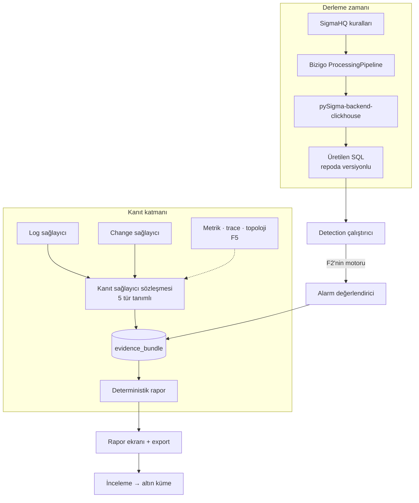

# F3 — Detection ve RCA kanıtı

F1 boru hattını kurdu, F2 yüzünü verdi. F3 ürünün **kendi başına düşünmeye**
**başladığı** faz — ama henüz LLM'siz: Sigma kuralları ve deterministik kanıt
paketi.

K22'nin ayrımı burada belirleyici: **kanıt F3'te, akıl F4'te.** Kanıt paketi
LLM'siz tek başına değerli, ve model kapalıyken bile okunabiliyor.

**Giriş noktaları:** [Sigma araştırması](../sigma-clickhouse-arastirmasi/index.md) ·
[RCA raporu özelliği](../rca-raporu-ozelligi/index.md) ·
[F1 kapanışı](../f1-kapanis/index.md)

## Planı yazarken çıkan bulgu — F3'ün yarısı buna bağlıydı

RCA'nın beş deterministik korelasyonundan ikisi (**ilk-görülen imza** ve **hacim**
**sapması**) `template_id` kolonuna dayanıyor. O kolonun bugün nasıl dolduğunu
ölçtüm:

| Olay | `template_id` |
| --- | --- |
| Ayrıştırması **başarısız** | Doluyor — ama imzanın **ilk** görülüşünde boş |
| Ayrıştırması başarılı | Yalnızca **%1** örnekleme (`SampleRate = 0.01`) |

Sebep bir hata değil, K14'ün bilinçli sonucu: sidecar sıcak yolda değil, o yüzden
`TemplateAnnotator` cache'te bulamadığında kuyruğa atıp **boş dönüyor**. Yani
"yeni bir şey oldu" diyen tam o satırda kimlik yok — ve RCA artifact'ı bu sinyali
"tek en güçlü sinyal" diye tanımlıyor.

## Kararlar

| # | Konu | Karar | Gerekçe |
| --- | --- | --- | --- |
| **K35** | İmza kolonu | Sıcak yolda **`signature_hash`**, her olayda | Maskeleme zaten sıcak yolda koşuyor; çıkan imzanın hash'ini yazmak "ilk-görülen" ve "hacim sapması"nı **saf SQL'e** çeviriyor ve sidecar'a hiç bağlı kalmıyor |
| **K36** | Sigma kapsamı | Önce **prototip**, sonra kapsam kararı | Hazır pipeline bizim şemamıza karşı 0 kural veriyor; kendi pipeline'ımızın gerçek maliyeti 20-30 kuralda ölçülmeden kapsam seçmek tahmin olur |

### K35 — imza kolonu

`MaskCatalog.Signature` bugün yalnızca keşif yoluna giren olaylarda çağrılıyor.
K35 onu **her olayda** çağırıp sonucun hash'ini `events.signature_hash`'e yazıyor.

Kazanç:

- **İlk-görülen imza** saf SQL: `signature_hash` baseline penceresinde yok,
olay penceresinde var. Sidecar gerekmiyor, örnekleme gerekmiyor, ilk görülüşte
boş kalmıyor.
- **Hacim sapması** gerçek sayılar üzerinde: `%1` örnekleme yerine tam sayım,
yani Poisson/z-score anlamlı hâle geliyor.
- `template_id` işlevini koruyor: insan-okunur kümeleme ve `<IPV4>` gibi maske
adlarıyla F4'ün grok taslağı. İki alan **farklı işler** yapıyor.

Bedeli ve sınırı:

- Maskeleme artık her olayda koşuyor. F1'de ölçüldü: 12 maskenin 8'i doğrusal
motorda, 16 KB girdi sınırı var, ve sınırı aşan satır sayılıyor
(`SkippedTooLong`). Yani maliyet bilinen ve sınırlı — ama **ölçülmeli**, çünkü
bugüne kadar sıcak yolun yalnızca bir kısmında koşuyordu.
- Sınırı aşan satırın `signature_hash`'i boş kalıyor. Bu, "ilk-görülen"in o
satırları göremeyeceği anlamına geliyor; kabul edilebilir ama rapor bunu
söylemeli.

### K36 — Sigma prototipi

Ölçüm net: `SigmaHQ/pySigma-pipeline-ocsf` kataloğun %80'ine dokunuyor ama bizim
`events_ocsf` görünümümüze karşı **0 kural** olduğu gibi çalışıyor. Kendi
`ProcessingPipeline`'ımızı yazmak zorundayız.

Kapsam seçimi prototipe bırakıldı. Prototip şunu ölçecek:

1. Bizim dört vendor'umuz + `firewall`/`network_connection`/`dns` kategorileri
için elle yazılan eşleme, kaç kuralı **gerçekten çalışır** hâle getiriyor?
2. Kural başına ortalama emek ne? (Eşleme satırı, değer dönüşümü, test.)
3. Üretilen SQL bizim `events_ocsf` görünümünde **koşuyor mu** — ölçüm bu kez
kolon listesine karşı değil, canlı ClickHouse'a karşı yapılacak.

Prototip 20-30 kuralla sınırlı ve **atılabilir**. Çıktısı kod değil, bir sayı:
kural başına maliyet. Kapsam kararı ondan sonra.

## Mimari

## Detection

Sigma SQL'i **F2'nin alarm motoruna takılıyor** — ayrı bir çalıştırıcı yazılmıyor.
F2 planı bunu zaten öngörmüştü: eşik/oran/sessizlik değerlendiricisi bir sorgu
koşturup sonucu eşikle karşılaştırıyor; Sigma kuralı da bir sorgu.

Eklenen: kural yönetimi (etkin/pasif, kapsam, gürültü ayarı) ve derlenmiş SQL'in
sürümlenmesi.

**Derleme zamanı kararı korunuyor** (mimari kararlar §3.1) ve üçüncü gerekçesini
kazandı: backend üç aylık ve tek geliştiricili, ama üretilen SQL repoda
versiyonlandığı için proje terk edilse bile mevcut kurallar çalışmaya devam
ediyor.

Referans implementasyon: [`clicksiem/sigma_rules`](https://github.com/clicksiem/sigma_rules)
— günlük cron, `sigconvert.py -b clickhouse`, üretilen kurallar repoda commit'li.
Bizim akışımızın çalışan hâli; iskeleti oradan alınabilir.

## Kanıt katmanı

### Sözleşme beş türü de tanıyor, ikisi uygulanıyor

`log`, `change`, `metric`, `trace`, `topology`. F3'te yalnızca ilk ikisi
uygulanıyor ama sözleşme beşini de tanıyor ve motor hiçbirine özel kod
içermiyor — F5 yeni bir sağlayıcı eklediğinde motor değişmiyor.

### Beş deterministik korelasyon

| Sinyal | K35'ten sonra durumu |
| --- | --- |
| **İlk-görülen imza** | ✅ `signature_hash` üzerinden saf SQL |
| **Hacim sapması** | ✅ gerçek sayılar (örnekleme yok) |
| **Sessizlik** | ✅ `source_id` bazlı — F2'nin sessizlik alarmıyla aynı sorgu yüzeyi |
| **Ortak öznitelik (lift)** | ✅ `core` alanları ve `attrs` üzerinden |
| **Yayılma sırası** | ✅ kaynak başına ilk bozulma anı |

Üçü zaten `template_id`'den bağımsızdı; ikisi K35 ile kurtuldu.

### Kapsam dışı kanıt dürüstlüğü

RCA sahibinin kapsamıyla koşuyor (K17). Kök neden başka grubun cihazındaysa rapor
bunu **bilmeden** yanlış sonuca varır. Karşı önlem: toplayıcı kapsam dışında kaç
eşleşme olduğunu **sayıyor** (içeriği değil) ve rapora koyuyor:

<user_quoted_section>"Kapsamınız dışında 342 ilişkili olay var — tam analiz için X grubununsahibiyle görüşün."</user_quoted_section>

Bilgi sızdırmıyor, yanlış güveni engelliyor.

### `time_source` kanıtın parçası

F1'de eklenen kolon burada işe yarıyor: zamanı `observed` veya `received` olan bir
olayın gerçek zamanı dakikalarca önce olabilir. Korelasyon penceresi bunu bilmeden
kayar. Kanıt paketi her olayın `time_source`'unu taşımalı ve rapor, penceresinde
güvenilmez zamanlı olay varsa bunu söylemeli.

## Altın küme ve inceleme yorgunluğu

RCA artifact'ının 2. riski: kimse "doğru muydu?" düğmesine basmazsa altın küme boş
kalır ve kalite ölçülemez.

Karşı önlem plandan aynen alınıyor: **alarm tetikli RCA'larda inceleme, alarmı**
**kapatma akışının zorunlu parçası.** Kullanıcı alarmı kapatırken zaten oradadır;
ayrı bir "geri bildirim ver" adımı hiç kullanılmaz.

## F3'ün dışında kalanlar

- LLM yorumu, senaryo plugin'i, dört tetikleyicinin tamamı — **F4**
- Metrik, trace, topoloji sağlayıcıları — **F5** (K21'in bedeli)
- Sigma korelasyon kuralları — backend destekliyor ama önce tekil kurallar otursun

## Ölçülmemiş, F3'e girmeden ölçülmeli

1. **K35'in sıcak yol maliyeti.** Maskeleme her olayda koşacak; F1'in
`SidecarLiveTests` iskelesi bunu ölçmek için zaten var.
2. **Sigma prototipinin kural başına maliyeti** (K36).
3. **Üretilen SQL canlı ClickHouse'ta koşuyor mu** — önceki ölçüm kolon listesine
karşıydı, sorgu çalıştırılmadı.
