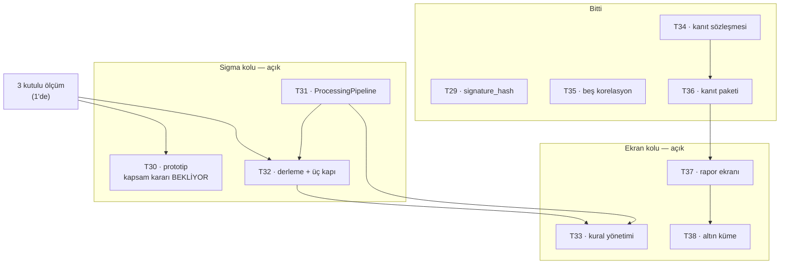
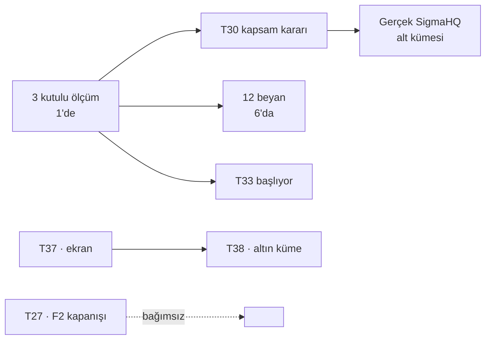

# Kalan işin haritası

Bu belge **2026-08-21** günündeki durumu anlatıyor. Ticket durumları, ölçülmüş
sayılar ve kimin neyi beklediği o günün fotoğrafı; sonraki bir tur bunu
geçersiz kılar.

Amacı tek şey: *"ne kaldı ve neyi bekliyor"* sorusunun cevabını, dağılmış
ticket dosyalarını tek tek açmadan verebilmek.

---

## 1 · Beş faz, neredeyiz

| Faz | Kapsam | Durum |
| --- | --- | --- |
| **F1** — Boru hattı | ingest → parser → OCSF/OTel → ClickHouse, ham arşiv, replay, envanter, OIDC | 12/12 ticket **kodu indi** · borcu §4'te |
| **F2** — Görünürlük | Next.js UI, arama, parser editörü, katalog, alarm + bildirim, change feed | 15/16 · **T27 açık** (fazın kendi doğrulaması) |
| **F3** — Detection + RCA kanıtı | Sigma → SQL, kural yönetimi, kanıt sağlayıcı, RCA raporu | **buradayız** — aşağısı |
| F4 — Agentic | senaryo plugin, MCP server, LLM yorumu, dört tetikleyici | başlamadı |
| F5 — Kanıt genişletme | metrik, trace, topoloji sağlayıcıları | başlamadı |
| **FS** — Cihaz simülatörleri | SSH config çekimi, syslog basımı, değişiklik bildirimi; filo + kapsam yayılımı | **paralel**, F3'ü bloke etmiyor — [belge](../fs-simulatorler/index.md) |

F5 sonrası tanıtım materyali var, henüz kapsamlandırılmadı.

**FS neden bu tabloda ve neden numarasız:** ekip gerçek cihazlara erişmiyor,
dolayısıyla `Bizigo.Devices` ve ingest'in canlı yolu bugün hiçbir yerde
koşmuyor. Ayrı bir faz çünkü üç yüzeye dokunuyor; **paralel** çünkü F3'ün
kritik yolundaki ölçümle hiçbir bağı yok ve ihtiyaç duyduğu her şey F1'de
indi. Ticket'ları `S` önekli (S01…S07) — `T` dizisiyle araya girmesi "hangi
ticket hangi fazın" sorusunu numaradan okunamaz hâle getirirdi.

---

## 2 · F3'ün on ticket'ı



| Ticket | Durum | Sahip | Neyi bekliyor |
| --- | --- | --- | --- |
| T29 · `signature_hash` | ✅ | — | — |
| T34 · kanıt sözleşmesi | ✅ | — | — |
| T35 · beş korelasyon | ✅ | — | — |
| T36 · kanıt paketi | ✅ | — | — |
| T30 · Sigma prototipi | 🔄 | 1 | **kapsam kararı** — 3 kutulu ölçüme bağlı |
| T31 · ProcessingPipeline | 🔄 | 1 | ölçüm, sonra T33 |
| T32 · derleme + kapılar | 🔄 | 6 | 12 beyan — ölçümü bekliyor |
| T33 · kural yönetimi | 🔄 | 1 | ölçüm bitince başlıyor |
| T37 · rapor ekranı | 🔄 | 4 | UI yarısı (`npm ci` koşuyor) |
| T38 · altın küme | 🔄 | 7 | beş karar verildi, veri katmanı yazılıyor |

### Sigma kolunun ölçülmüş hâli

```
manifest : total 24 · written 21 · gated 3 · gated_upstream 0 · failed 0
Kapı 3   : beyanlı 8 · bilerek beyansız 1 · ölçüm bekleyen 12
kapsam   : compiled/runs eşit · eşleşme %25 (kapsam) / %29 (eşleme kalitesi)
```

`gated` üçünün de alanı ve çaresi yazılı, yani yol haritası okunuyor:
`dns_query_name` eklenirse **iki** kural, `action` RouterOS için çözülürse
**bir** kural açılıyor.

### Fazın açık kalan tek kararı

**T30'un kapsam kararı.** `%25`'in *kapsamın* mı *örneklemin* mi sayısı olduğu
ölçülmedi; eşleşmeyen 15 kuralın kaçı eşleme eksikliğinden, kaçı örneklemde o
desen hiç olmadığından boş olduğu bilinmiyor. Ölçülmeden gerçek SigmaHQ alt
kümesi seçilemez.

Ölçüm üç kutulu olacak, ve üçüncüsü bu turda doğdu:

1. **eşleme eksik** — alan var, biz bağlamamışız
2. **örneklemde desen yok** — bağlasak da eşleşmez
3. **yanlış sebeple eşleşiyor** — sayı yeşil, sebep yanlış

Üçüncü kutunun bugünkü üyesi `asa_teardown_rst`: `raw_data ILIKE '%RST%'` ile
`first` ve `burst` sözcüklerine denk geliyordu. Ne kapı ne `--discover` bunu
söyleyebildi; örnek dosyanın **içeriğini** okuyan gördü.

---

## 3 · F2'de kalan tek ticket

**T27 — F2 doğrulaması**, sahibi 3.

Kapanmış olanlar ölçüldü: `ProducesContractTests` 16/16, `Pending` **boş**,
`Exempt` **6** ve `ExpectedExemptCount = 6`. `POST /v1/replay` kararı da
uygulanmış — `ReplayResponse` bir response record ve `Plan`'ı bilerek dışarıda
bırakıyor.

Taranacak üç kalem — hepsi *"aradım, yok"* ile *"aramadım"* ayrımıyla
yazılacak:

| # | Soru | Bugünkü bilgi |
| --- | --- | --- |
| 1 | Dört akış CI'da koşuyor mu | `F2FlowTests`'te **üç** görünüyor; kalan ikisi başka dosyada mı, hiç mi yok — bakılmadı |
| 2 | İki çapraz doğrulama ekran katmanında mı | API'de var; ekranda sınanıyor mu — bakılmadı |
| 3 | Replay sırasında canlı ingest bozulmuyor | kuru koşu eşitliği var; **yük altındaki replay yok** |

Üçüncüsü F1'den devrediyor ve envanterdeki uyarıya bağlı: `REPLACE PARTITION`
atomik diye replay'in canlı ingest'i bozmadığı *varsayılmıştı*; okuma ile
değiştirme arasındaki pencerede yazılan satırlar sessizce siliniyor.

---

## 4 · F1'den devreden borç

Hiçbiri "kod eksik" değil. Hepsi **doğrulanmamış** ya da **gerekçesi kayıtta
olmayan** şeyler — bu deponun en pahalı hata sınıfı (§7).

| Kalem | Ne | Durum |
| --- | --- | --- |
| T03 · çift yazma | Zaman aşımı penceresinde aynı batch WAL'a iki kez yazılıyor | **ölçüldü, var** |
| T03 · kimlik | İki kayıt birbirine bağlanamıyor — `EventId` her çözümlemede yeniden üretiliyor | tekilleştirme anahtarı **açık soru** |
| T40 · kurtarma | 48 saatlik WAL penceresinin sebebi bir kurtarma, kodu yok | ticket yazıldı |
| T40 · yarış | Silme kararı `State`'e hiç bakmıyor — mekanizma kendi kaynağını silebilir | ticket'ın 1. maddesi |
| T40 · aritmetik | 6sa × 20 → 48 saatte ~10 GB; arşiv büyükse koruma **erişilemez** | kabul kriteri yazıldı |
| T02 · ölçen ama yargılamayan | `Toplu_yazim_hizi_olculuyor` hızı basıyor, `Assert` satır sayısında | açık |
| T02 · elle liste | `ScopeNegativeTests` on iki yolu tek tek sayıyor | açık kalem yazıldı |
| T05 | `matchTimeout=50 ms` gerekçesi | **kayıtta yok** |
| T39 · `specificity` | Seçim ölçütü hiçbir yerde yok | ticket yazıldı |
| T12 / D3 | *"Sidecar arızalıyken throughput düşmüyor"* | mantıklı ama **ölçülmemiş** |
| B14 | Şema tamamlama listesi istemcide motorun kopyası | gerekçeli kabul |
| B16 | Worktree `node_modules` bayatlığı | yapısal, azaltıldı |

`T02 · ölçen ama yargılamayan` kapatılırken dikkat: mutlak bir hız bütçesi
`GrokPropertyTests`'in düştüğü tuzak, makineyi ölçmeye başlar. Kapatılacaksa
**aynı süreçte alınan bir tabana oran** ile.

---

## 5 · Bu turda kapanan borçlar

| Kalem | Ne olmuştu |
| --- | --- |
| **B18** · compose | İki ajan ayrı ayrı `redis` eklemiş; YAML **hiç ayrıştırılamıyordu**. `redis` / `redis-session` ayrıldı, `key-duplicates` bekçisi üç kapsamda koşuyor |
| **B19** · okunmayan CI | Kapı vardı, dört merge boyunca kırmızı yandı, kimse bakmadı. `pre-push` kancası + `workflow_run` → issue; ikisi de koordinatörün disiplinine dayanmıyor |
| **D6** · baseline | Süpürme kendi verisini tohumluyor, imzası **iki eğri** istiyor (tek eğriyle derlenmiyor) |
| **B7** · canlı Redis | `describe.skip` kalktı, dışlama yapılandırmaya taşındı; test artık dosya düzenlemeden koşuyor |
| F1 karar belgeleri | On iki ticket'ın hepsi yazıldı, geriye dönük olduğu her birinin başında yazılı |

### Baseline'ın teslim ettiği şey bir sayı değil

```
dik kuyruk (zipf 2.0) → dirsek 7g
düz kuyruk (zipf 1.4) → dirsek 1g
SEÇİLEBİLİR TABAN YOK.
```

Dirsek tohumlama düğmesiyle **yedi kat** kayıyor. Tek eğri koşturan bir araç
"7 gün" derdi ve o sayı verinin değil `--zipf 2.0`'ın karakteri olurdu.
Bağlayıcı taban **gerçek müşteri verisi** istiyor; bu bir eksiklik değil,
ölçümün sınırının ölçülmüş hâli.

Üç sebebi var ve üçü de aynı yöne bakıyor: düğme kayması · 87 örnek satırın ~81
imzayla tükenmesi · **ay adı maskesinin olmaması** (31 günlük yayılım bir ay
sınırı içeriyor, tabanı ayın birinden öteye uzatmak oranı beklendiği kadar
düşürmüyor).

---

## 6 · Bu turda adı konan hata sınıfları

Dördü de "yeşil ama anlamsız" ailesinden ve dördü de **ölçülerek** bulundu.

### Adı ile gövdesi ayrışan bekçi

| Bekçi | İddia ettiği | Gerçekte sınadığı |
| --- | --- | --- |
| `ProducesContractTests` | 16 uç sözleşmeli | listedeki uçlar |
| yaşam süresi bekçisi | DI grafiği doğrulanıyor | `AddBizigoAuthentication` hariç |
| `sigma_build` Kapı 2 | tip uyuşmazlığı yakalanıyor | AST'nin ayrıştırılabilirliği |
| `Ayni_id_icin_en_yuksek_surum_kazaniyor` | sürüm çözümlemesi | `specificity` sıralaması |

Üçü elle tutulan liste yansımaya çevrilince, biri kapının kendi `--self-test`
kipiyle, biri yeni test yazılırken bulundu.

### Sigma tuzakları — dördüncüsü yeni bir sınıf

| # | Tuzak | Nasıl görülür |
| --- | --- | --- |
| 6 | `attrs` anahtarları ad alanlı — `unmapped['url']` sonsuza kadar sıfır döner | üretilen SQL |
| 7 | `IPv6` kolonunda metin operatörü — `toString()` tip hatasından beter | üretilen SQL |
| 8 | Backend ifadelerimizi backtick'liyor | üretilen SQL |
| **9** | Gerçek kolon, temiz derleme, makul SQL — **ama o vendor'da hep boş** | **yalnızca veriye sorularak** |

9'un örneği `routeros_forward_new`: `activity_name`'e bakıyor, RouterOS parser'ı
onu **bilerek** boş bırakıyor (`accept`/`drop` yazmak uydurma olurdu), zincir
adı `fw_chain`'e gidiyor. Kayıp değil **yer değiştirme**.

Çözümü de küresel olamıyor: `FIELD_MAP` küresel, boşluk **logsource'a bağlı**.
`VENDOR_EMPTY_COLUMNS` bu yüzden doğdu, ve `action`'ın FortiGate'te hâlâ
derlendiğini ayrı bir bekçi çiviliyor.

### Aynı girdinin iki kopyası

Korpus `catalog/sigma/rules/`'a terfi etti, düzeltme `prototypes/`'ta yapıldı,
`measure.py` biri ile Kapı 3 diğerini okudu. Sürüklenme kapısı bunu göremez —
**çıktıyı girdiye karşı tutuyor**, bir girdinin kendi kopyasından ayrışmasını
değil. Bekçi artık **içeriğe** bakıyor (`detection:` + `logsource:` taşıyan her
YAML), ada değil; kopya başka adla düşse de görülüyor.

Sebep bir kişinin hatası değil **iki talimatın kesişimiydi**: koordinatör
korpusun taşındığını düzeltmeyi yapan ajana söylemedi.

---

## 7 · Sıralama

Kritik yol tek bir ölçümden geçiyor.



**Ekran kolu Sigma kolundan bağımsız** ilerliyor — T37 ve T38 ölçümü
beklemiyor. T27 de üçüncü bağımsız kol.

Yani üç kol paralel:

1. **Sigma** — ölçüm → kapsam kararı → gerçek korpus (1 ve 6)
2. **Ekran** — T37 → T38 (4 ve 7)
3. **F2 kapanışı** — T27 (3)

Dördüncü kol, altın örneklerin veri sadakati (2): alan kapsamı aracı bugün
`Reset-I`'yi bağımsız olarak buldu ve `asa_teardown_rst` teşhisini doğruladı.

---

## 8 · Bu belgenin bilmediği şey

**Gerçek müşteri verisi olmadan kapanmayacak** iki kalem var ve ikisi de
"yapılacak iş" değil:

- Baseline pencere uzunluğu (§5)
- Sigma kapsam oranının anlamı — `%25`'in örneklemin mi ürünün mü sayısı
  olduğu, ölçüm bittiğinde bile bir kısmı örnekleme bağlı kalacak

İkisi de F3'ü bloke etmiyor ama **F3'ün sayıları bağlayıcı değil** demek. Bunu
yazan yer burası; bir sonraki fazda birinin bu sayılara dayanması gerekirse
önce bu paragrafı okusun.
