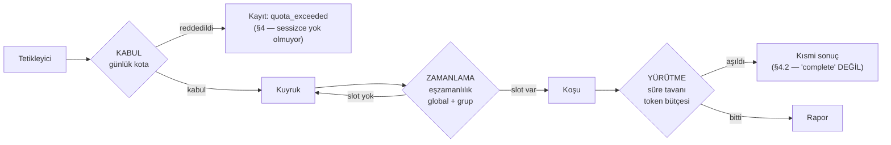

# F4 · Kota neyi koruyor?

[RCA tasarımı](../rca-raporu-ozelligi/index.md) §5'in son paragrafı dört kısıt
sayıyor ve hepsini tek cümlede risk #6'nın (gürültülü komşu) karşılığı diye
kuyruğa koyuyor:

> **eşzamanlılık limiti, koşu başına süre tavanı, token bütçesi ve grup başına
> günlük RCA kotası** kuyrukta uygulanır, senaryonun insafına bırakılmaz.

Cümle doğru bir şey söylüyor — *senaryonun insafına bırakılmaz* — ama dördünü
tek sepete koyduğu için **hangisinin hangi riski kapattığı ayrışmamış**. Bu
belge onu ayrıştırıyor.

> **Kapsam.** Bu belge kısıtların **hangi riske karşı, nerede ve nasıl**
> uygulanacağını karara bağlıyor. Zincir derinliği ≤ 2 **açık soru 1'in alanı**;
> burada yalnızca kotayla kesiştiği yer yazılı (§6). Sayı **önerilmiyor**,
> sayının nereden geleceği yazılıyor (§5).

---

## 1 · Neden ayrışmak zorunda

Dördü aynı sepetteyken *"kotayı ayarla"* diyen kişi, hangi riski ayarladığını
bilmiyor. Bu depo o hata sınıfını **ölçtü**: sidecar'ın altı sabiti
(`FailureThreshold=5`, `BreakDuration=5dk`, `Timeout=2sn`, `QueueCapacity=2048`,
`SampleRate=%1`, `TemplateCacheCapacity=50 000`) yan yana duruyor ve
[T12 §3](../t12-kararlar/index.md)'ün kaydı tek cümle:

> **Kayıtta olmayan:** bu altı sayının hiçbirinin gerekçesi koddan okunmuyor.
> Örnekleme oranının %1 seçilmesi bir ölçüme mi dayanıyor, tahmine mi —
> bilinmiyor.

Bedeli T04'te sayıldı: birbirine bağlı üç sabit ayrı ayrı makuldü, **birlikte
çalışmıyordu**. Aynı şekil burada da mümkün — token bütçesi ile günlük kota
çarpım hâlinde faturayı belirliyor (§3.1) ve ayrı ayrı seçilirlerse ikisi de
makul görünürken fatura sınırsız kalabilir.

> Bu belgenin varlık sebebi bir sayı vermek değil, **sayıların hangi soruya
> cevap vereceğini** önceden çivilemek.

---

## 2 · Kısıt × risk matrisi

Dört kısıt, dört risk. **●** kapatıyor · **◐** kısmen, yan etki olarak ·
**○** kapatmıyor.

| | Maliyet<br/>(LLM faturası) | Gürültülü komşu<br/>(başkasını bekletme) | Takılı koşu<br/>(slot tutma) | Döngü<br/>(senaryo A → RCA → A) |
| --- | :---: | :---: | :---: | :---: |
| **Eşzamanlılık limiti** | ○ | ● | ○ | ○ |
| **Koşu başına süre tavanı** | ◐ | ◐ | ● | ○ |
| **Token bütçesi** | ◐ | ○ | ◐ | ○ |
| **Grup başına günlük kota** | ◐ | ◐ | ○ | ○ |

Hücrelerin gerekçesi:

| Hücre | Neden |
| --- | --- |
| Eşzamanlılık → maliyet **○** | Eşzamanlılık *hızı* sınırlar, *toplamı* değil. 4 yerine 1 slot, aynı işi dört kat yavaş yapar — aynı faturayla |
| Eşzamanlılık → gürültülü komşu **●** | Doğrudan karşılığı. **Ama yalnızca grup başına uygulanırsa** — bkz. §2.1 |
| Süre tavanı → maliyet **◐** | Kesilen koşu daha az token harcar, ama bu bir **yan etki**: bütçe token'ı değil saniyeyi sayıyor ve ikisi arasındaki oran modele göre değişiyor |
| Süre tavanı → gürültülü komşu **◐** | Slot'u ne kadar tutabileceğini sınırlıyor, yani eşzamanlılık limitinin etkisini öngörülebilir kılıyor. Tek başına kimseyi öne geçirmiyor |
| Süre tavanı → takılı koşu **●** | Tek karşılığı. Başka hiçbir kısıt bitmeyen bir koşuyu bitirmiyor |
| Token bütçesi → maliyet **◐** | **Koşu başına** maliyeti sınırlıyor; koşu sayısını değil |
| Token bütçesi → gürültülü komşu **○** | Kısa bir koşu da slot'u işgal eder. Token sayısıyla sıra beklemenin ilgisi yok |
| Token bütçesi → takılı koşu **◐** | Üretim akışında takılan bir modeli keser; **kanıt toplarken** takılan bir sağlayıcıyı kesmez — orada token üretilmiyor |
| Günlük kota → maliyet **◐** | **Koşu sayısını** sınırlıyor; koşu başına maliyeti değil |
| Günlük kota → gürültülü komşu **◐** | Bir grubun *günü* domine etmesini engelliyor, *dakikayı* değil. 200 RCA'nın hepsi aynı beş dakikada kotanın içinde kalabilir |

### 2.1 · Birinci bulgu: "eşzamanlılık limiti" **neyin başına?**

Matristeki tek **●** koşullu. §5'in cümlesi *"eşzamanlılık limiti"* diyor ve
**neyin başına** olduğunu söylemiyor. Aynı belgenin tetikleyici tablosu ise
yalnızca kullanıcı satırında *"kullanıcı başına eşzamanlılık limiti"* yazıyor —
diğer üç tetikleyici için sessiz.

Fark, riskin kendisi:

- **Global limit** gürültülü komşuyu **kapatmıyor**. Sekiz slot varsa ve bir
grubun alarm fırtınası sekizini de doldurursa, diğer gruplar tam olarak
bekliyor. Global limit *sunucuyu* korur, *komşuyu* değil.
- **Grup başına limit** komşuyu korur ama sunucuyu korumaz: 50 grup × 2 slot =
100 eşzamanlı LLM koşusu.

**Karar: ikisi birden, ve ikisi ayrı sayı.** Global limit sunucu kapasitesinin
karşılığı (fiziksel), grup başına limit adaletin karşılığı (politik). Tek sayıya
indirgemek, iki farklı sorunun cevabını birbirine bağlamak olur.

### 2.2 · İkinci bulgu: **döngü sütunu tamamen boş**

Dört kısıttan **hiçbiri** döngüyü kapatmıyor. Zincir derinliği ≤ 2 ayrı bir
mekanizma ve §5 onu kotanın yanında saydığı için kotanın bir kolu sanılabiliyor.

Kota bir döngü koruması **değil** ve olamaz, iki sebeple:

1. **Geç ateşliyor.** Kota ancak hasar oluştuktan sonra devreye giriyor —
100'lük kotayla bir döngü günde 100 RCA üretir ve *"kota çalıştı"* der.
2. **Yavaş döngüyü hiç görmüyor.** Günde 3 RCA üreten bir döngü kotanın
**sonsuza kadar altında** kalır. Kısıtların hiçbiri kırmızı yanmaz, fatura
küçüktür, ve mekanizma **süresiz** çalışır. Bu, bu deponun *"belirti üretmeyen
yanlış davranış"* sınıfı — sayaç yok, alarm yok, sorun var.

> **Bu sütunun boş kalması bir eksiklik değil, bir sınır.** Döngüyü kapatan şey
> zincir derinliği ve döngü tespiti; kotanın orada işi yok. Kotayı döngü
> koruması sanmak, korunmadığın bir riski korunmuş saymak olur.

### 2.3 · Üçüncü bulgu: hiçbir kısıdın kapatmadığı dördüncü risk

Matriste sütunu olmayan ama ölçüldüğünde çıkacak bir risk var: **yavaş sızıntı**.
Kotanın hemen altında seyreden sürekli bir RCA akışı — yanlış ayarlanmış bir
debounce, dar bir zincir, ya da bir entegrasyonun her olayda RCA tetiklemesi.

Dört kısıt da bunu **tanım gereği** kaçırıyor: hepsi bir tavana çarpmayı
ölçüyor, hiçbiri **taban çizgisinin kaymasını** ölçmüyor.

Karşılığı bir kısıt değil, bir **sayaç ve eşik**: grup başına günlük RCA sayısı
zaman serisi olarak tutulmalı ve kendi baseline'ına göre sapması görünmeli.
Kotanın kendisi bunu vermez; kota yalnızca *"tavana çarptı mı"* der.

> Ürün bu sinyali zaten üretebiliyor: RCA'nın kendi **hacim sapması**
> korelasyonu (§3.1) tam olarak bunu ölçen şey. RCA sayısını RCA'nın kendi
> aracıyla izlemek, yeni mekanizma gerektirmiyor. ^[öneri, ölçülmedi]

---

## 3 · Her kısıt nerede uygulanır

Dördü "kuyrukta uygulanır" cümlesinde toplanmış, ama **kuyruğun üç ayrı anı**
var ve kısıtlar farklı anlara düşüyor. Bu, mekanizma farkı: girişte reddetmek
senkron bir cevap, koşu sırasında kesmek iptal altyapısı istiyor.



| Kısıt | An | Mekanizma | Ne gerektiriyor |
| --- | --- | --- | --- |
| **Günlük kota** | **Kabul** — kuyruğa girişte | Reddeder, senkron cevap | Grup başına sayaç + pencere. İş **hiç başlamıyor** |
| **Eşzamanlılık** | **Zamanlama** — kuyruktan çıkarken | Bekletir, reddetmez | Slot muhasebesi. İş başlamıyor ama **kaybolmuyor** |
| **Süre tavanı** | **Yürütme** — koşu sırasında | Keser | `CancellationToken`'ın **her adımda** onurlandırılması |
| **Token bütçesi** | **Yürütme** — adım adım | Keser ya da baştan reddeder | LLM adaptörünün token sayması; girişte tahmin, üretimde kesme |

### 3.1 · Maliyet iki kısıdın **çarpımı** — ve bu bir tuzak

Ne token bütçesi ne günlük kota tek başına faturayı sınırlıyor:

```
günlük fatura ≈ (günlük kota) × (koşu başına token bütçesi) × (birim fiyat)
```

İkisi ayrı ayrı seçilirse ikisi de makul görünürken çarpımları makul olmayabilir
— T04'ün *"üç sayı birbirinden habersiz seçilmiş"* şekli, iki sayıyla.

**Karar: ikisi birlikte seçilir ve çarpımları belgeye yazılır.** Biri
değiştiğinde çarpım yeniden hesaplanır. Sayıların yanına *"bu ikisi bağlı"*
notu düşer.

> Yerel model (K6) faturayı para değil **GPU-saat** yapıyor, ama denklem
> değişmiyor: kapasite de tükenen bir kaynak ve çarpım yine çarpım.

### 3.2 · Kanıt toplama ile akıl yürütme **ayrı bütçeler**

Senaryo YAML'ı ([RCA §8](../rca-raporu-ozelligi/index.md)) şunu taşıyor:

```yaml
budget: { max_items: 400, max_duration: 60s }
```

Bu bütçe `IEvidenceProvider.GatherAsync`'in `GatherBudget`'ı, yani **kanıt
toplamanın** bütçesi. LLM adımlarının (`rank-hypotheses`, `bind-evidence`,
`write-actions`) süre ve token tavanı **hiçbir yerde yazılı değil**.

İkisi ayrı olmak zorunda: kanıt toplama ClickHouse sorgusu, akıl yürütme model
çağrısı. Aynı 60 saniyeyi paylaşırlarsa yavaş bir sorgu, modele hiç sıra
gelmeden koşuyu bitirir — ve rapor *"model yetersiz"* diye okunur.

**Karar: `budget` iki bölüme ayrılır** — `evidence: {max_items, max_duration}`
ve `reasoning: {max_duration, max_tokens_in, max_tokens_out}`. §5'in "koşu
başına süre tavanı"ndan kastedilen **toplam** ise, o toplam ikisinin üstünde
üçüncü bir tavan olarak durur ve hangisinin tükettiği raporda görünür.

---

## 4 · Kota aşıldığında ne oluyor

Bu bölüm belgenin en riskli kısmı, çünkü **sessiz yanlış davranış** tam burada
doğuyor.

### 4.1 · Taşıyıcı kural

> **Kota yüzünden RCA üretilmemiş bir alarm, RCA'sı boş çıkmış alarmdan ayırt
> edilebilmeli.**

Bu, bu depoda daha önce **iki kez** aynı şekilde çözülmüş bir problem ve ikisi
de emsal:

**Emsal 1 — `AlertRunState`.** Alarm motoru zaman aşımını `Quiet` yapmıyor,
`TimedOut` yapıyor. Kodun kendi yorumu:

> *"Burada zaman aşımı `AlertRunState.TimedOut` üretiyor, `Quiet` değil — yani
> **'alarm yok' cevabı asla bir zaman aşımından türemiyor**."*

Enum `NeverRun / Quiet / Fired / Suppressed / TimedOut / Failed` diye altı
durum taşıyor; `Suppressed` bile ayrı, çünkü *"bakım penceresi yüzünden
bastırıldı"* ile *"eşik aşılmadı"* farklı cevaplar. Kota tam olarak
`Suppressed`'ın RCA'daki karşılığı.

**Emsal 2 — RCA'nın kendi kararı.** Referanssız cümle için §2 şunu seçmiş:
**içerik atılıyor, sayı kalıyor.** Kullanıcı uydurmayı görmüyor ama modelin ne
kadar uydurduğunu **biliyor**. Gerekçe belgede yazılı: *"ölçemedim" ile "sorun
yok"un aynı çıktıya inmesi, bu deponun dört kez adını koyduğu sınıf.*

Kota aynı şekli alıyor: **RCA üretilmiyor, üretilmediği kayda giriyor.**

### 4.2 · Karar tablosu — tetikleyiciye göre

| Tetikleyici | Aşıldığında | Kullanıcı/sistem ne görüyor |
| --- | --- | --- |
| **Kullanıcı (UI)** | **Reddet, senkron** | `429` + kotanın **ne zaman sıfırlanacağı**. İstemcide `RateLimitedError` zaten var (`ui/src/lib/api/errors.ts`) — yeni hata tipi gerekmiyor |
| **Dış API** | **Reddet**, `429` + `Retry-After` | ⚠️ `Idempotency-Key` **yakılmamalı**: reddedilen istek anahtarı tüketirse, kota sıfırlandıktan sonraki tekrar *"aynı rapor"* diye hiç var olmamış bir raporu döndürür |
| **Alarm / Sigma** | **Reddetme — kaydet** | `rca_report` satırı `status: quota_exceeded` ile **oluşuyor**. Alarm RCA'sız kapanmıyor; RCA'nın neden yok olduğu alarmın üstünde görünüyor |
| **Anomali zinciri** | **Reddet, sessiz değil** | Zincir kırılıyor; kırıldığı sayılıyor. Kullanıcıya senkron cevap yok, ama sayaç var (§6) |

**Alarm satırı neden diğerlerinden farklı:** kullanıcı reddi görür, alarm
görmez. Bir alarm, RCA'sı hiç denenmemiş olarak kapanırsa operatör *"RCA baktı,
bir şey bulamadı"* ile *"RCA hiç bakmadı"*yı ayırt edemez. `rca_report`'un
`status` alanı zaten
`queued / gathering / evidence_ready / reasoning / complete / failed` taşıyor;
`quota_exceeded` oraya **yeni bir durum** olarak giriyor.

> ⚠️ **Ve bu yeni durum bir tel sözleşmesi.** T05'te ölçülen ders burada birebir
> geçerli: eklenen bir statünün **hem tüketicisi hem üreticisi** olmalı.
> Tüketicisi belli — alarm kapatma akışı ve rapor listesi ekranı. Üreticisi
> kabul kapısı. İkisi de yazılmadan statü eklenirse, T05'in *"üreticisi hiç
> ateşlenmeyen tip"* tuzağının ikinci örneği olur.

### 4.3 · Yürütme kısıtları kestiğinde: kısmi rapor **"complete" değil**

Süre tavanı ve token bütçesi koşuyu **ortasında** kesiyor. Kesilen koşu bir
rapor üretmiş olabilir — eksik bir rapor.

**Karar: kesilen koşu `complete` olmuyor.** İki alt durum gerekiyor, çünkü ikisi
farklı kararlara götürüyor:

| Durum | Anlamı | Operatörün kararı |
| --- | --- | --- |
| `truncated` | Kanıt toplandı, akıl yürütme kesildi | Aynı paketle **yeniden koşturulabilir** — paket saklı (§2 kural 3) |
| `failed` | Kanıt bile toplanamadı | Pencere/kapsam yeniden seçilmeli |

`truncated` ucuz: kanıt paketi zaten saklanıyor ve tekrar üretim zaten
tasarımın taşıyıcı kararı. Kesilmiş bir raporu atmak, elde duran kanıtı da
atmak olurdu.

---

## 5 · Sayılar — **yazmıyorum, nereden geleceklerini yazıyorum**

§1'in dersi gereği hiçbir kısıt için sayı öneriyorum. Her biri için *"ne
ölçülürse sayı seçilebilir"*:

| Kısıt | Ölçülecek şey | Nerede ölçülür | Ölçülene kadar |
| --- | --- | --- | --- |
| **Global eşzamanlılık** | Model sunucusunun (vLLM) doyuma girmeden taşıdığı eşzamanlı istek sayısı ve o noktadaki gecikme | F4'te model sunucusu ayağa kalkınca; **fiziksel bir kapasite**, tahmin edilemez | Tek slot. Yavaş ama yanlış değil |
| **Grup başına eşzamanlılık** | Bir grubun tipik alarm fırtınasında ürettiği eşzamanlı RCA talebi | F3 telemetrisi — aşağıda | Global limitin bölümü değil, **ayrı** karar |
| **Süre tavanı — kanıt** | Kanıt toplama süresinin dağılımı (p50/p95/p99), sağlayıcı başına | **F3'te bedava**: kanıt paketi `providers[].duration_ms` alanını zaten taşıyor | YAML'daki `60s` — **işaretli sabit**, ölçülmedi |
| **Süre tavanı — akıl yürütme** | Model çağrısının uçtan uca süresi, prompt sürümü başına | F4, ilk koşumlar | — |
| **Token bütçesi** | Kanıt paketi **boyutunun** dağılımı → prompt token'ına çevrimi | **F3'te bedava**: `items` sayısı ve `evidence_item.summary` uzunlukları zaten yazılıyor | — |
| **Günlük kota** | Grup başına gerçek RCA talebi: alarm sayısı × debounce sonrası birleşme oranı | F3 telemetrisi + alarm geçmişi | — |

### 5.1 · Taşıyıcı gözlem: **F3 zaten ölçüm aracı**

F4'ün sayılarının üçü F3'ten **bedavaya** çıkıyor ve bu bir tesadüf değil —
[RCA §9](../rca-raporu-ozelligi/index.md)'a göre F3 kanıt paketini **LLM'siz**
üretiyor. Yani F3, F4'ün maliyet modelinin girdisini üretirken hiçbir token
harcamıyor:

- `providers[].duration_ms` → süre tavanı
- `items` sayısı + `summary` uzunlukları → token bütçesi
- paket üretim sıklığı, grup başına → günlük kota

**Karar: F4'ün kota sayıları F3 telemetrisinden seçilir, F4 tasarımında
seçilmez.** Şu an seçilecek her sayı, F3'ün üreteceği veriyle çelişme riskini
taşıyor ve *"gerekçesi kayıtta olmayan sabit"* envanterine yedinci satır olarak
girer.

Bunun bir şartı var ve **F3'e düşen bir iş**: yukarıdaki üç alanın kalıcı
olması. `providers[]` ve `items` zaten `evidence_bundle` şemasında — yani şart
**bugün karşılanıyor**, yalnızca F3 kapanışında bu verinin **sorgulanabilir**
olduğu doğrulanmalı.

> ⚠️ **Doğrulamadım.** `evidence_bundle` şeması belgede tanımlı; F3'te
> uygulanmış hâlinin `duration_ms`'i gerçekten yazıp yazmadığına **bakmadım** —
> F3 kodu bu turda okumadığım bir alan. Şema belgeyle uyuşuyorsa şart
> karşılanıyor. ^[doğrulanmadı]

### 5.2 · İşaretli sabit — tek tane

Senaryo YAML'ındaki `budget: { max_items: 400, max_duration: 60s }`
**ölçülmemiş bir sabit** ve belgede gerekçesi yok. Bu belgenin envanterine
işaretli olarak giriyor: ölçülene kadar (§5, satır 3) yerinde kalabilir, ama
*"seçildi"* değil *"yer tutuyor"*.

---

## 6 · Zincir derinliğiyle kesişme — *(soru 1'in alanı, yalnızca kesişme)*

Zincir derinliği ≤ 2 kararı **açık soru 1'e** ait. Kotayla üç yerde kesişiyor ve
üçü de soru 1'in kararını etkiliyor:

1. **Kota bir döngü koruması değil** (§2.2). Soru 1 zincir derinliğini
tasarlarken *"zaten kota var"* diyemez — yavaş bir döngü kotanın sonsuza kadar
altında kalır.
2. **Zincirin tetiklediği RCA kimin kotasından düşüyor?** Zincir başka bir
grubun senaryosundan geldiyse ve kota **tetikleyenin** hesabına yazılırsa,
zincir bir **kota aklama yolu** olur: A grubu kendi kotasını doldurunca bir
zincirle B grubunun kotasından harcar. Öneri: kota **RCA'nın kapsamının**
(`owner_group`) hesabına yazılsın, tetikleyenin değil — K17 kapsam kuralıyla da
tutarlı olan bu.
3. **Kota zinciri kırdığında zincir bunu bilmeli.** Kotaya takılan bir zincir
adımı sessizce durursa, senaryo *"ikinci adım bir şey bulamadı"* diye okunur —
§4.1'in aynısı, bir kademe içeride.

**Koordinatöre not:** ikinci madde soru 1'in kararını değiştirebilecek nitelikte
ve ben o alana girmedim. Zincir sahibinin görmesi gerekiyor.

---

## 7 · Öneri

**Dört kısıt, dört dial değil — iki aile.**

| Aile | Kısıtlar | Ortak yanı |
| --- | --- | --- |
| **Kabul kapıları** | Günlük kota | İş **hiç başlamıyor**; cevap senkron; reddin **kaydı** şart (§4) |
| **Yürütme sınırları** | Eşzamanlılık, süre tavanı, token bütçesi | İş başlıyor; kesilme **kısmi sonuç** bırakıyor ve o sonuç `complete` değil |

Karara bağlanan altı madde:

1. **Eşzamanlılık iki sayı**: global (sunucu kapasitesi, fiziksel) + grup başına
(adalet, politik). Tek sayıya indirgenmiyor. *(§2.1)*
2. **Maliyet tek kısıtla kapanmıyor**: token bütçesi × günlük kota birlikte
seçilir, çarpımları yazılır. *(§3.1)*
3. **Bütçe ikiye ayrılır**: `evidence` ve `reasoning`. Aynı saniyeyi
paylaşmıyorlar. *(§3.2)*
4. **Kota reddi sessiz olmuyor**: alarm tetikli RCA için `rca_report` satırı
`status: quota_exceeded` ile oluşuyor; kullanıcı ve API `429` görüyor;
`Idempotency-Key` yakılmıyor. *(§4.2)*
5. **Kesilen koşu `complete` değil**: `truncated` (paketle yeniden koşturulur) /
`failed` ayrımı. *(§4.3)*
6. **Sayılar F3 telemetrisinden seçilir**, F4 tasarımında değil. Üçü F3'te
bedava üretiliyor. *(§5.1)*

**Gerekçe.** Bu altı maddenin ortak paydası tek bir cümle: *bir kısıt devreye
girdiğinde, girdiğinin **görünmesi** kısıtın kendisi kadar önemli.* Dördü de
bir işi engelliyor; engellenen iş sessizce yok olursa, kısıt bir korumadan
çıkıp bir **bilgi kaybına** dönüşüyor — ve bu depo o dönüşümü RCA'nın kendi
tasarımında (referanssız cümle), alarm motorunda (`TimedOut ≠ Quiet`) ve T05'in
zaman aşımı ölçümünde olmak üzere üç ayrı yerde ödedi.

---

## 8 · Aramadıklarım ve tereddütlerim

**Aradım, yok:**

- RCA belgesinde **§8.1 yok** — §8 tek parça (`Senaryo plugin'i olarak RCA`) ve
alt bölümü yok. Ticket'ın işaret ettiği *"altı sabit"* ölçümü
[T12 §3](../t12-kararlar/index.md)'te; §1'de oradan alıntıladım.
- Depoda kota/eşzamanlılık için **var olan bir RCA mekanizması yok** — `rca`,
`quota` adıyla bir sınıf aramadım demiyorum: aradım, F4'e ait olduğu için henüz
yok.

**Aramadım:**

- **F3'ün uygulanmış kanıt paketi kodunu okumadım** (§5.1'in şartı buna bağlı).
`duration_ms` ve `items`'ın gerçekten yazıldığını **belgeden** biliyorum,
koddan değil.
- **Mevcut hız sınırının** (`PermitLimit=4`, `QueueLimit=8`, T10) RCA uçlarını
kapsayıp kapsamadığına bakmadım. Kapsıyorsa kullanıcı tetikli RCA'da **iki ayrı
limit** üst üste biner ve hangisinin reddettiği kullanıcıya aynı `429` olarak
döner — ayırt edilmesi gerekebilir. Bu, §4.2'yi etkileyecek tek açık uç.

**Tereddütlerim — senin cevaplaman gerekenler:**

1. **`quota_exceeded` gerçekten yeni bir `status` mi olmalı, yoksa `failed` +
`reason` mı?** Ayrı statü ekranların ayırt etmesini kolaylaştırıyor ama tel
sözleşmesini büyütüyor (§8). Ben ayrı statüden yanayım — `AlertRunState`'in
`Suppressed`'ı tam bu emsal — ama tüketicisini F4 ticket'ı yazmalı, ben değil.
2. **Günlük kota penceresi takvim günü mü, kayan 24 saat mi?** Takvim günü
öngörülebilir ama gece yarısı sürüsü yaratıyor; kayan pencere daha adil ama
kullanıcıya *"ne zaman sıfırlanır"* demek zorlaşıyor — ki §4.2 onu gösteriyor.
Ölçümle çözülecek bir şey değil, **politika**; senin kararın.
3. **Kotanın birimi RCA sayısı mı, token mı?** §3.1'in çarpımı, tek birim
seçilirse ortadan kalkar: doğrudan **token kotası** koymak sayıyı tek başına
anlamlı yapar. Ama kullanıcıya *"bugün 40 RCA hakkınız var"* demek,
*"1,2M token"* demekten okunaklı. Ben ikisini önerdim (§7 madde 2), tek birime
inmek de savunulabilir.

---

## 9 · Bu belgeye katılacak dört bulgu — **henüz katılmadı**

Bu soruyu iki ajan birbirinden habersiz cevapladı; koordinatörün hatası, ikisinin
değil. Bu belge taban olarak seçildi, ama diğer sürüm (`6fc87fa`) burada
**olmayan** dört şey taşıyor. Katılana kadar bu bölüm duruyor:

1. **"Reddedilen koşum düşülmez" yalnızca *girişte* reddedilen için geçerli.**
Süre ya da token tavanına takılan koşum reddedilmedi, **başarısız oldu** — kanıt
topladı, belki modeli çağırdı, maliyeti gerçekten ödendi ve kotadan düşülmeli.
İkisini aynı kefeye koymak kotayı gerçek harcamadan koparır.
2. **Eşzamanlılık bir ret değil bir bekletme.** *"Sıranı bekliyorsun"* ile
*"kotan doldu"* kullanıcı için tamamen farklı; tek bir *"şu an çalıştırılamıyor"*
mesajı ikisini birleştirir ve kullanıcıyı bekleyeceği yerde kotasını sorgulamaya
gönderir.
3. **Kapalı durum kümesinin emsali depoda ve gerekçesi kayıtlı:**
`AlertRunState`. Zaman aşımı `Quiet` sayılsaydı *"yavaş bir sorgu sessizce her
şey yolunda'ya dönüşürdü"*. Aynı ayrım burada `Empty` (bakıldı, bulunamadı) ≠
`QuotaExceeded` (**hiç bakılmadı**) ≠ `Cancelled` (başladı, yarıda kesildi).
Sonuncusu özellikle önemli: yarıda kesilen koşum kanıt toplamış olabilir ve o
kanıt *"bulunamadı"* diye sunulursa **yanlış bir olumsuzluk** üretir.
4. **İki emsal sayı var ve ikisi de ölçülerek değil kararla konmuş:**
`MaxConcurrentEvaluations = 4` ve `GatherBudget = (400, 20 sn)`. RCA koşumu
alarm değerlendirmesinden ağır; **aynı sayı devralınmamalı**.

Ayrıca `Cancelled` / `Failed` sınırının ölçütü karara bağlandı ve buraya
yazılmalı: **operatör yapılandırmaya bakarak öngörebilir miydi?** Öngörebilirse
`Cancelled` (sistem bildiği bir sınırda kasten durdu), öngöremezse `Failed`
(sağlayıcı hatası, tekrardan sonra hâlâ bozuk çıktı). Kota ekseni bundan
**bağımsız**: token bütçesi dolan koşum `Cancelled` **ve** düşülüyor. İki eksen
olduğu yazılmazsa *"iptal edildi, o hâlde bedava"* çıkarımı doğar.
