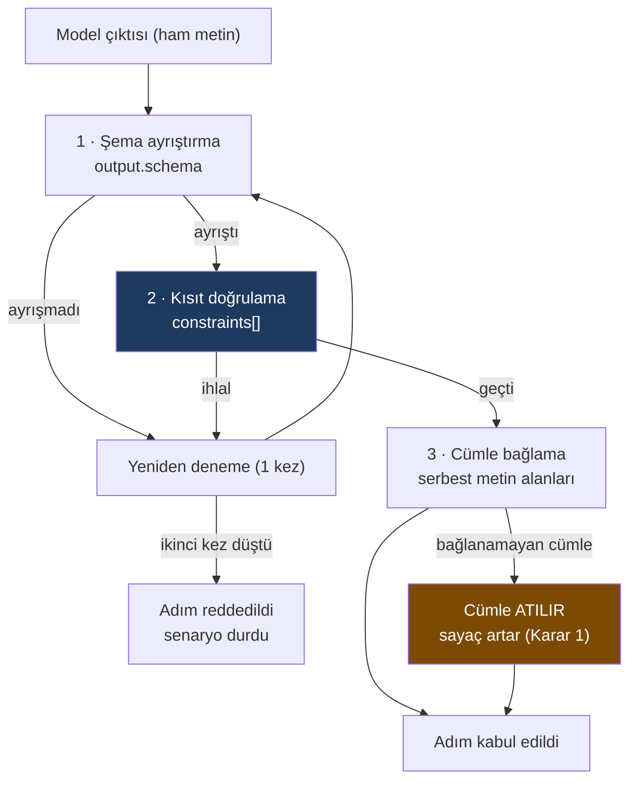

# Senaryo plugin formatı: çivilenebilir mi, nereye kadar

**Soru:** [RCA §8](../rca-raporu-ozelligi/index.md)'in YAML formatı, dört
senaryo yazılmadan çivilenebilir mi?

**Cevap: (c) kısmen.** Adım makinesi bugün çivilenebilir; **kanıt adresleme** ve
**tetikleyici sözcük dağarcığı** çivilenemez ve uzantı noktası olarak açık
kalmalı.

Gerekçe aşağıda, ve gerekçenin tamamı tek bir işten çıktı: formatı **iki farklı
şekilli senaryoya** oturtmayı denedim. Biri oturdu, biri kırdı, ve **kırılan
yer formatın tek gerçek güvencesiydi.**

> **Sayı uyarısı.** Bu belge yeni sabit **önermiyor**. Geçen her sayı ya
> mevcut formattan alıntı (ve §8.1'de zaten işaretli) ya da açıkça
> `⚠ işaretli` — yani seçilmemiş, ölçülmemiş, yalnızca örnek.

---

## 1 · Neden bu soru sorulmak zorunda

Format **tek bir senaryonun** şeklinden türedi. K19 senaryo plugin'ini genel bir
mekanizma sayıyor; ama genel bir mekanizmanın tek tüketiciyle çivilenmesi bu
depoda adı konmuş bir hata:

> **Tüketicisi olmayan bir tip tahmindir** (`CLAUDE.md` §8).

Burada tersi geçerli — tüketici **var** ama **tek**. Tek tüketiciyle çivilenen
bir format o tüketicinin şekli olur, ve ikinci senaryoda ya bükülür ya çatallanır.
Bükülme sessizdir: format aynı görünür, anlamı değişir.

---

## 2 · İki senaryo taslağı

Seçim ölçütü: **RCA'dan farklı şekilli olmak.** Aynı şekilli bir ikinci senaryo
formatın genelliğini sınamaz, yalnızca doğrular.

### 2.1 · Kapasite / eğilim raporu

RCA'dan farkı: **olay yok.** Konu bir zaman aralığı değil, bir **kapsam artı
ufuk**. Karşılaştırma pencere-vs-taban değil, uzun bir seri.

```yaml
apiVersion: bizigo.dev/v1
kind: Scenario
metadata:
  id: builtin.capacity.trend
  version: 0.1.0
  owner: platform-team
spec:
  trigger:
    on: [schedule]                 # ⚠ K20'nin dördünde YOK — §3.1
  evidence:
    providers: [logs.volume]
    horizon: { span: 90d, bucket: 1d }   # ⚠ işaretli: örnek, seçilmedi
    budget: { max_items: 90 }            # ⚠ işaretli
  steps:
    - id: describe-trend
      task: "Seriyi tek cümleyle tarif et: artıyor, düşüyor, düz, dalgalı."
      input: evidence.series
      output:
        schema: trend_label
    - id: project-threshold
      task: "Bugünkü eğilim sürerse saklama sınırının aşılacağı tarihi ver."
      input: [steps.describe-trend, evidence.series]
      output:
        schema: threshold_projection
        constraint: ???                  # ← BURASI KIRILIYOR, §3.2
  publish:
    requires_review: false               # ⚠ işaretli: aksiyon almıyor
```

### 2.2 · Parser kalite raporu

RCA'dan farkı: **konu bir varlık, bir zaman aralığı değil.** Girdi bir
`parser_id`; kanıt, o parser'ın düşürdüğü satırlar. Çıktı bir **depo
artifact'ına önerilen değişiklik**.

```yaml
apiVersion: bizigo.dev/v1
kind: Scenario
metadata:
  id: builtin.parser.quality
  version: 0.1.0
  owner: platform-team
spec:
  trigger:
    on: [manual, schedule]         # ⚠ `schedule` yine K20 dışında
  subject:                         # ← RCA'da YOK: konu pencere değil varlık
    kind: parser
  evidence:
    providers: [parse.failures]    # ← bugün var olmayan sağlayıcı
    sample: { max_items: 50 }      # ⚠ işaretli
  steps:
    - id: group-failures
      task: "Başarısız satırları benzer şekillere göre grupla, en fazla 5 grup."
      input: evidence.items
      output:
        schema: failure_group_list
        constraint: evidence_ids_must_exist    # ← burada ÇALIŞIYOR
    - id: propose-pattern
      task: "En büyük grup için bir grok deseni öner."
      input: steps.group-failures
      output:
        schema: pattern_proposal
        constraint: pattern_must_compile       # ← YENİ bir kısıt türü
  publish:
    requires_review: true
    target: repo_artifact          # ← RCA'da YOK: inceleme bir PR kapısı
```

---

## 3 · Nerede kırıldı

Üç kırılma çıktı. İkisi beklenendi; **üçüncüsü formatın tek gerçek güvencesini
vuruyor** ve asıl bulgu o.

### 3.1 · Tetikleyici sözcük dağarcığı K20'ye kilitli

`trigger.on` değerleri K20'den geliyor: `alert`, `manual`, `anomaly`,
`external`. **Dördü de RCA'nın tetikleyicileri.** Kapasite raporunun
tetikleyicisi bir takvim; parser kalite raporununki de öyle.

`schedule` eklenebilir — ama o zaman soru şu: bu liste **kapalı bir küme mi,
açık mı?** Kapalıysa her yeni senaryo çekirdeği değiştiriyor, yani plugin
olmaktan çıkıyor. Açıksa K20'nin *"dördü tek kuyrukta buluşur; debounce, döngü
koruması ve kota tek yerde"* garantisi yeni değerler için **tanımsız**.

Bu kesişme benim alanım değil — **kuyruk ve kota soru 2'nin**, zincir/döngü
koruması **soru 1'in**. Kararı vermedim, bildirdim.

> **Karar geldi (koordinatör):** `schedule` **beşinci tetikleyici olarak
> K20'ye giriyor** ve değer kümesi **kapalı** kalıyor. Gerekçe: bir formatın ilk
> iki gerçek tüketicisinin çekirdeği değiştirmek zorunda kalması, formatın değil
> **K20'nin** eksikliği. Küme kapalı çünkü açık olsaydı tek-kuyruk garantisi
> yeni değerler için tanımsız kalırdı — yeni tetikleyici eklemek bir **çekirdek**
> kararı, plugin kararı değil.
>
> K20/§5 metnini bu belge **değiştirmiyor**; taşıma koordinatörde (§9).

### 3.2 · `constraint` her senaryoda uygulanamıyor — ve uygulanamadığı sessiz

**Bu belgenin en önemli satırı.**

`evidence_ids_must_exist` formatın tek gerçek güvencesi: halüsinasyon kapısı
burada kapanıyor ve prompt'ta rica edilmiyor, **motorda zorlanıyor**. Ama
zorlanabilmesi için kanıtın **kimliği olması** gerekiyor.

| Senaryo | Kanıtın şekli | `evidence_ids_must_exist` |
| --- | --- | --- |
| RCA | Ayrık olaylar/değişiklikler, her birinin kimliği var | ✅ çalışıyor |
| Parser kalite | Ayrık satırlar, kimliklenebilir | ✅ çalışıyor |
| Kapasite | **Toplama** — "3 Ağustos: 1,2M satır" | ❌ kimlik yok |

Bir günlük kova bir kanıt *öğesi* değil, bir **özet**. Kimliği yok; verilirse de
uydurma olur ve *"kimlik var"* ile *"kimlik anlamlı"* arasındaki fark hiçbir
yerde görünmez.

**Bugünkü formatta bu durumun karşılığı yok.** `constraint` satırı yazılmazsa
senaryo geçerli sayılıyor ve kapı **sessizce yok**. Yani format, tek
güvencesinin uygulanmadığı bir senaryoyu, uygulandığı bir senaryodan **ayırt
edemiyor**.

Şekli tanıdık: bu depoda bir kapının sessizce atlaması, kapının kendisinden
tehlikeli çıktı — `Produces<T>` kapısı üç uç dosyasını hiç görmedi ve üç test de
yeşildi.

### 3.3 · `window` evrensel değil

`evidence.window: { lead, baseline }` iki pencereli bir **karşılaştırma**
varsayıyor. Kapasite raporu tek ve uzun bir seri istiyor (`horizon`); parser
kalite raporu **hiç pencere istemiyor** — "son N başarısız satır, ne zaman
olursa olsun".

Üçü de meşru ve üçü ayrı şekil. `window`'u zorunlu tutmak, olmayan bir kavramı
her senaryoya yazdırmak olur; opsiyonel yapmak ise **kanıt toplayıcının nereden
besleneceğini** belirsiz bırakır.

---

## 4 · Yapı / ayar ayrımı

Kırılmalar bu ayrımı kendiliğinden çizdi.

| Alan | Sınıf | Gerekçe |
| --- | --- | --- |
| `apiVersion`, `kind`, `metadata.id/version` | **yapı** | Yükleyicinin sözleşmesi; senaryodan bağımsız |
| `steps[]` — sıralı liste | **yapı** | K15'in "her adım tek iş" kısıtı buradan zorlanıyor |
| `steps[].id`, `input`, `output.schema` | **yapı** | Adım grafiği ve çıktı sözleşmesi; ikisi de senaryo-bağımsız |
| `steps[].output.constraint` | **yapı** — ama §3.2 | Motorun zorladığı tek şey. Var olması yapı; **hangi kısıt** olduğu ayar |
| `publish.requires_review` | **yapı** | K16 — aksiyon alan senaryo onaysız yayınlanmaz |
| `trigger.on` | **ayar**, kısıtlı | Değer kümesi bugün K20'ye kilitli (§3.1) |
| `evidence.providers` | **ayar** | Senaryo hangi sağlayıcıyı istiyorsa |
| `evidence.window` / `horizon` / `sample` | **ayar** — ve şekli senaryoya göre değişiyor (§3.3) | |
| `budget.*`, `max_items`, `lead`, `baseline` | **ayar** | Altısı da §8.1'de işaretli; ölçüm F4'ün işi |
| `subject` | **ayar**, RCA'da yok | Parser kalite senaryosu gerektirdi |
| `publish.target` | **ayar**, RCA'da yok | Depo artifact'ına öneri yazan senaryolar için |

**Ayrımın ölçütü:** bir alan çekirdeğin **davranışını** belirliyorsa yapı;
çekirdeğin davranışına **girdi** oluyorsa ayar. `constraint` sınırda duruyor ve
bu tesadüf değil — motorun zorladığı tek şey o.

---

## 5 · Öneri: çekirdeği çivile, kanıt tarafını uzantı noktası bırak

### 5.1 · Şimdi çivilenebilecek olan

```yaml
apiVersion: bizigo.dev/v1
kind: Scenario
metadata: { id, version, owner }
spec:
  steps:                      # sıralı, en az bir adım
    - id: <benzersiz>
      task: <tek cümle, tek iş>
      input: <evidence.* | steps.<id> | liste>
      output:
        schema: <şema adı>
        constraints: [<kısıt adı>, ...]     # LİSTE, tek değer değil
  publish:
    requires_review: <bool>
```

Üç değişiklik öneriyorum, üçü de §3'ten çıkıyor:

**(a) `constraint` → `constraints`, liste.** Parser kalite senaryosu tek adımda
iki kısıt istedi (`evidence_ids_must_exist` + `pattern_must_compile`). Tek
değerli alan bunu ya bükerdi ya ikinci bir alan doğururdu.

**(b) Boş kısıt listesi geçerli — ama ADI OLMAK ZORUNDA.**

```yaml
        constraints: []
        constraints_waived: "Kanıt toplama; öğe kimliği yok (§3.2)."
```

Gerekçe doğrudan §3.2: kapının uygulanmadığı hâl, uygulandığı hâlden **ayırt
edilebilir** olmalı. Bu, depodaki `Exempt` kalıbının aynısı — muafiyet
**iki ayrı bilinçli hareket** gerektiriyor: listeyi boşaltmak ve gerekçeyi
yazmak. Yükleyici, gerekçesiz boş liste gören senaryoyu **reddediyor**.

**(c) `subject` ve `publish.target` isteğe bağlı alanlar olarak şimdi açılsın.**
İkisi de ikinci ve üçüncü senaryoda gerekti. Sonradan eklenmeleri mümkün ama
bedeli asimetrik: bugün açmak bir satır, sonra açmak yazılmış senaryoların
göçü.

### 5.2 · Uzantı noktası olarak açık kalması gereken

| Ne | Neden şimdi çivilenemez |
| --- | --- |
| `evidence.*`'ın **şekli** | Üç senaryo üç farklı şekil istedi (`window`, `horizon`, `sample`). Ortak bir şekil uydurmak, üçünü de bükmek olur |
| `trigger.on` **değer kümesi** | K20'ye kilitli ve K20 RCA'nın kararı. Genişletmenin kuyruk/kota sonuçları soru 1 ve 2'de |
| Kısıt **adları** | `pattern_must_compile` bu belgede doğdu. Kaç tane olacağını bilmiyoruz; küme kapatılırsa her yeni senaryo çekirdeği değiştirir |

**Uzantı noktasının kendisi çivilenebilir:** `evidence` bloğu, sağlayıcının
tanıdığı **serbest bir belge** olsun ve doğrulaması **sağlayıcıya** ait olsun.
Çekirdek onu yalnızca taşır. Böylece yeni bir kanıt şekli çekirdeği
değiştirmiyor — bu, `IEvidenceProvider`'ın T34'te çözdüğü sorunun aynısı ve
çözümü de aynı.

---

## 6 · `evidence_ids_must_exist` nereye oturuyor

Soru şuydu: motorun hangi katmanı reddediyor, tek yeniden deneme nerede,
sayaç nerede artıyor.



### İki ayrı kapı, iki ayrı sonuç — ve karıştırılmamalı

Bu ayrım belgeyi yazarken çıktı ve tek başına bir bulgu:

| | Kısıt doğrulama (2) | Cümle bağlama (3) |
| --- | --- | --- |
| Neye bakıyor | Çıktı **belgesinin** yapısı: atıfta bulunulan kimlikler var mı | Serbest metin **cümleleri**: her cümle bir kanıta bağlanıyor mu |
| İhlalde ne oluyor | **Adım** reddediliyor, bir kez yeniden deneniyor | **Cümle** atılıyor, adım kabul ediliyor |
| Sayaç | — | Karar 1'in atılan cümle sayacı |

**İkisi tek kapıda birleştirilseydi** bir kötü cümle yüzünden bütün adım
atılırdı — yani iki iyi hipotez de kaybolurdu. Tersi de kötü: kısıt ihlalini
cümle atarak geçiştirmek, var olmayan bir `evidence_id`'yi rapordan silip
raporu **geçerli göstermek** olurdu.

### Kısıt doğrulaması **adımın gördüğü** kanıta karşı yapılıyor

Paketin tamamına karşı değil. Fark önemli: bütün pakete karşı doğrulansaydı bir
adım, **hiç görmediği** bir kanıta atıf yapıp geçebilirdi. O atıf teknik olarak
"var olan" bir kimliğe işaret eder ama modelin onu görmesinin hiçbir yolu
yoktur — yani kimlik doğru, gerekçe uydurma. Kapının kapatmak istediği şey tam
olarak bu.

### Tek yeniden deneme, ve nesi soru 2'nin alanı

Yeniden deneme **aynı adımı**, ihlali **adlandırarak** tekrar çalıştırıyor
(*"şu kimlikler pakette yok"*). İkinci düşüşte adım reddediliyor ve senaryo
duruyor — kısmi rapor üretilmiyor.

**Kesişme bildirimi:** yeniden deneme token harcıyor, yani kuyruk kotasının
(soru 2) muhasebesine giriyor. Bir adımın en fazla iki kez koşabileceği
varsayımı kota tarafında **bilinmeden** plan yapılmasını engelliyor. Kararı
vermiyorum; soru 2'nin sahibine iletilmesi gerek.

### 6.1 · Aynı bölme, ikinci kez: zarf çekirdeğin, içerik sağlayıcının

§5.2 `evidence` bloğunu sağlayıcıya bıraktı ve bu bir gerilim doğurdu: bozuk bir
blok artık **koşum anında** mı patlayacak? Çekirdek şekli bilemiyorsa yükleme
anında yakalayamaz.

Gerilimi kaldıran şey, §6'da tek sandığım kapıyı ikiye bölen ayrımın **aynısı**:

| | Yükleme anında | Koşum anında |
| --- | --- | --- |
| Kim biliyor | **Çekirdek** — zarf | **Sağlayıcı** — içerik |
| Ne doğrulanıyor | Sağlayıcı adı kayıtlı mı · blok iyi biçimli mi · `constraints` ya da `constraints_waived` var mı | Alanlar sağlayıcının kendi şemasına uyuyor mu |
| İhlalde | Senaryo **yüklenmiyor** | Koşum, adı konmuş bir hatayla duruyor |

**Çekirdeğin şekli bilmesi gerekmiyor — zarfı bilmesi yeterli.** §3.3'ün
*"çekirdek şekli bilemez"* dediği şey **içerik**; zarf onun kapsamında değil.
Yani bozuk bir blok yükleme anında yakalanabiliyor; koşuma kalan tek şey
**hangi** bozukluk olduğu.

Bu ayrımın kendisi bu belgenin yöntemsel çıktısı: iki kez, tek sanılan bir kapı
ikiye bölününce hem gerilim kalktı hem de her yarı kendi işini eksiksiz yapar
hâle geldi.

---

## 7 · Cevap

**(c) kısmen çivilenebilir.**

| Ne | Karar |
| --- | --- |
| Adım makinesi (`steps[]`, `id`, `task`, `input`, `output.schema`) | **Şimdi çivile** — üç senaryonun üçünde de aynı çalıştı |
| `constraints` **listesi** ve gerekçeli muafiyet | **Şimdi çivile** — §3.2'nin sessiz boşluğunu kapatıyor |
| `publish.requires_review` | **Şimdi çivile** |
| `subject`, `publish.target` | **Şimdi aç**, isteğe bağlı — sonradan eklemek göç demek |
| `evidence.*` şekli | **Uzantı noktası**; doğrulama sağlayıcıda |
| `trigger.on` değer kümesi | **Açık kalsın** — soru 1 ve 2'ye bağlı |
| Kısıt adları kümesi | **Açık kalsın** |

**Neden "hayır, N senaryo lazım" demiyorum:** iki taslak, formatın **hangi
kısmının** senaryoya bağlı olduğunu göstermeye yetti. Üçüncü ve dördüncü
senaryo muhtemelen daha çok kısıt adı ve daha çok kanıt şekli getirir — ama
ikisi de zaten **açık bırakılan** taraf. Çekirdeği bekletmek, bekleyen şeyin
yanlış olduğunu göstermeden bekletmek olurdu.

**Neden "evet, tamamen" de demiyorum:** §3.2 ölçüldü, tahmin değil. Kanıtı
kimliksiz olan bir senaryo bugünkü formatta kapısız yazılabiliyor ve bu
görünmüyor.

---

## 8 · Aramadıklarım

- **Diğer iki senaryo adayını (değişiklik etki analizi, envanter sapması)
  taslaklamadım.** İkisi de RCA'ya daha yakın şekilli görünüyor — ikisi de olay
  penceresi ve kimlikli kanıt kullanıyor — yani formatı benim seçtiğim ikili
  kadar zorlamazlardı. **Bu bir tahmin, ölçüm değil.**

  Ama bir şey daha: **formatı zorlayan ikiliyi seçmek bir seçimdi.** Kolay
  ikiliyi seçseydim iki senaryo da oturur, format **çivilenebilir görünürdü** —
  ve §3.2'nin sessiz boşluğu bulunmazdı. Yöntem, bulgunun parçası: bir formatı
  sınamak, ona **uyan** örnekler yazmak değil, **uymayanı aramak**.
- **`parse.failures` sağlayıcısının maliyetine bakmadım.** Parser kalite
  senaryosu bugün var olmayan bir sağlayıcı istiyor; taslak onu varmış gibi
  yazdı çünkü sorulan şey formatın şekliydi.
- **Yerel modelin bu adımları gerçekten yapabildiğini ölçmedim.** K6/K15 kısıtı
  belgeden alındı; ne modelle ne prompt'la sınandı.
- **Şema adlarının (`hypothesis_list`, `trend_label`, …) nasıl tanımlanacağına
  bakmadım.** Format onları isimle anıyor; tanımlarının nerede duracağı ayrı bir
  soru ve bu belgede yok.

## 9 · Tereddütler

1. ~~`constraints_waived` bir kaçış kapısı üretiyor.~~ **Çözüldü — ikisi
   birden, ve alternatif değiller.**

   `Exempt`'in dersi *"muafiyet görünür olsun"* değil, **"muafiyet eklemek iki
   ayrı bilinçli hareket gerektirsin"**di. Karşılığı:

   - **(a)** Muafiyet gerekçesini dosyada taşır; **boş dize kabul edilmez**.
   - **(b)** Muaf senaryo **sayısı** bir test sabitiyle tutulur —
     `ExpectedExemptCount`'un aynısı.

   İkisi birlikte olunca muafiyet eklemek *plugin'i düzenle* **ve** *sabiti
   düzenle* demek. Tek başına (a) kaçış kapısı; tek başına (b) gerekçesiz sayı.

   Tereddüdüm doğruydu ama eksikti: **kaçışı pahalı yapan şey görünürlük değil,
   ikinci hareket.**

2. ~~`evidence` bloğunun doğrulaması koşum anına kayıyor.~~ **Çözüldü —
   §6.1.** Gerilimi kaldıran şey, bulgu 1'de kullanılan bölmenin aynısı:
   çekirdek **zarfı**, sağlayıcı **içeriği** doğruluyor.

3. **`schedule` tetikleyicisini iki taslakta da kullandım** ve K20'nin dördünde
   yok. Kullanmasaydım iki senaryo da tetiklenemezdi; kullanınca K20'yi kendi
   alanımın dışından genişletmiş oldum. Taslakta `⚠` ile işaretledim ama
   **kararı vermedim** — soru 1 ve 2'nin sahiplerine bildirilmesi gerek.
