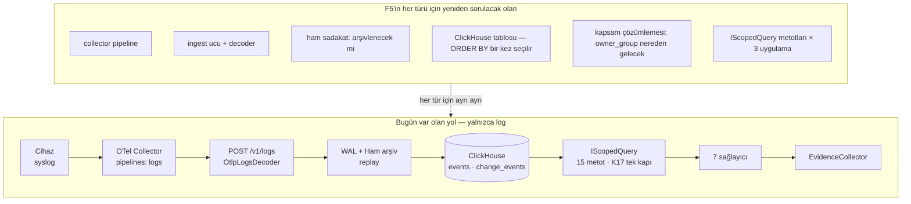
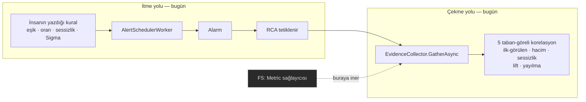

# F5 · Kapsam kararı

K21 F3'te bir söz verdi: *kanıt kapsamı hepsi — log, değişiklik, metrik, trace,
topoloji.* Aynı karar kendi uyarısını da yazdı:

> **K21'in maliyeti** — ürünü *"log analiz katmanı"*ndan *"gözlemlenebilirlik
> platformu"*na taşıyor. F1–F4 bittiğinde **yeniden kapsam kararı verilmeli**.

F1, F2 ve FS kapandı; F3'te bir kalem, F4'te iki kalem sürüyor. O an geldi.

> ## ✅ Karar verildi: **S1 · Topoloji-lite** (2026-09-05)
>
> Kullanıcı seçti. Seçimin dayandığı ölçüm §3.3'te: RCA'nın *"lift topolojiyi
> telafi ediyor"* iddiası **ölçülmemişti** — lift'te de envanterde de VLAN,
> upstream, firmware yoktu. Yani F5'i ertelemenin gerekçelerinden biri **var
> olmayan bir telafiye** dayanıyormuş.
>
> | Tür | Kader |
> | --- | --- |
> | **Topology** | **Karşılanıyor — sınırıyla birlikte.** `TopologyProvider`, envanter öznitelikleri üzerinden. İlişki grafiği **yok** |
> | **Metric** | **Kalıcı muaf** — `EvidenceKinds.Exempt` |
> | **Trace** | **Kalıcı muaf** — `EvidenceKinds.Exempt` |
>
> Uygulama §10'da. Belgenin geri kalanı **kararın verildiği andaki hâliyle
> duruyor** — seçilmeyen seçenekler dahil, çünkü bir kararın gerekçesi
> reddettiklerini de içeriyor.

> **Bu belge kararı vermedi, verilebilir hâle getirdi.** Seçenekleri, her
> birinin ölçülmüş bedelini ve hangi bilginin hangisini seçeceğini koydu.
>
> **Ticket de yazmadı.** Kapsam kararı verilmeden ticket dilimlemek, bu
> deponun §8'de yasakladığı şeyin planlama katmanındaki karşılığı olurdu:
> *tüketicisi olmayan bir tip tahmindir.*

---

## 1 · Ölçülen iddia: "sözleşme beş türü de bugünden tanıyor"

`kalan-is-raporu` §2 bunu yazdı ve bu belgenin başlangıç noktasıydı. Ölçüldü:
**doğru, ama tek başına okunduğunda olduğundan büyük bir şey söylüyor.**

`EvidenceKind` (`src/Bizigo.Evidence/EvidenceContract.cs:18`) beş değer taşıyor.
Kayıtlı sağlayıcılar `EvidenceServiceCollectionExtensions.cs:36-46`'da yedi
satır:

| Tür | Değer | Kayıtlı sağlayıcı | Nerede |
| --- | --- | --- | --- |
| **Log** | 1 | **6** — `logs.window`, `logs.first-seen`, `logs.volume`, `logs.silence`, `logs.attribute-lift`, `logs.propagation` | `Providers/LogWindowProvider.cs`, `LogCorrelationProviders.cs`, `SilenceProvider.cs` |
| **Change** | 2 | **1** — `change.feed` | `Providers/ChangeFeedProvider.cs` |
| **Metric** | 3 | **0** | — |
| **Trace** | 4 | **0** | — |
| **Topology** | 5 | **0** | — |

İddianın **taşıyıcı yarısı da ölçüldü ve doğru**: motor sağlayıcıya özel kod
içermiyor. `EvidenceCollector.UnregisteredKinds` enum'u geziyor, kayıtlı listeyi
değil (`EvidenceCollector.cs:39-43`), ve bu bugün koşan bir testle sınanıyor —
`EvidenceCollectorTests.cs:48` **uydurma bir `Trace` sağlayıcısı** kaydediyor ve
toplayıcıda tek satır değişmeden rapora giriyor.

> **İddianın söylemediği şey.** Sözleşmenin bir türü *tanıması*, o türün
> verisinin *var olması* değil. `AddScoped<IEvidenceProvider, MetricProvider>()`
> satırı gerçekten tek satır — ama o satırın arkasında **hiç yazılmamış bir
> ingest yolu, hiç açılmamış bir tablo ve hiç sorulmamış bir kapsam sorusu**
> var. §3 onları tek tek sayıyor.
>
> Yani `kalan-is-raporu`'nun *"F5 bir genişleme değil, sıralanmış bir kapsam"*
> cümlesi **motor için** doğru, **ürün için** değil.

---

## 2 · "Yok" olanın bugünkü bedeli: her raporda üç satır

Üç tür bugün sessizce atlanmıyor — bu bilinçliydi ve ölçüldü. Toplayıcı
kayıtsız her tür için bir dilim üretiyor (`EvidenceCollector.cs:75-81`), API
`not_registered` diye telleyip (`EvidenceResponses.cs:148`) ekrana veriyor, ve
ekran şunu yazıyor (`ui/src/lib/rca/report.ts:91`):

> **sağlayıcı yok** — *"Bu kanıt türü için sağlayıcı yok (F5). Bu türe hiç
> bakılmadı."*

Yani **üretilen her RCA raporunun altında bugün üç satır duruyor** ve üçü de
*"F5"* diyor. Bu, F1'in dersinin doğru uygulanmış hâli: rapor bakmadığı şeye
bakmış gibi görünmüyor.

Ama bir yan etkisi var ve karar tam da oraya değiyor:

> **Bu üç satır bir söz.** *"F5"* kelimesi ekranda *"bu gelecek"* demek. Karar
> "gelmeyecek" çıkarsa bu metin **bugünkü hâliyle yanlış** olur — ve yanlış
> olduğu hiçbir yerde kırmızı yanmaz.
>
> Depo bu ayrımın adını zaten koymuş (§8): **"bir gün kapanacak" ile "hiç
> kapanmayacak" aynı listede duramaz.** `ProducesContractTests`'te `Pending` ve
> `Exempt` ayrı listeler ve muafiyet sayısı `ExpectedExemptCount` ile sabit —
> muafiyet eklemek **iki ayrı bilinçli hareket** istiyor. Kanıt türlerinde o
> ayrım **yok**: `EvidenceKind`'ın üç değeri bugün "bekleyen" ile "muaf"ın
> ayrılmadığı tek listede duruyor.

Bu, seçeneklerden hangisi seçilirse seçilsin doğacak ilk işin ne olduğunu
söylüyor ve **her seçenekte aynı**: kararın ekrandaki karşılığını yazmak.

---

## 3 · Her türün ölçülmüş maliyeti



### 3.0 · Üç türün de ortak ödeyeceği dört kalem

Bunlar tür bağımsız ve **ölçüldü**:

| Kalem | Bugünkü ölçüm | F5'te ne olur |
| --- | --- | --- |
| **Collector hattı** | `deploy/otel/collector.yaml` → `service.pipelines` **yalnızca `logs`**. `otlp` alıcısı tanımlı ama sadece logs hattına bağlı | Her tür için ayrı hat. Bu **kod değil ayar** — K1 sayesinde ucuz olan tek kalem |
| **Depolama** | `db/clickhouse/` → **iki tablo**: `events`, `change_events` (+3 görünüm) | Her tür kendi tablosu. `0001_events.sql:7`'nin uyarısı devrede: *"⚠️ ORDER BY BİR KEZ SEÇİLİR. Tabloyu yeniden yazmadan değişmez."* Yani her tür için **geri alınamaz** bir tasarım kararı |
| **Kapsam kapısı** | `IScopedQuery` **15 metot**; **1 üretim uygulaması** (`ScopedQuery`) + **2 test sahtesi** (`AlertingTestDoubles`, `EvidenceTestDoubles`) | Her sağlayıcı kendi sorgusunu ve `CountOutOfScope…` karşılığını ekliyor → **3 dosya** her seferinde. T34 bunu bir kez ödedi (`CountOutOfScopeChangesAsync`) |
| **Kapsam çözümlemesi** | `SourceDirectory` **syslog peer adresi / hostname / source_id** ile eşliyor; eşleşmeyen `_unassigned`'a düşüyor | Metrik ve trace bu anahtarların hiçbiriyle gelmiyor. Çözümleme yolu yazılmazsa **her satır `_unassigned`'a düşer** ve K17 onları sessizce görünmez yapar — kimseye hata vermeden |

> **Dördüncü kalem §7'nin sınıfı.** "Metrikler geldi ama kimse göremiyor" bir
> hata mesajı üretmez, bir sayaç düşürmez; yalnızca raporlar boş çıkar ve
> `Empty` — *"bakıldı, yok"* — der. Kanıt sözleşmesinin tam olarak engellemek
> için yazıldığı cümle, kapsam tarafından yeniden üretilmiş olur.
>
> Karşılığı ucuz ve **ölçüm zamanı belli**: metrik/trace ingest'i yazan ticket,
> `NeverFed` ile `Empty` ayrımını kapsam çözümlemesi tarafında da kurmak
> zorunda. Bu bir uygulama ayrıntısı değil, sözleşmenin devamı.

### 3.1 · Metric — en pahalı kalem tablo değil, kapsam

| Soru | Ölçülen cevap |
| --- | --- |
| Collector | `metrics` hattı yok; eklenmesi ayar |
| Ingest ucu | `LogsEndpoint.cs` **tek** ingest arayüzü (`/v1/logs`). `Bizigo.Ingest/Otlp/` altında **yalnızca** `OtlpLogsDecoder.cs` var |
| Ham sadakat | `WalFrame`, `RawObjectKey`, `RawArchiveService` log-satırı şeklinde. **Karar gerekiyor:** metrik ham arşive girecek mi? Girmezse replay garantisi **türe göre değişen** bir garanti olur ve bu bugün hiçbir yerde yazılı değil |
| Depolama | Yeni tablo + geri alınamaz `ORDER BY` + TTL. Kardinalite ölçülmedi (§7) |
| Kapsam | Metrik `resource.attributes` ile geliyor; `SourceDirectory` bunu tanımıyor |
| Sağlayıcı | RCA §3 iki sinyal yazıyor: **baseline sapması**, **eşik ihlali** |
| Bağımlılık | **Bir metrik kaynağı olmak zorunda.** Ağ cihazı (K2) OTLP metrik göndermiyor; yol SNMP → collector. K1 gereği collector'ı biz yazmıyoruz, ama **birinin koşturması** gerekiyor ve o "birisi" bugün belirsiz |

### 3.2 · Trace — teknik maliyeti metriğe benzer, **arz sorusu tamamen başka**

Teknik kalemler metrikle aynı sırada (hat, uç, decoder, tablo, kapsam, sağlayıcı).
Ayrıştığı yer şu ve karar açısından belirleyici:

> **K2 ürünün birincil alanını "altyapı / ağ cihazı logları" diye çiviliyor.**
> Ağ cihazları trace üretmez. Trace uygulamalardan gelir — yani bu türün
> değerli olması, ürünün **uygulama gözlemlenebilirliği** alanına girmesine
> bağlı. Bu bir faz kararı değil, **ürün alanı** kararı.
>
> Bunu ölçebilecek tek şey hedef ortam ve o veri bende yok (§7).

RCA belgesinin trace için yazdığı iki sinyal — *hata yayılımı*, *servis grafiği*
— ikisi de ağ cihazı logu dünyasında karşılığı olmayan kavramlar. Buna karşılık
`logs.propagation` sağlayıcısı **kaynak başına ilk bozulma anını sıralayarak**
"yayılım" sorusunun ağ karşılığını zaten cevaplıyor
(`LogCorrelationProviders.cs:328`).

### 3.3 · Topology — üç tür içinde tek "yeni ingest gerekmeyen" olan

Ve tam da bu yüzden ölçüm en çok burada sürpriz verdi.

RCA belgesi §3.1 ortak öznitelik (lift) sinyali için şunu yazıyor:

> *"Etkilenen olayların paylaştığı alan değeri: aynı VLAN, aynı upstream, aynı
> firmware … **topoloji olmadan topoloji sezgisi**"*

Ölçüldü — `CorrelationFields.Lift` (`LogCorrelationProviders.cs:406`) şu sekiz
alanı tarıyor:

```
source_id · host · vendor · product · parser_id · proto · action · outcome
```

**VLAN yok. Upstream yok. Firmware yok.** Envanterde de yoklar: `SourceEntity`
(`src/Bizigo.ControlPlane/Entities.cs:11`) `SourceId`, `PeerAddress`,
`Hostname`, `OwnerGroup`, `Vendor`, `Product`, `ParserId`, `Encoding`,
`SourceClass`, `Enabled` ve iki zaman damgası taşıyor — **tek bir ilişki alanı
yok**, ne üst düğüm ne site ne bağlantı.

> Yani *"topoloji olmadan topoloji sezgisi"* cümlesi bugün **bir tasarım niyeti,
> uygulanmış bir yetenek değil**. Lift çalışıyor ve değerli, ama topolojik
> alanlar üzerinde değil, kimlik alanları üzerinde çalışıyor.

Bunun karar açısından sonucu iki yönlü:

| | |
| --- | --- |
| **Kötü haber** | RCA belgesinin "topolojiye ihtiyacımız yok, lift onu telafi ediyor" gerekçesi **ölçülmemiş bir gerekçeydi**. Telafi eden mekanizma yazılmadı |
| **İyi haber** | Telafi etmenin bedeli çok küçük: envantere birkaç kolon, izin listesine birkaç ad. **Yeni ingest yok, yeni tablo yok, yeni collector hattı yok** |

Dikkat edilecek tek mekanik nokta ölçüldü ve zaten bir bekçisi var: lift izin
listesi **depolama tarafındaki izin listesiyle aynı olmak zorunda**; ayrışırsa
sorgu istisna fırlatıyor ve bir test ikisini eşitliyor. Yani bu genişleme
§5'in *"git'in göremediği çakışma"* sınıfına girmiyor — kapı zaten orada.

Asıl bağımlılık teknik değil:

> **Topoloji-lite'ın değeri envanterin doldurulmuş olmasına bağlı.** Boş
> envanterde "aynı upstream" diye bir sinyal üretilemez, ve üretilemediği
> `Empty` diye görünür — yani yine §7'nin cümlesi. Farkı: bu değişkenin
> **ölçüm aracı bugün var** (§6).

---

## 4 · F5'in kapatmadığı sınır

`kalan-is-raporu` §4 ürünün bugünkü sınırını yazıyor ve ticket bu sınırı kararın
merkezine koydu:

> **Korelasyonlar çekme modelinde** — beş korelasyon *"sorarsan görüyorum"*
> diyor, *"bir şey oldu"* diyemiyor. Ürünün push modda anomali tespiti yok ve F4
> bittiğinde de olmayacak.

Ölçüldü, ve **cevap ilk bakışta beklenenin tersi.**

**Ölçüm 1 — RCA'yı ne doğurabiliyor.** `RcaTriggerSource`
(`src/Bizigo.Contracts/RcaTriggerSource.cs`) **dört** değer taşıyor: `Alert`,
`Manual`, `External`, `Schedule`. K20'nin saydığı beşinci — anomali zinciri —
bilerek **yok**; tipin kendi belgesi *"bir kaynak değil bir devam kuralı"* diyor
ve izi `RcaRunEntity.Depth > 0`. Yani **bir anomaliyi ilk kez tespit eden hiçbir
mekanizma yok**; zincir her zaman o dört kaynaktan biriyle başlıyor.

**Ölçüm 2 — itme tarafında bugün ne var.** `AlertEvaluator` üç kural tipi
koşturuyor: **eşik**, **oran**, **sessizlik**; `AlertSchedulerWorker` onları
takvimle çalıştırıyor. Yani ürünün itme yolu **var** — ama üçü de *insanın
yazdığı kurala* bağlı, ve üçü de **log** üzerinde.

**Ölçüm 3 — asıl bulgu.** Taban-göreli makine **zaten yazılmış**: beş korelasyon
baseline penceresiyle karşılaştırma yapıyor (`RcaWindow` olay penceresini ve
tabanı **birlikte** taşıyor, `EvidenceContract.cs:107`). Bu makine kural
yazılmasını gerektirmiyor — *"baseline'da yoktu, pencerede var"* kendi kendine
bir anomali tanımı. Ama yalnızca `GatherAsync` içinde koşuyor, yani **bir RCA
zaten tetiklendikten sonra**.



Diyagramın söylediği şey bu belgenin en önemli cümlesi:

> **Metrik sağlayıcısı eklemek bu sınırı kapatmıyor.** Sağlayıcı sözleşmesi
> çekme şeklinde: `IEvidenceProvider.GatherAsync` **bir pencere verildiğinde**
> koşuyor. Metrik sağlayıcısı da diğer yedisi gibi, RCA zaten tetiklendikten
> sonra devreye giriyor. Metrik verisi ürüne *"bir şey oldu"* dedirtmiyor —
> yalnızca *"sorduğunda metrik de bakıyorum"* dedirtiyor.
>
> Sınırı kapatan şey **bir dedektör**: taban-göreli sinyalleri takvimle koşturan
> ve eşiği aşanı bir tetikleyiciye çeviren bir işçi. Bu, kanıt sağlayıcı
> ekseninden **farklı bir eksen** ve F5'in tanımında yok.

Bu, kararın şeklini değiştiriyor: F5 ile §4 sınırı **aynı soru değil**, ve
ikisinden birini seçmek gerekebilir. §5'te S4 olarak duruyor.

---

## 5 · Dört seçenek

| | **S0 · Kapat** | **S1 · Topoloji-lite** | **S2 · Metrik** | **S3 · Hepsi (K21'in yazıldığı hâli)** |
| --- | --- | --- | --- | --- |
| **Metric** | ❌ kalıcı muaf | ❌ kalıcı muaf | ✅ | ✅ |
| **Trace** | ❌ kalıcı muaf | ❌ kalıcı muaf | ❌ kalıcı muaf | ✅ |
| **Topology** | ❌ kalıcı muaf | ✅ envanter öznitelikleri | ✅ | ✅ tam ilişki grafiği |
| **Yeni ingest yolu** | yok | **yok** | 1 | 2 |
| **Yeni ClickHouse tablosu** | yok | **yok** | 1 (geri alınamaz `ORDER BY`) | 2 |
| **Yeni dış bağımlılık** | yok | **envanterin doldurulması** (müşteri işi) | metrik kaynağı: SNMP/OTel collector koşumu | + trace üreten uygulamalar |
| **`IScopedQuery` genişlemesi** | yok | 1 metot × 3 dosya | ~3 metot × 3 dosya | ~6 metot × 3 dosya |
| **Ürünün iddiası** | *"Ağ cihazı log ve değişiklik analiz katmanı"* — **K1 olduğu gibi** | aynı iddia, **envanter farkındalığıyla** | *"Log + metrik analiz katmanı"* — **K1 aşılıyor** | *"Gözlemlenebilirlik platformu"* — K21'in uyardığı yer |
| **Kimin karşısına çıkar** | Graylog, Seq, Wazuh | aynı | SigNoz, HyperDX | Dynatrace **Davis** (RCA §2'nin kendi kıyası) |

### S0 · F5'i kapat — ve kapatıldığını yaz

En ucuz seçenek ama **bedava değil**, ve bedelinin tamamı §2'de:

- `EvidenceKind`'ın üç değeri kalır (koddan silmek T36'nın sakladığı paketleri
  bozar — değerler kalıcı, `EvidenceContract.cs:49`), ama **muaf** olarak
  işaretlenir.
- Ekrandaki *"(F5)"* ifadesi değişir: *"bu ürün metrik/trace/topoloji
  kanıtına bakmıyor"* — bir söz değil bir sınır.
- §8'in ayrımı kurulur: muafiyet listesi ayrı, sayısı sabit, eklemek **iki
  bilinçli hareket**.

> **Bu seçeneğin gizli kazancı:** ürünün ne olmadığı yazılı hâle gelir. Bugün
> üç satır *"henüz değil"* diyor; ölçülmemiş bir gelecek vaadi, okuyanı
> bekletiyor.

### S1 · Topoloji-lite — envanter öznitelikleri, ingest yok

Kapsam: `SourceEntity`'ye ilişki/konum alanları (üst düğüm, site, VLAN,
firmware sürümü), `CorrelationFields.Lift` ve depolama izin listesinin birlikte
genişlemesi, ve isteğe bağlı olarak gerçek bir `Topology` sağlayıcısı —
*"etkilenen cihazların ortak üst düğümü"*.

Bunun **F5 olmadığını yazmak lazım**: bu, RCA belgesinin lift için zaten
varsaydığı yeteneği gerçekten yapmak. Yeni bir eksen açmıyor, açık bırakılmış
bir gerekçeyi kapatıyor.

- **Bedel:** en düşük. Yeni ingest yok, yeni tablo yok, collector'a dokunulmuyor.
- **Bağımlılık:** envanterin doldurulmuş olması — ve bu **müşterinin işi**.
- **İddia:** değişmiyor. Ürün hâlâ log analiz katmanı; sadece kaynaklarını daha
  iyi tanıyor.

### S2 · Metrik gir, trace kalıcı muaf

Kapsam: metrik ingest + depolama + iki sağlayıcı (baseline sapması, eşik
ihlali). Trace ve topoloji S0 gibi muaf işaretlenir.

- **Bedel:** §3.0 ve §3.1'in tamamı. En riskli tek kalem tablo değil **kapsam
  çözümlemesi**: metriğin `owner_group`'u nereden gelecek sorusu K17'nin
  metrikteki karşılığı ve bugün cevabı yok.
- **Bağımlılık:** hedef ortamda bir metrik kaynağı. Ağ cihazı dünyasında bu
  SNMP demek, ve SNMP → OTel yolu **collector ayarı** (K1 sayesinde kod değil)
  ama işletilmesi gereken bir şey.
- **İddia:** K1 aşılıyor. Bu, geri alınabilir bir söz değil: metrik tablosu
  açıldıktan sonra "biz metriğe bakmıyoruz" denemez.

### S3 · Hepsi — K21'in yazıldığı hâli

- **Bedel:** RCA belgesinin kendi tahmini *"F5 tek başına F1 büyüklüğünde"*.
  Bu belge o tahmini **doğrulamadı da yalanlamadı da** — efor tahmini kapsam
  dışı (§8, bilerek).
- **Bağımlılık:** hem metrik hem trace kaynakları, hem de doldurulmuş bir
  envanter ilişki grafiği.
- **İddia:** *"gözlemlenebilirlik platformu"*. RCA §2'nin kendi kıyas tablosu
  bu durumda Dynatrace Davis'i işaret ediyor — *"Davis'in gücü topolojiden
  geliyor; bizde F5'e karşılık gelen kısım"*.

### S4 · Rakip yatırım — **F5 değil**, ama aynı bütçeyi istiyor

§4'ün ölçümü bunu ayrı bir satır olarak yazmayı zorunlu kıldı: ürünün *"bir şey
oldu"* diyememesi F5 ile **kapanmıyor**. Kapatan şey, taban-göreli beş
korelasyonu takvimle koşturan ve eşiği aşanı tetikleyiciye çeviren bir dedektör.

| | |
| --- | --- |
| **Yeni ingest** | yok |
| **Yeni depolama** | yok (koşum kaydı dışında) |
| **Yeni bağımlılık** | yok |
| **İddia** | *"kural yazmadan anomali gören log analiz katmanı"* — K1 içinde kalıyor, ama ürünün **hissi** değişiyor |
| **Neden burada** | F5 ile karıştırılabildiği için. *"Metrik gelirse anomali tespiti de gelir"* varsayımı ölçüldü ve **yanlış** (§4) |

Bu seçenek diğer dördüyle **dışlayıcı değil** — ama aynı sırayı istiyor, ve
karar verilirken masada olmadığı için bugüne kadar hiç tartılmadı.

> **S4 seçilmedi — ama kapattığı boşluk açık.** Karar S1'e gitti; bu, §4'ün
> ölçtüğü sınırı değiştirmiyor. Ürün bugün de *"bir şey oldu"* diyemiyor ve
> S1 bunu kapatmıyor. Kalem burada kayıtta kalıyor ki bir sonraki kapsam
> turunda yeniden keşfedilmek zorunda kalmasın.

---

## 6 · Karar değişkenleri — hangi bilgi hangisini seçer

§6'nın kuralı burada da geçerli: **protokolü sonuçtan önce yaz.** Aşağıdaki
eşikler *sayı gelmeden* yazıldı; sayı geldiğinde yeniden pazarlık edilirse ölçüm
bir gerekçelendirme aracına dönüşür.

| # | Değişken | Ölçüm aracı | Bugün var mı | Eşik → seçim |
| --- | --- | --- | --- | --- |
| **D1** | Yanlış/eksik RCA raporlarında gerçek kök nedenin **log+change'in hiç göremeyeceği** yerde olma oranı | `GoldenReviewEntity` — `Verdict` (`Wrong`/`Incomplete`) + `ActualRootCause` | **Alan var, veri yok** (§7). Ayrıca *"hangi tür eksikti"* için **yapılandırılmış alan yok** — bugün serbest metin | < %10 → **S0/S1** · %10–30 → **S1**, sonra yeniden bak · > %30 → **S2**, ve eksik türlerin dağılımı hangisini seçeceğini söyler |
| **D2** | Hedef ortamda **metrik kaynağı** var mı (SNMP/OTel) | Ortam envanteri — üründe değil | **Yok** | Yoksa **S2 anlamsız**: sağlayıcı `NeverFed` döner ve ürün bir yetenek daha kazanmış görünürken hiçbir şey kazanmaz |
| **D3** | Hedef ortamda **trace üreten uygulama** var mı | Ortam envanteri | **Yok** | Yoksa **S3 elenir**. K2 ile birlikte okunduğunda varsayılan cevap "hayır" |
| **D4** | Envanter gerçekten dolduruluyor mu | `GET /v1/health/pipeline` → `bound_ratio` (hedef **0.95**), `unassigned_sources`, `unassigned_source_events` | **Var ve ölçülüyor** — bu belgedeki tek "araç hazır" değişken | `bound_ratio ≥ 0.95` → **S1 değerli** · belirgin düşükse S1 boş bir sinyal üretir, önce envanter bakımı |
| **D5** | Kullanıcılar *"bir şey oldu"* mu istiyor, *"sorduğumda daha çok kanıt"* mı | Kullanım — hangi tetikleyici baskın: `RcaRunEntity` `TriggerSource` dağılımı | **Alan var, veri yok** | `Manual` baskınsa kullanıcı zaten bir şey fark etmiş demektir → **S4** öne geçer · `Alert` baskınsa kanıt derinliği daha değerli → **S1/S2** |

> **D1'in aracı bugün yarım ve düzeltmesi ucuz.** `ActualRootCause` serbest
> metin; *"hangi kanıt türü eksikti"* sorusunun cevabı ancak metni okuyarak
> çıkar. Depoda emsali de gerekçesi de var: `GoldenReviewEntity.SchemaVersion`
> tam bu yüzden taşınıyor — *"kolonun varlığı ile doldurulmuş olması ayrı
> şeyler; sürüm olmadan ikisi ayırt edilemez."*
>
> Yani D1'i cevaplanabilir kılmak için yapılacak şey **veri gelmeden önce**
> yapılmalı: incelemeye *"hangi tür eksikti"* sorusunu ekle ve sürümü artır.
> Sonra eklenirse eski satırlardaki boşluk *"eksik tür yok"* mu *"soru
> sorulmadı"* mı ayırt edilemez — ve bu, D1'in cevabını **sistematik olarak
> S0 yönünde** kaydırır.
>
> **Bu bir ticket önerisi değil, bir sıra uyarısı.** Ticket dilimlemek bu
> belgenin kapsamı dışında (§8) — ama "önce şu, sonra bu" bilgisi kararın
> kendisine ait: karar S1/S2/S3'ten biri çıkarsa ve D1 üzerinden yeniden
> bakılacaksa, aracın düzeltilmesi **kararın uygulanmasından önce** gelir.

---

## 7 · Ölçülemeyenler

`kalan-is-raporu` §7 bunu F3 için yazmıştı; F5 için karşılığı daha ağır, çünkü
**karar değişkenlerinin dördü bu listede.**

| Ne | Neden ölçülemedi | Ne zaman ölçülebilir |
| --- | --- | --- |
| **D1 — eksik kanıt türü dağılımı** | Altın kümede satır yok. Ürün gerçek bir olayda hiç koşmadı | Üretimde inceleme yapılmaya başladıktan sonra. Ve ancak D1'in aracı düzeltilmişse |
| **D2/D3 — hedef ortamda metrik/trace var mı** | Bu depoda cevabı olan bir soru değil; kurumun ortamına bakmak gerekiyor | Sorulunca. **En ucuz karar değişkeni bu ve ölçüm gerektirmiyor** |
| **Metrik hacmi ve kardinalitesi** | Kaynak yok. ClickHouse tablo tasarımı (geri alınamaz `ORDER BY`) bu sayıya bağlı | Gerçek bir metrik akışı bağlandıktan sonra — yani S2 seçilirse ilk iş bu ölçüm olmalı, tablo tasarımından önce |
| **F5'in gerçek eforu** | Efor tahmini bu ticket'ın kapsamı dışında (bilerek). RCA belgesinin *"F1 büyüklüğünde"* tahmini **doğrulanmadı** | Kapsam seçildikten sonra, ticket dilimlemesiyle |
| **Topoloji-lite'ın gerçekten sinyal üretip üretmeyeceği** | Envanterde alanlar yok, dolayısıyla lift'in onlar üzerinde ne bulacağı bilinmiyor | Alanlar eklenip **doldurulduktan** sonra. D4 bunun ön koşulunu ölçüyor |
| **`_unassigned` oranının bugünkü değeri** | Ölçüm aracı var (`GET /v1/health/pipeline`) ama **koşan bir yığın gerektiriyor**; bu ticket Docker'a dokunmuyor | Koordinatörün canlı doğrulama turunda — `kalan-is-raporu` §3'ün listesine bir satır daha |

> **Bu tablonun kendisi bir karar girdisi.** Beş değişkenden dördü bugün
> cevaplanamıyor, ve ikisi (D2, D3) **hiçbir ölçüm gerektirmiyor — yalnızca
> sorulmayı bekliyor.** Eğer cevapları "hayır" ise S2 ve S3 masadan kalkıyor ve
> karar S0/S1/S4 arasına iniyor. **En ucuz bir sonraki adım bu iki soruyu
> sormak.**

---

## 8 · Ölçtüklerim, aradıklarım, aramadıklarım

**İlk bakılacak yer:** `src/Bizigo.Evidence/EvidenceContract.cs` ve
`EvidenceServiceCollectionExtensions.cs` — sözleşmenin tanıdığı ile kaydedilenin
ayrıştığı tek yer orası.

**Ölçtüm (koda bakarak, iddia ederek):**

| İddia | Nasıl ölçüldü |
| --- | --- |
| Beş tür tanımlı, ikisinin sağlayıcısı var | `EvidenceKind` 5 değer · DI'de 7 `AddScoped` satırı · her sağlayıcının `Kind` özelliği tek tek okundu |
| Motor sağlayıcıya özel kod içermiyor | `EvidenceCollector.UnregisteredKinds` enum'u geziyor; `EvidenceCollectorTests.cs:48` uydurma `Trace` sağlayıcısıyla bunu bugün koşturuyor |
| Üç tür her raporda görünüyor | `EvidenceCollector.cs:75` → `EvidenceResponses.cs:148` → `ui/src/lib/rca/report.ts:91` zinciri uçtan uca okundu |
| Collector'da yalnızca `logs` hattı var | `deploy/otel/collector.yaml` `service.pipelines` |
| İki ClickHouse tablosu var | `db/clickhouse/*.sql` içindeki tüm `CREATE TABLE`/`CREATE VIEW` |
| Kapsam kapısı 15 metot, 3 uygulama | `IScopedQuery.cs` + `: IScopedQuery` arayanları |
| Envanterde ilişki alanı yok | `SourceEntity`'nin tüm alanları okundu |
| Lift'te VLAN/upstream/firmware yok | `CorrelationFields.Lift` — sekiz ad |
| Anomali bir tetikleyici kaynağı değil | `RcaTriggerSource` dört değer + tipin kendi gerekçesi + `ScenarioTriggers.Continuations` |
| İtme yolu üç kural tipi ve hepsi log | `AlertEvaluator` + `AlertSchedulerWorker` |
| D4'ün aracı bugün var | `PipelineHealthResponses.cs` → `bound_ratio`, `unassigned_sources` |

**Aradım ve bulamadım (yani "yok" bir ölçüm, tahmin değil):**

- Metrik/trace tablosu, migration'ı ya da decoder'ı — `db/clickhouse/` ve
  `src/Bizigo.Ingest/Otlp/` tarandı.
- Collector'da `metrics` / `traces` hattı.
- Envanterde herhangi bir ilişki/üst-düğüm/site/VLAN alanı.
- Bir anomali dedektörü — `BackgroundService`/`IHostedService` uygulayan **10
  sınıfın hepsi** listelendi; hiçbiri taban-göreli sinyal koşturmuyor.
- Altın kümede *"hangi kanıt türü eksikti"* diyen yapılandırılmış bir alan.

**Aramadım (ve bu bir sınır, bir eksiklik değil):**

- **Efor/süre tahmini** — ticket'ın kapsam dışı listesinde.
- **Ticket dilimlemesi** — aynı şekilde. §6'daki tek "sıra" notu kararın
  parçası olduğu için orada duruyor, dilimleme değil.
- **MCP epic'inin F5 ile kesişimi** — M01–M08 okunmadı. MCP araç yüzeyi kanıt
  türlerini dışarı açıyorsa F5 kararının orada bir yansıması olabilir; **bakmadım.**
- **Sidecar'ın (Drain3) metrik/trace tarafında bir katkısı olup olmadığı** —
  bakmadım.
- **Rakiplerin metrik/trace fiyatlandırması ve konumlanması** — pazar
  araştırması belgesi F5 açısından taranmadı; yalnızca `metrik|trace|topoloji`
  geçen satırlarına bakıldı ve F5 lehine/aleyhine bir argüman içermiyordu.
- **ClickHouse'da metrik şeması için dış emsal** (OTel'in kendi şeması, SigNoz'un
  tablo tasarımı) — S2 seçilirse bu araştırma ilk iş olmalı; **yapılmadı.**

---

## 10 · S1 uygulandı — ve iki yerde plandan saptı

### 10.1 · Sapma: lift genişlemedi, **ayrı bir tür sağlayıcısı** doğdu

Kapsam brief'i *"`CorrelationFields.Lift` genişleyecek"* diyordu. Ölçüm buna
izin vermedi ve sapmanın gerekçesi tek bir bulguda:

> `CorrelationFields.Lift` ile depolama tarafındaki `CorrelationReader.LiftFields`
> **ClickHouse `events` kolonlarının** izin listesi. Oradaki her ad bir kolona
> karşılık gelmek zorunda. `vendor`/`product` bile envanterden **gelmiyor** —
> `EventNormalizer` onları **parser çıktısından** yazıyor
> (`EventNormalizer.cs:47`); `ResolvedSource`'tan olaya geçen tek şey
> `owner_group` ve `source_id`.

Yani "lift bu alanları görsün" demek, envanterden olaya **yeni bir denormalize
yolu** açmak demekti: `events`'e üç kolon, `ResolvedSource`'a üç alan, sıcak yol
değişikliği, ve geri alınamaz bir şema kararı. Brief'in kendi maliyet zarfı
(*"yeni ingest yok, yeni ClickHouse tablosu yok, 1 metot × 3 dosya"*) bunu
dışlıyordu.

İkinci ve daha ağır sebep **geçmiş**:

| | Denormalize (lift) | Envanterden okuma (seçilen) |
| --- | --- | --- |
| Geçmiş olaylarda | Kolonlar **boş** — geçen ayki bir olaya bakan RCA sessizce `Empty` alır | Çalışıyor: envanter bugünkü hâliyle okunuyor |
| Firmware yükseltilince | Olay o günkü sürümü taşır (daha doğru) | Geçmiş, **bugünkü** sürümle raporlanır |
| Sıcak yol | Değişiyor | Değişmiyor |
| Sınır görünür mü | Hayır — boş kolon ile "değer yok" ayırt edilemez | Evet — `Detail`'da yazılı |

İkisinin de bir §7 tuzağı var ve **aynı şekilli**: cevap özniteliğin *ne zaman*
doğru olduğuna göre değişiyor, ve hiçbir gösterim hangisini söylediğini
belirtmiyor. Seçilen tarafta tuzak **söylenebilir**; denormalize tarafta
görünmez.

Üçüncü ve belirleyici sebep: brief'in kendi kabul ölçütü bunu **zorunlu**
kılıyordu. *"`Topology` karşılanıyor"* demek ekranın *"(F5)"* yazmayı bırakması
demek, ve `EvidenceCollector.UnregisteredKinds` bunu **sağlayıcı kind'lerinden**
hesaplıyor. Sağlayıcı olmadan tür `NotRegistered` kalırdı. Sağlayıcı varken
lift'i de genişletmek ise **aynı kavramın ikinci gösterimi** olurdu — §9'un
açıkça yasakladığı şey.

**Genişleyen liste yine de var:** `CorrelationFields.Topology`, `Lift`'in tam
yanında, aynı izin-listesi disipliniyle ve `SourceSummary`'nin alan adlarıyla
eşitlendiği bir testle.

### 10.2 · Sapma: `IScopedQuery`'e **hiç metot eklenmedi**

Brief 1 metot × 3 dosya bütçeliyordu. Gerekmedi: "etkilenen cihaz" zaten
`GetPropagationAsync`'in cevabı, envanter zaten `SearchSourcesAsync`'in.
Sağlayıcı ikisini besteliyor.

Bu, §9'un *"ortak yüzey varsa genişlet, kopyalama"* kuralının uygulanmış hâli ve
emsali `IScopedQuery`'nin kendi içinde yazılı: **sessizlik korelasyonunun da
kendi metodu yok**, `GetSourceActivityAsync`'i paylaşıyor. Yan kazancı, "bozulma"
tanımının `PropagationProvider` ile **aynı** kalması — iki tanım olsaydı aynı
raporun iki bölümü farklı cihaz kümesinden bahsederdi.

### 10.3 · Muafiyet mekanizması — belgedeki tereddüt 2'nin cevabı

Karar S1'e gidince ayrım doğdu ve **sayılı liste** seçildi:

```
EvidenceKinds.Exempt              = { Metric, Trace }
EvidenceKinds.ExpectedExemptCount = 2        // çivi
EvidenceStatus.OutOfScope         = 7        // yeni değer
```

Yalnızca ekran metnini değiştirmek yetmezdi: `not_registered` ile *"bu ürün
bakmıyor"* tel üzerinde **aynı değer** kalırdı ve §7'nin bütün dersi iki farklı
olguyu tek değerde toplamamak. Ayrı bir durum değeri, ayrımı ekrana kadar
taşıyor — ve `RcaSliceResponse`'un `switch`'i bilinmeyen durumda **fırlattığı**
için eşleme unutulamıyor.

`NotRegistered` **ölmedi**: bugün hiçbir tür orada değil ama enum'a yeni bir tür
eklenmesi mümkün ve o gün sessizce atlanmamalı.

### 10.4 · Altın kümeye *"hangi tür eksikti"* alanı **eklenmedi** — gerekçe

§6'nın D1 uyarısı *"veri gelmeden önce ekle, yoksa boşluk 'eksik tür yok' mu
'soru sorulmadı' mı ayırt edilemez"* diyordu ve doğruluğunu koruyor. Yine de
eklenmedi:

- D1, **S2/S3'ün** karar değişkeni. İkisi de seçilmedi; alan bugün hiç
  okunmayacak bir soruyu soruyor olurdu.
- Maliyet *"bugün bedava"* değil: nullable kolon **artı** `SchemaVersion` 3'e
  çıkışı **artı** inceleme ekranında bir kontrol **artı** API. S1'in içine
  sığdırılırsa ticket iki ayrı kararı taşır.
- **"Yarın pahalı" tarihi belli ve henüz gelmedi:** altın kümede bugün
  **sıfır satır** var (§7) ve satırlar ancak ürün gerçek bir olayda koştuktan
  sonra birikiyor.

**Kaydedilen koşullu yükümlülük:** *ilk üretim incelemesi yazılmadan önce* alan
eklenmeli ve `SchemaVersion` artmalı. **Bunun bekçisi yok** ve olamaz — bir test
üretim verisinin ne zaman gelmeye başladığını göremez. Yükümlülük bu yüzden
burada, kararın kendi belgesinde duruyor; bir kod yorumunda değil.

---

## 11 · Tereddütler

**1 · §4'ün bulgusu ticket'ın çerçevesini biraz aşıyor.** Ticket §4 sınırını
*"F5'in bu sınırı kapatıp kapatmadığı kararın merkezinde"* diye tarif etti;
ölçüm cevabın **"kapatmıyor"** olduğunu söyledi ve bu, kapsam seçeneklerinin
yanına F5 **olmayan** bir seçenek (S4) koymayı gerektirdi. Bunu eklemek
kapsamı genişletmek gibi görünebilir — ama çıkarmak, kararın en önemli
girdisini masadan kaldırmak olurdu. **Koordinatörün onayına açık.**

**2 · "Kalıcı muaf" ile "ertelendi" ayrımını kim yazacak.** §2 bu ayrımın
bugün kurulmadığını ölçtü ve her seçenekte doğduğunu söyledi. Ama bunun
`ProducesContractTests`'teki gibi sayılı bir muafiyet listesine mi bağlanacağı,
yoksa yalnızca ekran metnine mi, **bir tasarım kararı** ve bu belgede
verilmedi.

**3 · S1'in adı.** "Topoloji-lite" diyorum ama aslında F5'in `Topology` türünü
karşılamıyor — RCA belgesinin tarif ettiği *"etkilenen cihazların ortak üst
düğümü"*nün ancak zayıf bir hâlini veriyor. `Topology` sağlayıcısını kaydedip
kaydetmemek (ve dolayısıyla o türü "muaf" saymaktan çıkarıp çıkarmamak) S1
seçilirse cevaplanması gereken bir alt soru. **Cevabı bende yok.**
