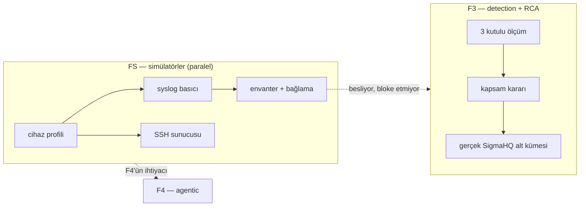
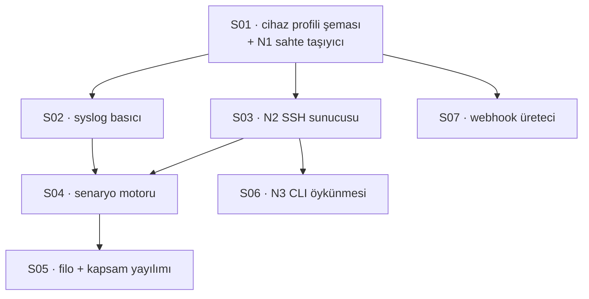

# FS — Cihaz simülatörleri

Bu belge **2026-08-21** günündeki durumu anlatıyor. Ölçülen sayılar ve "bugün
ne var" satırları o günün fotoğrafı; sonraki bir tur bunu geçersiz kılar.

Amacı tek şey: ürünün **cihaza dokunan yüzeyinin** gerçek bir cihaz olmadan
nasıl sınanacağını ve besleneceğini tek yerden okunabilir yapmak.

> **Kısıt, ve bu fazın var olma sebebi:** ekip **gerçek cihazlara erişmiyor.**
> FortiGate, Cisco ASA ve MikroTik yüzeyleri bugün ürünün içinde yazılı ama
> hiçbir yerde **çalışmıyor**. Bu bir eksik değil bir engel: erişim olmadan
> kapanmayacak kalemler var ve onları "yapılacak iş" listesinde tutmak, hiç
> kapanmayacak bir listeyi kapanacakmış gibi göstermek olur (§8).

---

## 1 · Ölçülen boşluk

Aşağıdakilerin hepsi **bugün bakılarak** doğrulandı; hiçbiri tahmin değil.

| Yüzey | Bugün ne var | Ne yok |
| --- | --- | --- |
| **SSH config çekimi** | `IDeviceTransport` seam'i, tek üretim uygulaması `SshDeviceTransport`, üç vendor toplayıcısı | `SshDeviceTransport`'u **hiçbir test koşturmuyor.** Cihaz yüzeyine dokunan tek dosya `tests/Bizigo.UnitTests/DeviceConfigTests.cs` ve o da süreç içi iki sahte kullanıyor (`FailingTransport`, `CountingTransport`) |
| **Syslog basımı** | Collector yapılandırılmış (TCP 5140 / UDP 5141), `iso-8859-1` kodlaması, ingest boru hattı | Boru hattını besleyen tek araç `bizigo seed golden` ve o **doğrudan ClickHouse'a** yazıyor — CLI'ın tek bağlantı seçeneği `--clickhouse`. Yani kodlama tespiti, WAL, ham arşiv ve dispatcher kademeleri ölçüm verisiyle **hiç koşmuyor** |
| **Kaynak envanteri** | `bizigo.sources` tablosu, ekran, kapsam eşlemesi | Tablo **boştu.** Uçtan uca ekran görüntüsü koşumunda envanter elle tohumlanmak zorunda kaldı; aksi hâlde ekran "Kapsamınızda kayıtlı kaynak yok" basıyordu |

### Bir gösterge, iki anlamsız cevap

Envanter üstünde ölçülen ve bu fazın ne kadar gerektiğini en iyi anlatan şey:

```
envanter BOŞ           → "parser bağlama oranı"  %100
envanter 4 kaynak, bağsız → %0
envanter 4 kaynak, BAĞLI  → %0   ← değişmedi
```

Üçüncü satır bu fazın en net gerekçesi ve **koda bakılarak** doğrulandı:
`bound_ratio` envanteri okumuyor, `DispatchStats.BoundRatio`'yu okuyor — yani
**koşan sürecin gerçekten dağıttığı satırları**. Envantere satır yazmak o sayacı
asla oynatamaz; oynatan tek şey `/v1/logs`'tan akan gerçek trafik.

Boş envanterdeki **%100** da bir başarı değil, paydanın sıfır olması. Üç ölçüm
de ürünün gerçek bağlama oranı hakkında hiçbir şey söylemiyor, çünkü ortada
akan bir cihaz yok. Göstergenin anlamlı bir sayı üretmesi doğrudan **S02'nin
(syslog basıcı)** çıktısına bağlı — ve bu, fazın hangi ticket'ının hangi
sayıyı canlandıracağının en somut örneği.

---

## 2 · Neden ayrı ve **paralel** bir faz

**Ayrı**, çünkü kapsamı bir ticket'a sığmıyor ve üç ayrı yüzeye dokunuyor.

**Paralel**, çünkü iki yön de bloke etmiyor:

- F3'ün kritik yolu tek bir ölçümden geçiyor (üç kutulu ölçüm → kapsam kararı).
Simülatör o ölçümün girdisi değil.
- Simülatörlerin ihtiyacı olan her şey (`IDeviceTransport`, collector, envanter
şeması, kapsam eşlemesi) **F1'de indi**. F3'ün bitmesini beklemiyor.



**Ticket numaraları `S` önekli** (S01…S07), `T` dizisinden ayrı. Sebebi
paralellik: iki dizinin araya girmesi "hangi ticket hangi fazın" sorusunu
numaraya bakarak cevaplanamaz hâle getirirdi.

---

## 3 · Üç yüzey, üçü de kapsamda

| # | Yüzey | Ürünün hangi iddiasını sınıyor |
| --- | --- | --- |
| **A** | SSH config çekimi | T26'nın tamamı: bağlantı, vendor komutları, gürültü eleme, **sır maskeleme**, bölüm bazlı çoklu-küme farkı |
| **B** | Syslog basımı | F1'in tamamı: kodlama tespiti, WAL + fsync, ham arşiv + doğrulama, dispatcher kademeleri, parser motoru, normalizasyon |
| **C** | Değişiklik bildirimi | T24/T25: webhook imzası, idempotans, sağlayıcı filtreleri |

**C en ucuzu ve en az yeni iş.** Uçlar zaten var; simülatörün yapacağı tek şey
imzalı gövde üretmek. Buna rağmen kapsamda, çünkü RCA'nın ikinci ekseni
(değişiklik ↔ log korelasyonu) ancak üçü birlikte akarken görünür hâle geliyor:
bir cihazın config'i değişiyor, aynı cihaz log basıyor, ve rapor ikisini yan
yana koyuyor.

---

## 4 · Cihaz profili — **tek kaynak**

Bu fazın en önemli tasarım kararı, ve sebebi §9'un kuralı: *ikinci kopya yazma*.

Üç yüzey ve üç sadakat seviyesi, aynı cihaz hakkında aynı şeyleri bilmek
zorunda: hangi vendor, hangi hostname, hangi kapsam grubu, hangi parser, hangi
config, hangi log satırları. Her biri kendi tanımını taşısaydı, ayrıştıkları gün
**hangisinin doğru olduğu bilinemezdi** — ve ayrışma sessiz olurdu: SSH tarafı
`fw-ankara-01` derken syslog tarafı `fw-ankara-1` basar, envanterde iki cihaz
görünür, ikisi de yarım.

Bu yüzden tek bir **cihaz profili** var ve üçü de onu okuyor. Şemanın
kendisi ve çalışan örnekler burada:

- **Şema ve gerekçeler:** [`catalog/simulators/README.md`](../../../catalog/simulators/README.md)
- **Beş profil:** [`catalog/simulators/*.yaml`](../../../catalog/simulators/)
- **Tipler:** [`sim/Bizigo.Simulators/SimulatorProfile.cs`](../../../sim/Bizigo.Simulators/SimulatorProfile.cs)

> **Buraya örnek bir YAML kopyalanmıyor** ve bu bir eksiklik değil, bu belgenin
> bizzat ödediği bir bedelin karşılığı. Kopya iki kez ayrıştı ve ikisini de
> inceleme yakaladı: bir kez dizin adında (`profiles/` ↔ `profiller/`), bir kez
> de var olmayan bir senaryo dosyasını göstererek — o örnekten kurulan bir
> profil doğrulamadan geçemezdi. Tasarım belgesinin örneği ayrıştığında
> öğrettiği şey yanlış şekil oluyor. Şeklin tek kaynağı çalışan dosyalar; burası
> **kararları** anlatıyor, sözdizimini değil.

Profilin taşıdığı alanlar ve neden orada oldukları
[`catalog/simulators/README.md`](../../../catalog/simulators/README.md) içindeki
tabloda; doğrulayıcının hangi hâlde kırmızı yandığı §10'da.

Üç şey bilerek profilde **yok**:

- **Vendor komutları** (`show`, `more system:running-config`, `/export terse`) —
onlar ürünün toplayıcısında yazılı ve tek kaynak orası. Profilde tekrarlanması,
ürün komutu değiştirdiğinde simülatörün eski komuta cevap vermeye devam etmesi
demekti; test yeşil kalır, üretim kırılır.
- **Örnek log satırları** — `catalog/parsers/<id>/samples/` altında zaten
duruyorlar ve parser testlerinin girdisi de onlar. Profil onlara **işaret
ediyor**, kopyalamıyor.
- **Maskeleme sözlüğü** — `catalog/masks/`, ürünle ortak.

---

## 5 · Üç sadakat seviyesi — hepsi, ama farklı işler için

Onay: *"bunların hepsini destekleyeceğiz."* Üçü rakip değil, farklı sorulara
cevap veriyor ve **aynı profili** okudukları için birbirini yalanlayamıyorlar.

| Seviye | Ne | Neyi kanıtlıyor | Neyi kanıtlamıyor | Nerede koşar |
| --- | --- | --- | --- | --- |
| **N1** — süreç içi sahte | `IDeviceTransport` uygulaması, profilden okuyup çıktı döndürüyor | Toplayıcı, normalize edici, fark motoru, maskeleme | SSH'ın kendisi | Birim testleri (Docker yok) |
| **N2** — gerçek SSH sunucusu | Container, gerçek SSH, komuta göre profil çıktısı | `SshDeviceTransport`: kimlik doğrulama, komut çalıştırma, çıktı çerçeveleme, **zaman aşımı** | Vendor kabuğunun davranışı (prompt, sayfalama) | Compose + Testcontainers |
| **N3** — CLI öykünmesi | N2 + etkileşimli kabuk: prompt, sayfalama, bilinmeyen komuta vendor'a özgü hata | Toplayıcının gerçek bir kabukla baş edip edemediği | Cihazın kendi hataları (donanım, sürüm farkı) | Compose (opsiyonel), CI'da nightly |

**Sıralama bir tercih değil bir bağımlılık:** N1 profil formatını doğuruyor, N2
onu bir sunucunun arkasına koyuyor, N3 o sunucuya kabuk davranışı ekliyor. Ters
sırada başlamak, format kararını en pahalı seviyede vermek olurdu.

> ⚠️ **N1'in sınırı yazılı olmalı.** Bu depoda ölçülmüş bir tuzak: bir bekçinin
> adı ile gövdesi ayrışıyor ve yeşilliği hiçbir şey ifade etmiyor (§7). N1 ile
> yazılan bir test "cihazdan config çekiliyor" **diyemez**; diyebileceği şey
> "toplayıcı verilen çıktıyı doğru işliyor". İkisini ayıran cümle testin özet
> yorumunda duracak.

---

## 6 · Kapsam yayılımı — ekranın istediği şey

Onaydaki cümle: *"parser bağlama ekranına bağlanacak simülatörler... farklı
cihaz kapsamlarını sağlayacak konfigürasyonlara sahip olmamız lazım."*

Bunun teknik karşılığı: **filo birden çok `owner_group`'a yayılmalı.** Tek gruba
toplanmış bir filo, ürünün en pahalı hata sınıfının (K17 — kapsam) ekranda
görünmesini imkânsız kılar; analist her şeyi görür ve kapsamın uygulandığını
hiçbir görüntü göstermez.

Önerilen filo — Keycloak realm'inde **zaten var olan** gruplarla hizalı:

| Cihaz | Vendor | `owner_group` | Neden bu grup |
| --- | --- | --- | --- |
| `fw-ankara-01` | FortiGate | `network/core` | `analyst.core` bunu görüyor |
| `fw-izmir-01` | FortiGate | `network/edge` | `analyst.edge` görüyor, `analyst.core` **görmüyor** — negatif kanıt |
| `asa-dc-01` | Cisco ASA | `network/core` | Aynı grupta ikinci vendor: bağlama oranı vendor'a değil kaynağa bağlı |
| `rb-sube-07` | MikroTik | `network/edge` | Üçüncü vendor, ikinci grup |
| `lb-web-01` | nginx | `network/core` | Cihaz değil ama aynı yolu kullanıyor; syslog-only profil |

Bu filo üç şeyi aynı anda üretiyor ve üçü de bugün elle konuyor:

1. Envanter **dolu** ve satırlar gerçek trafikten geliyor.
2. Bağlama oranı **anlamlı** — bağlı ve bağsız kaynaklar bir arada.
3. Kapsam **görünür** — iki analistin ekranı farklı, ve farkın kaynağı
`idp_group_mapping`.

> Bugünkü uçtan uca koşum bu üçünü de **elle** kuruyor: kapsam eşlemesi bir
> `INSERT`, envanter dört satır, veri `seed golden`. Faz bittiğinde o elle
> kurulan üç şeyin de yerini gerçek akış alacak ve harness'taki tohumlama
> silinebilecek. **Silinebildiği gün faz bitmiş sayılır** — bu, fazın kapanış
> ölçütü.

---

## 7 · Senaryolar — varsayılan statik, değişim seçilebilir

Onay: *"İkisi de — senaryo seçilebilir."*

**Varsayılan statik**, çünkü tekrarlanabilirlik testin şartı: aynı girdi aynı
çıktı. Değişim bir bayrakla geliyor ve **her senaryo ürünün belirli bir
iddiasını hedefliyor** — "genel olarak değişsin" diye bir senaryo yok.

| Senaryo | Ne değişiyor | Hangi iddiayı sınıyor |
| --- | --- | --- |
| `kural-eklendi` | Config'e bir güvenlik duvarı kuralı giriyor | `ConfigDiff` gerçek bir fark üretiyor; `change_events` bölüm **adını** taşıyor, satır içeriğini değil |
| `sir-dondu` | `set psksecret ENC …` değeri değişiyor | Maskeleme **siliyor değil maskeliyor**: özet değişiyor, değer hiçbir yere yazılmıyor |
| `cihaz-yeniden-yazdi` | Aynı ayarlar, bölüm içinde farklı sırada | Çoklu-küme farkı **sahte değişiklik üretmiyor** (LCS üretirdi) |
| `gurultu` | Yalnızca `Cryptochecksum` / config sürümü / export başlığı damgası değişiyor | `ConfigNormalizer` gürültüyü eliyor; fark **boş** çıkıyor |
| `saat-kaymasi` | Cihazın syslog damgası ileri/geri kayıyor | `time_source` dürüstlüğü; kaymış kaynak **görünür** oluyor, sessizce atlanmıyor |
| `bozuk-kodlama` | Latin-1 baytlar UTF-8 iddiasıyla geliyor | Kodlama tespiti ve `bizigo.wire_encoding`; ham baytlar bozulmadan arşive giriyor |
| `sidecar-yok` | — (sidecar durdurulur) | D3: *"sidecar arızalıyken throughput düşmüyor"* — bugün **mantıklı ama ölçülmemiş** bir iddia |

Son iki satır bu fazın F1'den devralınan borçlara dokunduğu yer: `bozuk-kodlama`
ve `sidecar-yok`, yol haritasındaki iki açık kalemi ölçülebilir hâle getiriyor.

---

## 8 · Koşum yolları — tek imaj, iki yol

Onay: *Compose + Testcontainers.*

| Yol | Kim koşturur | Ne için |
| --- | --- | --- |
| **Compose** (`--profile simulators`) | Koordinatör | Geliştirme yığını, uçtan uca ekran görüntüleri, demo |
| **Testcontainers** | Entegrasyon testleri (CI) | Kanıt üretimi; her koşum kendi filosunu kurar |

**Tek imaj** — ikisi aynı Dockerfile'dan çıkıyor. İki imaj, ikisinin ayrışacağı
bir yer daha demekti; ve ayrıştıkları gün CI yeşil kalıp demo kırılırdı.

**Profil arkasında**, `api` servisinde verilen kararın aynısı: `docker compose
up -d` simülatörleri başlatmıyor. Sebebi ölçüldü — makine 16 GB ve yığın bugün
altı container ile swap'i %76'ya çıkarıyor. Beş simülatör container'ı varsayılan
olarak açılırsa geliştirme yığını kullanılamaz hâle gelir.

---

## 9 · Ticket'lar



| Ticket | Kapsam | Bağımlılık | Bitti sayılma ölçütü |
| --- | --- | --- | --- |
| **S01** | Profil YAML şeması + doğrulayıcı + N1 `IDeviceTransport` uygulaması | — | Bir profil bozuksa **derleme/lint kırmızı**; N1 ile `DeviceConfigTests` profil okuyor |
| **S02** | Syslog basıcı: profilden örnek okuyup TCP/UDP basıyor, hız ve kodlama profilden | S01 | Basılan satır ClickHouse'a **ham arşivden geçerek** ulaşıyor; `raw_manifest` doğrulanmış |
| **S03** | N2: gerçek SSH sunucusu container'ı, komuta göre profil çıktısı | S01 | `SshDeviceTransport` **ilk kez** bir testte koşuyor; yanlış parola `DeviceCommandResult.Ok=false` ve kimlik doğrulama hatası üretiyor — SSH'ın HTTP durum kodu yok, ölçüt oraya yazılırsa hiç gerçekleşemez |
| **S04** | Senaryo motoru: adlandırılmış geçişler, hem SSH hem syslog tarafında | S02, S03 | §7'deki yedi senaryonun her biri için bir test; her biri **kırmızı yanabildiği ölçülmüş** |
| **S05** | Beş cihazlık filo, iki `owner_group`, envanter + bağlama otomatik | S04 | Uçtan uca harness'taki **elle tohumlama silinebiliyor** (§6'nın kapanış ölçütü) |
| **S06** | N3: etkileşimli kabuk, prompt, sayfalama, vendor hata mesajları | S03 | Toplayıcı sayfalama açıkken de doğru çıktı alıyor — ya da alamadığı **yazılı** |
| **S07** | GitHub/GitLab/Jenkins/generic imzalı webhook üreteci | S01 | İmza doğrulaması geçiyor; aynı teslimat iki kez gönderilince **tek** kayıt |

Sahipler atanmadı — koordinatörün kararı.

---

## 10 · Bekçiler: ne kırmızı yanacak

Bu depoda bir özellik, kırmızı yanabildiği ölçülmüş bir bekçiyle birlikte
gelir (§6). Fazın üreteceği bekçiler:

| Bekçi | Kırmızı yandığı hâl |
| --- | --- |
| Profil şeması doğrulayıcısı | Bilinmeyen alan, eksik `owner_group`, var olmayan parser referansı |
| Komut tek kaynak bekçisi | Profil bir vendor komutunu **tekrarlarsa** düşer — §4'ün kararını mekanizmaya bağlar |
| Örnek dosya referansı | Profilin işaret ettiği `samples/*.log` yoksa düşer |
| Uçtan uca elle tohumlama | S05 bittikten sonra harness'ta **kalan** bir `INSERT` varsa düşer |
| `CiCoverageTests` | Yeni test paketi CI'a bağlanmadan eklenirse düşer — bekçi bu turda `(dizin, koşucu ailesi)` çiftine genişletildi, yani `ui` altındaki ikinci bir paket artık görünüyor |

---

## 11 · Bu belgenin bilmediği şey

**Gerçek cihaz olmadan kapanmayacak** kalemler — ve simülatör bunları
kapatmıyor, yalnızca **sınırını görünür kılıyor**:

- **Vendor sürüm farkları.** FortiGate 7.2 ile 7.4 aynı komuta farklı biçimde
cevap veriyor olabilir. Simülatör bizim yazdığımız biçimi üretir; yani
toplayıcıyı sınar, **vendor'ı değil**. Bir müşteri cihazından alınan tek bir
gerçek çıktı, on senaryodan daha çok şey söyler.
- **Ölçek.** Beş simülatör, beş yüz cihazlık bir kurulumun davranışını
göstermez. Bağlama oranı, dispatcher kademeleri ve WAL basıncı hakkında bu
fazdan çıkan hiçbir sayı **bağlayıcı değil**.
- **Ağ gerçekliği.** Paket kaybı, yeniden bağlanma, yarım kalan SSH oturumu.
Simülatör bunları taklit edebilir ama etmediği sürece kapsam dışı.

Bu üçü F3'ün bilinmeyenleriyle aynı sınıftan: *ölçümün sınırının ölçülmüş
hâli*. Bir sonraki fazda birinin bu sayılara dayanması gerekirse önce bu
paragrafı okusun.
