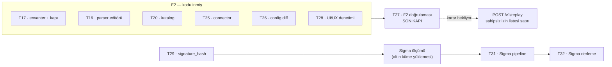

# İş envanteri

`main` = `a4dc297`. Bu belge gerçek depo durumundan çıkarıldı — ticket
dosyalarındaki `status` alanlarına **değil koda** bakıldı, çünkü o alanlar yine
bayatladı (B15).

**Ölçüm `t19-parser-editoru` @ `main` birleşik hâlinde alındı:** 18 proje 0
uyarı · **739** birim testi (3 atlanan) · **247** UI testi · `tsc` temiz ·
`api:check` birebir.

> Bu bölümdeki ölçümler ancak `npm install` **merge sonrası** koşulduğunda
> tekrar edilebiliyor; `package.json` değişmişse worktree'nin `node_modules`'ü
> bayat kalıyor ve `tsc` size ait olmayan bir hata gösteriyor (B16).

## 1 · Biten iş (main'de, doğrulanmış)

| # | Ticket | Kanıt |
| --- | --- | --- |
| T13 | Next.js iskelet + BFF | Token izolasyon testi: giriş akışının her yanıtının her baytı taranıyor, iki yönlü |
| T14 | OpenAPI tip üretimi | Derleme zamanı üretim + CI sürüklenme kapısı |
| T15 | Log arama ekranı | Kısa sorgu eşiği ve keyset kaynak filtresi kısıtları ekranda |
| T16 | Olay detayı + ham görünüm | OCSF/OTel sekmeleri `0003` görünümlerinden okunuyor |
| T18 | Parser taslak deposu + yayın akışı | Kapılar yayında tekrar koşuyor; geri alma bilerek atlıyor |
| T21 | Alarm motoru | Eşik/oran/sessizlik, `IScopedQuery` üzerinden, K16 sınırları |
| T22 | Bildirim kanalları | Dört kanal, AES-256-GCM, redaksiyon, geri adımlı yeniden deneme |
| T23 | Alarm yönetim ekranı | Önizleme: kural yayından önce kendi gürültüsünü gösteriyor |
| T24 | Change: imzalı webhook | GitHub/Jenkins/GitLab eşlemesi, idempotans Postgres'te |
| T17 | Kaynak envanteri + kapı düzeltmesi | `Produces` kapısı yansımalı; `Pending`/`Exempt` ayrımı ve `ExpectedExemptCount` |
| T19 | Parser editörü + canlı test | Taslak yayınlanmadan deneniyor; ad-hoc derlemenin kataloğu kirletmediği testle sabit |
| T20 | Katalog yönetim ekranı | Fark görünümü; okuma ve yayın uçları tipli |
| T25 | Change connector yapılandırma | İki ekranın UI testi geldi; maskenin ekranda tuttuğu ölçüldü (B12) |
| T26 | Cihaz config diff | Bölüm farkında diff; `FINALIZED` borcu ele alındı |
| T28 | UI/UX denetimi | Yedi bulgu, hepsinin bekçisi kırmızı yanabiliyor |
| T29 | `signature_hash` sıcak yolda | F3 ölçümü |
| T34 | Kanıt sözleşmesi | Sağlayıcılar `IScopedQuery`'den geçiyor; mimari test kanıt katmanını da kapsıyor |

Önceki turun **"main'de ama açık eksiği var"** bölümü boşaldı ve kaldırıldı:
tek satırı T25'ti ("iki ekranın UI testi yok"), testleri geldi ve satır yukarı
taşındı.

## 2 · Teknik borç

Bunlar ticket değil; biri kapanmazsa sessizce büyüyen şeyler. Tablo
**iki bölümlü** — protokoldeki `Pending`/`Exempt` ayrımının envanterdeki
karşılığı. Ayrım olmadan liste hiç boşalmıyordu: kapanacak bir kalemle
kapanmayacak bir kalem yan yana durunca ikisi de "açık borç" gibi okunuyor ve
kapanmayanlar listeyi sonsuza kadar dolu gösteriyordu.

### 2.1 · Kapanacak

| # | Borç | Nerede kapanacak |
| --- | --- | --- |
| B7 | Next oturum deposu **bellek içi** — çok kopyaya çıkmadan Redis gerekiyor | dağıtım |
| B10 | Jenkins `FINALIZED` ilk-gelen-kazanır: farklı `status` taşıyorsa erken durum kaydediliyor | T26'da ele alındı, kapanışı doğrulanacak |
| **B14** | **Şema tamamlama listesi motorun kopyası.** `ui/src/lib/parsers/schema.ts` `ParserYamlLoader`'ın anahtar kümelerini istemcide tekrarlıyor. Motora yeni bir adım eklenip burası güncellenmezse öneri eksik kalır. Bedeli "öneri görünmüyor", sessiz yanlış davranış **değil** — bu yüzden kabul edildi. Ucuz bir bekçi bulunamadı; sunucudan çekmek tamamlamayı her tuşta ağ isteğine bağlardı. | bekçi tasarlanabilirse |
| **B15** | **Ticket `status` alanları her merge'de bayatlıyor.** B11 bir kez kapatılmıştı ve yeniden açıldı; koordinatör `03a6efa`'da sekiz dosyayı düzeltti ama kalıcı çözüm değil — kapanışı bir kez yapmak yetmiyor. | koordinatör, her merge'de |
| **B19** | **CI kırmızıydı ve dört merge boyunca kimse bakmadı.** B18'i yakalayan kapı (`compose` işindeki `docker compose config --quiet`) **zaten vardı ve zaten kırmızı yanmıştı**: B7 merge'ünün koşumundan (`32384919290`) itibaren "Geliştirme ortamı doğrulaması" işi dört koşumda üst üste düştü, log satırı da tam hatayı yazıyordu. Eksik olan bekçi değil, kırmızıyı okuyan biriydi. Ölçüldü: `gh run list` beş koşumun dördünü `failure` gösteriyor. Ayrıca **ikinci bir iş** de bugün kırmızı: "Kapı 2 — ClickHouse üretilen SQL'i kabul ediyor mu" (T32 merge'ünden sonra) — bu kalem yalnızca compose'la ilgili değil. | **İki katman geldi, ikisi de kişiye dayanmıyor.** (1) `.githooks/pre-push`: `main`'e push'u, bir önceki koşum kırmızıysa durduruyor — hatırlamayı değil, komutun kendisini hedefliyor. (2) `.github/workflows/ci-red.yml`: main kırmızı kaldığında açık bir konu yazıyor, yerel kurulum istemiyor. **Kalan boşluk:** kanca `git config core.hooksPath .githooks` bir kez yapılmazsa sessizce yok — bu yüzden tek katman değil |
| **B17** | **`docs/epic/` senkron yönü.** Protokol epic dizinini kanonik sayıyordu, ama ajanlar oraya **erişemiyor**; yazdıkları tek yer depo kopyası. Koordinatör `rsync <epic>/ docs/epic/` çalıştırınca T27'nin 233 satırlık envanteri 148 satıra düştü ve yeni bölümü kayboldu (`git checkout` ile geri alındı). Yön **depo → epic** olarak düzeltildi ve `CLAUDE.md` §11'e yazıldı. Kalan risk: iki ajan aynı belgeyi paralel güncellerse çakışma kaçınılmaz — bu turda oldu. | çalışma kuralı; koordinatör tek yazar atamalı |

### 2.2 · Kapanmayacak — gerekçesiyle kabul edilmiş

| # | Risk | Neden kalıcı |
| --- | --- | --- |
| B8 | Keşif belgesi süresiz önbellekli; realm yeniden import edilirse Next yeniden başlatılmalı | Önbelleği kısaltmak her istekte Keycloak'a bağımlılık demek. Dağıtım notu olarak yazılı; kod değişikliği değil işletim kuralı. |
| B9 | `GetDocument.Insider` adı sözleşme dışı bir bağ; araç yeniden adlandırılırsa `api:check` düşer | Ayrımı bir ortam değişkenine bağlamak daha kötüydü: bayrak yanlışlıkla üretime taşınabilir ve göçleri sessizce atlayan bir API bırakırdı. Araç adı değişirse belge üretimi **kırmızı yanıyor** — hatanın doğru yönü bu. |
| **B16** | **Worktree `node_modules` bayatlığı.** `package.json` bir dalda değişince diğer worktree'lerin `node_modules`'ü eskiyor ve `tsc` kişiye ait olmayan bir hata gösteriyor (`Cannot find module 'playwright'`). Bu turda **üç ayrı yerde** aynı duvara toslandı: main, T27 ajanı, T19 ajanı. | Ajanlar ayrı worktree'lerde çalıştığı sürece yapısal. Azaltılabilir (protokolde "merge sonrası `npm install`"), yok edilemez. |

### 2.3 · Bu turda kapanan

| # | Borç | Nasıl kapandı |
| --- | --- | --- |
| ~~B1~~ | API kendi içinde tutarsız (`camelCase`/`snake_case`) | T25; connector/change uçları çevrildi, istek tarafı dahil |
| ~~B2~~ | `targetKind` bir yöne metin, öbür yöne sayı | T25; `ChangeResponse` DTO'su, `ChangeEvent` artık tel sözleşmesi değil |
| ~~B3~~ | **`Produces` kapısının yapısal deliği** — uçlar elle yazılmış `Map*` listesinden | T17; keşif yansımaya çevrildi, `/v1/` önek filtresi de kalktı |
| ~~B4~~ | İzin listesi tek liste, "küçülen" ile "kalıcı muaf" ayrımı yok | T17; `Pending`/`Exempt` ayrıldı, `ExpectedExemptCount` muafiyeti görünür kıldı |
| ~~B5~~ | İzin listesinde 21 satır | T17+T19+T20; **1 satıra indi** (`POST /v1/replay`, sahipsiz) |
| ~~B6~~ | `criteria.ts` ile `AlertSearch`/`FieldFilter` sessizce ayrışabilir | T20; `ui/tests/alert-criteria-bridge.test.ts` köprüyü sabitledi |
| ~~B11~~ | Ticket `status` alanları bayat | 2026-08-20'de kapandı, **B15 olarak yeniden açıldı** |
| ~~B12~~ | T25'in iki ekranının UI testi yok, maske ölçülmedi | T25; `ui/tests/changes-screen.test.tsx` maskeyi sınıyor |
| ~~B13~~ | **Elle tutulan `Add*` listesi ömür bekçisini körleştiriyor** | T19 (`5dcb786`); keşif yansımaya çevrildi — ayrıntısı aşağıda |
| ~~B18~~ | **Compose yığını B7'den bugüne ayrıştırılamıyordu.** `426fb05` compose'a `redis` adında bir servis ekledi; aynı adda bir servis 155 satır aşağıda T01'den beri duruyordu. Git iki tarafı da temiz gördü, derleme ve testler yeşil kaldı — **hiçbir şey kırmızı yanmadı**, dosyanın tamamı ayrıştırılamaz olduğu hâlde. Öğrenmenin tek yolu yığını ayağa kaldırmayı denemekti (§7: ölçülmeyen çalışıyor sayılmaz) | İki ayrı örnek: `redis-session` (BFF, kalıcılık yok, port açık) ve `redis` (sidecar, `--save 60 1`, port yok). Birleştirmek mümkün değil — RDB anlık görüntüsü veritabanı seçmiyor, "sidecar için kalıcı" demek "token'lar da diske" demek. CI'a Docker istemeyen bir ayrıştırma kapısı eklendi (`compose-lint`); süregelen kısmı **B19** |

### Üç kez ısıran kalıp — ve neden artık ısıramaz

Bu turun asıl bulgusu tek bir borç değil, **borcun şekli**: elle tutulan bir
liste bir bekçiyi besliyor ve liste eskidiğinde bekçi yeşil yanmaya devam
ediyor. Aynı şey üç yerde oldu:

| Nerede | Ne göremedi | Kapatan |
| --- | --- | --- |
| `Produces<T>` kapısı | Elle `Map*` listesi — **16 uç** kapıya hiç görünmedi, üç testin üçü de geçti | T17 |
| Ömür bekçisi | Elle `Add*` listesi — kanıt katmanı görünmedi, sağlayıcıları tam da bekçinin arayacağı hatayı taşıyordu | T19 |
| Ömür bekçisi | Aynı liste **doğduğu gün eksikti** — aşağıdaki iki kalem | T19 |

**Doğduğu gün eksik olan iki şey:**

- **`AddBizigoAuthentication`** — `Program.cs`'te çağrılıyor, bekçide hiç yoktu.
Yani **kimlik ve yetkilendirme grafiği kapsam doğrulamasından bir kez bile
geçmemişti**. Bu, listenin eskimesi değil; hiç doğru olmamış olması.
- **`AddBizigoDiscovery`** — `AddBizigoIngest`'in içinden çağrılıyor, dolayısıyla
elle listeye girmesi hiç akla gelmezdi.

Kapatılışı: keşif hem uzantılar hem **derlemeler** için yansımalı. Derleme
listesini elle bırakmak deliği bir kat yukarı taşımak olurdu; kompozisyon
kökünden başlanıp `Bizigo.*` referansları geçişli yükleniyor
(`AppDomain.GetAssemblies()` yetmiyor — hiç dokunulmamış derleme yüklü olmaz).
Tanınmayan bir imza **atlanmıyor, testi düşürüyor**: atlamak bekçiyi en sinsi
biçimde körleştirirdi. Elle kalan tek şey artık *denetlenen* küme değil
*beklenen* küme.

### Kaçırılan kapı — ve nasıl kaçırıldı

T26 indikten sonra `api:generate`/`api:check` **kırıldı ve kimse görmedi**:
`DeviceConfigRunner` singleton kaydedilip scoped `IScopedQuery` alıyordu, belge
üretimi de `Main`'i gerçekten çalıştırdığı için tek gerçek DI doğrulaması
oydu. Kusur ancak T19 birleştirmesinde, ona hiç dokunmamış bir dalda görüldü.

İki ders, ikisi de kayıtlı: **(a)** doğrulama listesinden düşen bir kapı, kapı
olmaktan çıkıyor — koordinatörün faz doğrulamasında tip kapısı vardı ve
düşmüştü; **(b)** bir kusurun yalnızca tesadüfen görülebilir olması, kusurun
kendisi kadar önemli. İkincisi
`ArchitectureTests.Uretim_DI_grafi_kapsam_dogrulamasindan_geciyor` ile
kapatıldı: kapsam doğrulaması artık her birim testi koşumunda.

### Bir bekçinin **adı ile gövdesinin ayrışması**

Yukarıdaki iki bölüm aynı hastalığın iki belirtisiydi; hastalığın kendisi bu ve
bir sözleşme kalemi değil, bir **ölçüm kültürü** kalemi.

**Bir bekçinin adı bir iddia kurar. Gövdesi başka bir şey ölçüyorsa, o bekçi
hiç yokmuş gibidir — ama yokluğu görünmez, çünkü yeşil yanıyor.** Hiç bekçi
olmamasından tehlikeli olmasının sebebi bu: eksik bekçi bir boşluk bırakır,
yanlış bekçi o boşluğu **doldurulmuş gösterir.**

Bu turda dört örnek çıktı.

| Bekçi | Adının kurduğu iddia | Gövdesinin ölçtüğü | Nasıl bulundu |
| --- | --- | --- | --- |
| `ProducesContractTests` | `/v1/*` altındaki her uç sözleşmeli | **Listedeki** uçlar — 16 uç listede yoktu | Keşif yansımaya çevrilince |
| Ömür bekçisi | Üretim DI grafiği kapsam doğrulamasından geçiyor | `AddBizigoAuthentication` **hariç** grafik | Keşif yansımaya çevrilince |
| `sigma_build` Kapı 2 | Tip uyuşmazlığı yakalanıyor | `EXPLAIN SYNTAX` yalnızca AST'yi yeniden yazıyor, **tip denetimi yapmıyor** — iki bilinen kırık sorguya da 200 | Kapının kendi `--self-test` kipi |
| `Ayni_id_icin_en_yuksek_surum_kazaniyor` | Sürüm çözümlemesi | `specificity` **sıralaması** (iki farklı `id`) | Yeni test yazılırken |

**Nasıl bulunduklarına dikkat** — arayan birine nereye bakacağını söyleyen kısım
bu:

**Üç ayrı yol.** Dördü tek bir yöntemle bulunmadı ve aradaki fark, arayan biri
için asıl bilgi.

- **İkisi, keşif elle tutulan bir listeden yansımaya çevrilince çıktı**
(`ProducesContractTests`, ömür bekçisi). Liste kaldırıldığı an denetlenen küme
büyüdü ve bekçinin daha önce neyi görmediği **sayı olarak** göründü. Yani:
*bir bekçi elle tutulan bir listeden besleniyorsa, listeyi kaldırmak teşhis
aracıdır.*
- **Biri, kapının kendi `--self-test` kipiyle çıktı** (`sigma_build` Kapı 2).
Kip, kapıyı **bilinen kırık girdilere** karşı koşturuyor; `EXPLAIN SYNTAX` iki
kırık sorgunun ikisine de 200 dönünce kapının hiçbir şey ölçmediği görüldü. Bu
en ucuz yol ve tek başına bir kalıp: *bir bekçiye, yakalaması gereken şeyi
yakalayıp yakalamadığını soran bir kip yaz.* Kip olmasaydı kusur kural seti
üretime çıkana kadar görünmeyecekti.
- **Biri, o bekçinin iddiasına dayanan yeni bir test yazılırken çıktı**
(`Ayni_id_icin_en_yuksek_surum_kazaniyor`).
`Yayinlanan_parser_sonraki_olayi_ayristiriyor` "yeni sürüm kataloğa giriyor"
varsayımına dayanıyordu; o varsayımı kim tutuyor diye bakınca tutmadığı
görüldü. Yani: *bir iddiaya dayanacaksan önce onu kimin tuttuğuna bak.*

**En can sıkıcı örnek sonuncusu**, çünkü bilgi zaten kayıtlıydı: testin kendi
yorumu *"`Replace` sürüm çözümlemesi yapmıyor; çözümleme dizinden yüklemede"*
diyordu ve testin **adı** sürüm çözümlemesini iddia ediyordu. İki cümle yan yana
duruyordu; kimse ikisini birden okumamıştı. Diğer üçü keşif ya da araç
gerektirdi, bu yalnızca dikkat gerektiriyordu.

#### Katalogda arandı — üç bulgu

Aynı soru `catalog/parsers`'daki **62 gömülü teste** soruldu: adı ile beklentisi
ayrışan var mı? Yöntem, her testin `name` alanıyla `expect` bloğunu yan yana
dökmek oldu.

| Test | Ad ne diyordu | Gövde ne ölçüyordu | Düzeltme |
| --- | --- | --- | --- |
| `cisco.asa.auth` — 611103 | "yıllı zarf ve **host yok**" | Zarf sınanıyordu, **host yokluğu sınanmıyordu** | `core.host: null` eklendi |
| `nginx.access.combined` — sanal sunucu öneki | "**yüzde kodlu yol**" | Host, IP, durum, bayt — **yola hiç bakılmıyordu** | `otel.url.path` eklendi, kod çözülmemiş hâliyle |
| `mikrotik.routeros.firewall` — kural öneki | "**boşluklu arayüz adlı** satır" | Girdide boşluklu arayüz **yok** (`ether1-gateway`); ad bir **sonraki** testin girdisini anlatıyordu | Ad gerçekten sınadığı şeye çevrildi |

İlk ikisi ancak T08 raporu #6 kapandıktan sonra düzeltilebilirdi: "bu alan hiç
olmamalı" beklentisi T19'a kadar ifade edilemiyordu. Yani bulgu yeni değil,
**düzeltilebilir olması** yeni.

**Ölçüldü:** iki yeni beklenti de kırmızı yanabiliyor. ASA zarfına host
eklendiğinde `core.host` düşüyor, nginx yolu kod çözülmüş hâline çevrildiğinde
`otel.url.path` düşüyor — `62 geçti` → `60 geçti, 2 kaldı`. Sonra geri alındı.

**Geri kalan 59 testte ayrışma bulunmadı** — aradım, yok. Negatif testlerin
tamamı (`negatif — … bu parser'a düşmemeli`) gerçekten `parse_status: failed`
bekliyor; `302020 — zaman damgası olmayan zarf` iddiasını `tags:
["_asa_no_timestamp"]` ile gerçekten ölçüyor ve doğru yapmanın örneği olarak
duruyor.

## 3 · Doğrulanmamış olan

| # | Ne | Kim |
| --- | --- | --- |
| ~~D1~~ | ~~Tarayıcı giriş akışı canlı Keycloak'a karşı hiç koşulmadı~~ — **koşuldu ve geçti** 2026-08-20. Ayrıntı aşağıda. | — |
| ~~D2~~ | ~~Entegrasyon testleri yerelde hiç koşulmadı~~ — **koşuldu**, 93/93 geçti (koordinatör, 2026-08-20). | — |
| D3 | `SidecarLiveTests` atlanıyor (canlı sidecar gerekiyor) | koordinatör, T29 ölçümü |
| **D4** | **Kimlik/yetkilendirme grafiği kapsam doğrulamasından hiç geçmemişti** — `AddBizigoAuthentication` ömür bekçisinin listesinde yoktu. Artık geçiyor (`5dcb786`), ama bugüne kadar geçmemiş olması D1'in bulduğu sınıfla aynı: doğrulanmamış bir katman, çalıştığı sanılan bir katman. | ✅ kapandı |

| **D5** | **Sigma kapsam ölçümü koştu ama sayısı kullanılamaz.** `match_ratio = %0`; sebebi eşleme değil **veri**: ClickHouse'daki 1M satır tek-vendor'lu sentetik benchmark verisi, altın örnek değil. Aracın ön kontrolü "boş mu" diye soruyordu, "doğru veri mi" diye değil — sonradan altın örnek sondası arayacak şekilde sertleştirildi. **Veriden bağımsız tek kullanılabilir sayı:** `compiled=24, runs=14` — on kural var olmayan kolonlara giden SQL üretiyor, ve bu kapsam daraltarak çözülmez. | koordinatör; altın örnek yükleyicisi yazılıyor |
| **D6** | **Baseline pencere ölçümü de aynı sebeple bekliyor** — araç en az taban süresi kadar gerçek geçmiş istiyor ve bunu kendisi söylüyor, sessizce anlamsız sayı üretmiyor. | koordinatör, yükleyiciden sonra |

### D1'in sonucu — canlı Keycloak, 2026-08-20

Keycloak 26.7.1 + Postgres + ClickHouse + RustFS ayağa kaldırıldı, `Bizigo.Api`
ve Next BFF gerçekten koşturuldu, giriş akışı uçtan uca sürüldü
(`analyst.core`). **Geçti.** Sonra hepsi kapatıldı.

**Taşıyıcı kanıt — K31'in gerekçesi kaynağında doğrulandı.** Realm'in keşif
belgesi `scopes_supported = ["openid", "offline_access", "bizigo-claims"]`
diyor; `profile` ve `email` **yok**, çünkü realm dosyası `clientScopes`
verdiği için Keycloak yerleşik scope'ları hiç oluşturmuyor. Üç istek yan yana
koşuldu:

| İstenen scope | Keycloak'ın cevabı |
| --- | --- |
| `openid` | geçiyor (yalnızca PKCE eksikliğinde duruyor) |
| `openid profile` | `error=invalid_scope` — *Invalid scopes: openid profile* |
| `openid profile email` | `error=invalid_scope` — *Invalid scopes: openid profile email* |

API'nin F1'den kalma OIDC işleyicisi üçüncü satırı istiyordu. Yani tarayıcı
akışı sevk edilseydi **ilk kullanıcının ilk girişinde** patlardı ve hiçbir test
bunu görmezdi — akış hiç koşulmamıştı.

**Ölçülen diğer şeyler:**

- Giriş tamamlandı; oturum çerezi `bizigo.sid` **opak rastgele** değer taşıyor
(nokta yok, JWT/base64 JSON değil), `HttpOnly`, `SameSite=Lax`, `Secure` yok
(adres `http`, doğru davranış).
- **BFF'in (`localhost:3000`) hiçbir yanıtında token yok** — altı yanıtın
başlıkları ve gövdeleri `eyJ…`, `access_token`, `refresh_token`, `id_token`
için tarandı: sıfır bulgu. Beş bulgunun tamamı Keycloak'ın kendi alanındaki
kendi çerezleri (`KC_RESTART`, `KEYCLOAK_IDENTITY`, `KEYCLOAK_SESSION`).
- **Yukarı akışta token var:** `/api/bff/auth/me` gerçek kimliği döndürdü
(`roles: ["analyst"]`, `idp_groups: ["/network/core"]`), yani vekil oturum
anahtarını `Authorization` başlığına çeviriyor ve `bizigo-claims` scope'u
rolleri ve grupları gerçekten taşıyor.
- Sahte oturum çerezi → **401**.
- K17'nin kapalı-başarısızlığı çalışıyor **ve sessiz değil**: `idp_group_mapping`
tablosu boşken kullanıcı giriş yapıyor ama `sees_nothing: true` dönüyor ve ekran
sebebini söylüyor — *"Hiçbir gruba eşlenmediğiniz için veri göremiyorsunuz…
yöneticinize başvurun."*

## 4 · Ticket durumları — **dosyalar bayat** (B15)

`0` yapılacak · `1` sürüyor · `2` bitti

Bu tablo **koddan** çıkarıldı. Ticket dosyalarındaki `status` alanları üç yerde
kodla çelişiyor; düzeltmek koordinatörün defter işi, envanterin değil — burada
yalnızca **fark kayda geçiriliyor**:

| Ticket | Dosya diyor | Kod diyor | Kanıt |
| --- | --- | --- | --- |
| T20 katalog ekranı | `1` | bitti | `f75bfa9` main'de |
| T25 change connector | `1` | bitti | `c193f83` — eksik olan UI testleri geldi |
| T26 config diff | `1` | bitti | `1ae0e93` main'de |

Dosyalardaki hâl (yukarıdaki üç satır hariç, **çapraz kontrol edilmedi** —
"kod birleşti" ile "ticket bitti" aynı şey değil ve o kararı ticket'ın sahibi
verir):

| Durum | Ticket'lar |
| --- | --- |
| **2 — bitti** | T13, T14, T15, T16, T18, T19, T21, T22, T23, T24, T29, T34 |
| **1 — sürüyor** | T20, T25, T26 *(üçü de kodla çelişiyor)*, T28 |
| **0 — yapılacak** | T27, T30–T33, T35–T38 |

Ayrıca `korelasyonlar` (T35) `status: 0` görünüyor ama `CorrelationReader`,
`CorrelationMath` ve iki test dosyası `main`'de — bu da bir çelişki adayı,
ticket sahibi doğrulamalı.

T32 (Sigma derleme hattı) T31'e, o da Sigma ölçümüne bağlı; ölçümün önkoşulu
altın örneklerin ClickHouse'a yüklenmesi ve o ayrı bir ajanda.

## 5 · Kalan ticket'lar

F2'nin yedi ticket'ının kodu indi; kalan **T27**, yani fazın kendi
doğrulaması.

T19 ile T20 parser uçlarını **yetki tablosuna göre** böldü — yazar/inceleyen
ayrımı `ParserAuthoringEndpoints`'te zaten çizili: author uçları T19, admin ve
okuma uçları T20. `GET /v1/parsers/drafts/{id}` sözleşmesi ikisine birden
çivilendi (`yaml` alanı, `snake_case`) ki biri diğerini beklemesin. Merge'de
o satırlardan hiçbiri iki kez silinmedi — bölünme tuttu.

**T27'nin önündeki tek açık karar:** izin listesindeki `POST /v1/replay`.
Atfı yanlıştı ("T19 — replay ekranı"), oysa replay ekranının ticket'ı yok.
Tüketicisi olmayan bir uca yanıt tipi yazmak listenin var olma sebebini boşa
çıkarır; kalıcı muafiyete taşımak ise "hiç ekranı olmayacak" iddiası olur.
İkisinden biri seçilmeden liste boşalmıyor.

## 6 · Çalışma kuralları (2026-08-20'de konuldu)

1. **Ajanlar Docker'a dokunmaz.** Entegrasyon testleri, Testcontainers, compose,
canlı Keycloak, canlı sidecar — hepsi koordinatörde, **faz bitimlerinde**.
2. **Ajanlar kendi testlerini koşar:** `dotnet build`, birim testleri,
`npm run typecheck`, `npm test`. Entegrasyon testlerini **yazar, koşturmaz**.
3. **Herkes başlattığı prosesi temizler** — hata alsa, iş yarıda kalsa bile.
Arka planda bırakılan sunucu/izleyici/batch makineyi şişiriyor. Öldürme deseni
dar tutulur; geniş `pkill -f` bir keresinde oturumun kendi izleyicilerini öldürdü.
4. **Ağır işten önce** `~/.claude/scripts/machine-resources.sh check`; çıkış kodu
1 ise başlanmaz, koordinatöre haber verilir.
5. Ajanlar **push etmez**; birleştirme koordinatörde.
6. **`git merge main`'den sonra `npm install`.** `package.json` başka bir dalda
değiştiyse worktree'nin `node_modules`'ü bayat kalıyor ve `tsc` size ait
olmayan bir hata gösteriyor. Bu tura kadar üç ajan aynı duvara tosladı; kural
kusuru yok etmiyor, yalnızca teşhis süresini sıfırlıyor (B16).
