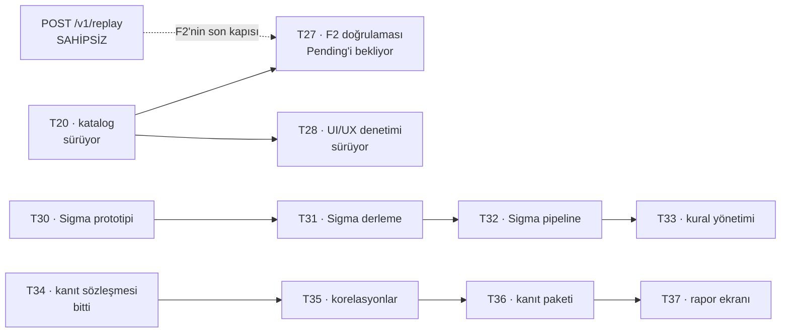

# İş envanteri

`main` = `52b209b`, CI **yeşil**. Bu belge 2026-08-20'de gerçek depo durumundan
çıkarıldı ve aynı gün ikinci kez tazelendi. Ticket dosyalarındaki `status`
alanları bu belgeyle aynı şeyi söylüyor (B11 kapandı).

## 1 · Biten iş (main'de, doğrulanmış)

| # | Ticket | Kanıt |
| --- | --- | --- |
| T13 | Next.js iskelet + BFF | Token izolasyon testi: giriş akışının her yanıtının her baytı taranıyor, iki yönlü |
| T14 | OpenAPI tip üretimi | Derleme zamanı üretim + CI sürüklenme kapısı |
| T15 | Log arama ekranı | Kısa sorgu eşiği ve keyset kaynak filtresi kısıtları ekranda |
| T16 | Olay detayı + ham görünüm | OCSF/OTel sekmeleri `0003` görünümlerinden okunuyor |
| T18 | Parser taslak deposu + yayın akışı | Kapılar yayında tekrar koşuyor; geri alma bilerek atlıyor |
| T21 | Alarm motoru | Eşik/oran/sessizlik, `IScopedQuery` üzerinden, K16 sınırları |
| T22 | Bildirim kanalları | Dört kanal, AES-256-GCM, redaksiyon, geri adımlı yeniden deneme |
| T23 | Alarm yönetim ekranı | Önizleme: kural yayından önce kendi gürültüsünü gösteriyor |
| T24 | Change: imzalı webhook | GitHub/Jenkins/GitLab eşlemesi, idempotans Postgres'te |
| T17 | Envanter ekranı + kapı düzeltmesi | Kapı denetlediği kümeyi yansımayla buluyor; izin listesi ikiye bölündü |
| T19 | Parser editörü | Yazar yüzeyi uçları yanıt tipi kazandı |
| T25 | Change connector yapılandırma | Kimlik bilgisi şifreli, maske ekranda da tutuyor, redaksiyon kapısı serviste |
| T26 | Cihaz config fark tespiti | Üç vendor, gürültü elemesi, bölüm başına çoklu-küme farkı |
| T29 | `signature_hash` sıcak yolda | Ölçüm teslim edildi |
| T34 | Kanıt sözleşmesi | İki sağlayıcı; uç yok, depo ve rapor T36'da |

**Ölçülen durum (2026-08-20, ikinci tazeleme):** 18 proje 0 uyarı · **738**
birim testi (3 atlandı) · **247** UI testi · **96** entegrasyon testi ·
`tsc` temiz · `api:check` birebir · CI yeşil.

Entegrasyon testleri **yerelde de koşturuldu** (93/93, koordinatör) — bugüne
kadar yalnızca CI koşuyordu. D2 böylece kapandı.

## 2 · Main'de ama açık eksiği var

| # | Ticket | Durum | Eksik |
| --- | --- | --- | --- |
| T20 | Katalog ekranı | sürüyor | — |
| T27 | F2 doğrulaması | akışlar ve bekçiler yazıldı | `Pending` tek satır kaldı (aşağıda); kuru koşu testi koşturulabilir hâle gelmedi |
| T28 | UI/UX denetimi | sürüyor | — |

## 3 · Açık teknik borç

Bunlar ticket değil; biri kapanmazsa sessizce büyüyen şeyler.

| # | Borç | Nerede kapanacak |
| --- | --- | --- |
| ~~B1~~ | ~~API kendi içinde tutarsız~~ — **kapandı** (`2590d04`). Connector/change uçları `snake_case`'e çekildi, istek tarafı dahil. `ChangeWriteRequest` bilerek kırıldı: tek çağıranı ürünün kendi formuydu, bedeli sıfırken kırmak doğru andı. | — |
| ~~B2~~ | ~~`targetKind` bir yöne metin, öbür yöne sayı~~ — **kapandı**. Dönüştürücü yerine `ChangeResponse` DTO'su kuruldu: `ChangeEvent` artık tel sözleşmesi değil, yani o tipe eklenen bir alan kimse karar vermeden API'ye sızamıyor. | — |
| ~~B3~~ | ~~`Produces` kapısının yapısal deliği~~ — **kapandı** (T17). Uçlar yansımayla bulunuyor. T27 ikinci yarısını da kapattı: bulunmak yetmiyor, **çağrılabilmesi** de gerekiyor, ve on değişiklik rotası ada göre sabitlendi. İkisi de kırmızı yanabildiği ölçüldü. | — |
| ~~B4~~ | ~~İzin listesi tek liste~~ — **kapandı** (T17). `Pending` küçülüyor, `Exempt` kalıcı ve `ExpectedExemptCount = 6` ile korunuyor. | — |
| B5 | İzin listesinde **tek satır**: `POST /v1/replay`, **sahipsiz** — replay ekranının ticket'ı yok | koordinatör kararı bekliyor; F2'nin son kapısı |
| B6 | `criteria.ts` `PARAM` kümesi ile `AlertSearch`/`FieldFilter` ayrışabilir; iki yönlü bekçi (T20) kuruldu ve **ters yön de** artık kullanımda (alarm bağlantısı). | kapandı sayılabilir; bekçi duruyor |
| ~~B12~~ | ~~T25'in iki ekranının UI testi yok~~ — **kapandı**. Mantık `lib/changes`'e ve iki sunum bileşenine çıkarıldı; maskenin ekranda tuttuğu, `target_kind` çevirisi, dört durum ve çok dilli gövde sınandı. Maske bekçisi kırmızı yanabildiği ölçüldü. | — |
| B7 | Next oturum deposu **bellek içi** — çok kopyaya çıkmadan Redis gerekiyor | F2 sonu / dağıtım |
| B8 | Keşif belgesi süresiz önbellekli; realm yeniden import edilirse Next yeniden başlatılmalı | dağıtım notu |
| B9 | `GetDocument.Insider` adı sözleşme dışı bir bağ; araç yeniden adlandırılırsa `api:check` düşer | kabul edilmiş risk |
| ~~B10~~ | ~~Jenkins `FINALIZED` ilk-gelen-kazanır~~ — **kapandı** (T26). Teslimat anahtarı durumu da taşıyor: iki bitiş fazı aynı durumu bildiriyorsa tek kayıt, post-build adımı `SUCCESS`'i `FAILURE`'a çevirdiyse ikinci kayıt. Eski hâl erken ve **yanlış** durumu sessizce kalıcı yapıyordu. | — |
| B13 | **Kuru koşu testi koşturulabilir değil** — `Skip` iskeleti + numaralı adımlar; Postgres manifest satırları ve S3 nesneleri gerekiyor | koordinatör, faz sonu |
| B14 | `ui/node_modules` worktree'lerde **bayatlıyor**: `package.json` değiştiğinde `tsc` ve `npm test` ajana ait olmayan hata gösteriyor. Çözüm tek komut (`npm install`) ama tuzağa iki kişi düştü. | çalışma kuralı (§7) |
| ~~B11~~ | ~~Ticket `status` alanları bayat~~ — **kapandı** 2026-08-20. Aşağıdaki tablo artık dosyalardaki değerlerle aynı. | — |

## 4 · Doğrulanmamış olan

| # | Ne | Kim |
| --- | --- | --- |
| ~~D1~~ | ~~Tarayıcı giriş akışı canlı Keycloak'a karşı hiç koşulmadı~~ — **koşuldu ve geçti** 2026-08-20. Ayrıntı aşağıda. | — |
| ~~D2~~ | ~~Entegrasyon testleri yerelde hiç koşulmadı~~ — **koşuldu**, 93/93 geçti. | — |
| D3 | `SidecarLiveTests` atlanıyor (canlı sidecar gerekiyor) | koordinatör, T29 ölçümü |
| ~~D4~~ | ~~"Replay sırasında canlı ingest bozulmuyor"~~ — **ölçüldü ve iddia YANLIŞ çıktı.** Ayrıntı aşağıda. | — |
| D5 | `HotPathCostMeasurement.K35_sicak_yol_maliyeti` atlanıyor | T29/T30 zinciri |

### D4'ün sonucu — F1'in kapalı sandığı kapı açıkmış

F1 şöyle bırakmıştı: *"`REPLACE PARTITION` atomik olduğu için beklenen doğru
davranış, ama yük altında sınanmadı."* Ölçülünce iddia yanlış çıktı ve sebebi
atomikliğin **ne söylediğiyle** ilgili.

Motor önce mevcut satırları okuyup gölge tabloyu kuruyor, sonra bölümü
değiştiriyor. O iki adım arasında canlı ingest'in aynı bölüme yazdığı her satır
gölgede **yok** — ve değiştirme onu sessizce siliyor. Hata yok, sayaç yok,
belirti yok. Atomiklik *"yarım bölüm görünmez"* diyor, *"anlık görüntüden sonra
geleni korurum"* demiyor.

**Kapatma biçimi:** açık bölüm (bugünün bölümü) varsayılan olarak replay'in
dışında ve atlandığı **rapora yazılıyor** (`SkippedOpenPartitions`). Sessiz veri
kaybı, görünür bir karara çevrildi. İngest'i durdurduğunu bilen operatör
`AllowOpenPartition` ile bugünü de kapsayabiliyor.

Karar saf bir fonksiyonda ve saat dışarıdan veriliyor, yani altı test
**konteynersiz** koşuyor — gece yarısı sınırının kayması dâhil.

### D6 — alarm bağlantısı kuralın filtrelerini taşımıyordu

Bağlantı `kural=<guid>` taşıyor ama arama ekranı onu **hiç okumuyordu**;
`AlertLinkBuilder`'ın kendi yorumu "ekran kuralı kimliğinden okuyor" diyordu.
Sonuç 404 değil, daha sinsisi: kullanıcı doğru ekrana ve doğru aralığa gidiyor
ama kuralın **alan filtreleri olmadan** — yani "5 dakikada `action=deny` > 100"
alarmı, o beş dakikanın bütün olaylarını gösteren bir ekran açıyordu.

**Kapatma biçimi kimliği çözdürmek değil:** bağlantı bir kez üretilip bildirime
gömülüyor ve kullanıcı günler sonra tıklıyor, yani kimliği çözen ekran
*bugünkü* kuralı gösterirdi. Filtreler bağlantının kendisine gömüldü
(`criteria-bridge.ts`'in ters yönü) ve bağlantı **o anın fotoğrafı** oldu;
`kural` kaynak göstergesi olarak kaldı.

Ters yön birebir değildi: ekranın "n ve üzeri"si ileri yönde `gt(n-1)`'e
çevriliyor, geri yönde 1 eklenmezse alarm **bir kademe geniş** bir ekran açıyor
— ve tek kademelik sapmayı kimse fark etmez.

Ekranda karşılığı olmayan filtreler (`src_ip`, `user_name`) sessizce düşmüyor:
`eksik` parametresiyle bildiriliyor ve ekran kullanıcıya *"bu alarmın N filtresi
burada gösterilemiyor, sonuçlar daha geniş"* diyor.

### D1'in sonucu — canlı Keycloak, 2026-08-20

Keycloak 26.7.1 + Postgres + ClickHouse + RustFS ayağa kaldırıldı, `Bizigo.Api`
ve Next BFF gerçekten koşturuldu, giriş akışı uçtan uca sürüldü
(`analyst.core`). **Geçti.** Sonra hepsi kapatıldı.

**Taşıyıcı kanıt — K31'in gerekçesi kaynağında doğrulandı.** Realm'in keşif
belgesi `scopes_supported = ["openid", "offline_access", "bizigo-claims"]`
diyor; `profile` ve `email` **yok**, çünkü realm dosyası `clientScopes`
verdiği için Keycloak yerleşik scope'ları hiç oluşturmuyor. Üç istek yan yana
koşuldu:

| İstenen scope | Keycloak'ın cevabı |
| --- | --- |
| `openid` | geçiyor (yalnızca PKCE eksikliğinde duruyor) |
| `openid profile` | `error=invalid_scope` — *Invalid scopes: openid profile* |
| `openid profile email` | `error=invalid_scope` — *Invalid scopes: openid profile email* |

API'nin F1'den kalma OIDC işleyicisi üçüncü satırı istiyordu. Yani tarayıcı
akışı sevk edilseydi **ilk kullanıcının ilk girişinde** patlardı ve hiçbir test
bunu görmezdi — akış hiç koşulmamıştı.

**Ölçülen diğer şeyler:**

- Giriş tamamlandı; oturum çerezi `bizigo.sid` **opak rastgele** değer taşıyor
(nokta yok, JWT/base64 JSON değil), `HttpOnly`, `SameSite=Lax`, `Secure` yok
(adres `http`, doğru davranış).
- **BFF'in (`localhost:3000`) hiçbir yanıtında token yok** — altı yanıtın
başlıkları ve gövdeleri `eyJ…`, `access_token`, `refresh_token`, `id_token`
için tarandı: sıfır bulgu. Beş bulgunun tamamı Keycloak'ın kendi alanındaki
kendi çerezleri (`KC_RESTART`, `KEYCLOAK_IDENTITY`, `KEYCLOAK_SESSION`).
- **Yukarı akışta token var:** `/api/bff/auth/me` gerçek kimliği döndürdü
(`roles: ["analyst"]`, `idp_groups: ["/network/core"]`), yani vekil oturum
anahtarını `Authorization` başlığına çeviriyor ve `bizigo-claims` scope'u
rolleri ve grupları gerçekten taşıyor.
- Sahte oturum çerezi → **401**.
- K17'nin kapalı-başarısızlığı çalışıyor **ve sessiz değil**: `idp_group_mapping`
tablosu boşken kullanıcı giriş yapıyor ama `sees_nothing: true` dönüyor ve ekran
sebebini söylüyor — *"Hiçbir gruba eşlenmediğiniz için veri göremiyorsunuz…
yöneticinize başvurun."*

## 5 · Ticket durumları (dosyalardaki `status` ile aynı)

`0` yapılacak · `1` sürüyor · `2` bitti

| Durum | Ticket'lar |
| --- | --- |
| **2 — bitti** | T13, T14, T15, T16, T17, T18, T19, T21, T22, T23, T24, T29, T34 |
| **1 — sürüyor** | T20 (katalog), T25 (connector), T26 (config diff), T28 (UI/UX denetimi) |
| **0 — yapılacak** | T27 (F2 doğrulaması), T30–T33, T35–T38 (F3) |

**T25 ve T26 dosyada `1` ama işleri bitti** — kod main'de ve doğrulandı;
`status` alanları bir sonraki tazelemede `2`'ye çekilmeli. T27 de fiilen
yazıldı; `0` kalmasının tek sebebi `Pending`'in henüz boşalmaması (B5).

## 6 · Kalan ticket'lar

**F2'de kalan üç iş:** T20, T27, T28 — ve T27'nin tek engeli teknik değil,
`POST /v1/replay`'in **sahibi olmaması**. Replay ekranının ticket'ı hiç
açılmadı; uç ya bir ticket kazanacak ya kalıcı muafiyete geçecek. Karar
verilmeden F2 "bitti" diyemiyor, çünkü kriterin kendisi `Pending`'in
boşalması.

**F3:** T30–T38. İki iş (T30 Sigma prototipi, T29 `signature_hash`) kod değil
**sayı** teslim ediyor; T29 bitti.

## 7 · Çalışma kuralları (2026-08-20'de konuldu)

1. **Ajanlar Docker'a dokunmaz.** Entegrasyon testleri, Testcontainers, compose,
canlı Keycloak, canlı sidecar — hepsi koordinatörde, **faz bitimlerinde**.
2. **Ajanlar kendi testlerini koşar:** `dotnet build`, birim testleri,
`npm run typecheck`, `npm test`. Entegrasyon testlerini **yazar, koşturmaz**.
3. **Herkes başlattığı prosesi temizler** — hata alsa, iş yarıda kalsa bile.
Arka planda bırakılan sunucu/izleyici/batch makineyi şişiriyor. Öldürme deseni
dar tutulur; geniş `pkill -f` bir keresinde oturumun kendi izleyicilerini öldürdü.
4. **Ağır işten önce** `~/.claude/scripts/machine-resources.sh check`; çıkış kodu
1 ise başlanmaz, koordinatöre haber verilir.
5. Ajanlar **push etmez**; birleştirme koordinatörde.
6. **`git merge main` her turun ilk işi.** Paralel dört-beş ajan aynı dosyalara
dokunuyor; geç birleştiren çakışmayı büyütüyor.
7. **`package.json` değiştiyse `ui/` içinde `npm install`.** Worktree'nin
`node_modules`'ü bayatlayınca `tsc` ve `npm test`, ajana ait olmayan bir hata
gösteriyor (B14). İki kişi bu tuzağa düştü; ikisi de "benim değil" diye
doğruladıktan sonra bildirdi — doğru refleks o, ama komut daha ucuz.

## 8 · Bu fazda tekrarlanan hata sınıfı

F1'in dersi *"doğrulanmamış her katman kırıktı ve hiçbiri kendini belli
etmedi"* idi. F2'de aynı sınıf **dört kez** çıktı ve dördü de aynı şekle sahip:
**belgelenmiş bir iddianın kodda karşılığı yok, ve sonuç sessizce yanlış.**

| Bulgu | İddia | Gerçek |
| --- | --- | --- |
| D4 · replay | "`REPLACE PARTITION` atomik, canlı ingest bozulmuyor" | Anlık görüntüden sonra gelen satır siliniyor |
| D6 · alarm bağlantısı | "Ekran kuralı kimliğinden okuyor" | Hiç okumuyor; alarm işaret ettiğinden geniş bir ekran açıyor |
| T26 · bölüm adı | "Gizli değerler maskeleniyor" | Maskeleniyor ama sır **bölüm adının içinde** kalıyordu |
| T24 · Jenkins | "İki faz aynı olguyu bildiriyor" | Post-build adımı durumu çevirebiliyor; erken ve yanlış durum kalıcı oluyordu |

Dördü de **koşturarak değil, okuyarak ve test yazarken** bulundu. Ortak
çıkarım: bir yorumun bir şeyi iddia etmesi, kodun onu yaptığı anlamına
gelmiyor — ve iddia ile kod ayrıştığında belirti üretmiyor. Yeni bir bekçi
yazarken sorulacak soru "bu davranış doğru mu" değil, **"bu yorumun söylediği
şey gerçekten oluyor mu"**.
