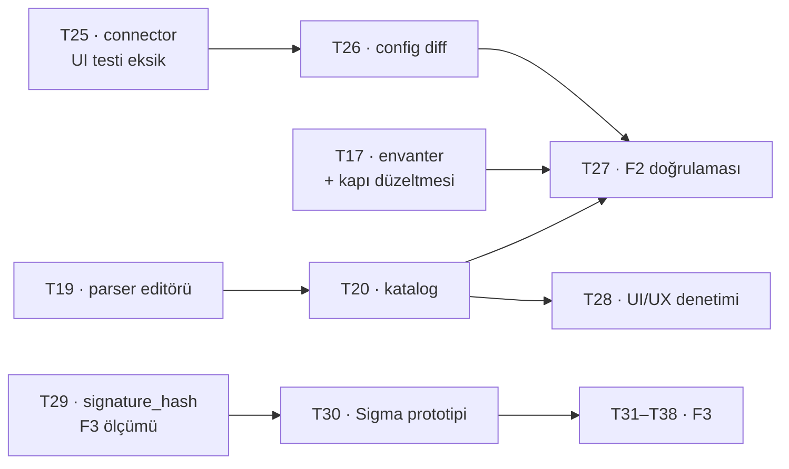

# İş envanteri

`main` = `2590d04`, CI **yeşil**. Bu belge 2026-08-20'de gerçek depo durumundan
çıkarıldı. Ticket dosyalarındaki `status` alanları o gün bu belgeye göre
düzeltildi (B11 kapandı), yani ikisi artık aynı şeyi söylüyor.

## 1 · Biten iş (main'de, doğrulanmış)

| # | Ticket | Kanıt |
| --- | --- | --- |
| T13 | Next.js iskelet + BFF | Token izolasyon testi: giriş akışının her yanıtının her baytı taranıyor, iki yönlü |
| T14 | OpenAPI tip üretimi | Derleme zamanı üretim + CI sürüklenme kapısı |
| T15 | Log arama ekranı | Kısa sorgu eşiği ve keyset kaynak filtresi kısıtları ekranda |
| T16 | Olay detayı + ham görünüm | OCSF/OTel sekmeleri `0003` görünümlerinden okunuyor |
| T18 | Parser taslak deposu + yayın akışı | Kapılar yayında tekrar koşuyor; geri alma bilerek atlıyor |
| T21 | Alarm motoru | Eşik/oran/sessizlik, `IScopedQuery` üzerinden, K16 sınırları |
| T22 | Bildirim kanalları | Dört kanal, AES-256-GCM, redaksiyon, geri adımlı yeniden deneme |
| T23 | Alarm yönetim ekranı | Önizleme: kural yayından önce kendi gürültüsünü gösteriyor |
| T24 | Change: imzalı webhook | GitHub/Jenkins/GitLab eşlemesi, idempotans Postgres'te |

**Ölçülen durum:** 16 proje 0 uyarı · **588** birim testi · **96** UI testi ·
`tsc` temiz · `api:check` birebir · CI entegrasyonu yeşil.

## 2 · Main'de ama açık eksiği var

| # | Ticket | Durum | Eksik |
| --- | --- | --- | --- |
| T25 | Change connector yapılandırma | `2590d04` içinde, backend doğrulanmış | **İki yeni ekranın hiç UI testi yok.** `ChangeFeed` ve `ConnectorManager` geldi, UI test sayısı 96'da sabit kaldı. En kritiği: kimlik bilgisi maskesinin **ekranda** tuttuğu ölçülmedi — maskeli değeri geri gönderen bir form, kayıtlı gizli anahtarı `••••` yapar ve kimse fark etmez. Ticket bu yüzden `status: 1`. |

## 3 · Açık teknik borç

Bunlar ticket değil; biri kapanmazsa sessizce büyüyen şeyler.

| # | Borç | Nerede kapanacak |
| --- | --- | --- |
| ~~B1~~ | ~~API kendi içinde tutarsız~~ — **kapandı** (`2590d04`). Connector/change uçları `snake_case`'e çekildi, istek tarafı dahil. `ChangeWriteRequest` bilerek kırıldı: tek çağıranı ürünün kendi formuydu, bedeli sıfırken kırmak doğru andı. | — |
| ~~B2~~ | ~~`targetKind` bir yöne metin, öbür yöne sayı~~ — **kapandı**. Dönüştürücü yerine `ChangeResponse` DTO'su kuruldu: `ChangeEvent` artık tel sözleşmesi değil, yani o tipe eklenen bir alan kimse karar vermeden API'ye sızamıyor. | — |
| B3 | **`Produces` kapısının yapısal deliği:** uçları elle yazılmış `Map*` listesinden topluyor; yeni bir uç dosyası eklenirse kapı yine sessizce yeşil yanar | T17 |
| B4 | İzin listesi tek liste; "küçülen" ile "kalıcı muaf" ayrımı yok, dolayısıyla liste hiç boşalamaz | T17 |
| B5 | İzin listesinde **21 satır** — 10'u T18 parser uçları, 3'ü T17, kalanı replay/changes | T17, T19, T20 |
| B6 | `criteria.ts` `PARAM` kümesi ile `AlertSearch`/`FieldFilter` ayrışabilir; ayrışırsa **hiçbir yerde kırmızı yanmaz**. Bugün fiilî ayrışma **yok** (alarm formu `filters: []` gönderiyor), yani düzeltilecek değil **önlenecek** bir kusur. `severity_min` → `severity_num` + `gt` eşlemesi gerekiyor; `FilterableColumns`'ta `severity_min` yok. | T20 (bekçi, özellik değil) |
| B12 | **T25'in iki ekranının UI testi yok** — maskenin ekranda tuttuğu ölçülmedi | T25 ajanı, T26'dan önce |
| B7 | Next oturum deposu **bellek içi** — çok kopyaya çıkmadan Redis gerekiyor | F2 sonu / dağıtım |
| B8 | Keşif belgesi süresiz önbellekli; realm yeniden import edilirse Next yeniden başlatılmalı | dağıtım notu |
| B9 | `GetDocument.Insider` adı sözleşme dışı bir bağ; araç yeniden adlandırılırsa `api:check` düşer | kabul edilmiş risk |
| B10 | Jenkins `FINALIZED` ilk-gelen-kazanır: farklı `status` taşıyorsa erken durum kaydediliyor | T26 |
| ~~B11~~ | ~~Ticket `status` alanları bayat~~ — **kapandı** 2026-08-20. Aşağıdaki tablo artık dosyalardaki değerlerle aynı. | — |

## 4 · Doğrulanmamış olan

| # | Ne | Kim |
| --- | --- | --- |
| ~~D1~~ | ~~Tarayıcı giriş akışı canlı Keycloak'a karşı hiç koşulmadı~~ — **koşuldu ve geçti** 2026-08-20. Ayrıntı aşağıda. | — |
| D2 | Entegrasyon testleri yerelde hiç koşulmadı; yalnızca CI koşuyor | koordinatör, faz sonu |
| D3 | `SidecarLiveTests` atlanıyor (canlı sidecar gerekiyor) | koordinatör, T29 ölçümü |

### D1'in sonucu — canlı Keycloak, 2026-08-20

Keycloak 26.7.1 + Postgres + ClickHouse + RustFS ayağa kaldırıldı, `Bizigo.Api`
ve Next BFF gerçekten koşturuldu, giriş akışı uçtan uca sürüldü
(`analyst.core`). **Geçti.** Sonra hepsi kapatıldı.

**Taşıyıcı kanıt — K31'in gerekçesi kaynağında doğrulandı.** Realm'in keşif
belgesi `scopes_supported = ["openid", "offline_access", "bizigo-claims"]`
diyor; `profile` ve `email` **yok**, çünkü realm dosyası `clientScopes`
verdiği için Keycloak yerleşik scope'ları hiç oluşturmuyor. Üç istek yan yana
koşuldu:

| İstenen scope | Keycloak'ın cevabı |
| --- | --- |
| `openid` | geçiyor (yalnızca PKCE eksikliğinde duruyor) |
| `openid profile` | `error=invalid_scope` — *Invalid scopes: openid profile* |
| `openid profile email` | `error=invalid_scope` — *Invalid scopes: openid profile email* |

API'nin F1'den kalma OIDC işleyicisi üçüncü satırı istiyordu. Yani tarayıcı
akışı sevk edilseydi **ilk kullanıcının ilk girişinde** patlardı ve hiçbir test
bunu görmezdi — akış hiç koşulmamıştı.

**Ölçülen diğer şeyler:**

- Giriş tamamlandı; oturum çerezi `bizigo.sid` **opak rastgele** değer taşıyor
(nokta yok, JWT/base64 JSON değil), `HttpOnly`, `SameSite=Lax`, `Secure` yok
(adres `http`, doğru davranış).
- **BFF'in (`localhost:3000`) hiçbir yanıtında token yok** — altı yanıtın
başlıkları ve gövdeleri `eyJ…`, `access_token`, `refresh_token`, `id_token`
için tarandı: sıfır bulgu. Beş bulgunun tamamı Keycloak'ın kendi alanındaki
kendi çerezleri (`KC_RESTART`, `KEYCLOAK_IDENTITY`, `KEYCLOAK_SESSION`).
- **Yukarı akışta token var:** `/api/bff/auth/me` gerçek kimliği döndürdü
(`roles: ["analyst"]`, `idp_groups: ["/network/core"]`), yani vekil oturum
anahtarını `Authorization` başlığına çeviriyor ve `bizigo-claims` scope'u
rolleri ve grupları gerçekten taşıyor.
- Sahte oturum çerezi → **401**.
- K17'nin kapalı-başarısızlığı çalışıyor **ve sessiz değil**: `idp_group_mapping`
tablosu boşken kullanıcı giriş yapıyor ama `sees_nothing: true` dönüyor ve ekran
sebebini söylüyor — *"Hiçbir gruba eşlenmediğiniz için veri göremiyorsunuz…
yöneticinize başvurun."*

## 5 · Ticket durumları (dosyalardaki `status` ile aynı)

`0` yapılacak · `1` sürüyor · `2` bitti

| Durum | Ticket'lar |
| --- | --- |
| **2 — bitti** | T13, T14, T15, T16, T18, T21, T22, T23, T24 |
| **1 — sürüyor** | T17 (envanter + kapı düzeltmesi), T19 (parser editörü), T20 (katalog), T25 (UI testi eksiği), T26 (config diff), T29 (`signature_hash`) |
| **0 — yapılacak** | T27 (F2 doğrulaması), T28 (UI/UX denetimi), T30–T38 (F3) |

T27 ve T28 bilerek başlatılmadı: ikisi de T20+T26'yı bekliyor, altıncı bir ajan
boş çalışırdı. F2 ve F3 story'leri `status: 1`.

## 6 · Kalan ticket'lar

T19 ile T20 parser uçlarını **yetki tablosuna göre** böldü — yazar/inceleyen
ayrımı `ParserAuthoringEndpoints`'te zaten çizili: author uçları T19, admin ve
okuma uçları T20. `GET /v1/parsers/drafts/{id}` sözleşmesi ikisine birden
çivilendi (`yaml` alanı, `snake_case`) ki biri diğerini beklemesin.

**F2:** T17, T19, T20, T25, T26, T27, T28 — yedi ticket.
**F3:** T29–T38 — on ticket, ikisi (T29, T30) kod değil **sayı** teslim ediyor.

## 7 · Çalışma kuralları (2026-08-20'de konuldu)

1. **Ajanlar Docker'a dokunmaz.** Entegrasyon testleri, Testcontainers, compose,
canlı Keycloak, canlı sidecar — hepsi koordinatörde, **faz bitimlerinde**.
2. **Ajanlar kendi testlerini koşar:** `dotnet build`, birim testleri,
`npm run typecheck`, `npm test`. Entegrasyon testlerini **yazar, koşturmaz**.
3. **Herkes başlattığı prosesi temizler** — hata alsa, iş yarıda kalsa bile.
Arka planda bırakılan sunucu/izleyici/batch makineyi şişiriyor. Öldürme deseni
dar tutulur; geniş `pkill -f` bir keresinde oturumun kendi izleyicilerini öldürdü.
4. **Ağır işten önce** `~/.claude/scripts/machine-resources.sh check`; çıkış kodu
1 ise başlanmaz, koordinatöre haber verilir.
5. Ajanlar **push etmez**; birleştirme koordinatörde.
