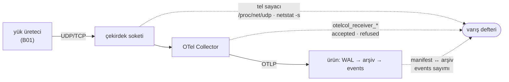
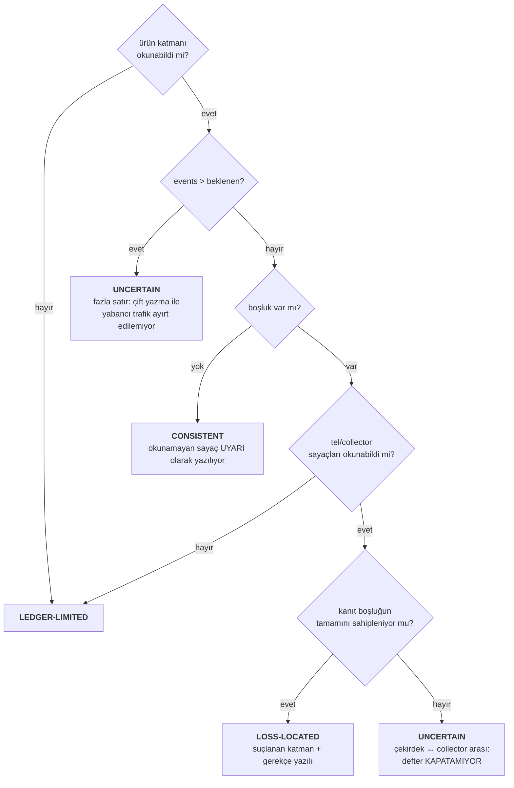

# B02 — Üç katmanlı varış defteri

> **Kapsam:** [kapasite ölçümü §3](../index.md) — dış aracın pasif
> `AF_PACKET` gözlemcisi yerine üç sayaç. Bitti ölçütü orada yazılı: *"üç sayı
> tek raporda; **ayrıştıklarında** hangi katmanın suçlandığı yazılı; ve
> sayaçlardan biri güvenilmezse rapor **`LEDGER-LIMITED`** diyor, kayıp
> demiyor."*

**Neden `kind: spec`, `ticket` değil.** `EpicStatusTests` her `ticket`
belgesinin bir yol haritası tablosunda görünmesini istiyor, ve o kapının kimlik
deseni `[TSM]\d+` — yani **`B` ile başlayan bir kimlik hiçbir tabloda
bulunamıyor**, üstelik B serisinin tablosu (`kapasite-olcumu/index.md` §5)
`tickets*` dizini altında da değil. İki bağımsız sebep, ikisi de yapısal. Bir
`ticket` yazmak bekçiyi kırmızıya çevirir, kimliği `KnownDivergence`'a yazmak
ise *"bir gün düzelecek"* listesine bu turda ölçülmemiş bir şey eklemek olurdu.
Kayıt olarak `spec` doğru kap; kapının B serisini görmemesi ayrı bir bulgu
(§8).

---

## 1 · Neyi çözüyor

Bugün *"hiçbir satır kaybolmuyor"* iddiasının **tamamı** ürünün kendi
sayaçlarına dayanıyor: WAL, `raw_manifest`, `parse_status`, `bound_ratio`.
Ürünün dışından sayan bir şey yok, ve sonuç bir körlük:

Üç ayrı arıza defter olmadan **aynı** görünüyor: çekirdek düşürdü, collector
düşürdü, boru hattı düşürdü. Defterin tek işi bunları ayırmak — bir EPS sayısı
üretmek değil (o B01/B03).

## 2 · Üç sayaç aynı şeyi saymıyor

Bu, koordinatörün özellikle istediği madde ve **T63'te ölçülen uyarının** bu
ticket'taki karşılığı: *yanlış sayacı okumak yanlış hüküm veriyor.*

| Katman | Okunan | Eksen — **ne ölçüyor** | Yönü |
| --- | --- | --- | --- |
| **Tel** | `/proc/net/udp` `drops` · `netstat -s` receive errors | Çekirdeğin **düşürdüğü** paket | **Negatif kanıt**: sıfır olması *"vardı"* demiyor, *"çekirdek düşürdüğünü bilmiyor"* diyor |
| **Collector** | `otelcol_receiver_accepted_log_records` | Boru hattına **itilen** kayıt | Pozitif |
| **Collector** | `otelcol_receiver_refused_log_records` | Collector'ın **görüp bilerek almadığı** kayıt | Pozitif, ve **ayrı**: reddetmek düşürmekten farklı bir arıza |
| **Ürün** | manifest ↔ ham arşiv **eşleşmesi** | **Dayanıklı** yazılan satır | Pozitif |
| **Ürün** | `events` sayımı | **Aranabilir** olan satır | Pozitif |

**Ürün katmanının iki okuması var ve birleştirilmedi.** Ham arşivde duran ama
`events`'e girmemiş bir satır gerçek bir arıza sınıfı; tek sayıya indirilse
görünmez olurdu. Defter bu hâli adıyla raporluyor: *"satır DAYANIKLI yazıldı
ama ARANAMIYOR."*

**`ProcessedRecords` ile `AcceptedRecords` bu deftere hiç girmedi** ve gerekçesi
yazılı: ikisi de **ürünün içinden** konuşuyor (biri parse + ClickHouse, diğeri
WAL) ve defterin var olma sebebi ürünün dışından saymak. İçeriden bir sayaç
eklemek, üçüncü katmanı iki kez saymak olurdu — ve hangi eksende olduğu
karışırsa hüküm yanlış katmanı suçlar.

## 3 · Hüküm — dört hâl

**`UNCERTAIN` ayrı bir sınıf olmak zorunda** (kapasite belgesi §4'ün
`uncertain` maddesi): *eşleşti* ile *kayıp* arasında üçüncü bir hâl var ve onu
kayba saymak sayıyı bozar, tutarlıya saymak arızayı gizler. İki ayrı yerden
doğuyor — hiçbir katmanın sahiplenmediği kayıp, ve beklenenden **fazla** satır.

**`CONSISTENT` hükmü okunamayan bir sayaçla da verilebiliyor** ve bu bir yargı
çağrısı: yerleştirilecek kayıp yoksa *"ölçemedim"* demek koşumu boşa
çıkarırdı. Ama sayaç raporda **uyarı** olarak duruyor, yoksa bir sonraki koşum
aynı körlükle koşar ve kimse bilmez. İddianın dayanağı ürün okumasının bir
**sayım değil eşleşme** olması: düz bir sayım *"biri kayıp, biri iki kez"*
hâlini sessizce geçirirdi.

## 4 · `LEDGER-LIMITED` — bu ticket'ın asıl kalemi

Dış aracın `OBSERVER-LIMITED`'ının karşılığı: **sayaçlardan biri güvenilmezse
rapor kayıp demiyor, ölçemedim diyor.**

Emsali ölçülmüş bir olay, tahmin değil — `tools/README.md`:
`machine-resources.sh` Linux'ta bellek için **`100`**, disk için **`0`**
basıyordu. İkisi sessiz, **ikisinin yönü zıt**, ve ikisi de bir ölçüm değil. Bu
yüzden `LedgerReading.Value` nullable ve `Limited` fabrikası **gerekçeyi zorunlu
tutuyor**: gerekçesiz bir kısıt, kısıtın kendisinden kötü — rapor *"ölçemedim"*
der, okuyan **neyi** düzelteceğini bilemez.

| Hâl | Cevap | Neden sıfır DEĞİL |
| --- | --- | --- |
| Platform okuyucusu yok (macOS) | `Limited` | Sıfır *"tel temiz"* diye okunurdu |
| `/proc/net/udp`'de port satırı yok | `Limited` | Collector container'da koşuyorsa host'un tablosunda o soket **hiç yok**; sıfır *"düşürme olmadı"* iddiası olurdu |
| `drops` **negatif** | `Limited` | Sayaç işaretli ve taşabiliyor; kırpmak *"düşürme yok"* demek, gerçek muhtemelen tersi |
| `netstat` etiketi bulunamadı | `Limited` | Çıktı **yerelleştirilmiş**; Türkçe Windows'ta sıfır *"tel temiz"* olurdu — `tr-TR` tuzağının ağ katmanındaki hâli |
| Metrik sergilemede yok | `Limited` | Sayacın **hiç doğmaması** ile sıfır olması ayırt edilemiyor |
| Sayaç geri gitti | `Limited` | Collector koşum ortasında yeniden başlamış: **ölçüm arızası**, ürünün kaybı değil |
| `events` sorgusu düştü | `Limited` | Sıfıra çevirmek hükmü *"ürün her şeyi kaybetti"* yapardı |

## 5 · Ölçümün kendi kusurları — ikisi kodu değiştirdi

**Tel sayacı boşluğu açıklamadığı hâlde suçlanıyordu.** İlk hâl `drops > 0`
görünce kaybı tele yazıyordu. Oysa collector beklenen kadar kayıt görmüşse o
satırlar tele **varmış** demektir; sayaçtaki düşürmeler aynı sokete gelen başka
trafiğe ait olabilir. Yerleştirme artık *collector'ın hiç görmediği* satır
sayısıyla sınırlı, ve açıklanamayan düşürme rapora **not** olarak yazılıyor.
**Yanlış katmanı suçlamak hiç suçlamamaktan kötü:** arama yanlış yerde başlar ve
gerçek arıza (burada: dayanıklı yazılmış ama aranamayan satır) gözden kaçar.

**Sınıflandırıcının eşiği değil ama okuyucunun ad sınırı bir kusur taşıyordu.**
Metrik adı önek olarak eşleştiriliyordu; `..._log_records` deseni başka bir
sayacı (`..._log_records_bytes`) da yakalar ve sayı **sessizce şişer**. Ad sınırı
eklendi.

## 6 · Collector'ın metrik ucu yoktu — ölçüldü

Kapasite belgesi *"collector metrikleri **zaten** Prometheus'ta · bedava
geliyor"* diyordu. **Yarısı doğruydu.** İki bağımsız eksiklik vardı ve ikisi de
sessiz:

| # | Eksiklik | Neden sessiz |
| --- | --- | --- |
| 1 | Varsayılan uç **`127.0.0.1:8888`** | Container'ın **kendi** loopback'i: port yayınlansa bile host ulaşamıyor |
| 2 | `docker-compose.yml` 8888'i **hiç yayınlamıyordu** | Uç doğru bağlansa bile dışarıdan görünmez |

Aynı sınıf hata bu depoda bir kez ödendi: Keycloak'ın `jwks_uri`'si container
içinden `localhost:8180` diyordu ve *"API kimliği tanımıyor"* gibi görünen şey
bir **ağ topolojisi** arızasıydı (`README.md`).

### `deploy/otel/collector.yaml`'a neden dokunuldu

Koordinatörün özellikle sorduğu madde. O dosyada her satırın bir gerekçesi var
(`encoding: iso-8859-1` ham sadakatin şartı, `nop` denendi ve **çalışmadığı
ölçüldü**) ve bu değişiklik **hiçbirine dokunmuyor**: alıcılar, işlemciler,
ihracatçılar ve kodlama olduğu gibi. Eklenen tek şey `service.telemetry.metrics`
— yani collector'ın **kendi** telemetrisi, veri yolunun dışında.

Üç ayrıntı yazılı olmak zorunda:

- **`readers:` biçimi ZORUNLU.** Eski `metrics: address: 0.0.0.0:8888` ayarı
  collector **v0.123.0'dan beri sessizce yok sayılıyor** ve bu imaj `0.159.0`.
  O satırı yazmak *"yapılandırdım"* sanmak ve **hiçbir şey değiştirmemek**
  olurdu — §7'nin sınıfı, ve bir sonraki kişi doğal olarak onu deneyecek. Bir
  test eski biçimin **kullanılmadığını** da tutuyor.
- **`without_type_suffix` / `without_units` elle `true`.** Uç elle
  yapılandırıldığında bu iki bayrak varsayılan olarak **gelmiyor** ve sayaç
  `otelcol_receiver_accepted_log_records_total` adıyla yayılıyor. Yalnızca kısa
  adı arayan bir okuyucu o kurulumda **hiçbir seri bulmaz** ve
  `LEDGER-LIMITED` der: uç ayakta, metrik orada, defter kör. Teşhisi zor bir
  hâl, o yüzden **iki savunma**: yapılandırma adı sabitliyor, okuyucu iki adı da
  kabul ediyor.
- **`0.0.0.0` ve kapsamı.** Bu dosya **geliştirme** yığınının yapılandırması
  (`deploy/`), üretim değil. Üretimde uç ya kapalı olmalı ya da yalnızca
  kazıyıcının gördüğü bir ağda — ve bu cümle dosyanın içinde de duruyor.

**İki değişiklik birlikte anlamlı, biri eksikse sessizce çalışmıyor** — o yüzden
ikisi **tek bekçide**. Gerekçe: bu depoda yapılandırma dosyaları birleştirmenin
kurbanı oldu ve kırığı yalnızca yığını gerçekten kaldıran gördü (§5 — iki ajan
compose'a ayrı ayrı `redis` ekledi, YAML ayrıştırılamaz hâle geldi, derleme ve
testler yeşil kaldı). `docker compose config --quiet` **söz dizimini**
doğruluyor, bu **bağı** doğrulamıyor.

## 7 · Nerede duruyor

| Parça | Yer |
| --- | --- |
| Okuma + `LEDGER-LIMITED` tipi | `sim/Bizigo.Capacity/LedgerReading.cs` |
| Defter ve hüküm | `sim/Bizigo.Capacity/ArrivalLedger.cs` |
| Tel katmanı (iki platform ayrıştırıcısı) | `sim/Bizigo.Capacity/WireDropReader.cs` |
| Collector katmanı (sergileme ayrıştırıcısı + fark) | `sim/Bizigo.Capacity/CollectorMetricsReader.cs` |
| Birim ölçümleri (konteynersiz) | `tests/Bizigo.UnitTests/ArrivalLedgerTests.cs` — 27 test |
| Gerçek yığın koşumu | `tests/Bizigo.IntegrationTests/ArrivalLedgerIntegrationTests.cs` — **yazıldı, koşturulmadı** |
| Kırmızı ölçümü | `tools/b02-kirmizi-olcumu.py` — 10 kusur |

**Yerleşim: `sim/`, ve hiçbir proje referansı yok.** İkisi de karar:

- `sim/` altında, çünkü ürün değil — `Bizigo.Simulators` ile aynı gerekçe. Ayrı
  derleme, çünkü simülatör bir **sadakat** basıcısı (baytlar doğru mu), defter
  bir **muhasebe** aracı (satır kayboldu mu, nerede).
- **Referanssız**, çünkü üçüncü katmanı burada üretmek `Bizigo.Storage.Raw` ve
  `Bizigo.Storage.ClickHouse`'u buraya çekerdi ve defter **konteynersiz
  sınanamaz** hâle gelirdi. Yerine bir **sonda** sözleşmesi var: ürün tarafını
  çağıran bağlıyor, defter yalnızca sayıyı ve *"ölçemedim"* hâlini biliyor.
  Bedeli açık ve entegrasyon testi onu ödüyor: sondanın gerçek okuyucularla
  bağlanabildiği **birim testlerinde görünmüyor**.

## 8 · Yapılmayanlar ve bilinen sınırlar

**Kutunun dışına çıkamıyor.** Defter *bizim ürettiğimiz yükün* nerede
kaybolduğunu söylüyor; `events`'te 999.000 görmek müşterinin 1.000.000
gönderdiğini kanıtlamıyor. Kapasite belgesi §4 bu asimetriyi zaten yazıyor.

**Çekirdek ile collector arasını kapatamıyor.** OS sayaçları daraltıyor, paket
yakalama kapatırdı — ve o karar bilinçli (Linux'a çivilenmemek). Defter bu hâli
`UNCERTAIN` diye **adıyla** raporluyor, sessizce ürüne yıkmıyor.

**Beklenen sayıyı defter üretmiyor.** B01'in manifestinden geliyor ve bunun bir
**iddia** olduğu yazılı: üreteç istediği hıza ulaşamadıysa suçlu hedef değil
(`GENERATOR-LIMITED`, B01). Defter o hükmü vermiyor.

**macOS okuyucusu bilerek yazılmadı.** Hedef Linux + Windows; macOS okuyucusu
yazmak çıktı biçimini **ölçmeden** tahmin etmek olurdu — yani
`machine-resources.sh`'in yaptığı şey. Bedeli: geliştirme makinesinde tel
katmanı hep `LEDGER-LIMITED`. Kazancı: kısıt yolu bu depoda **gerçekten koşan**
tek yol ve koştuğu ölçülüyor.

**Linux ve Windows ayrıştırıcıları gerçek makinede koşmadı.** Biçimler
doğrulandı — `/proc/net/udp` çekirdeğin kendi `udp4_seq_show` başlığından,
`netstat -s` bölüm etiketinden — ve fixture'lar o biçimlerden yazıldı. Ama
*"canlı bir Linux'ta okundu"* diyemiyoruz; ayrıştırıcı doğru, **girdinin gerçek
olduğu ölçülmedi**.

**`EpicStatusTests` B serisini göremiyor.** Kimlik deseni `[TSM]\d+` ve B
tablosu `tickets*` altında değil. Bu belgenin `spec` olması o boşluğu
kapatmıyor, **görünür** kılıyor. Kapının genişletilmesi ya da B serisine bir
`tickets-*` evi verilmesi koordinatörün kararı — ve bugün ölçülmemiş.

## 9 · Kırmızı yanabildiği ölçüldü — 10 kusur

`tools/b02-kirmizi-olcumu.py`. Kusurların **ortak şekli** kayda değer: onunun
altısı *"ölçemedim yerine sıfır dön"* biçiminde, çünkü defterin tamamı o tek
hataya karşı kurulu.

| # | Kusur | Beklenen kırmızı | Sonuç |
| --- | --- | --- | --- |
| 1 | Tanınmayan platformda uydurma sıfır dönüyor | Platform kısıtı + beyan/davranış örtüşmesi | **2/2 kırmızı** |
| 2 | Negatif `drops` sıfıra kırpılıyor | Negatif sayaç kısıtı | **kırmızı** |
| 3 | Port bulunamazsa sıfır dönüyor | Ağ ad alanı kısıtı | **kırmızı** |
| 4 | `netstat` etiketi bulunamazsa sıfır dönüyor | Yerelleştirme kısıtı | **kırmızı** |
| 5 | Metrik sergilemede yoksa sıfır dönüyor | Metrik yokluğu kısıtı | **kırmızı** |
| 6 | Sayaç sıfırlanması sıfıra kırpılıyor | Fark kısıtı | **kırmızı** |
| 7 | `_total` ekli ad artık tanınmıyor | Ad kabulü | **kırmızı** |
| 8 | Düşürme sayacı **koşulsuz** suçlanıyor | Yanlış katman suçlaması | **kırmızı** |
| 9 | Okunamayan sayaçla boşluk yine de yerleştiriliyor | `LEDGER-LIMITED` + platform kısıtı | **2/2 kırmızı**, ve *"boşluk yokken uyarı"* testi **yeşil kaldı** |
| 10 | Compose 8888'i yayınlamayı bırakıyor | Yapılandırma bağı | **kırmızı** |

**12 beklenen kırmızının 12'si yandı**, ve 9'daki *"yeşil kalmalı"* iddiası
tuttu — boşluk **varken** ve **yokken** hükmün ayrı olduğunun kanıtı. Geri
alındıktan sonra tam paket: **1654 geçti / 0 düştü**.

### Ölçüm aracının kendisi iki kez yalancı çıktı — ve ikisi de kaydedildi

**Üç kusur ilk turda TEST kırmızısı değil DERLEME hatası üretti**, yani o üç
kusur **hiç ölçülmemişti**. Sebep enjeksiyonun kendisiydi, kusurun değil:

| Enjeksiyon | Derleyicinin dediği | Neden |
| --- | --- | --- |
| Mevcut `return`in önüne ikinci bir `return` | CS0162 | Ulaşılamayan kod — uyarı-hata |
| `return true ? … : …` | CS0162 | Sabit koşul, `else` dalı ulaşılamaz |
| `return total >= 0 ? … : …` | **CS0219** | `found` atanıp hiç okunmuyor |

Üçüncüsü ilk düzeltmenin **kendisiydi** ve aynı sınıfa düştü: ölçtüğüm şeyin
ölçmek istediğim şey olduğunu varsaydım. Düzeltilmiş hâli `found || total >= 0`
— `found`u canlı tutuyor, sabit olmadığı için CS0162 üretmiyor, ve kusurun
anlamı aynı kalıyor. **Hata sınıfı `CLAUDE.md` §6'nın adını koyduğu şey:**
*"derleme kırıldı"* ile *"kusur etkisiz"* aynı özet satırına inebiliyor, ve
araç bunu ayırt edilebilir bastığı için yakalandı.

**Bir koşum SIGTERM ile kesildi ve ağaçta kusur bıraktı.** Geri alma `finally`
içinde ama `finally` öldürülen bir süreçte koşmuyor. Kusur yedekten elle geri
alındı ve üç dosya doğrulandı. Main'in `CLAUDE.md`'si bu turda tam bu hâli
yazmış (*"öldürülmüş bir ölçüm geri alınmış bir ölçüm değildir"*), yani ders
depoda zaten kayıtlı; buradaki kayıt onun **ikinci** örneği.

**Süzgeç bu yüzden var:** araç artık kusur adıyla çağrılabiliyor
(`python3 tools/b02-kirmizi-olcumu.py netstat`), böylece bir enjeksiyon
düzeltildiğinde bütün tur yeniden koşmuyor. Son adım (tam paket) süzgeçten
**etkilenmiyor** — geri almanın derlemeye ulaştığını gösteren tek şey o koşum.

## 10 · Ölçülen sayılar

| Ölçüm | Sonuç |
| --- | --- |
| `dotnet build` | 0 hata, 0 uyarı |
| `dotnet test tests/Bizigo.UnitTests` (main birleştirildikten sonra) | **1654 geçti / 0 düştü / 4 atlandı** |
| `ArrivalLedgerTests` | 27/27 |
| `EpicStatusTests` · `WikiSourceDigestTests` · `CiCoverageTests` · `ProductDiscoveryTests` · `ArchitectureTests` | 32/32 |
| Kırmızı ölçümü | 10 kusur · **12/12 beklenen kırmızı** · 1 *"yeşil kalmalı"* tuttu |
| Konteyner isteyen koşum | **koşturulmadı** (§2) |

