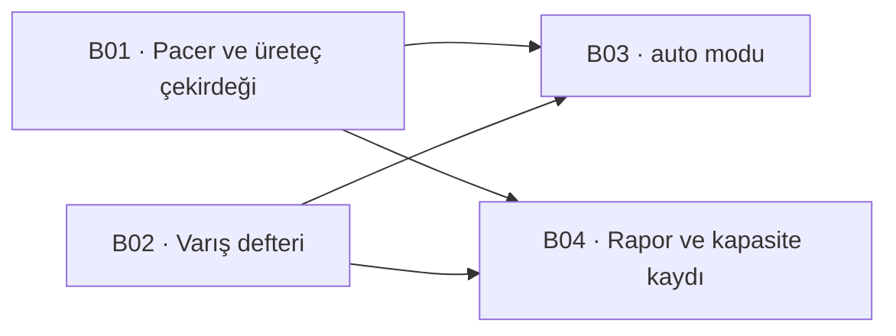

# Kapasite ölçümü

Bu belge iki şeyi ayırıyor: **ne ölçmediğimizi** ve **neyi kendimiz yazacağımızı**.

Tetikleyen soru bir dış araçtı — [`cumakurt/syslog-bench`](https://github.com/cumakurt/syslog-bench),
Go, GPL-3.0, iki ikili: EPS kontrollü bir üreteç ve alıcı tarafta **pasif**
(AF_PACKET) bir gözlemci. Karar **kendimiz yazmak** oldu ve gerekçesi lisans
değil **taşınabilirlik**: probe'un tamamı Linux çekirdek yüzeyine bağlı
(`AF_PACKET`, `CAP_NET_RAW`, `/proc`), oysa kurulum hedefimiz Linux **ve**
Windows.

> **Lisans notu.** Kendi kodumuzu yazmak korunan şeye dokunmuyor: telif kodu
> korur, davranışı ve tasarımı değil. Yani aracın **belgelenmiş davranışını**
> bir şartname gibi okumak temiz; Go kaynağından satır taşımak değil. Yazarın
> sözlü izni yazılı bir nota çevrilmeli — bedava bir sigorta.

## 1 · Bugün ölçülmeyen şey

**Kapasite sayımız yok.** `HotPathCostMeasurement` satır başına CPU maliyetini
ölçüyor; uçtan uca EPS tavanını ölçen hiçbir şey yok. Kalan-iş raporu
benchmark'ları *"ölçülmedi"* diye işaretliyor ve bu o kalemin adı.

Ve daha pahalı olan ikinci boşluk: **"hiçbir satır kaybolmuyor" iddiasının
tamamı kendi sayaçlarımıza dayanıyor.** WAL, `raw_manifest`, `parse_status`,
`bound_ratio` — hepsi ürünün içinden konuşuyor. Ürünün dışından sayan bir şey
yok, dolayısıyla üç ayrı arıza bugün **aynı** görünüyor: çekirdek düşürdü,
collector düşürdü, boru hattı düşürdü.

## 2 · "Bizim de üretecimiz var" — ölçüldü, yarısı doğru

`SyslogEmitter` (S02) gerçek bir üreteç **değil**, bir *sadakat* basıcısı:
kodlamayı bozuyor, damgayı kaydırıyor, senaryo uyguluyor. Ölçtüğü şey ürünün
**baytları** doğru ele alıp almadığı.

Hız modeli satır başına `Task.Delay` ve iki kusuru var. İkisi de ölçüldü
(`RatePerMinute` → `TimeSpan.FromMinutes(1.0/rate)`, 200 satır, macOS/arm64):

| Hedef | İstenen gecikme | Ölçülen |
| --- | --- | --- |
| 10 EPS | 100 ms | 10 EPS |
| 100 EPS | 10 ms | **91 EPS** |
| 1.000 EPS | 1 ms | **824 EPS** |
| 10.000 EPS | 0,1 ms | **pacing YOK** |

**Birinci kusur sapma:** gecikme, satırın kendi işini saymıyor — hedef
yükseldikçe %9–18 geride kalıyor.

**İkinci kusur daha kötü ve bu deponun adını koyduğu sınıf:** gecikme
`Task.Delay`'in çözünürlüğünün altına indiğinde çağrı **hemen** dönüyor, yani
`RatePerMinute` sessizce **anlamsızlaşıyor**. Hata yok, sayaç yok, uyarı yok —
knob çalışmayı bırakıyor ve döngü soket hızında basıyor. Yani bugün 10.000 EPS
*istemek* mümkün, **elde etmek** değil, ve ikisi ayırt edilemiyor.

Sonuç: üreteç tarafında yeniden kullanacağımız şey **satırın şekli**
(`SyslogEmitter.WireLine` — damga kaydırma, kodlama), atacağımız şey **hız
modeli**.

## 3 · Dış aracın probe'u yerine: varış defteri

Aracın en değerli parçası pasif gözlemci, çünkü **ürünün dışından** sayıyor.
Ama onu birebir yazmak Linux'a çivilenmek demek.

Aynı soruyu üç sayaçla, **ham soket olmadan** cevaplıyoruz:

| Katman | Sayan | Nerede çalışır |
| --- | --- | --- |
| **Tel** | OS soket sayaçları — Linux `/proc/net/udp` `drops` + `nstat`, Windows `netstat -s` UDP receive errors | Linux · Windows |
| **Collector** | OTel Collector'ın **kendi** metrikleri: `otelcol_receiver_accepted_log_records`, `..._refused_...` | her yer |
| **Ürün** | Üretecin sha256 manifesti ↔ ham arşiv, ve `events` sayımı (koşum penceresi + `owner_group`) | her yer |

Bu üç sayı **kaybı bir katmana yerleştiriyor**, ki bugün yapamadığımız tam olarak
bu. Ve içerik korelasyonu için pakete bakmak gerekmiyor: **ham arşiv baytları
zaten saklıyor** (`RawRecordCodec`), yani manifest doğrudan arşive karşı
doğrulanabiliyor. Dış aracın telde yaptığı korelasyonun bizdeki karşılığı daha
güçlü — varışı değil **dayanıklılığı** kanıtlıyor.

### Bunun tutamadıkları — yazılı olmayan hâli kapı varmış gibi okunur

- **Çekirdek ile collector arasındaki kaybı ayıramıyor.** OS sayaçları daraltıyor,
  paket yakalama kapatırdı. Kapatmak istenirse `SharpPcap` ile v2 mümkün ve
  bedeli açık: libpcap/npcap kurulumu ve ayrıcalık.
- **Vendor-nötr değil.** Dış araç herhangi bir SIEM'i ölçüyor; bu düzenek
  Bizigo'nun ham arşivini ve `events` tablosunu biliyor. Bu bir eksiklik değil
  bir **kapsam kararı**: benchmark aracı satmıyoruz.
- **TLS yok, ve bu bir bulgu.** Collector'da TLS syslog dinleyicisi bugün **hiç
  yok** (`5140/tcp`, `5141/udp`, `4318/OTLP`). Yani TLS altında kapasite
  ölçülemez çünkü TLS altında **ingest yok**.
- **Cihaz kimliği tek makinede çökiyor.** `SyslogEmitter`'ın kendi belgesinde
  yazılı: ürün kaynağı `net.peer.ip`'den çözüyor ve syslog alıcısı öznitelikleri
  **alıcı başına** veriyor. Yani tek makineden basan yük üreteci ürüne **tek
  kaynak** görünür. Kapasite için sorun değil (throughput ölçüyoruz), **kapsam
  yayılımı** için ölçüm yapılamaz — ikisini karıştıran bir rapor yanlış sayı
  üretir.

## 4 · Dilimleme

| Ticket | Ne | Bitti ölçütü |
| --- | --- | --- |
| **B01** | Gerçek hız kontrolü: token kovası, toplu yazma, çok bağlantı; `fixed`/`ramp`/`burst`/`soak`/`max`; koşum başına sha256 manifest | İstenen EPS ile **ölçülen** EPS arasındaki sapma yazılı bir tavanın altında, ve pacing'in *sessizce kaybolduğu* hâl bir bekçiyle kırmızı |
| **B02** | Üç katmanlı varış defteri, Linux + Windows | Üç sayı tek raporda, ve **ayrıştıklarında** hangi katmanın suçlandığı yazılı |
| **B03** | `auto`: sürdürülebilir EPS arayışı, geri besleme B02'den | Bulunan sayı **tekrarlanabilir**: aynı fixture'la iki koşum aynı aralığı veriyor |
| **B04** | Sayının kaydı ve bekçisi | Koşumu olmayan bir kapasite iddiası **kırmızı yanıyor** (T39'un kalıbı) |

## 5 · Açık sorular — cevaplanmadı, burada duruyor

**Hedef ortam hangisi?** Kapasite sayısı makineye bağlı ve bu depo *"ölçülmemiş
sayı yazma"* diyor. Tek bir sayı yazacaksak hangi donanım? Yoksa sayı bir
**yordam** olarak mı kayıtlanacak (*"şu komutu şu makinede koştur"*)?

**`auto`'nun sürdürülebilirlik ölçütü ne?** Kayıp sıfır mı, kayıp < %x mi, yoksa
kuyruk gecikmesi mi? Üçü farklı sayı verir ve seçim bir ürün kararı.

**Yük üreteci nereden koşacak?** Aynı makineden koşan bir üreteç ölçtüğü sistemin
CPU'sunu yiyor. Ayrı container yeterli mi, ayrı makine mi gerekiyor — ve fark
ölçülmeden bilinmiyor.
