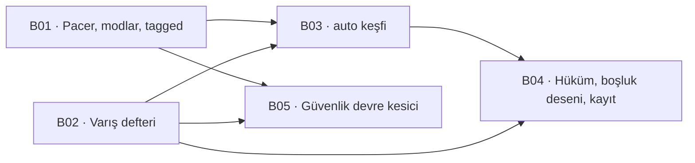

# Kapasite ölçümü

Bu belge iki şeyi ayırıyor: **ne ölçmediğimizi** ve **neyi kendimiz yazacağımızı**.

Tetikleyen soru bir dış araçtı — [`cumakurt/syslog-bench`](https://github.com/cumakurt/syslog-bench),
Go, GPL-3.0, iki ikili: EPS kontrollü bir üreteç ve alıcı tarafta **pasif**
(AF_PACKET) bir gözlemci. Karar **kendimiz yazmak** oldu ve gerekçesi lisans
değil **taşınabilirlik**: probe'un tamamı Linux çekirdek yüzeyine bağlı
(`AF_PACKET`, `CAP_NET_RAW`, `/proc`), oysa kurulum hedefimiz Linux **ve**
Windows.

> **Lisans notu.** Kendi kodumuzu yazmak korunan şeye dokunmuyor: telif kodu
> korur, davranışı ve tasarımı değil. Yani aracın **belgelenmiş davranışını**
> bir şartname gibi okumak temiz; Go kaynağından satır taşımak değil. Yazarın
> sözlü izni yazılı bir nota çevrilmeli — bedava bir sigorta.

## 1 · Bugün ölçülmeyen şey

**Kapasite sayımız yok.** `HotPathCostMeasurement` satır başına CPU maliyetini
ölçüyor; uçtan uca EPS tavanını ölçen hiçbir şey yok. Kalan-iş raporu
benchmark'ları *"ölçülmedi"* diye işaretliyor ve bu o kalemin adı.

Ve daha pahalı olan ikinci boşluk: **"hiçbir satır kaybolmuyor" iddiasının
tamamı kendi sayaçlarımıza dayanıyor.** WAL, `raw_manifest`, `parse_status`,
`bound_ratio` — hepsi ürünün içinden konuşuyor. Ürünün dışından sayan bir şey
yok, dolayısıyla üç ayrı arıza bugün **aynı** görünüyor: çekirdek düşürdü,
collector düşürdü, boru hattı düşürdü.

## 2 · "Bizim de üretecimiz var" — ölçüldü, yarısı doğru

`SyslogEmitter` (S02) gerçek bir üreteç **değil**, bir *sadakat* basıcısı:
kodlamayı bozuyor, damgayı kaydırıyor, senaryo uyguluyor. Ölçtüğü şey ürünün
**baytları** doğru ele alıp almadığı.

Hız modeli satır başına `Task.Delay` ve iki kusuru var. İkisi de ölçüldü
(`RatePerMinute` → `TimeSpan.FromMinutes(1.0/rate)`, 200 satır, macOS/arm64):

| Hedef | İstenen gecikme | Ölçülen |
| --- | --- | --- |
| 10 EPS | 100 ms | 10 EPS |
| 100 EPS | 10 ms | **91 EPS** |
| 1.000 EPS | 1 ms | **824 EPS** |
| 10.000 EPS | 0,1 ms | **pacing YOK** |

**Birinci kusur sapma:** gecikme, satırın kendi işini saymıyor — hedef
yükseldikçe %9–18 geride kalıyor.

**İkinci kusur daha kötü ve bu deponun adını koyduğu sınıf:** gecikme
`Task.Delay`'in çözünürlüğünün altına indiğinde çağrı **hemen** dönüyor, yani
`RatePerMinute` sessizce **anlamsızlaşıyor**. Hata yok, sayaç yok, uyarı yok —
knob çalışmayı bırakıyor ve döngü soket hızında basıyor. Yani bugün 10.000 EPS
*istemek* mümkün, **elde etmek** değil, ve ikisi ayırt edilemiyor.

Sonuç: üreteç tarafında yeniden kullanacağımız şey **satırın şekli**
(`SyslogEmitter.WireLine` — damga kaydırma, kodlama), atacağımız şey **hız
modeli**.

## 3 · Dış aracın probe'u yerine: varış defteri

Aracın en değerli parçası pasif gözlemci, çünkü **ürünün dışından** sayıyor.
Ama onu birebir yazmak Linux'a çivilenmek demek.

Aynı soruyu üç sayaçla, **ham soket olmadan** cevaplıyoruz:

| Katman | Sayan | Nerede çalışır |
| --- | --- | --- |
| **Tel** | OS soket sayaçları — Linux `/proc/net/udp` `drops` + `nstat`, Windows `netstat -s` UDP receive errors | Linux · Windows |
| **Collector** | OTel Collector'ın **kendi** metrikleri: `otelcol_receiver_accepted_log_records`, `..._refused_...` | her yer |
| **Ürün** | Üretecin sha256 manifesti ↔ ham arşiv, ve `events` sayımı (koşum penceresi + `owner_group`) | her yer |

Bu üç sayı **kaybı bir katmana yerleştiriyor**, ki bugün yapamadığımız tam olarak
bu. Ve içerik korelasyonu için pakete bakmak gerekmiyor: **ham arşiv baytları
zaten saklıyor** (`RawRecordCodec`), yani manifest doğrudan arşive karşı
doğrulanabiliyor. Dış aracın telde yaptığı korelasyonun bizdeki karşılığı daha
güçlü — varışı değil **dayanıklılığı** kanıtlıyor.

### Bunun tutamadıkları — yazılı olmayan hâli kapı varmış gibi okunur

- **Çekirdek ile collector arasındaki kaybı ayıramıyor.** OS sayaçları daraltıyor,
  paket yakalama kapatırdı. Kapatmak istenirse `SharpPcap` ile v2 mümkün ve
  bedeli açık: libpcap/npcap kurulumu ve ayrıcalık.
- **Vendor-nötr değil.** Dış araç herhangi bir SIEM'i ölçüyor; bu düzenek
  Bizigo'nun ham arşivini ve `events` tablosunu biliyor. Bu bir eksiklik değil
  bir **kapsam kararı**: benchmark aracı satmıyoruz.
- **TLS yok, ve bu bir bulgu.** Collector'da TLS syslog dinleyicisi bugün **hiç
  yok** (`5140/tcp`, `5141/udp`, `4318/OTLP`). Yani TLS altında kapasite
  ölçülemez çünkü TLS altında **ingest yok**.
- **Cihaz kimliği tek makinede çökiyor.** `SyslogEmitter`'ın kendi belgesinde
  yazılı: ürün kaynağı `net.peer.ip`'den çözüyor ve syslog alıcısı öznitelikleri
  **alıcı başına** veriyor. Yani tek makineden basan yük üreteci ürüne **tek
  kaynak** görünür. Kapasite için sorun değil (throughput ölçüyoruz), **kapsam
  yayılımı** için ölçüm yapılamaz — ikisini karıştıran bir rapor yanlış sayı
  üretir.

## 4 · Özellik yüzeyi — ne alıyoruz, ne almıyoruz

Aracın şartnamesi 47 bölüm ve alınacak asıl şey **özellik listesi değil hüküm
verme biçimi**: ölçümün kendi kusurunu ölçtüğünde suçu hedefe yıkmayı reddediyor.
Üç ayrı yerde bunu yapıyor ve üçü de bu deponun §6'sının aynısı.

| Onun özelliği | Bizde | Karar ve gerekçe |
| --- | --- | --- |
| `raw` replay — satır **değiştirilmeden** | var (`SyslogEmitter`) | **Al.** Damga kaydırma kalıyor: kaydırmazsak `events`'in 90 günlük TTL'i satırı *"yazıldı"* denildikten sonra sessizce siliyor — ölçüldü, 100 satır, tabloda sıfır |
| `tagged` — `RUN-ID`/`TEST-ID`/`SEQ`/`SEND-NS` | yok | **Al.** Gecikme ve boşluk deseni bunsuz **ölçülemez**; `raw` bilerek damga taşımıyor, yani ikisi ayrı koşum |
| `smart` (metadata'yı "akıllıca" ekle), `envelope` | yok | **Almıyoruz.** Parser'ı biz yazıyoruz; *"parser'ın kabul edeceği yere ekle"* bizde tahmin, orada zorunluluk |
| `--format rfc5424 / rfc3164` | yok, **bilinçli** | **Almıyoruz.** Collector `protocol: none` ile koşuyor ve başlık üretmek onu gövdenin parçası olarak arşive sokardı — gerçek cihazın bastığından farklı bir şey ölçerdik |
| `fixed` · `max` · `ramp` · `burst` · `soak` | yok | **Al.** Beşi beş ayrı soru: sabit yük, tavan, kademeli tırmanma, kısa ani yük, uzun süre kararlılık |
| `auto` — hızlı büyüt, sonra ikili arama; **her denemeye ayrı `RUN-ID`** | yok | **Al.** Ayrı `RUN-ID` şart: bir kademenin gecikmiş olayları diğerinin sayısını kirletiyor |
| **`GENERATOR-LIMITED`** — üreteç istenen hıza ulaşamadıysa **hedefi suçlamıyor** (`--min-generator-attainment 95`) | yok | **Al ve birinci sınıf yap.** Bizim ölçtüğümüz pacer kusurunun tam panzehiri: bugün 10.000 EPS *istemek* mümkün, elde etmek değil, ve ikisi ayırt edilemiyor |
| **`OBSERVER-LIMITED`** — ölçüm aracının kendi tampon kaybı varsa koşum *"hedef kaybetti"* diye raporlanmıyor | yok | **Al**, adı **`LEDGER-LIMITED`**: sayaçlarımızdan biri güvenilmezse (metrik kazıma boşluğu, sayaç sıfırlanması) rapor **kayıp** demiyor, **ölçemedim** diyor |
| SLO — `max-loss-pct`, p95/p99, `duplicates`, `failed`, **`uncertain`**, `timeouts` → `PASS`/`FAIL` | yok | **Al.** `uncertain`'ın ayrı bir sınıf olması kritik: *eşleşti* ile *kayıp* arasında üçüncü bir hâl var ve onu kayba saymak sayıyı bozar |
| Boşluk deseni: `head-loss` · `tail-loss` · `block-loss` · `scattered-isolated` · `periodic-suspected` · `complete-loss` | yok | **Al.** Bu depoda `tail-loss` bir kez **gerçekten oldu**: soketi son yazımdan hemen sonra kapatmak veriyi RST'le düşürüyordu, basıcı *"5 satır yazdım"* diyordu ve ClickHouse'a sıfır satır ulaşıyordu. Sınıflandırma o arızayı **adıyla** bulurdu |
| Güvenlik devre kesici — yeni NIC RX drop, softnet drop, UDP tampon hatası, sürekli CPU, sürekli `Recv-Q` görülünce **üreteci durdur** (`--safety-consecutive 3`) | yok | **Al.** Kendi yığınımıza karşı bile: ölçüm, ölçtüğü sistemi bozarsa ürettiği sayı kendi yan etkisini ölçüyor |
| Pasif `AF_PACKET` gözlemci + probe HTTP API'si | yok | **Almıyoruz.** Linux çekirdek yüzeyine çivili; yerine §3'ün üç sayacı |
| Aktif alıcı / forward modu (*"lab only"*) | — | **Almıyoruz.** Bizim lab'ımızda alıcı ürünün kendisi |
| Prometheus / Grafana | collector metrikleri **zaten** Prometheus'ta | **Bedava geliyor** |
| Çok hedefli karşılaştırma, canlı gösterge | yok | **Erteliyoruz.** Tek yığına karşı ölçüyoruz; ikinci hedef yok |

### Kanıt zincirinin iki ucu — ve asimetri

Aracın kendi §44'ü sınırını açıkça yazıyor ve bizim tam **aynası**:

| | Onun kanıtladığı | Bizim kanıtlayabildiğimiz |
| --- | --- | --- |
| Gönderildi | ✅ | ✅ |
| **Tele/makineye vardı** | ✅ (paket yakalama) | ⚠ yalnızca OS sayaçları kadar |
| Çekirdek/NIC sağlığı | ✅ | ✅ |
| Parser kabul etti | ❌ *"SIEM API'si gerekir"* | ✅ `parse_status` |
| Dayanıklı yazıldı | ❌ | ✅ ham arşiv + manifest |
| **Aranabilir oldu** | ❌ | ✅ `events` sayımı |

Onun cümlesi şuydu: *"1.000.000 arayüzde eşleşti"* demek *"1.000.000 olay aranabilir oldu"* **değildir**. Bizde tersi geçerli ve söylenmesi gerekiyor: **`events`'te 999.000 görmek, müşterinin 1.000.000 gönderdiğini kanıtlamıyor.** Ledger kaybı bir katmana yerleştiriyor ama kutunun **dışına** çıkamıyor. İki araç birlikte zinciri kapatır; tek başına hiçbiri kapatmıyor.

## 5 · Dilimleme

| Ticket | Ne | Bitti ölçütü |
| --- | --- | --- |
| **B01** | Gerçek hız kontrolü (token kovası, toplu yazma, çok bağlantı); `fixed`/`ramp`/`burst`/`soak`/`max`; `raw` + `tagged` replay; koşum başına sha256 manifest | İstenen ↔ **ölçülen** EPS sapması yazılı bir tavanın altında, ve **`GENERATOR-LIMITED`** hükmü bir bekçiyle kırmızı yanabiliyor: üretecin ulaşamadığı bir hız *hedefin kaybı* diye raporlanamıyor |
| **B02** | [Üç katmanlı varış defteri](b02-varis-defteri/index.md) — **yazıldı** (OS sayaçları · collector metrikleri · manifest ↔ ham arşiv ↔ `events`), Linux + Windows; `uncertain` ayrı bir sınıf | Üç sayı tek raporda; **ayrıştıklarında** hangi katmanın suçlandığı yazılı; ve sayaçlardan biri güvenilmezse rapor **`LEDGER-LIMITED`** diyor, *kayıp* demiyor |
| **B03** | `auto`: hızlı büyütme + ikili arama, **deneme başına ayrı `RUN-ID`** | Bulunan sayı **tekrarlanabilir**: aynı fixture'la iki koşum aynı aralığı veriyor. Gecikmiş olayların bir sonraki kademeyi kirletmediği ölçülüyor |
| **B04** | SLO hükmü (`PASS`/`FAIL`), boşluk deseni sınıflandırması, raporun kaydı | `tail-loss` **enjekte edilerek** ölçülüyor — soketi erken kapatmak bu depoda gerçekten olmuş bir arıza ve sınıflandırma onu adıyla bulmalı. Koşumu olmayan bir kapasite iddiası kırmızı yanıyor (T39'un kalıbı) |
| **B05** | Güvenlik devre kesici: yeni drop / sürekli CPU / sürekli `Recv-Q` görülünce üreteci durdur, `--safety-consecutive` ile | Kesicinin **gerçekten kestiği** ölçülüyor; ve kesilmiş bir koşum *"kapasite bulundu"* diye raporlanamıyor |

## 6 · Açık sorular — cevaplanmadı, burada duruyor

**Hedef ortam hangisi?** Kapasite sayısı makineye bağlı ve bu depo *"ölçülmemiş
sayı yazma"* diyor. Tek bir sayı yazacaksak hangi donanım? Yoksa sayı bir
**yordam** olarak mı kayıtlanacak (*"şu komutu şu makinede koştur"*)?

**`auto`'nun sürdürülebilirlik ölçütü ne?** Kayıp sıfır mı, kayıp < %x mi, yoksa
kuyruk gecikmesi mi? Üçü farklı sayı verir ve seçim bir ürün kararı.

**Yük üreteci nereden koşacak?** Aynı makineden koşan bir üreteç ölçtüğü sistemin
CPU'sunu yiyor. Ayrı container yeterli mi, ayrı makine mi gerekiyor — ve fark
ölçülmeden bilinmiyor.
