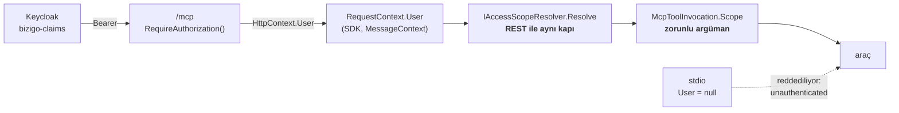

# MCP teknik planı

Ürüne **Model Context Protocol** desteği giriyor. İki ayrı yüzey, tek protokol
ve tek uyum kapısı:

| Yüzey | Kim kullanıyor | Ne yapıyor |
| --- | --- | --- |
| **`bizigo-sim`** | Geliştirici / ajan | Simülatörleri **çalışırken** yönetir: senaryo değiştir, filo bas, cihaz sustur |
| **`bizigo`** | Operatör / ajan / dış araç | Ürünün kendisi: log ara, alarm oku, RCA tetikle, kanıt paketi getir |

---

## 1 · Neden bu planın ilk cümlesi bir yasak

MCP bir **model** yüzeyi. Bu depoda modele giden her şey K6'nın ve T41/T42'nin
kapısından geçiyor, ve MCP o kapıyı **atlayabilecek** bir yol açıyor: bir
araç çağrısının dönüş değeri doğrudan modelin bağlamına giriyor.

> **MCP araçlarının log içeriği döndüren her çıktısı `RedactedPrompt`'tan
> geçmek zorunda.** Tip zaten bunu derleyiciye bağlıyor (T41: yapıcı
> `private`, yalnızca kapıdan çıkıyor); MCP katmanı `string` döndürüyorsa kapı
> **atlanmış** olur.

Ve K6 (T42) ikinci kapı: MCP istemcisi kurum dışındaysa hiçbir düzey geçmiyor.
MCP sunucusu kendi ağ sınırını **beyan etmek** zorunda, tıpkı model uçları
gibi — `Unspecified` reddediliyor.

Bu iki cümle planın geri kalanından önce yazıldı çünkü MCP'nin cazibesi tam
olarak burada: *"araç zaten veriyi getiriyor, modele de versin."*

---

## 2 · Protokol uyumu — neyin şart olduğu

Hedef **`2026-07-28`** revizyonuna tam uyum. Uyum bir iddia değil bir
**kapı** olmalı:

> **Düzeltme (2026-08-26, ölçüldü).** Bu bölüm önce *"MCP 2.0 spesifikasyonu"*
> diyordu. **Öyle bir revizyon adı yok.** Spesifikasyon yayınlarının tamamı
> tarih damgalı — `2024-11-05` · `2025-03-26` · `2025-06-18` · `2025-11-25` ·
> `2026-07-28` — ve *"2.0"* muhtemelen **C# SDK'sının** sürümüne
> (`ModelContextProtocol` 2.x) bakıyordu; o ayrı bir şey.
>
> Seçilen: **`2026-07-28`**, en yeni stable. Sürüm anlaşması eski istemciyi
> zaten aşağı indiriyor, yani geniş uyum kaybedilmiyor — yalnızca hedef
> yukarı konuyor. Çivi bir sabit **artı bir bekçi**: SDK'nın ilan ettiği
> sürüm yazdığımız sabitten ayrıştığı gün **kırmızı**. *"En güncel"* bir hedef
> değil bir kaymadır; yazılı revizyon hedeftir ve kayma **ölçülebilir** olur.
>
> Hatanın sınıfı kayda değer: bir plan belgesinde **var olmayan bir adı var
> gibi yazmak**, okuyanı doğrulanmamış bir hedefe bağlıyor. Bu deponun
> [*"zaten"* deseninin](../../wiki/concepts/sessiz-yanlis-davranis.md) üçüncü
> örneği — `AlertRaised` ve `rca_report`'tan sonra — ve üçüncüsü bir **plan**
> belgesinde çıktı.

| Alan | Şart |
| --- | --- |
| Taşıma | `stdio` **ve** akışlanabilir HTTP. İkisi aynı araç kümesini sunuyor |
| Yetenek anlaşması | `initialize` el sıkışması, sürüm anlaşması, istemcinin desteklemediği yeteneğin **kullanılmaması** |
| Araçlar | JSON Schema girdi **ve** çıktı şeması; `outputSchema` yazılıysa çıktı ona **uyuyor** |
| Kaynaklar | URI şeması, abonelik, değişiklik bildirimi |
| İstemler | Parametreli, sunucu tarafında sürümlü |
| Hata | Protokol hatası ile **araç hatası** ayrı — araç hatası `isError` ile döner, protokol istisnası değil |
| İptal | `notifications/cancelled` **gerçekten** iptal ediyor |

> **Günlükleme bu tablodan çıkarıldı (M01).** İlk hâli `notifications/message`'ı
> bir şart olarak yazıyordu. Çivilediğimiz revizyonda (`2026-07-28`) o yetenek
> **kullanımdan kaldırıldı** (SEP-2577); C# SDK'sı onu okuyan kodu `MCP9005` ile
> işaretliyor ve depodaki `TreatWarningsAsErrors` bunu bir derleme hatasına
> çeviriyor — yani şart, kendi kapısını kuramıyor.
>
> Gerekçe yalnızca teknik değil. §8'in kuralı yetenek düzeyinde de geçerli:
> *tüketicisi olmayan bir tip tahmindir.* Bugün `notifications/message`'ı
> okuyacak bir tüketicimiz yok, ve kullanımdan kalkmış bir yeteneği tüketicisiz
> biçimde **yepyeni** bir yüzeye sokmak yarının borcunu bugün yazmak olurdu.
> Kapı tarafı daha da kötü: spesifikasyonun kaldırdığı bir şeyi şart koşan bir
> uyum kapısı, uyumu ölçmüyor — **kendi geçmişini** ölçüyor.
>
> Gerçek bir günlükleme ihtiyacı doğarsa ayrı bir ticket açılacak ve
> **tüketicisiyle** gelecek.

**Uyumun bekçisi bir sözleşme testi olacak**, elle yazılmış bir liste değil:
sunucunun ilan ettiği her araç için şemanın geçerliliği ve örnek çağrının
şemaya uyması sınanacak. Bu deponun `Produces<T>` dersi burada birebir
geçerli — elle tutulan bir araç listesi, listede olmayan aracı kapıya
görünmez yapar.

### İptal ve zaman aşımı bu üründe özel

Ürünün sorguları ClickHouse'a iniyor ve uzun sürebiliyor. `cancelled`
bildirimi **sorguyu gerçekten iptal etmezse** MCP katmanı kaynak sızdırır ve
istemci "iptal ettim" sanır. Bu, deponun *"sessiz yanlış davranış"* sınıfının
protokol katmanındaki hâli ve ayrı bir bekçi istiyor.

---

## 3 · CLI paritesi — ve neden kopya değil

Her MCP aracının bir CLI karşılığı olacak. Ama **iki uygulama yazılmayacak**:
ortak bir komut çekirdeği, iki sunum katmanı.

Gerekçe bu deponun beş kez ödediği ders: iki liste sessizce ayrışıyor. Bir
araç MCP'de var CLI'da yok ise fark **bir karar** olmalı, kaza değil — ve
bunu tutan bir bekçi gerekiyor:

> Komut çekirdeğindeki her komutun ya bir MCP aracı ya bir **gerekçeli
> muafiyeti** var; muafiyet sayısı sabit.

`Exempt` kalıbı: muafiyet eklemek iki ayrı bilinçli hareket istiyor.

---

## 4 · `bizigo-sim` — simülatör kontrolü

FS'in ürettiği simülatörler bugün **başlarken** yapılandırılıyor: profil,
senaryo, filo. MCP bunu **çalışırken** değiştirilebilir yapıyor.

| Araç | Ne yapıyor |
| --- | --- |
| `sim.fleet.list` | Filodaki cihazlar, grupları, o anki senaryoları |
| `sim.scenario.set` | Bir cihazın senaryosunu değiştir (`kural-eklendi`, `sir-dondu`, `saat-kaymasi` …) |
| `sim.scenario.list` | Tanımlı senaryolar ve **hangi yüzeye** ait oldukları |
| `sim.syslog.burst` | Sayılı satır bas, hız ve profil parametreli |
| `sim.device.silence` | Bir cihazı sustur — sessizlik korelasyonunun tek gerçek sınavı |
| `sim.webhook.emit` | İmzalı değişiklik olayı gönder (S07) |
| `sim.state` | Simülatörün o anki hâli: hangi cihaz hangi senaryoda, ne kadar süredir |

**S04'ün yüzey ayrımı burada da geçerli ve protokolde görünmeli:**
`sim.scenario.set` bir config senaryosunu syslog cihazına uygularsa hata
*"bu senaryo başka bir yüzeye ait"* demeli, *"profilde yok"* değil. Aynı
cümle, MCP hata gövdesinde.

**Bu yüzey ürün verisi döndürmüyor** — simülatör durumu döndürüyor. Yani §1'in
redaksiyon kapısı burada `sim.syslog.burst`'ün **bastığı satırlara** değil,
`sim.state`'in döndürdüğü örneklere bakıyor. Ayrım yazılı olmalı, yoksa kapı
ya gereksiz yere her şeyi maskeler ya hiçbir şeyi.

---

## 5 · `bizigo` — ürünün kendisi

| Araç | Karşılığı |
| --- | --- |
| `logs.search` | Log arama; kapsam filtresi **zorunlu** |
| `logs.context` | Bir olayın çevresindeki pencere |
| `alerts.list` · `alerts.get` | Alarm okuma |
| `rca.trigger` | `POST /v1/rca` — **dış API tetikleyicisi** (K20), `Idempotency-Key` şart |
| `rca.runs` | `GET /v1/rca/runs` — üç yönlü ayrım (T46) |
| `evidence.bundle` | Kanıt paketi; **LLM'siz okunabilir** olması K22'nin sınavı |
| `inventory.list` | Cihaz envanteri, kapsamıyla |
| `catalog.parsers` | Parser kataloğu ve kapsama oranı |

**Kaynaklar (resources) olarak sunulacaklar** araç değil veri: kanıt paketi
belgesi, RCA raporu, parser tanımı. Abonelik `rca.runs` için anlamlı — koşum
durum değiştirdiğinde bildirim.

**Kapsam her araçta.** Bu depoda kapsam bir sessiz-hata mıknatısı ve MCP yeni
bir kaçış yolu: bir aracın `owner_group` almayı unutması, bütün grupların
verisini modele açar. Kapsamın **tek kapıdan** geçtiğini tutan bekçi MCP
yüzeyini de kapsamalı.

---

## 6 · Kimlik

MCP istemcisi bir kullanıcı adına konuşuyor. `bizigo` yüzeyi Keycloak'tan
gelen kimliği **taşımak** zorunda; servis hesabıyla koşan bir MCP sunucusu
bütün kapsam kapılarını atlar.

Realm'de yalnızca `bizigo-claims` client scope var (`scope=openid` geçiyor,
`openid profile email` `invalid_scope` alıyor) — ölçüldü, MCP tarafı bunu
varsaymalı.

### M08 kimliği nasıl taşıyor

Kimlik **çağrı başına** taşınıyor, kurulumda değil. Gerekçe ölçüldü: araçlar
`AddOptions<McpServerOptions>().Configure<IServiceProvider>` içinde **kök**
sağlayıcıdan ve **bir kez** kuruluyor, yani kapsamlı bir `ICurrentUser` oraya
enjekte edilemiyor — edilebilseydi tek bir kullanıcının kimliği bütün
oturumlara esir bağımlılık olarak dağılırdı, yani *"servis hesabıyla koşan
sunucu"*nun kılık değiştirmiş hâli.

Yol şu:

Kapının üç mekanik özelliği var ve üçü de ölçüldü
(`tests/Bizigo.UnitTests/McpIdentityTests.cs`):

| Özellik | Nasıl zorlanıyor |
| --- | --- |
| Kapsamsız araç çağrısı **yazılamıyor** | `McpToolInvocation.Scope` zorunlu; onu kuran tek yer `sealed BizigoMcpTool.InvokeAsync` |
| Kapsam **REST'in kapısından** geliyor | `IAccessScopeResolver` = `AccessScopeResolver`'ın kendisi; MCP ikinci bir çevrim yazmıyor |
| Muafiyet **iki bilinçli hareket** | `RequiresCallerIdentity` ezilecek **ve** gerekçeli listeye + sabit sayıya girilecek |

### stdio'da kimlik — cihaz akışı **elendi**

Sorulan soru şuydu: stdio'da HTTP başlığı yok, o hâlde `bizigo mcp serve
--surface bizigo` kimliği nereden alacak? Beklenen cevap **cihaz akışı**
(device code) idi. **Çürütüldü**, ve çürüten şey uyduğumuz revizyonun kendi
yetkilendirme spesifikasyonu (`2026-07-28`, birebir):

> Implementations using an HTTP-based transport **SHOULD** conform to this
> specification. Implementations using an **STDIO** transport **SHOULD NOT**
> follow this specification, and instead **retrieve credentials from the
> environment**.

Yani spesifikasyon stdio'yu OAuth akışlarının (cihaz akışı dahil) **dışında**
tutuyor. Mekanik gerekçe de bağımsız olarak aynı yere çıkıyor: bu taşımada
**stdout protokolün kendisi, stdin de protokolün kendisi**; cihaz akışının
göstermesi gereken URL + kod için geriye yalnızca stderr kalıyor ve stderr MCP
istemcilerinde kullanıcıya gösterilen bir kanal değil, bir günlük dosyası.
Sunucu o sırada el sıkışmayı tutarak bloke olurdu.

Üçüncü gerekçe §8: CLI bugün API'ye **hiç konuşmuyor** (ölçüldü — `HttpClient`
yok, `Authorization` yok, `/v1/...` çağrısı yok; `token` eşleşmelerinin hepsi
`CancellationToken`). `serve` bir belirteç edinseydi onu bugün **kimse
tüketmiyor** olurdu.

**Bugünkü davranış:** stdio'da `RequestContext.User` `null` ve kimlik isteyen
bir ürün aracı **koşmadan** reddediliyor — `unauthenticated`, sebebi söyleyen
bir mesajla. Boş sonuç dönmüyor: `logs.search`'ün sıfır satırı *"eşleşme yok"*
diye okunur ve kimliğin kaybolduğunu kimse görmez. Bugün ürün yüzeyinde kimlik
isteyen araç olmadığı için (`server.info` gerekçeli muaf) `bizigo mcp serve`
bozulmuyor; M04'ün ilk aracıyla birlikte duvar oraya çıkıyor.

**Açık kalan:** belirtecin ortamdan hangi biçimde okunacağı (değişken adı,
tazeleme, süre dolumu). Bilerek yazılmadı — onu tüketen ilk araçla birlikte
doğmalı (§8: tüketicisi olmayan bir tip tahmindir).

### Servis hesabı yasağı **yapısal**, bir claim kontrolü değil

Yukarıdaki cümlenin öznesi **sunucu**: *"servis hesabıyla koşan bir MCP
sunucusu"*. Yasak buna göre mekanizmaya bağlandı — kimlik yalnızca çağrının
kendisinden geliyor, yapılandırmadan ya da bir singleton'dan gelen bir kimlik
yolu yok, ve sunucu hiçbir yerde kendi adına belirteç edinmiyor.

**İddia edilen kimliği eleyen bir kontrol bilerek konmadı** (örn. Keycloak'ta
`preferred_username` = `service-account-<client>`), ve gerekçesi burada duruyor
ki bir sonraki kişi *"kolay bir kontrol, neden yok"* diye eklemesin:

1. **Ürünün yazılı bir özelliğini bozardı.** `AccessScopeResolver`'ın belgesi
claim sözleşmesini **bilerek dar** tutuyor (dört claim), sebebi Keycloak →
Entra ID geçişinin **kodda değişiklik istememesi**. Beşinci bir claim eklemek o
özelliği kaybetmek.
2. **Bu deponun adı konmuş hata sınıfına girerdi:** *SQL doğru, kolon doğru,
**dizge** yanlış.* IdP adlandırmasını değiştirdiği gün kapı **sessizce**
açılırdı.

### Bilinen sınır — kimliğin **bulunması** (M09'a taşındı)

Aynı spesifikasyon iki **MUST** daha koyuyor ve ikisi de bugün karşılanmıyor.
İkisi de *"kimliğin taşınması"* değil **"kimliğin bulunması ve bağlanması"**,
ve ikisi de M08'in patlama yarıçapının dışına çıkıyor:

| Sınır | Spesifikasyon | Bugünkü hâl | Neden M08'de değil |
| --- | --- | --- | --- |
| **Protected Resource Metadata** | *"MCP servers **MUST** implement OAuth 2.0 Protected Resource Metadata (RFC 9728)"*; 401'de `WWW-Authenticate: Bearer resource_metadata="…"` | `/mcp` **çıplak 401** dönüyor; istemci Keycloak'ı bulamıyor, belirteç elle yapılandırılmak zorunda | SDK desteği var (`AddMcp()`) ama `DefaultChallengeScheme`'i değiştiriyor, yani **API'nin tamamının** 401 davranışına ve BFF'e (K31) dokunuyor |
| **Audience bağlama** | *"MCP servers **MUST** validate that access tokens were issued specifically for them as the intended audience"* (RFC 8707) | `AuthOptions.Audience = "account"` — Keycloak varsayılanı, MCP sunucusunu tanımlayan bir değer değil | Realm yapılandırması + BFF + collector'ı birlikte ilgilendiriyor; realm değişikliği **canlı Keycloak** demek (§2) |

---

## 7 · Ticket'lar

| # | Ticket | Özü | Bağımlılık |
| --- | --- | --- | --- |
| **M01** | Protokol çekirdeği ve uyum kapısı | `initialize`, yetenek anlaşması, iki taşıma, sözleşme testi | — |
| **M02** | Komut çekirdeği ve CLI paritesi | Ortak çekirdek, iki sunum, muafiyet sabiti | M01 |
| **M03** | `bizigo-sim` araçları | §4'ün yedi aracı, yüzey hatası dahil | M01, FS-a |
| **M04** | `bizigo` okuma araçları | `logs.*`, `alerts.*`, `inventory.*`, `catalog.*` | M01, M02 |
| **M05** | `bizigo` RCA araçları | `rca.trigger`, `rca.runs`, `evidence.bundle` | M04, T46 |
| **M06** | Redaksiyon ve K6 kapısı | §1'in iki cümlesi mekanizmaya bağlanıyor | M04, T41, T42 |
| **M07** | Kaynaklar ve abonelik | Belge kaynakları, `rca.runs` bildirimi | M05 |
| **M08** | Kimlik taşıma | Keycloak kimliği MCP oturumundan uca | M04 |

**M06 sona bırakılmadı, sonda duruyor** — ama M04 ve M05 **onsuz sevk
edilmiyor**. Sıra bu: araçlar yazılır, kapı takılır, sonra ikisi birlikte
açılır. Kapıyı önce yazmak, tüketicisi olmayan bir tip yazmak olurdu (§8).

---

## 8 · Bitti tanımı

1. `initialize` el sıkışması **iki taşımada da** çalışıyor ve desteklenmeyen
bir yetenek **kullanılmıyor**.
2. Sunucunun ilan ettiği **her** aracın şeması geçerli ve örnek çağrısı
şemaya uyuyor — bekçi araçları **kendisi buluyor**, elle listeden değil.
3. `notifications/cancelled` uzun bir ClickHouse sorgusunu **gerçekten**
iptal ediyor; ölçüldü.
4. Komut çekirdeğindeki her komut ya MCP aracı ya **gerekçeli muafiyet**;
muafiyet sayısı sabitle tutuluyor.
5. Log içeriği döndüren hiçbir MCP aracı `RedactedPrompt` kapısını atlamıyor —
ve bu **derleyiciye** bağlı, bir çağrı alışkanlığına değil.
6. MCP sunucusu ağ sınırını **beyan ediyor**; `Unspecified` reddediliyor.
7. Kapsam filtresi MCP yüzeyinde de **tek kapıdan** geçiyor; bekçi bunu
kapsıyor.
8. Simülatör senaryosu yanlış yüzeye uygulandığında hata **yüzeyi** söylüyor,
profili değil.

---

## 9 · Bu belgenin bilmediği şey

- ~~**MCP 2.0'ın hangi revizyonu.**~~ **Cevaplandı** (2026-08-26): `2026-07-28`,
ve *"MCP 2.0"* diye bir revizyon zaten yoktu — §2'ye bakın.
- ~~**Akışlanabilir HTTP'nin oturum yönetimi.**~~ **Cevaplandı** (2026-08-26):
MCP oturumu **SDK'nın taşıma oturumu** olarak duruyor ve BFF'in
`redis-session`'ından **bağımsız**. İkisini bağlamak, kimliğin uca nasıl
taşınacağı sorusunun cevabını (**M08**) önden vermek olurdu — ve M08 henüz
yazılmadı. Yani bu bir erteleme değil, **sıra**: taşıma oturumu M01'in,
kimlik M08'in.
  **M08 yazıldı ve bağımsızlık korundu:** kimlik oturuma değil **çağrıya**
  bağlandı (`RequestContext.User` → §6). Yani MCP oturumu hâlâ SDK'nın taşıma
  oturumu; BFF'in `redis-session`'ıyla hiçbir bağı yok.
- ~~**stdio kimliği nereden alacak.**~~ **Cevaplandı** (M08): cihaz akışı
**elendi** — uyduğumuz revizyonun yetkilendirme spesifikasyonu stdio'yu OAuth
akışlarının dışında tutuyor ve kimliği **ortamdan** istiyor. §6'ya bakın.
- ~~**Araç sayısının modele maliyeti ölçülmedi.**~~ **Ölçüldü** (M01): §10'a
bakın.

---

## 10 · M01'in ölçtükleri

### Araç şemalarının bağlam maliyeti

`o200k_base` BPE ile, `tools/list` yanıtının **tamamı** üzerinden (sözlük
pakete gömülü, **ağ yok**):

| Ölçüm | Değer |
| --- | --- |
| `tools/list` toplam (1 araç) | **198 belirteç** (700 karakter) |
| Zarf (araçlar hariç) | ~4 belirteç |
| **Araç başına** (`server.info`) | **194 belirteç** |

Araç başına rakam asıl olan: **yeni bir aracın fiyatı.** `server.info` iki
küçük şema ve iki cümlelik bir açıklama taşıyor, yani bu sayı **alt sınıra
yakın** — `logs.search` gibi zengin bir filtre şeması daha pahalı olacak.

Ölçümün M04/M05 için bugünden bir tasarım sonucu var: **en pahalı kalem şema
değil, `description` metni.** Uzun bir araç açıklaması her konuşmada taşınıyor.

**On beş araç için bir sayı yazılmadı** çünkü o sayı bir ölçüm değil kurgu
olurdu. `McpSchemaBudgetTests` her koşumda gerçek rakamı basıyor ve tavan
sabiti (`ToolListTokenCeiling`) büyümeyi **görünür** kılıyor — araç eklemek o
sabiti de değiştirmeyi gerektiriyor.

### Revizyon sabiti bir hedef; kısıtlama olarak yazıldığında anlaşmayı öldürüyor

Uygulamanın ilk hâlinde `McpServerOptions.ProtocolVersion` doğrudan
`McpRevision.Supported`'a sabitlenmişti. **Ölçüldü:** SDK onu *tek desteklenen*
sürüm yapıyor ve `2025-11-25` konuşan istemci el sıkışmada
`UnsupportedProtocolVersionException` alıyor.

Yani bir çivi gibi görünen satır, §2'nin **şart** koştuğu sürüm anlaşmasını
kapatıyordu. Şimdi sunucu anlaşmayı açık bırakıyor ve sabitin doğruluğunu
**ölçüm** tutuyor: `McpComplianceTests` hem yazılı revizyonun el sıkışmada
kabul edildiğini, hem eski istemcinin bağlanabildiğini sınıyor. SDK bir gün o
revizyonu bıraktığında kapı kırmızı yanıyor.

Ayrım M02–M08 boyunca geçerli: **yazılı bir sabit + ölçüm** kaymayı engelliyor;
**yazılı bir sabit + kısıtlama** protokolün kendi mekanizmasını kırıyor.

### Anonim MCP oturumu açılamıyor

`/mcp` ucu `RequireAuthorization()` taşıyor ve kimliksiz bir isteğin **401**
aldığı ölçülü (`McpHttpTransportTests`). Bu M08'in ön şartı — servis hesabıyla
ya da kimliksiz koşan bir MCP sunucusu bütün kapsam kapılarını atlardı (K17).

---

## 11 · M08'in ölçtükleri

### Keşif, yüzeyini yapıcıdan almayan hiçbir aracı kuramıyordu

M01'in `McpToolDiscovery.Instantiate`'i `surface`'i **koşulsuz** fazladan
argüman veriyordu. Ölçüldü: `ActivatorUtilities` fazladan argümanı olan bir
çağrıyı eşleştirmiyor —

> A suitable constructor for type 'TestOnlyTool' could not be located. …
> **Also ensure no extraneous arguments are provided.**

— yani **parametresiz bir yapıcı da, yalnızca `IScopedQuery` isteyen bir M04
aracı da kurulamıyordu**, ve `Instantiate` atlamayıp patladığı için sunucu hiç
ayağa kalkmıyordu.

Kapının bugüne kadar sessiz kalma sebebi ayrıca ölçüldü: **üretimdeki tek araç
yanlış tarafı hiç göstermiyordu.** `server.info` yüzeyini yapıcıdan alıyor,
test araçları da keşfe hiç verilmemişti. Yani kapı yeşildi ve yeşilliği
*"yalnızca bu tek örnek çalışıyor"* demekti.

Asıl bedel mesajdı: `Instantiate`'in `catch`'i bunu *"Bağımlılığı DI'ya
kaydedilmemiş olabilir"* diye raporluyordu — sebebi **olmayan** bir yere
işaret eden bir hata, yani §7'nin sınıfı. Düzeltildi ve
`Kesif_yuzeyini_yapicidan_almayan_araci_da_kurabiliyor` bekçisi eklendi.

### Kırmızı yanabildiği ölçülen bekçiler

Beş kusur uygulandı, her birinde **kusurun dosyada gerçekten olduğu iddia
edildi**, sonra geri alındı ve tam paket bir kez daha koştu (§6):

| Kusur | Kırmızı yanan |
| --- | --- |
| Kimlik kapısı devre dışı | `Kimliksiz_oturumda_urun_araci_kosmadan_reddediliyor` |
| Kapsam ürünün kapısından değil MCP'nin kendi kopyasından | `Kapsam_REST_ile_ayni_kapidan_geliyor` |
| Taşıyıcı `AccessScope.System` kaçış deliğine düşüyor | `Mcp_cekirdegi_kapsam_kacis_deligine_dokunmuyor` |
| Muafiyet listesi gerçekle ayrışıyor | `Kimlik_muafiyeti_gerekceli_ve_sayisi_sabit` |
| Keşif yüzeyi koşulsuz veriyor (yukarıdaki M01 kusuru) | `Kesif_yuzeyini_yapicidan_almayan_araci_da_kurabiliyor` |

### Canlı Keycloak ölçümü **yazıldı, koşturulmadı**

`tests/Bizigo.IntegrationTests/McpKeycloakIdentityTests.cs` — koşturulduğunda
üç halkayı kapatıyor: Keycloak gerçekten `groups`/`sub` basıyor mu,
`MapInboundClaims = false` MCP yolunda da geçerli mi, ve baştaki eğik çizgi
gerçek `idp_group_mapping` satırlarıyla eşleşiyor mu.

Belirteç **ortamdan** alınıyor (`BIZIGO_MCP_ACCESS_TOKEN`) ve sebebi ölçüldü:
realm'deki hiçbir istemcide `directAccessGrantsEnabled` açık **değil**
(`bizigo-ui`, `bizigo-collector` — ikisi de `false`), yani parola akışıyla
test içinden kullanıcı belirteci alınamıyor. Alınabilmesi realm'i gevşetmeyi
gerektirirdi ve bu bir ürün kararı, bir test kolaylığı değil.
