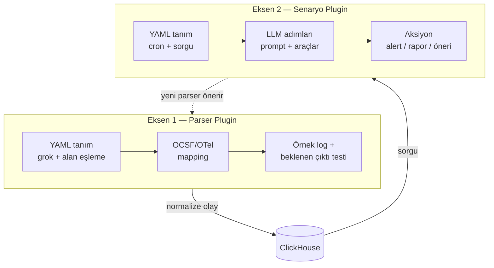
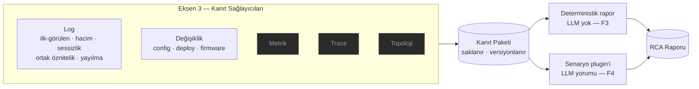

# Mimari Kararlar

2026-08-14 tarihinde, [pazar araştırması ve feature parity](../pazar-arastirmasi-ve-feature-parity/index.md)
çalışması üzerine yapılan dört turluk netleştirme sonucunda alınan kararlar. Proje greenfield —
`/Users/hakkisagdic/Projects/bizigo-loganalyzer` şu an boş.

Bu belge karar tabanıdır. Türevleri:
[F1 teknik plan](../f1-teknik-plan/index.md) · [RCA raporu özelliği](../rca-raporu-ozelligi/index.md)

## 1. Karar Tablosu

| # | Konu | Karar | Doğrudan sonucu |
| --- | --- | --- | --- |
| K1 | **Ürün sınırı** | Analiz katmanı. Collector ve storage yazılmayacak | .NET'te yazılan: plugin host, normalizasyon, sorgu API, agent katmanı, UI |
| K2 | **Birincil alan** | Altyapı / ağ cihazı logları | Syslog ağırlıklı ingest; vendor parser kataloğu ürünün "kutudan çıkar çalışır" hissi |
| K3 | **Parser plugin** | Deklaratif YAML + grok **birinci sınıf** | Yeni format eklemek için derleme yok. .NET assembly kaçış kapısı olarak kalır |
| K4 | **Çok dillilik** | Log mesaj gövdesi + UI + agent çıktısı | Plugin'in programlama dili **kapsam dışı** → WASM/Extism gereksiz, kod bütçesi düştü |
| K5 | **Ölçek** | Belirsiz — küçükten başla, geç bağla | v1'de kuyruk yok, doğrudan ingest; ama arayüz kuyruk eklenebilecek şekilde tasarlanır |
| K6 | **LLM** | Yerel (Ollama/vLLM) + **uzak GPU cluster** | OpenAI-uyumlu endpoint soyutlaması; base URL config'den. Log verisi kurum dışına çıkmaz |
| K7 | **Agent görevleri** | 4 senaryonun tamamı, **plugin olarak** | Built-in değil — kendi senaryo plugin formatımızda referans implementasyon |
| K8 | **Hedef şema** | OCSF + OTel semconv, mapping katmanı | Çekirdek alanlar ortak, çıktı iki şemaya da verilebilir |
| K9 | **Senaryo formatı** | Deklaratif YAML + prompt | Parser plugin'iyle aynı zihinsel model. Kullanıcı kendi senaryosunu config'den ekler |
| K10 | **Dağıtım** | Tek kurum, tek tenant | Multi-tenancy, kota, faturalandırma, lisanslama **yok**. Ciddi sadeleşme |
| K11 | **Arayüz** | Kendi web UI — React/Next | .NET REST API + ayrı front-end. Log arama UX'i için ekosistem olgunluğu gerekçesi |
| K12 | **MVP kapsamı** | Ham arşiv+replay, Sigma, vendor kataloğu, alert — **dördü de** | Kapsam geniş; fazlara bölünmesi şart (bkz. §4) |
| K13 | **Faz sıralaması** | F1→F2→F3→F4, **+F5** (K21 nedeniyle) | Ham arşiv+replay F1'de. Her faz kendi başına çalışır bitiyor |
| K14 | **Template mining** | **Python sidecar** (Drain3) | Port yazılmayacak. .NET hiç Python import etmez; ayrı süreç, ayrı imaj (bkz. §3.2) |
| K15 | **Senaryo YAML kısıtı** | Format "her adım tek iş"i **zorlar** | Şema düzeyinde: adım başına tek çıktı sözleşmesi, serbest çok adımlı prompt yazılamaz |
| K16 | **Kurum profili** | Tek tenant, **çok kullanıcılı büyük kurum** | Tenant izolasyonu yok; kurum içi rol ayrımı + senaryo sahipliği + kaynak kotası **var** (bkz. §6) |
| K17 | **Veri erişim kapsamı** | Kaynak/cihaz **grubu bazlı** erişim | Olay şemasında `owner_group`; sorgu API'si zorunlu filtre uygular. F1'de bağlanıyor |
| K18 | **Kimlik** | Kurumsal SSO — **OIDC** | Roller token claim'inden. Yerel kullanıcı tablosu yok |
| K19 | **RCA'nın yeri** | **Çekirdek + senaryo** | Rapor veri modeli/deposu/UI/export çekirdekte; üreten akış senaryo plugin'inde. İki plugin ekseni korunuyor |
| K20 | **RCA tetikleyicileri** | **Dördü de**: alarm, kullanıcı, anomali zinciri, dış API | Dördü tek kuyrukta buluşur; debounce, döngü koruması ve kota tek yerde |
| K21 | **RCA kanıt kapsamı** | **Hepsi**: log, değişiklik, metrik, trace, topoloji | ⚠️ Projedeki en büyük kapsam genişlemesi — **K1'i genişletiyor** (bkz. §7) |
| K22 | **RCA fazı** | F3'te deterministik kanıt, F4'te LLM yorumu | Kanıt paketi LLM'siz tek başına değerli; yerel model riskini (K6) ayrıştırır |
| K23 | **Kontrol düzlemi** | **PostgreSQL** (ClickHouse veri düzlemi) | Envanter, katalog, RCA raporları, audit. Değişken durum ClickHouse'ta tutulmaz |
| K24 | **Ingest sözleşmesi** | Tek kapı: **OTLP/HTTP**; syslog `protocol: none` | Protokol çeşitliliği collector'ın işi. Ham sadakat ancak `none` ile korunuyor (bkz. §3.3) |
| K25 | **Object storage** | **RustFS** (Apache 2.0, S3 uyumlu) | ⚠️ 1.0-beta; dağıtık mod "under testing". Yalnızca S3 API üzerinden konuşulur + manifest + WAL kuyruğu (bkz. §3.5, risk #13) |
| K26 | **IdP** | **Keycloak 26.7.x** | Apache 2.0, tek konteyner, mevcut Postgres'i kullanır. LDAP/AD federasyonu sayesinde MVP'den üretime taşınabilir — atılacak parça değil |
| K27 | **Collector gövde kodlaması** | syslog receiver'da `encoding: iso-8859-1` | Varsayılan `utf-8`, geçersiz baytları collector içinde U+FFFD ile değiştiriyor ve K4/K12'yi anlamsız kılıyor. **`nop` denendi ve reddedildi** (aşağıya bakın). `iso-8859-1` bayt ↔ kod noktası eşlemesini birebir ve tersinir yapıyor; satır bölme korunuyor, baytlar bizde `Latin1.GetBytes` ile aynen geri alınıyor |
| K28 | **WAL yükü = arşiv satırı** | Tek NDJSON formatı, tek codec | Yükleyici bir dönüştürücü değil kopyalayıcı olur; iki formatın sessizce ayrışması mümkün olmaz. `owner_group`/`source_id` alanları WAL aşamasında boş yazılır — alanın **varlığı** formatın parçası, değeri değil |
| K29 | **`raw_ref` bayt konumu değil arşiv ön eki** | `raw/{owner_group}/{yyyy}/{MM}/{dd}/{HH}/{source_class}/` | Ön ek yazma anında hesaplanabiliyor ve manifest sorgusunun anahtarıyla örtüşüyor; tek gerçek kaynak arşivin kendisi kalıyor. Bedeli tek kaydı okumak için nesnenin açılması — replay zaten nesnenin tamamını okuyor |
| K30 | **OCSF/OTel türetmesi ClickHouse görünümünde** | `events_ocsf`, `events_otel` (materialized **değil**) | SQL konuşan herkes aynı şekli görüyor: F3'te Sigma kuralları ClickHouse SQL'ine derleniyor ve OCSF alan adlarına vuruyor. API katmanında türetme bunu imkânsız kılardı |

### K29 — `raw_ref` neden bayt konumu taşımıyor

T04'te açık bırakılan kalem T07'de kapandı. Sorun yapısal: ingest boru hattı ile
arşiv yükleyici **bilinçli olarak bağımsız** çalışıyor (F1 §2.3), yani olay satırı
ClickHouse'a yazıldığında nesne henüz oluşmamış oluyor ve `offset` bilinemiyor.

| Seçenek | Neden seçilmedi / seçildi |
| --- | --- |
| Ayrı `raw_index(event_id, object_key, offset, length)` tablosu | O(1) okuma verirdi ama hem yükleyicinin hem replay'in bakması gereken **ikinci bir gerçek kaynak** doğururdu. Sessizce sürüklenmesi, manifest'in (K25 koruma #4) önlemek için var olduğu hata sınıfının aynısı |
| Yüklemeyi olay yazımından önce yapmak | İki yolu birbirine bağlar; ClickHouse yazımı S3 gecikmesine tabi olurdu |
| **Arşiv ön eki** ✅ | Yazma anında hesaplanabiliyor (grup, saat, kaynak sınıfı biliniyor), manifest sorgusunun anahtarıyla birebir örtüşüyor, tek gerçek kaynak arşiv kalıyor |

Bedeli dürüstçe: tek bir kaydın ham hâlini okumak için nesnenin açılıp `event_id`
taranması gerekiyor. Bu, insan tetikli ve seyrek bir işlem; replay ise zaten
nesnenin tamamını okuduğu için ona hiç maliyet getirmiyor.

### K27 — `nop` neden reddedildi

Bir düzeltme kaydı: `encoding: nop` önce doğru cevap sanıldı ve öyle yazıldı.
Seçeneğin **var olduğu** doğrulanmıştı, syslog receiver'ının TCP/UDP yollarında
**çalıştığı** değil. CI'da çıkan gerçek davranış:

| Yol | `nop` ile ne oluyor |
| --- | --- |
| UDP | Girdinin varsayılan bir `line_end_pattern` değeri var; `nop` ile birlikte açılışta hata: *"line_end_pattern should not be set when using nop encoding"* |
| TCP | Bölücü `NoSplitFunc`'a düşüyor: **syslog çerçevelemesi kayboluyor**, TCP akışının tamamı tek kayda dönüşüyor. Çökme yok — sessizce bozuk veri. Çerçeveleme yalnızca `enable_octet_counting` ile korunur, onu da cihazların çoğu göndermiyor |

`utf-8-raw` da bayt geçirgen, ama gövde protobuf `string_value` alanına geçersiz
UTF-8 olarak yazılırdı ve .NET tarafında çözümleme U+FFFD üretirdi — sorun bir
hop öteye taşınmış olurdu.

`iso-8859-1` üçünü birden veriyor: çerçeveleme korunuyor, eşleme tersinir, telde
geçerli UTF-8 taşınıyor. Bedeli, 0x80–0xFF baytlarının telde iki bayta çıkması.
Tel kodlaması `bizigo.wire_encoding` özniteliğiyle **açıkça** bildiriliyor —
çözücünün tahmin etmesi gerekmiyor.

### K4 ve K10'un birlikte etkisi

İkisi de kapsamı ciddi biçimde daraltıyor. WASM plugin runtime'ı ve multi-tenant izolasyon
katmanı — normalde bu ölçekte bir ürünün en pahalı iki parçası — tamamen düştü. Bütçe
parser kataloğuna ve agent katmanına kayabilir.

### Tam metin araması — ölçüldü, açık kalem kapandı

`0001_events.sql` içinde `sparseGrams(3, 20, 5)` parametreleri "gerçek gövdelerle
ölçülüp kesinleştirilecek" diye işaretliydi. 1M satırla ölçüldü.

**İndeks çalışıyor:** eşleşmeyen sorgu **0 satır** okuyor (11 ms) — granül atlama
tam. Ama seçiciliğin bir **uzunluk eşiği** var:

| Sorgu | Okunan satır |
| --- | --- |
| `açma` (4 karakter) | 1.000.000 — atlama yok |
| `kullanıcı` (9 karakter) | 1.000.000 — atlama yok |
| `oturum açma` (11 karakter) | 286.720 ✓ |
| `用户登录失败` (6 karakter) | 1.000.000 — atlama yok |
| `用户登录失败，请检查凭据` (12 karakter) | 286.720 ✓ |
| Arapça tam cümle | 295.488 ✓ |

**Eşik ~10-11 karakter ve alfabeden bağımsız.** Yani K4'ün "TR/AR/CJK'yi dile özel
tokenizasyon olmadan çözüyor" iddiası **doğru** — CJK ayrıcalıklı bir sorun değil.
Kırılan şey kısa sorgular, ki bir log arama kutusuna yazılan şey tam olarak odur.

Bedeli de ölçüldü: `idx_body` **13,32 MiB**, tablo 29,41 MiB — indeks tablonun
**%45'i**. `min_cutoff_length`'i düşürmek kısa sorguları seçici yapar ama zaten
büyük olan indeksi daha da büyütür. F2'nin arama arayüzü ya minimum sorgu uzunluğu
dayatmalı ya bu takas bilinçli olarak yeniden yapılmalı.

### Keyset sayfalama — koşullu doğru

"Derin sayfada sabit süre" iddiası **sıralama anahtarının tam öneki verildiğinde**
doğru, genel olarak değil. Tablo `ORDER BY (owner_group, source_id, ts)`, sorgu ise
`ORDER BY ts DESC, event_id DESC` yapıyor:

| Sorgu şekli | Sayfa 1 | Derin sayfa |
| --- | --- | --- |
| Filtresiz | 40,7 ms / 377k satır | 38,8 ms / **1M satır** |
| `owner_group` | 45,9 ms / 155k | 57,1 ms / 286k |
| `owner_group` + `source_id` | 17,8 ms / 57k | **13,7 ms / 57k** |

Kapsam kapısı `owner_group`'u her sorguya eklediği için kısmi fayda garanti; tam
sabitlik için kaynak filtresi gerekiyor. Offset'e üstünlük her hâlükârda net
(38,8 ms vs 148,6 ms). F2'nin arama arayüzü kaynak filtresini teşvik etmeli.

### K7 ve K9'un birlikte etkisi

Dört agent senaryosu (format keşfi, anomali/sessizlik, RCA, dış kaynak takibi) ürünün
**built-in özelliği değil**, senaryo plugin formatının **referans implementasyonu** olacak.
Bu, formatı gerçek yükle test etmenin tek dürüst yolu: kendi özelliklerimizi kullanıcının
kullanacağı mekanizmayla yazarsak, mekanizmanın eksiği hemen ortaya çıkar.

## 2. İki Plugin Ekseni

Ürünün genişleme yüzeyi iki ayrı eksende:

Son ok kritik: **format keşfi senaryosu, parse edilemeyen logları kümeleyip yeni bir parser**
**plugin taslağı üretir ve onaya sunar.** Katalog kendi kendini büyüten bir döngüye girer.
Ürünün asıl farklılaşması burada — piyasada bu döngüyü kuran bir araç yok.

<user_quoted_section>RCA kararlarıyla (K19–K22) buna üçüncü bir eksen eklendi: kanıt sağlayıcıları.Bkz. §7.</user_quoted_section>

## 3. Teknoloji Seçimleri ve Doğrulama Durumu

| Bileşen | Seçim | Durum |
| --- | --- | --- |
| Toplama | OTel Collector + Fluent Bit | ✅ Olgun, 80+ plugin |
| Depolama | ClickHouse | ✅ Apache 2.0 |
| ClickHouse .NET erişimi | `ClickHouse.Driver` (resmi) | ✅ **1.0 stable**, .NET 6+, binary bulk insert. `ClickHouse.BulkExtension` ek performans için |
| Detection | SigmaHQ kuralları | ✅ Binlerce hazır kural |
| Sigma → ClickHouse SQL | `clicksiem/pySigma-backend-clickhouse` | ⚠️ **"Testing" statüsünde** ve Python. Çözüm önerisi aşağıda |
| Agent orkestrasyonu | Microsoft Agent Framework 1.0 | ✅ GA (3 Nisan 2026), LTS |
| LLM soyutlaması | `Microsoft.Extensions.AI` (`IChatClient`) | ✅ Ollama / vLLM / bulut aynı arayüz arkasında |
| Araç arayüzü | MCP C# SDK (`ModelContextProtocol` 1.4.0) | ✅ Stable, DI + ASP.NET Core + AOT |
| Zamanlama | Quartz.NET veya Hangfire | ✅ Kalıcı kuyruk + retry gerekiyorsa Hangfire |
| Plugin yükleme | `AssemblyLoadContext` (+ `McMaster.NETCore.Plugins`) | ✅ Runtime'ın parçası; sadece kaçış kapısı için gerekli |
| Template mining | Drain3, Python sidecar içinde | ⚠️ Karar verildi (K14). Upstream durgun — sürüm sabitleme şart (bkz. §3.2) |
| Grok motoru | **Kendi ince derleyicimiz** (`System.Text.RegularExpressions`) | ✅ `grok.net` 2.0 PCRE.NET (native) kullanıyor; `RegexOptions.NonBacktracking` ile **doğrusal zaman garantisi** bizde daha değerli (bkz. §3.4) |
| OTLP alıcı (.NET) | `opentelemetry-proto`'dan üretilen çözücü | ✅ Hazır alıcı paketi yok; `logs_service.proto` + tek çözücü, ~yarım gün |
| Tam metin arama | ClickHouse **text index**, `sparseGrams` tokenizer | ✅ Full-text search **26.2'de GA** (Mart 2026). `sparseGrams` TR/AR/CJK'yi dile özel tokenizasyon olmadan çözüyor → **risk #4 kapandı** |
| Kontrol düzlemi | PostgreSQL + EF Core (K23) | ✅ Envanter, katalog, RCA raporları, audit. ClickHouse'a mutasyon yazılmaz |
| Object storage | **RustFS** (K25) | ⚠️ Apache 2.0, MinIO ikilisinin yerine geçiyor. **1.0-beta** — üretim tavsiyesi henüz yok; tasarım veri kaybını varsayıyor (bkz. §3.5) |
| IdP | **Keycloak 26.7.x** (K26) | ✅ Apache 2.0. `start-dev` **kullanılmaz** (bellek içi H2); `start --optimized` + Postgres + `--import-realm` |
| Collector kimliği | OTel `oauth2clientauthextension` | ✅ `client_credentials`, otomatik token yenileme. Servis hesabının rolü yalnızca `ingest` |

### 3.1 Sigma entegrasyonu

pySigma Python, backend "Testing" statüsünde. **Kuralları derleme/dağıtım zamanında SQL'e**
**çevir:** Sigma kuralları nadiren değişir; `sigma-cli` ile üretilen ClickHouse SQL'i
versiyonlayıp repoda tut. Sıcak yolda hazır SQL çalışır, backend olgunluğu tek seferlik
doğrulama sorununa iner.

K14 ile Python zaten dağıtımda olduğu için gerekçe değişti: artık "Python istemiyoruz" değil,
**"sıcak yolda belirsizlik istemiyoruz"**. pySigma aynı sidecar imajına konur ve yalnızca
UI'daki "bu kuralı derle ve önizle" akışında (F3) çağrılır.

**Üçüncü bir gerekçe ölçümle eklendi:** backend üç aylık, iki yıldızlı ve tek
geliştiricili. Build-time derleme bu tedarik zinciri riskini **soğuruyor** —
üretilen SQL repoda versiyonlandığı için proje terk edilse bile mevcut kurallar
çalışmaya devam eder; kaybedilen yalnızca *yeni* kural derleme yeteneği, ve
LGPL-3.0 fork'a izin veriyor.

<user_quoted_section>⚠️ Eşleme maliyeti sıfır değil — ilk araştırmanın sonucu yanlıştı."OCSF pipeline'ı bedava geliyor" değerlendirmesi ölçümle çürüdü. Ayrıntı:Sigma → ClickHouse araştırması.
SigmaHQ/pySigma-pipeline-ocsf kataloğun %80'ine dokunuyor ama bizimevents_ocsf görünümümüze karşı bugün 0 kural olduğu gibi çalışıyor. Yalnızcaad normalizasyonuyla 3, tam anlamsal eşleme katmanıyla 59 (%1,57); ağtarafında 1 kural.aws, azure, gcp, zeek, okta, m365, cisco, fortigate,juniper ürünlerinde tek kural bile eşlenmiyor. proxy ve webserverkategorilerinde eşleme tablosu var ama kimlik eşlemesi — doldurulmamış yertutucu.Pipeline noktalı OCSF yolu üretiyor (dst_endpoint.ip), K30'un görünümüdüzleştirilmiş ad kullanıyor (dst_endpoint_ip). Backend FROM logs yazıyor,bizim tablo events.
Sonuç: F3'e, bizim ürün evrenimizdeki 5 kategori + 4 vendor için (269kural) proje-özel bir ProcessingPipeline yazma işi giriyor. ocsf_pipelinezincirde kalabilir — maliyeti sıfır, ama faydası da sıfır.</user_quoted_section>

`rsigma` hakkındaki varsayım da **çürüdü**: runtime eşleştirme motoru değil,
`rsigma-convert` içinde pluggable `Backend` trait'i olan gerçek bir derleyici ve
Postgres backend'i tam bizim modelimizi uyguluyor. Ama **ClickHouse backend'i**
**yok** ve desteklemediği hedefler için zaten `sigma-cli`'ye subprocess olarak
deleg ediyor — yani Python'dan kurtarmıyor, üstüne Rust binary'si ekliyor.

Kopyalanacak referans: [`clicksiem/sigma_rules`](https://github.com/clicksiem/sigma_rules)
— günlük cron, `sigconvert.py -b clickhouse`, üretilen 7.447 kural repoda. Bizim
planladığımız akışın çalışan hâli.

### 3.2 Analiz sidecar'ı (Python) — K14

Tek bir Python imajı: `drain3` + `pysigma`. .NET tarafı Python'a **hiç** bağlanmaz, yalnızca
HTTP çağırır.

| Konu | Karar | Gerekçe |
| --- | --- | --- |
| Konum | Sıcak yolda **değil** | Sadece parse edilemeyen loglar + örneklenmiş trafik gider. Throughput ihtiyacı ingest'in çok altında |
| Protokol | HTTP + JSON, toplu (batch) uç nokta | Düşük hacim gRPC'yi hak etmiyor. gRPC kaçış kapısı olarak kalır |
| Arıza davranışı | Sidecar ölürse ingest **etkilenmez** | Yalnızca keşif senaryosu devre dışı kalır. Sert bağımlılık kurulmayacak |
| Durum (state) | Kaynak/cihaz sınıfı **başına ayrı miner** | Daha temiz küme + doğal sharding. Anahtar = source id |
| Kalıcılık | Redis persistence (dosya değil) | Yeniden başlatmada öğrenilen ağaç korunur, ileride yatay ölçeklenir |
| Bellek | `max_clusters` **zorunlu** ayarlanır (LRU) | Sınırsız bırakılırsa ağ loglarında bellek sızıntısı gibi davranır |
| Sürüm | PyPI 0.9.11 **değil**, `logpai/Drain3` git SHA'sı | PyPI sürümü Tem 2022; repo Şub 2025'te typing + modern Python desteği aldı |

**Maskeleme sinerjisi:** Drain3'ün masking regex'leri (IP, MAC, port, hostname) parser
kataloğundaki grok pattern'lerinin aynısı. Tek bir kaynaktan üretilirse, mined template +
mask isimleri doğrudan **grok taslağına** dönüşür — format keşfi senaryosunun çıktı kalitesi
buradan geliyor.

**Eğitim / çıkarım ayrımı:** keşif turu `add_log_message()` ile öğrenir; çalışma anında
bilinmeyen logun hangi şablona düştüğü `match()` ile bulunur (regex yok, hızlı).

### 3.3 Syslog ham sadakati — K24'ün gerekçesi

F1 planı yazılırken doğrulandı ve **mimariyi bağladı**: OTel syslog receiver'ında
`preserve_to` benzeri bir **ham satır saklama seçeneği yok**. RFC3164/5424 modunda
mesaj alanlara ayrılır ve orijinal satır geri alınamaz — bu, ham arşiv + replay
hedefiyle (K12) doğrudan çelişiyor.

Çözüm: collector `protocol: none` ile çalışır. Çerçeveleme (octet counting) ve PRI
çözümü collector'da kalır, **gövde olduğu gibi bize gelir**. Yan etkisi aslında bir
kazanç: syslog başlık ayrıştırması da YAML motoruna düşer, yani ayrıştırmanın
tamamı tek yerde toplanır ve **replay'de birebir aynı kod koşar**. İki ayrı
ayrıştırıcı olsaydı replay ile canlı yol sessizce ayrışırdı.

Kalan risk: `protocol: none` "experimental" etiketli. Azaltma: collector sürümü
sabitlenir; kaybolursa `protocol: rfc3164` + OTTL ile gövde kopyalama yedek planı var.

### 3.4 Grok motoru — neden hazır kütüphane değil

Tek olgun .NET seçeneği `grok.net` 2.0, v2'den itibaren **PCRE.NET** (PCRE2 native
sarmalayıcı) kullanıyor. Hız iyi ama üç şey eksik: RID başına native ikili,
AOT/trim belirsizliği, ve pattern kayıt defteri/sürümleme yok.

Asıl belirleyici olan dördüncüsü: **ReDoS**. Parser YAML'ı kullanıcıdan geliyor
(K16 — çok kullanıcılı büyük kurum). Kötü niyet gerekmiyor, dikkatsiz bir pattern
ingest'i durdurmaya yeter. .NET'in `RegexOptions.NonBacktracking` seçeneği girdi
uzunluğunda **doğrusal zaman garantisi** veriyor — düşman girdiye karşı bunun
karşılığı PCRE tarafında yok.

Grok derlemesi zaten küçük bir iş (`%{PATTERN:alan:tip}` özyinelemeli genişletme +
adlandırılmış grup). ~300–400 satır yazıp kontrolü elde tutmak, hazır kütüphaneye
bağlanıp ReDoS'u çözememekten ucuz. Pattern **kütüphanesi** yine Logstash/Elastic
setinden alınıyor — o veri, kod değil.

### 3.5 RustFS ve olgunluk kısıtı — K25

MinIO 2025 sonunda bakım moduna geçince bu alandaki en hareketli proje RustFS oldu:
Apache 2.0, S3 uyumlu, MinIO ikilisinin yerine doğrudan geçiyor (mevcut bucket ve
veri korunuyor).

Ama proje **1.0.0-beta** serisinde ve geliştiricilerin kendi tavsiyesi 1.0 stable
öncesi üretimde kullanmamak. Dağıtık mod ve KMS "under testing". Ham arşiv bu
ürünün dayanıklılık omurgası — replay'in tek kaynağı.

Karar değişmiyor; tasarım **RustFS'in veri kaybetmesi ihtimalini varsayıyor.**
Beş bağımsız koruma [F1 planı §7.0](../f1-teknik-plan/index.md)'da; özü:

- Dayanıklılık sınırı **yerel WAL**, RustFS değil — kesinti ingest'i durdurmaz.
- WAL segmenti, yüklendiği **doğrulandıktan** sonra 48 saat daha tutulur.
- **Manifest Postgres'te** (`object_key, sha256, event_count, ts aralığı`). Nesne
kaybolursa replay sessizce kısa dönmez; **ne kaybolduğunu söyler.** Tek başına
en değerli koruma bu.
- Yalnızca S3 API kullanılır → SeaweedFS / gerçek S3'e geçiş config işi.
- MVP tek düğüm; düğüm dayanıklılığı RAID/ZFS'e bırakılır, sürüm sabitlenir.

### 3.6 IdP seçimi — K26

Kısıt "ücretsiz, kolay erişilebilir, kendi başına kolay kurulabilir" idi.
**Keycloak 26.7.x** seçildi. Belirleyici gerekçe kolaylık değil, **atılacak bir MVP**
**parçası olmaması**: diğer adayların hepsi geliştirme için kurulup üretimde kurumun
IdP'siyle değiştirilecekti. Keycloak LDAP/AD federasyonunu yerel yapıyor — büyük bir
kurumda neredeyse kesin olan AD'nin önüne geçip üretimde de kalabilir.

Elenenler: **Zitadel** (org/project/grant modeli düz `owner_group`'a fazladan eşleme
çıkarıyor), **Authentik** (4 konteyner), **Dex** (kullanıcı deposu yok, RBAC
gösterilemez), **OpenIddict** (kendi auth sunucumuzu yazmak — K18'e aykırı),
**Duende** (ciro eşiği üstünde ücretli).

İki operasyonel karar: `start-dev` **kullanılmaz** (bellek içi H2, her yeniden
başlatmada veri gider) — `start --optimized` + mevcut Postgres. Ve realm **repoda**
**dosya olarak** durur (`--import-realm`), böylece ihtiyaç duyulan claim'ler belgeye
değil koda yazılmış olur.

Ürünün IdP'den beklediği tek şey dört claim: `sub`, `preferred_username`, `roles`,
`groups`. Bu sözleşme sayesinde Keycloak → Entra ID geçişi IdP tarafında mapper
ayarı + eşleme tablosu satırı demek; **kodda değişiklik yok.**

## 4. Faz Planı — onaylandı (K13)

K12'de MVP'nin dördü birden seçildi. Buna React/Next UI, iki plugin ekseni ve agent katmanı
eklenince MVP tek parça olarak taşınamayacak kadar büyük. Onaylanan dilimleme — her faz kendi
başına çalışır durumda bitiyor:

| Faz | İçerik | Neden bu sıra |
| --- | --- | --- |
| **F1 — Boru hattı** | Syslog/OTLP ingest → YAML parser motoru → OCSF/OTel mapping → ClickHouse → **ham arşiv + replay**. 3-4 vendor parser'ı. Envanter + `owner_group`. OIDC. CLI + REST API. **`change_events` tablosu** | Diğer her şey bunun üstünde duruyor. Ham arşiv ve değişiklik akışı baştan konulmazsa sonradan eklemesi çok pahalı — ikisi de **geçmiş biriktirmek** zorunda |
| **F2 — Görünürlük** | React/Next UI: log arama, parser editörü + canlı test, katalog yönetimi. Alert + bildirim kanalları. **Değişiklik olayı beslemeleri** (config/deploy araçları) | Parser yazmak UI'sız acı verici; kataloğu büyütmek için editör şart. Change feed burada gerçekten bağlanmazsa F3'te boş bir sağlayıcı olur |
| **F3 — Detection + RCA kanıtı** | Sigma kuralları (derlenmiş SQL), kural yönetimi. **Kanıt sağlayıcı sözleşmesi (5 tür), log+change sağlayıcıları, kanıt paketi, deterministik RCA raporu + UI + export + altın küme** | Katalog ve UI oturmadan detection'ın zemini yok. RCA'nın deterministik yarısı LLM'siz tek başına değerli (K22) |
| **F4 — Agentic** | Senaryo plugin motoru + MCP server + 4 referans senaryo. **RCA senaryo plugin'i (LLM yorumu), 4 tetikleyici, kuyruk kotası** | Hepsi alttaki katmanların olgunluğuna bağlı. Format keşfi F1'in parser motorunu, RCA F3'ün kanıt paketini kullanıyor |
| **F5 — Kanıt genişletme** | **Metrik, trace, topoloji** kanıt sağlayıcıları — yeni ingest + depolama | K21'in bedeli. K1'i genişlettiği için ayrı faz; F1–F4 bittiğinde kapsam yeniden değerlendirilmeli |

RCA'nın fazlara dağılımının ayrıntısı: [RCA raporu özelliği](../rca-raporu-ozelligi/index.md) §9.
F1'in teknik ayrıntısı: [F1 teknik plan](../f1-teknik-plan/index.md).
F2'nin teknik ayrıntısı: [F2 teknik plan](../f2-teknik-plan/index.md).

### F5 sonrası — tanıtım materyali (henüz kapsamlandırılmadı)

Son fazdan sonra dokümantasyona **slayt ve tanıtım ekran filmi** eklenecek,
muhtemelen **Remotion** ile (2026-08-18'de bildirildi, ayrıntılar bekleniyor).

Buraya bir faz olarak yazılmadı çünkü kapsamı henüz konuşulmadı. Şimdiden not
edilmesinin tek sebebi F2'yi etkilemesi: tanıtım filmi **uçtan uca akışların**
üstüne kurulacak, dolayısıyla arayüz ticket'ları yazılırken "bu ekran demo
edilebilir mi" sorusu bedava bir kısıt olarak akılda tutulmalı. Remotion React
tabanlı, yani K31'in Next.js/React yığınıyla aynı ekosistemde kalıyor — ayrı bir
teknoloji kararı gerektirmiyor.

Vendor parser kataloğunun tamamı (Cisco ASA/IOS, FortiGate, PAN-OS, MikroTik, Juniper, F5,
HAProxy, Nginx) tek faza sıkıştırılmamalı — F1'de 3-4 tanesiyle motor doğrulanır, gerisi
F2'deki editörle ve F4'teki keşif senaryosuyla çok daha ucuza gelir.

## 5. Açık Riskler

1. **Yerel model kalitesi (K6/K15)** — Ollama/vLLM üzerindeki açık ağırlıklı modeller uzun,
çok adımlı akıl yürütmede zayıf. K15 ile senaryo YAML'ı bunu şema düzeyinde zorlayacak;
asıl risk **kullanıcının formatı esnetmeye çalışması** (tek adıma üç iş sığdırmak). Format
tasarımında bunun kapısı kapalı olmalı, sadece tavsiye edilmemeli.
2. **Sigma backend olgunluğu** — "Testing" statüsü. Derleme zamanı yaklaşımı riski
azaltıyor ama üretilen SQL'in doğruluğu örnek verilerle test edilmeli.
3. **Drain3 upstream durgunluğu (K14)** — PyPI'da son sürüm Tem 2022, repoda son commit
Şub 2025. Ölü değil ama bakımsız: yukarı akıştan düzeltme beklenemez. Azaltma: kod küçük
(~28 KB), MIT, sidecar'a hapsedilmiş; gerekirse fork edilir. Sıcak yolda olmaması bu riski
kabul edilebilir kılan asıl şey.
4. **~~Çok dilli tam metin arama~~** — **kapandı.** ClickHouse full-text search 26.2'de
GA; `sparseGrams` tokenizer değişken uzunlukta n-gram üretiyor ve TR/AR/CJK'de dile
özel tokenizasyon olmadan alt dizi araması veriyor. Kalan iş ayar: `min_length` /
`max_length` gerçek gövdelerle ölçülüp indeks boyutuna göre seçilecek. Ayrı bir tuzak
**kodlama** tarafında duruyor (bkz. risk #11).
5. **Ölçek belirsizliği (K5)** — geç bağlayan tasarım disiplin ister. Ingest arayüzü
baştan "batch alan" şeklinde tanımlanmazsa kuyruk eklemek sonradan refactor olur.
6. **Gürültülü komşu (K16)** — tenant izolasyonu yok ama paylaşılan iki kıt kaynak var:
GPU cluster ve ClickHouse. Zamanlanmış senaryolar kotalanmazsa tek bir kötü cron ikisini de
doyurur. Bu, multi-tenancy'nin kaçtığı yerden geri gelen tek maliyet kalemi.
7. **Senaryo yayınlama yetkisi (K16)** — senaryo yalnızca okumaz, **aksiyon alır**
(alert, webhook). Taslak → inceleme → yayın akışı F4'ten önce tasarlanmalı.
8. **K21'in kapsam bedeli — en büyük açık risk.** "Kanıt kapsamı: hepsi" kararı
metrik + trace + topolojiyi işin içine soktu; bu, ürünü "log analiz katmanı"ndan
(K1) gözlemlenebilirlik platformuna taşıyor. F5 tek başına F1 büyüklüğünde bir iş.
Azaltma: kanıt sağlayıcı sözleşmesi beş türü de F3'te tanır, motor hiçbirine özel
kod içermez — yani karar **geciktirilebilir, geri alınamaz değil**. F4 bittiğinde
gerçek kullanım verisiyle yeniden değerlendirilmeli.
9. **RCA inceleme yorgunluğu** — kimse "bu rapor doğru muydu?" düğmesine basmazsa
altın küme boş kalır ve yerel modelin yeterliliği (risk #1) **ölçülemez**. Karşı
önlem: alarm tetikli RCA'da inceleme, alarmı kapatma akışının zorunlu parçası olsun.
10. **Değişiklik akışının boş kalması** — RCA'nın en güçlü sinyali "ne değişti".
F1'de tablo açmak yetmez; kurumun config/deploy araçlarından besleme **F2'de**
**gerçekten bağlanmalı**. Bağlanmazsa F3'te sürekli "değişiklik yok" diyen bir
sağlayıcı olur ve RCA kalitesi sessizce düşer.
11. **Kodlama ve Türkçe kültür tuzağı (K4)** — ağ cihazları UTF-8 garanti etmiyor;
`windows-1254` / `iso-8859-9` yaygın. Ham arşive **orijinal baytlar** yazılmazsa
yanlış tespit replay ile düzeltilemez. Ayrıca `tr-TR` kültüründe `ToLower()`
`I → ı` yapar ve aramayı sessizce bozar — `ToLowerInvariant()` CI lint kuralı olmalı.
12. **`protocol: none` deneysel (K24)** — ham sadakat buna bağlı. Collector sürümü
sabitlenmeli; yedek plan `rfc3164` + OTTL ile gövde kopyalama.
13. **RustFS olgunluğu (K25)** — 1.0-beta, geliştiricilerin kendi üretim tavsiyesi
yok, dağıtık mod "under testing". Ham arşiv replay'in tek kaynağı olduğu için bu
riskin bedeli yüksek. Azaltma §3.5'te beş koruma; kalıcı olarak izlenecek kalem:
**RustFS 1.0 GA çıktığında sürüm yükseltme ve dağıtık mod yeniden değerlendirme.**
Kabul edilebilir kılan şey, dayanıklılık sınırının WAL olması — yani en kötü
senaryo "eski arşivin bir kısmı kayıp", "yeni veri kayıp" değil.

## 6. Kurum Profili — K16

"Tek tenant" ile "kullanıcılar kendi senaryolarını yazar" çelişmiyor: tek kurum, ama kurum
büyük ve her ekip kendi iş yüküne göre agent tasarlayacak. Bunun mimariye yansıması:

| Konu | Var mı? | Not |
| --- | --- | --- |
| Tenant izolasyonu, kota faturalandırma, veri ayrıştırma | ❌ | Tek kurulum, tek veri havuzu |
| Kurum içi roller (okuyucu / analist / yazar / yönetici) | ✅ | Kim parser-senaryo yayınlar, kim sadece sorgular |
| Senaryo sahipliği + ekip etiketi | ✅ | Bulgular sahibine düşer; terk edilmiş senaryo tespit edilebilir |
| Yayın onayı (taslak → inceleme → yayın) | ✅ | Senaryo aksiyon alabildiği için zorunlu |
| Çalıştırma kotası (eşzamanlılık, timeout, token bütçesi) | ✅ | Risk #6'nın karşılığı; zamanlayıcıya baştan girmeli |
| Kimlik — OIDC (K18) | ✅ | Roller token claim'inden okunur; ürün kendi kullanıcı tablosunu tutmaz |
| Veri düzeyinde kapsam (K17) | ✅ | Grup bazlı: her olayda `owner_group`, sorgu API'si zorunlu filtre uygular |

### 6.1 K17'nin F1'e yansıması

Grup bazlı erişim üç yere dokunuyor ve üçü de **F1'de** yapılmalı:

1. **Şema** — olay tablosunda `owner_group LowCardinality(String)`. Sıralama anahtarında
(`ORDER BY`) öne alınırsa filtreli sorgular ucuzlar; bu bir kez seçilir, sonra değişmez.
2. **Atama** — grup, olayın kendisinden değil **kaynağından** gelir: cihaz/kaynak envanteri
→ grup eşlemesi. Envanter kaydı F1'in parçası; parser'ın işi değil.
3. **Zorlama noktası** — filtre sorgu API'sinde uygulanır, ClickHouse row policy'de değil.
Gerekçe: agent'lar ve MCP server da aynı API'den geçecek, tek kapı olmalı. Ham arşiv
okuma yolu da bu kapıdan geçmeli — yoksa kapsam ayrımı arka kapıdan delinir.

Agent senaryoları da bir **kimlik altında** koşar: senaryonun gördüğü veri, sahibinin
grubuyla sınırlıdır. Bu, K16'daki senaryo sahipliğinin teknik karşılığı.

## 7. RCA ve üçüncü genişleme ekseni — K19…K22

RCA eklenmesiyle ürüne **üçüncü bir genişleme ekseni** girdi: kanıt sağlayıcıları.
Parser plugin'leri veriyi *içeri* alır, senaryo plugin'leri veriyi *yorumlar*, kanıt
sağlayıcıları ise **hangi verinin bakılacağını** belirler.

Sözleşmenin iki taşıyıcı özelliği:

1. **RCA motoru ClickHouse'u doğrudan sorgulamaz** — sağlayıcılara sorar. Bu yüzden
metrik/trace/topoloji sağlayıcıları F5'te eklenirken motora dokunulmaz.
2. **Kanıt paketi LLM'den önce ve LLM'siz üretilir**, saklanır ve tekrar kullanılır.
Yerel model riskini (risk #1) ölçülebilir hale getiren tek şey bu: aynı paket
üzerinde farklı modeller karşılaştırılabiliyor.

Ayrıntı: [RCA raporu özelliği](../rca-raporu-ozelligi/index.md).

## Kaynaklar

- [ClickHouse resmi .NET client — clickhouse-cs](https://github.com/clickhouse/clickhouse-cs)
- [ClickHouse.Driver 1.0.0 stable duyurusu](https://clickhouse.com/blog/clickhouse-driver-1_0_0-official-dotnet-client)
- [clicksiem/pySigma-backend-clickhouse](https://github.com/clicksiem/pySigma-backend-clickhouse)
- [pySigma Backends dokümantasyonu](https://sigmahq-pysigma.readthedocs.io/en/latest/Backends.html)
- [timescale/rsigma](https://github.com/timescale/rsigma)
- [Microsoft Agent Framework Overview](https://learn.microsoft.com/en-us/agent-framework/overview/)
- [logpai/Drain3](https://github.com/logpai/Drain3) — repo taşındı (eski: IBM/Drain3); son commit Şub 2025
- [drain3 PyPI 0.9.11](https://pypi.org/project/drain3/) — Tem 2022, repodan geride
- [OTel syslog receiver README](https://github.com/open-telemetry/opentelemetry-collector-contrib/blob/main/receiver/syslogreceiver/README.md) — `protocol: none`; ham saklama seçeneği **yok** (K24)
- [OTLP HTTP exporter](https://github.com/open-telemetry/opentelemetry-collector/tree/main/exporter/otlphttpexporter) — `otlphttp` → `otlp_http`
- [ClickHouse — Full-text Search GA](https://clickhouse.com/blog/full-text-search-ga-release) — 26.2, Mart 2026
- [ClickHouse — Text Indexes dokümantasyonu](https://clickhouse.com/docs/engines/table-engines/mergetree-family/textindexes)
- [ClickHouse 26.1 sürüm notları](https://clickhouse.com/blog/clickhouse-release-26-01) — `sparseGrams` beta
- [Marusyk/grok.net](https://github.com/Marusyk/grok.net) — v2.0'dan itibaren PCRE.NET (native)
- [Datadog Bits AI SRE](https://www.datadoghq.com/product/ai/bits-ai-sre/) — RCA pazar referansı
- [rustfs/rustfs](https://github.com/rustfs/rustfs) — Apache 2.0; dağıtık mod ve KMS "under testing" (K25)
- [Sealos — What Is RustFS?](https://sealos.io/blog/what-is-rustfs/) — 1.0 stable öncesi üretim tavsiyesi yok
- [Keycloak 26.7.0 duyurusu](https://www.keycloak.org/2026/07/keycloak-2670-released) (K26)
- [Keycloak — Docker ile başlangıç](https://www.keycloak.org/getting-started/getting-started-docker) — `start-dev` bellek içi H2 uyarısı
- [OTel `oauth2clientauthextension`](https://github.com/open-telemetry/opentelemetry-collector-contrib/blob/main/extension/oauth2clientauthextension/README.md)
