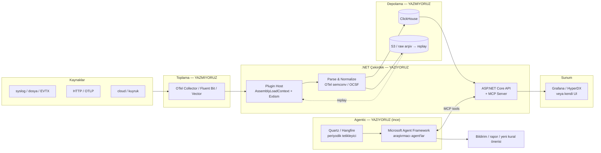

# Log Analyzer — Pazar Araştırması ve Feature Parity

Araştırma tarihi: 2026-08-14. Amaç: plugin tabanlı, çok formatlı/çok dilli log analiz
platformu için piyasa referansı çıkarmak, hangi yeteneklerin "olmazsa olmaz" olduğunu
belirlemek ve **mümkün olduğunca az kod yazarak** open source bileşenlere yaslanan bir
mimari zemin hazırlamak. Teknoloji tercihi: .NET.

## 1. Pazar Haritası

Piyasa dört ayrı katmana ayrışmış durumda. Kritik gözlem: **hiçbir ciddi ürün bu dört**
**katmanı da sıfırdan yazmıyor** — herkes bir katmanda uzmanlaşıp diğerlerini OSS bileşenlerle
dolduruyor.

| Katman | Ticari | Open Source | Notlar |
| --- | --- | --- | --- |
| **Collector / Agent** | Splunk UF, Datadog Agent | **OTel Collector**, **Fluent Bit**, **Vector**, Fluentd, Filebeat | Fluent Bit hâlâ en yaygın K8s agent'ı (1–5 MB/node); sektör OTel'e konsolide oluyor |
| **Pipeline / Transform** | **Cribl Stream**, Chronosphere (Calyptia) | Vector (VRL), OTel Collector (OTTL), Logstash, Bindplane (OSS core) | Cribl'ın satış argümanı: routing + **reduction** (%40+ hacim düşürme) + **replay** |
| **Store / Search** | Splunk, Datadog, Sumo Logic | **ClickHouse/ClickStack**, OpenSearch, Elasticsearch (SSPL), Loki, Quickwit, OpenObserve, Parseable | ClickHouse log analitiğinde Elastic'e göre %60–70 daha ucuz; Elastic tam-metin aramada 3–10x hızlı |
| **Analiz / UX / Detection** | Splunk ES, Sentinel, Sumo | Graylog, SigNoz, Grafana, Wazuh, **Seq** (.NET), HyperDX | Asıl farklılaşma burada — ve senin ürününün yeri de burası |

### Öne çıkan referanslar

- **Splunk** — 1.500+ entegrasyon (çoğu topluluk kaynaklı), SPL, schema-on-read. Ekosistem
büyüklüğü rakipsiz ama plugin kalitesi değişken.
- **Sumo Logic** — Field Extraction Rules (FER): parsing hem ingest'te hem **sorgu anında**
uygulanabiliyor. Yapısal olmayan log için en esnek model. Bizim için doğrudan kopyalanacak fikir.
- **Datadog** — sıralı pipeline'lar; yapıyı **önceden** tanımlamayı zorunlu kılıyor (schema-on-write).
Bu bir zayıflık — bilinmeyen kaynakta işe yaramıyor.
- **Cribl** — pipeline'ı ayrı ürün yaptı: azalt, yönlendir, ucuz depodan **replay** et.
- **Graylog** — Elastic/OpenSearch + MongoDB üstünde olgun, güvenlik/uyumluluk odaklı.
- **Seq (Datalust)** — .NET dünyasının referansı. Signals (kayıtlı filtre kompozisyonu),
`select` ile başlayan sorgu dili, alert → Slack/Teams/SMTP. 2026.1'de metrik desteği eklendi.
**UX açısından en yakın örnek bu.**
- **Wazuh** — güvenlik tarafında decoder + rule ekosistemi olan OSS SIEM.

## 2. Feature Parity Matrisi

Bir aracın "ciddiye alınması" için gereken yetenekler. `MVP` = ilk sürümde şart,
`v2` = ikinci dalga, `Diff` = bizim farklılaşma alanımız.

### 2.1 Ingestion

| Yetenek | Splunk | Datadog | Graylog | Elastic | Loki | ClickStack | Hedef |
| --- | --- | --- | --- | --- | --- | --- | --- |
| Syslog (RFC 3164/5424, TCP/UDP/TLS) | ✅ | ✅ | ✅ | ✅ | ⚠️ | ⚠️ | **MVP** |
| Dosya tail + rotation takibi | ✅ | ✅ | ✅ | ✅ | ✅ | ✅ | **MVP** |
| HTTP/JSON bulk endpoint (HEC benzeri) | ✅ | ✅ | ✅ | ✅ | ✅ | ✅ | **MVP** |
| OTLP (logs) | ✅ | ✅ | ✅ | ✅ | ✅ | ✅ | **MVP** |
| Kafka / mesaj kuyruğu | ✅ | ✅ | ✅ | ✅ | ✅ | ✅ | v2 |
| Windows Event Log (EVTX) | ✅ | ✅ | ✅ | ✅ | ⚠️ | ⚠️ | **MVP** (.NET avantajı) |
| Cloud (S3, CloudTrail, Azure, GCP) | ✅ | ✅ | ⚠️ | ✅ | ⚠️ | ⚠️ | v2 |
| Veritabanı / API polling | ✅ | ✅ | ⚠️ | ✅ | ❌ | ❌ | v2 |
| Backpressure + disk buffer + at-least-once | ✅ | ✅ | ✅ | ✅ | ✅ | ✅ | **MVP** |

### 2.2 Parsing & Normalization — *ürünün kalbi*

| Yetenek | Piyasa durumu | Hedef |
| --- | --- | --- |
| Grok / regex pattern kütüphanesi | Herkeste var; Splunk+Elastic en zengin | **MVP** |
| Deklaratif (YAML/DSL) parser tanımı — kod yazmadan yeni format | Elastic integrations, Fluent Bit parsers | **MVP** |
| Programatik parser (kod ile) | Splunk custom commands, Vector VRL | **MVP** (plugin SDK) |
| **Schema-on-read** (sorgu anında alan çıkarma) | Sumo FER, Splunk | **Diff** |
| **Otomatik format tespiti** (kaynak "bilinmiyor" iken) | Kimsede tam yok | **Diff** |
| **Log template mining** (Drain3 tarzı, bilinmeyen formatı kümeleme) | Sadece araştırma/AIOps ürünlerinde | **Diff** |
| LLM destekli parser üretimi (örnekten grok/DSL yazma) | Yeni yeni çıkıyor | **Diff** |
| Çok dilli mesaj gövdesi (TR/EN/DE/AR/CJK, encoding, tarih/sayı yerelleştirmesi) | **Çoğunda zayıf veya yok** | **Diff** |
| Ortak şema (ECS / OTel semconv / OCSF) | Elastic ECS, AWS/Datadog OCSF | **MVP** |
| PII maskeleme / redaction | Cribl, Datadog | v2 |

<user_quoted_section>Kritik bulgu — şema savaşı bitti: ECS, OpenTelemetry Semantic Conventions'a bağışlandı;OTel semconv artık ECS'in ardılı. Güvenlik tarafında OCSF ayrı ve güçlü (AWS Security Lakeyerel formatı; Datadog, SentinelOne, Rapid7, Palo Alto destekliyor). Yani hedef şema seçimiikili: operasyonel log → OTel semconv, güvenlik olayı → OCSF. İkisi arasında mappingkatmanı gerekir; sıfırdan üçüncü bir şema icat etmek hata olur.</user_quoted_section>

### 2.3 Storage & Query

| Yetenek | Hedef | Not |
| --- | --- | --- |
| Zaman serisi bölümleme + retention politikası | **MVP** |  |
| Hot/warm/cold tiering, S3/object storage | v2 | ClickHouse yerel destekliyor |
| Tam metin arama | **MVP** | ClickHouse token-based; Elastic'ten yavaş ama yeterli |
| SQL veya SQL-benzeri analitik sorgu | **MVP** | ClickHouse'un asıl gücü |
| Kayıtlı sorgu / "signal" kompozisyonu | **MVP** | Seq modeli en iyisi |
| Sıkıştırma / hacim azaltma | v2 | Cribl parity |
| **Replay** (ucuz depodan yeniden işleme) | v2 | Parser düzeltince eski logu yeniden parse etmek için **şart** |

### 2.4 Detection, Alerting, Analiz

| Yetenek | Hedef | Dayanacağımız OSS |
| --- | --- | --- |
| Eşik/oran bazlı alert + bildirim kanalları | **MVP** | — |
| **Sigma kural desteği** (SigmaHQ ekosistemi, binlerce hazır kural) | **MVP** | pySigma / rsigma (Rust) |
| Sigma correlation rules (çoklu kural, zaman penceresi) | v2 | rsigma |
| İstatistiksel anomali tespiti (baseline, seasonality) | v2 | — |
| Threat intel / GeoIP / lookup zenginleştirme | v2 | MaxMind, MISP |
| RCA (kök neden) yardımı | **Diff** | LLM + template mining |

### 2.5 Extensibility — plugin modeli karşılaştırması

| Model | Örnek | Artı | Eksi |
| --- | --- | --- | --- |
| Deklaratif paket (YAML+grok+test) | Elastic integrations, Fluent Bit parsers | Kod yok, kolay katkı, güvenli | Sınırlı ifade gücü |
| DSL script | Vector **VRL**, OTel **OTTL** | Esnek, sandboxed | Yeni dil öğrenme maliyeti; OTTL VRL'den kısıtlı |
| Native assembly | Splunk apps, .NET `AssemblyLoadContext` | Tam güç, tam hız | İzolasyon zayıf, sürüm çakışması, çökme riski |
| **WASM** | **Extism**, Wasmtime | Çok dilli plugin, gerçek sandbox + bellek izolasyonu | Ek karmaşıklık, veri marshalling maliyeti |

<user_quoted_section>.NET tarafında AssemblyLoadContext + AssemblyDependencyResolver runtime'ın parçası;plugin'in .deps.json'ı kendi klasöründen çözülüyor, host ile sürüm çakışması olmuyor.McMaster.NETCore.Plugins v2 (.NET 8+) bunu paketlemiş durumda. Extism ise C#/F# host SDK'sısunuyor ve plugin'i herhangi bir dilde yazmayı mümkün kılıyor.</user_quoted_section>

### 2.6 Operasyon

| Yetenek | Hedef |
| --- | --- |
| Multi-tenancy + RBAC | v2 (tasarımda baştan düşünülmeli) |
| Audit log, değişmezlik (immutability), uyumluluk saklama | v2 |
| Fleet/agent yönetimi (uzaktan config) | v2 |
| Yüksek erişilebilirlik / yatay ölçek | v2 |

## 3. Agentic Katman — Piyasa Durumu

| Seçenek | Durum (2026-08) | Değerlendirme |
| --- | --- | --- |
| **Microsoft Agent Framework** | **1.0 GA — 3 Nisan 2026**. Semantic Kernel + AutoGen birleşimi, .NET & Python, LTS taahhütlü | .NET için **varsayılan tercih**. Multi-agent orchestration, graph-based workflow, MCP + A2A, checkpointing, human-in-the-loop, telemetry |
| Semantic Kernel | Bakımda ama yeni iş için "ardılı Agent Framework" deniyor | Yeni projede tercih edilmez |
| AutoGen | Sadece bugfix + güvenlik yaması | ❌ |
| `Microsoft.Extensions.AI` | .NET AI yığınının temel soyutlaması (`IChatClient`), provider-agnostik | **Kullanılacak** — model sağlayıcı kilitlenmesini önler |
| **MCP C# SDK** | `ModelContextProtocol` 1.4.0 stable (Temmuz 2026), DI + ASP.NET Core + AOT uyumlu | **Kullanılacak** — log sorgulama araçlarını MCP tool olarak açmak, hem iç agent'lar hem Claude/Cursor gibi dış istemciler için tek arayüz |
| Zamanlama (periyodik proaktif agent) | Quartz.NET / Hangfire / Coravel / `BackgroundService` | Kalıcı iş kuyruğu + retry + dashboard gerekiyorsa Hangfire; cron ifade gücü için Quartz |

### AIOps referansları (fikir kaynağı)

- **ARGUS** — sadece OSS gözlemlenebilirlik + açık ağırlıklı LLM ile; ilk aksiyona kadar geçen
süreyi ~90 dk → <5 dk'ya indirmiş, RCA doğruluğu %80–85 olarak raporlanmış.
- **Argos** — LLM ile otonom kural üretimi yapan agentic anomali tespiti.
- **MicLog (AAAI 2026)** — progressive meta in-context learning ile LLM tabanlı log parsing.
- **Drain3** — online log template mining; maskeleme (IP, hex, sayı, e-posta) ile doğruluk artıyor.
Python ve Go implementasyonları mevcut, **.NET portu yok** → ya port edilecek ya sidecar.

## 4. Önerilen Mimari İskeleti (tartışmaya açık)

"Az kod yaz, OSS'e yaslan" ilkesinin somut karşılığı: **collector, pipeline ve storage'ı**
**yazmıyoruz.** .NET'te yazdığımız şey plugin host, normalizasyon/şema katmanı, sorgu/analiz
API'si ve agent katmanı.

### Yazmama kararları (kod bütçesi)

| Bileşen | Yazmıyoruz — kullanıyoruz | Gerekçe |
| --- | --- | --- |
| Log toplama/taşıma | OTel Collector + Fluent Bit | 80+ plugin, savaş testinden geçmiş, backpressure çözülmüş |
| Depolama & sorgu motoru | ClickHouse | Apache 2.0, Elastic'e göre %60–70 ucuz, SQL analitik |
| Detection kuralları | SigmaHQ kural deposu + pySigma/rsigma | Binlerce hazır kural bedavaya gelir |
| Ortak şema | OTel semconv + OCSF | Şema icat etmenin bedeli çok yüksek |
| Grok pattern kütüphanesi | Logstash/Elastic pattern setleri | Yüzlerce hazır pattern |
| Agent orkestrasyonu | Microsoft Agent Framework + MCP SDK | GA, LTS, .NET yerel |
| Dashboard (en azından v1) | Grafana / HyperDX | UI yazmak projeyi 3x büyütür |

## 5. Açık Kararlar

Bunlar netleşmeden teknik plana geçilmemeli:

1. **Ürünün sınırı** — "log analyzer" mı (mevcut store üstünde analiz katmanı), yoksa uçtan uca
 platform mu (kendi ingest + store + UI)?
2. **Birincil kullanım** — güvenlik/SIEM mi, uygulama troubleshooting mi, iş/uyumluluk analitiği mi?
 Bu, OCSF ↔ OTel semconv tercihini ve detection yatırımını belirler.
3. **Plugin sözleşmesi** — deklaratif YAML mı, .NET assembly mi, WASM mı? (üçü birden desteklenebilir
 ama biri "birinci sınıf" olmalı)
4. **Dağıtım** — tek makine self-hosted mu, K8s mi, multi-tenant SaaS mı?
5. **Ölçek** — günlük hacim (GB/TB), kaynak sayısı, retention süresi.
6. **LLM sağlayıcı** — bulut (Anthropic/OpenAI/Azure) mu, yerel (Ollama/vLLM) mi? Log verisi
 dışarı çıkabilir mi?
7. **"Çok dilli" tanımı** — (a) log **mesaj gövdesinin** dili mi (TR/AR/CJK metin, encoding,
 yerelleştirilmiş tarih), (b) plugin'in yazıldığı **programlama dili** mi, (c) ürün **arayüzünün**
 dili mi? Muhtemelen (a)+(b) ama netleşmeli.

## Kaynaklar

- [SigNoz — 11 Best Log Management Tools 2026](https://signoz.io/blog/best-open-source-log-management-tools/)
- [OpenObserve — Best Log Analysis Tools 2026](https://openobserve.ai/blog/best-log-analysis-tools/)
- [SigNoz — Sumo Logic vs Datadog 2026](https://signoz.io/comparisons/sumo-logic-vs-datadog/)
- [DevOpsBoys — Fluentd vs Fluent Bit vs OTel Collector 2026](https://devopsboys.com/blog/fluentd-vs-fluent-bit-vs-otel-collector-2026)
- [Better Stack — Vector Alternatives 2026](https://betterstack.com/community/comparisons/vector-alternatives/)
- [Dash0 — Mastering OTTL](https://www.dash0.com/guides/opentelemetry-transformation-language-ottl)
- [ClickHouse — Observability Cost Optimization Playbook 2026](https://clickhouse.com/resources/engineering/observability-cost-optimization-playbook)
- [Tasrie IT — ClickHouse vs Elasticsearch 2026](https://tasrieit.com/blog/clickhouse-vs-elasticsearch-2026)
- [OpenTelemetry — ECS & OTel Semantic Convention Convergence](https://opentelemetry.io/blog/2023/ecs-otel-semconv-convergence/)
- [Deepwatch — OCSF Enterprise Guide](https://www.deepwatch.com/glossary/open-cybersecurity-schema-framework-ocsf/)
- [SigmaHQ — Sigma Detection Format](https://sigmahq.io/docs/guide/about.html)
- [timescale/rsigma — Sigma detection toolkit](https://github.com/timescale/rsigma)
- [Visual Studio Magazine — Agent Framework 1.0 for .NET and Python](https://visualstudiomagazine.com/articles/2026/04/06/microsoft-ships-production-ready-agent-framework-1-0-for-net-and-python.aspx)
- [Microsoft Learn — Agent Framework Overview](https://learn.microsoft.com/en-us/agent-framework/overview/)
- [Managed Code — Building AI agents in C# and .NET: the 2026 stack](https://www.managed-code.com/blog-post/building-ai-agents-with-csharp-dotnet)
- [Dev Leader — Plugin Architecture in C#](https://www.devleader.ca/2026/04/07/plugin-architecture-in-c-the-complete-guide-to-extensible-net-applications)
- [natemcmaster/DotNetCorePlugins](https://github.com/natemcmaster/DotNetCorePlugins)
- [InfoWorld — Intro to Extism](https://www.infoworld.com/article/2336970/intro-to-extism-a-webassembly-library-for-extendable-apps-and-plugins.html)
- [logpai/Drain3](https://deepwiki.com/logpai/Drain3)
- [awesome-LLM-AIOps](https://github.com/Jun-jie-Huang/awesome-LLM-AIOps)
- [Cribl Stream](https://cribl.io/products/stream/)
- [Datalust — Seq Overview](https://datalust.co/docs/an-overview-of-seq)
- [Forshtec — Splunk vs Sentinel vs Elastic connector packaging](https://forshtec.com/splunk-vs-sentinel-vs-elastic-connector-packaging-certification/)
