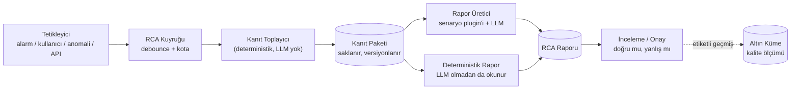

# RCA (Kök Neden Analizi) Raporu Özelliği

2026-08-14. [Mimari kararlar](../mimari-kararlar/index.md) üzerine eklenen özellik.
Dört netleştirme sorusuyla kapsamı bağlandı: **K19–K22**.

## 0. Özet ve kapsam uyarısı

| Soru | Karar |
| --- | --- |
| RCA ürünün neresinde? | **Çekirdek + senaryo** — rapor veri modeli/deposu/UI/export çekirdekte, üreten akış senaryo plugin'inde (K19) |
| Tetikleyici | **Dördü de** — alarm, kullanıcı, anomali zinciri, dış API (K20) |
| Kanıt kapsamı | **Hepsi** — log, değişiklik olayları, metrik, trace, topoloji (K21) |
| Faz | **F3'te deterministik kanıt, F4'te LLM yorumu** (K22) |

<user_quoted_section>Söylemem gereken şey: K21 ("hepsi") bu projedeki tek en büyük kapsamgenişlemesi. Metrik + trace, K1'in "sadece log analiz katmanı" sınırını aşıyor —yeni ingest yolu, yeni şema, yeni sorgu API'si demek. Topoloji ise envanteribaşlı başına bir alt ürüne çeviriyor.
Kapsamı daraltmıyorum, sıralıyorum: kanıt sözleşmesi F3'te beş türü detanır ve RCA motoru hiçbirine özel kod içermez. Log ve değişiklik sağlayıcılarıF3'te iner (ikisi de ucuz). Metrik, trace ve topoloji sağlayıcıları F5'teiner, çünkü her biri kendi ingest+depolama işidir. Bu sıralama kararını sendeğiştirmek istersen tek yeri var: F5'i F3'e çekmek — bedeli F3'ün ~2.5 katınaçıkması.</user_quoted_section>

Ayrıca **change feed (değişiklik olayları) tablosu F1'e giriyor.** Gerekçe ham
arşivle aynı: RCA F3'te gelse bile, F1'den itibaren biriktirmezsen F3'te elinde
**sıfır geçmiş** olur ve özellik boş bir kabukla doğar.

## 1. Neden bu tasarım — piyasa konumu

| Ürün | RCA yaklaşımı | Bizim farkımız |
| --- | --- | --- |
| Datadog **Bits AI SRE** | Agentic araştırma, olay başına ücretlendirme, kapalı | Kanıt paketi açık ve tekrar üretilebilir; yerel model |
| Dynatrace **Davis** | Nedensel (causal) motor, topoloji grafiği üstünde | Davis'in gücü topolojiden geliyor — bizde F5'e karşılık gelen kısım |
| **Elastic** AI Assistant | Runbook'a dayalı, kurumsal doküman merkezli | Bizde kanıt merkezli; runbook v2 |
| **Coroot** | Self-hosted, eBPF + AI RCA | Ağ cihazı/syslog alanı Coroot'un kör noktası |
| **ARGUS** (araştırma) | Sadece OSS + açık ağırlıklı LLM; ~90 dk → <5 dk, %80–85 doğruluk | Doğrudan referans aldığımız model |

Ağ/altyapı logu alanında (K2) agentic RCA yapan olgun bir ürün **yok**. Bits AI ve
Davis uygulama/servis dünyasına bakıyor. Bizim konumumuz burası.

## 2. Temel tasarım ilkesi — kanıt önce, akıl sonra

RCA'nın tek gerçek riski **inandırıcı ama yanlış rapor**. Yerel modelle (K6) bu risk
daha da yüksek. Tasarımın tamamı bu tek riske karşı kurulu:



Üç kural bunu somutlaştırıyor:

1. **Kanıt paketi LLM'siz üretilir ve tek başına değerlidir.** F3'ün çıktısı bu.
 Model kapalıyken bile kullanıcı "pencerede ilk kez şu 3 imza göründü, öncesinde
 şu config değişti, şu 12 cihaz sustu" raporunu alır. Ürün LLM'e bağımlı değil.
2. **Her cümle bir kanıt kimliğine bağlanır.** Rapordaki her bulgu `evidence_id`
 referansı taşır. Halüsinasyona karşı tek işe yarayan savunma bu.

 **Referanssız cümle rapora hiç girmiyor — ama atıldığı sayılıyor ve
 gösteriliyor.** *"Model 12 cümle üretti, 3'ü kanıta bağlanamadı ve
 çıkarıldı."*

 <details>
 <summary>Karar değişti — önceki hâli "rozetle göster"di (2026-08-24)</summary>

 Bu belge önce *"referanssız cümle **desteklenmemiş** rozetiyle gösterilir ve
 güven skoruna katkı vermez"* diyordu. Değiştirildi, çünkü o bir **gösterme**
 kararıydı: model uydurursa rapor onu gösteriyor ama **engellemiyor**.

 Bu depoda *göstermek* ile *engellemek* arasındaki fark yedi kez ölçüldü ve her
 seferinde aynı yöne çıktı — bir rozeti okumayan kullanıcı ikna oluyor, ve
 rozetin kendisi bir süre sonra arayüz gürültüsüne dönüşüyor.

 Ama **yalnızca atmak** da yeterli değildi: o zaman model ne kadar uydurursa
 uydursun kullanıcı bunu göremez ve kalite ölçülemez hâle gelir — *"ölçemedim"*
 ile *"sorun yok"*un aynı çıktıya inmesi, bu deponun dört kez adını koyduğu
 sınıf.

 Seçilen üçüncü yol ikisini ayırıyor: **içerik atılıyor, sayı kalıyor.**
 Kullanıcı uydurmayı görmüyor ama modelin ne kadar uydurduğunu **biliyor**.

 O sayı F4'ün kalite göstergesi oluyor — T38'in `unknown_ratio`'suyla aynı
 rolde: bir oran yüksekse ya kanıt paketi yetersiz ya model uygun değil, ve
 ikisi de kararı gerektiren bilgi.
 </details>
3. **Kanıt paketi saklanır → rapor tekrar üretilebilir.** Aynı paket üzerinde farklı
 modelle rapor yeniden koşturulabilir. Bu, model değiştiğinde regresyon testi
 yapmayı ve iki modeli aynı girdide karşılaştırmayı mümkün kılar.

### 2.1 · Prompt'a ne giriyor — karar (2026-08-25)

K6 *"log verisi kurum dışına çıkmaz"* diyor ve bu **ağ sınırını** çiziyor.
Prompt'un **içeriği** ayrı bir soru: yerel bir model de olsa prompt'un içinde
müşteri log satırları ve onların taşıdığı sırlar var.

İki uç da yanlış:

| | Ham `raw_data` gider | Yalnızca kanıt özetleri gider |
| --- | --- | --- |
| Model ne görür | Log satırının kendisi | *"12 cihaz sustu, 3 yeni imza"* |
| Riski | Prompt'ta müşteri verisi ve sırlar | Bağlam kaybı → **uydurma artar** |

İkincisinin riski sezgiye aykırı ama ölçülebilir: içeriği kısmak halüsinasyonu
azaltmıyor, **artırıyor** — ve §2'nin *"referanssız cümleyi at"* kararı bunun
maliyetini doğrudan yükseltiyor.

**Karar: içerik düzeyi ayarlanabilir bir parametre, sınır değil.**

Üç düzey — `summary` · `masked` · `raw` — ve hangisinin işe yaradığını
**ölçüm söylüyor**: §2 gereği atılan cümle zaten sayılıyor, §3 gereği paket
saklanıyor, yani **aynı paket üzerinde iki düzey karşılaştırılabiliyor.**
Sınırı baştan çizmek yerine sınırı ölçen bir düzenek kuruluyor.

#### Ama bir taban var ve o ayarlanabilir değil

Sır içeren bir satır **hiçbir düzeyde** prompt'a girmemeli. Bu bir parametre
değil bir değişmez.

Ve bugün o tabanı sağlayacak bir bileşen **yok**. Üçü de aday görünüyor ve
üçü de değil:

| Bileşen | Gerçekte ne yapıyor | Neden taban olamaz |
| --- | --- | --- |
| `catalog/masks/*.yaml` | Şablon madenciliği — `IPV4`, `NUMBER` gibi **değişken** kısımları gizliyor | Amacı imza kararlılığı, redaksiyon değil. Maskeleri grok pattern adları; modelin ihtiyacı olan bağlamı siler, sırrı kaçırır |
| `SecretProtector` | Saklanan kanal sırlarını AES-256-GCM ile **şifreliyor** | Girdisi yapılandırma alanı, log metni değil |
| Config scrub (T04) | Cihaz config'inde sır maskeliyor | Girdisi cihaz config'i, log satırı değil |
| **`SecretRedactor`** | **Bilinen** bir sırrı metinden söküyor — parça parça, altı karakter tabanıyla | Girdisi *"şu dizgeyi maskele"*; **keşif yapmıyor.** Prompt'un ihtiyacı ters yön: bilinmeyen bir sırrı **tanımak** |

Son satır bir düzeltme ve nasıl bulunduğu kayda değer: bu tablo önce üç satırdı
ve *"böyle bir bileşen yok"* diyordu. `SecretRedactor` **vardı** ve benim
aramam bulamadı — `graphify query` buldu. Yani tablonun ilk hâli, bu deponun
adını koyduğu şeyin kendisiydi: **aranmamış bir şeyin yok sayılması.**

Sonuç değişmedi ama gerekçe keskinleşti, ve bu fark önemli: taban bir
**ikame** sorunu değil bir **keşif** sorunu. `SecretRedactor` ikame yarısını
zaten çözüyor ve §9 gereği ikinci kopyası yazılmamalı — eksik olan, ona *neyi*
maskeleyeceğini söyleyecek taraf.

Birincisinin yetmeyeceği ayrıca **ölçüldü** — dosyanın kendi altın kümesinden:
`Failed password for admin from 10.1.2.3` girdisi
`Failed password for admin from <IPV4>` çıkıyor. **IP gitti, "password"
durdu.** Yani maske kataloğu, modelin ihtiyacı olan bağlamı silerken sır
sınıfına hiç bakmıyor; kanıtlanmış biçimde bir redaksiyon kapısı değil.

<details>
<summary>Düzeltme: bu paragraf önce yanlış bir ölçüme dayanıyordu (2026-08-25)</summary>

Önceki hâli şuydu: *"ASA'nın gerçek IKEv2 söz dizimi belirteç sınırını
aşıyordu ve ham anahtar normalize edilmiş metinde kalıyordu (FS S01'in
fixture'ları buldu)."*

O ölçüm gerçek, ama **maske kataloğunun değil** — `ConfigNormalizer`'ın
(T04 config scrub, tablonun üçüncü satırı). "Belirteç sınırı" oradaki
`SecretAssignment` deseninin `{0,4}` öneki, "normalize edilmiş metin" de
`ConfigNormalizer.Normalize` çıktısı; ikisi de sınıfın kendi XML yorumunda
yazılı. Yani sonuç doğruydu, **dayanağı yanlış satıra bağlanmıştı**.

Yerine konan ölçüm daha doğrudan: kanıt maske kataloğunun kendi
`golden:` bloğunda duruyor, başka bir bileşenden ödünç alınmıyor.
Ayrıntısı [T41 §2](../tickets-f4/prompt-redaksiyon-tabani/index.md).
</details>

#### Sonucu: bugün yalnızca `summary` sevk edilebilir

`masked` ve `raw` düzeyleri **taban var olana ve kırmızı yanabildiği
ölçülene kadar açılmıyor**. Bu bir erteleme değil bir sıralama: tabanı
olmayan bir düzeyi "şimdilik" açmak, bu deponun yedi kez adını koyduğu şeyi
yapmak olurdu — ölçülmemiş bir sınırı çalışıyor saymak.

Taban ayrı bir kalem ve F4'ün önkoşulu. Kapsamı: log metninde sır tanıma,
kırmızı yanabildiğinin ölçülmesi, ve **neyi tanıyamadığının yazılması** —
çünkü hiçbir redaksiyon kapısı tam değildir ve tam olduğu iddiası, olmadığı
iddiasından tehlikelidir.

O kalem **[T41 — prompt redaksiyon tabanı](../tickets-f4/prompt-redaksiyon-tabani/index.md)**
olarak yazıldı. Ticket bu bölümün bıraktığı soruyu *"log satırında sır neye
benzer?"* üç yaklaşımla (entropi · bilinen anahtar biçimleri · üretici söz
dizimi) açıyor ve **seçmiyor**: seçim ölçütleriyle birlikte açık duruyor.
Yanlış pozitiflerin asimetrisi de orada ölçülü hâliyle duruyor — 87 satırlık
altın korpusta anahtar kelime taraması 3 satır buluyor ve üçünde de sır
**yok**.

## 3. Kanıt sağlayıcı sözleşmesi (F3'te beş tür de tanımlı)

RCA motoru ClickHouse'u **doğrudan sorgulamaz**. Sağlayıcılara sorar:

```csharp
public interface IEvidenceProvider
{
    string   Id       { get; }   // "logs.first-seen", "change.feed", ...
    EvidenceKind Kind { get; }   // Log | Change | Metric | Trace | Topology
    bool     IsAvailable { get; }

    Task<EvidenceSlice> GatherAsync(
        RcaWindow window,      // olay penceresi + baseline penceresi
        AccessScope scope,     // K17 — owner_group zorunlu filtre
        GatherBudget budget,   // süre, satır, token tavanı
        CancellationToken ct);
}
```

| Tür | Sağlayıcılar | Faz | Not |
| --- | --- | --- | --- |
| **Log** | ilk-görülen imza, hacim sapması, sessizlik, ortak öznitelik, yayılma sırası | **F3** | Hepsi düz ClickHouse SQL. Asıl değer burada |
| **Change** | change feed sorgusu (pencere öncesi N dk) | **F3** | Tablo **F1**'de açılır, sağlayıcı F3'te yazılır |
| **Metric** | baseline sapması, eşik ihlali | **F5** | Metrik ingest+depolama gerekir |
| **Trace** | hata yayılımı, servis grafiği | **F5** | Trace ingest+depolama gerekir |
| **Topology** | etkilenen cihazların ortak üst düğümü | **F5** | Envanter ilişki grafiği gerekir |

`IsAvailable=false` olan sağlayıcı raporda **"bu kanıt türü kapalı"** olarak
görünür — sessizce atlanmaz. Rapor okuyanın neye bakılmadığını bilmesi şart.

### 3.1 F3'ün deterministik korelasyonları

LLM'siz, saf SQL. Ağ logu alanında (K2) en yüksek getirili beşi:

| Sinyal | Ne yapar | Neden değerli |
| --- | --- | --- |
| **İlk-görülen imza** | Baseline'da hiç görülmemiş, pencerede beliren Drain3 template'leri | RCA'nın tek en güçlü sinyali. "Yeni bir şey oldu" |
| **Hacim sapması** | Template başına baseline'a göre oran (Poisson/z-score) | Var olan hatanın patlaması |
| **Sessizlik** | Baseline'da düzenli gönderen, pencerede susan kaynaklar | Ağ tarafında kritik — çöken cihaz log göndermez |
| **Ortak öznitelik (lift)** | Etkilenen olayların paylaştığı alan değeri: aynı VLAN, aynı upstream, aynı firmware | "Hepsi aynı switch'in arkasında" — topoloji olmadan topoloji sezgisi |
| **Yayılma sırası** | Kaynak başına ilk bozulma anı, sıralanmış | İlk bozulan çoğu zaman kök nedene en yakın olan |

Bunlar `template_id` alanına dayanıyor → **Drain3 sidecar'ının çıktısı olay**
**tablosunda taşınmalı** (F1 şemasında `template_id` kolonu var, F1'de boş
kalabilir ama kolon açılır).

### 3.2 Kapsam dışı kanıt dürüstlüğü

RCA, sahibinin `owner_group` kapsamıyla sınırlı koşar (K17). Kök neden başka bir
grubun cihazındaysa rapor bunu **bilmeden** yanlış sonuca varır. Karşı önlem:
kanıt toplayıcı kapsam dışında **kaç eşleşme olduğunu** sayar (içeriği değil) ve
rapora şu satırı koyar: *"Kapsamınız dışında 342 ilişkili olay var — tam analiz*
*için X grubunun sahibiyle görüşün."* Bilgi sızdırmaz, yanlış güveni engeller.

## 4. Veri modeli

### 4.1 Kanıt paketi (`evidence_bundle`)

| Alan | Tip | Not |
| --- | --- | --- |
| `id` | UUID |  |
| `gathered_at` | timestamptz |  |
| `window` | jsonb | `{from, to, baseline_from, baseline_to}` |
| `scope` | jsonb | owner_groups, source_ids, hosts |
| `providers` | jsonb[] | her biri: `{id, kind, status, duration_ms, truncated, item_count}` |
| `items` | tablo | aşağıda |
| `out_of_scope_count` | int | §3.2 |
| `content_hash` | text | aynı pencere+kapsam için tekrar üretimi tespit eder |

`evidence_item`: `{id, bundle_id, provider_id, kind, ts, weight, summary, payload jsonb, drilldown_query}`

`drilldown_query` kritik: UI'da her kanıt satırından **ham loga tıklanarak inilir**.
Kanıt gösterip kaynağa götürmeyen rapor güven kazanmaz.

### 4.2 RCA raporu (`rca_report`)

> **Düzeltme (2026-08-26) — statü buraya ait değil.** Aşağıdaki tablo `status`
> ve `trigger` alanlarını rapora koyuyordu. **İkisi de `rca_runs`'a taşındı**
> (T45 getirdi, T46 tamamlıyor) ve `rca_report` **statü taşımayacak**.
>
> Sebep F4'ün bitti tanımındaki kriter: *"kota yüzünden RCA üretilmemiş bir
> alarm, RCA'sı boş çıkmış alarmdan ayırt edilebiliyor."* Bu ayrım
> `QuotaExceeded` (**hiç bakılmadı**) · `Empty` (bakıldı, bulunamadı) ·
> `Cancelled` (başladı, kesildi) durumlarının **karşılaştırılabilir** olmasını
> gerektiriyor. İki tabloya bölünürlerse karşılaştırma bir **join** olur, ve
> join'in iki sessiz hâli var: satır **ikisinde birden** ya da **hiçbirinde**.
> İkisi de belirti üretmez — ekran bir şey gösterir, yanlış olduğunu kimse
> görmez. Yani bölünmüş hâl kriteri sağlıyormuş gibi görünüp tam da kriterin
> kovaladığı sınıfı üretir.
>
> Sınır: **`rca_runs` koşumun başına gelen her şeyin sahibi** (kabul, ret,
> yürütme, sonuç — tek kapalı küme). **`rca_report` üretilen belgenin sahibi**
> (metin, cümle atfı, atılan cümle sayısı). Rapor tarafına statü benzeri bir
> kolon eklenirse bir bekçi kırmızı yanar.
>
> **Ve bu bölümün asıl kusuru bir alan seçimi değil bir kelime:** metin
> *"`status` alanı **zaten** `queued / gathering / …` taşıyor"* diyordu.
> `rca_report` diye bir tablo, varlık ya da statü kümesi **kodda hiç yoktu** —
> tek geçtiği yer bu belgeydi. `AlertRaised` ile aynı sınıf ve ikinci örneği:
> **bir tasarım belgesinde *"zaten"*, doğrulanmadan okunduğunda sıfır maliyet
> iddiası taşıyor.** Öngörülen şema ile bugünkü şema aynı cümlede yazılırsa
> planlama ikisini ayırt edemiyor.

| Alan | Not |
| --- | --- |
| `id`, `created_at` | ~~`status`~~ → `rca_runs` |
| ~~`trigger`~~ | → `rca_runs` (kaynak + soyağacı + ret kaydı orada) |
| `bundle_id` | kanıt paketine bağ |
| `title`, `summary` |  |
| `findings[]` | `{rank, hypothesis, confidence, evidence_ids[], contradicting_evidence_ids[], unsupported: bool}` |
| `timeline[]` | `{ts, kind, summary, evidence_id}` |
| `recommended_actions[]` | `{text, risk, evidence_ids[]}` |
| `model_info` | `{provider, model, prompt_version, tokens_in/out, duration_ms}` |
| `review` | `{state: unreviewed\|correct\|partially\|wrong, reviewer, note, actual_root_cause}` |

`contradicting_evidence_ids` bilinçli: modelden **hipotezini zayıflatan kanıtı da**
**göstermesini** istemek, tek yönlü hikâye anlatmasını ciddi biçimde azaltıyor.

`review` alanı §7'deki kalite ölçümünün tek girdisi. Rapor ekranında "doğru /
kısmen / yanlış + gerçek kök neden" üç tıkla doldurulabilmeli — doldurulmazsa
kalite hiç ölçülemez.

## 5. Tetikleyiciler (K20 — beşi de)

**Dört kaynak, bir devam kuralı** — beşi de tek kuyrukta buluşuyor. Ayrı yollar
olsaydı kota ve döngü koruması beş kez yazılacaktı.

| Tetikleyici | Giriş | Özel gereksinim |
| --- | --- | --- |
| **Alarm / Sigma** | `alert_triggers` tablosuna düşen **satır** | **Debounce + birleştirme**: alarm fırtınasında 500 alarm → 1 RCA. Anahtar: `(rule_id, scope, 10dk pencere)` |
| **Kullanıcı (UI)** | zaman aralığı + kapsam + belirti metni | Kullanıcı başına eşzamanlılık limiti |
| **Dış API** | `POST /api/v1/rca` + `Idempotency-Key` | Aynı anahtar → aynı rapor, yeni koşu değil |
| **`schedule`** | takvim / cron ifadesi | **Kotanın en öngörülebilir tüketicisi.** Diğer üç kaynak olaya bağlı, bu **takvime**: takvimli senaryolar günlük kotayı baştan tüketip olay tetikli bir RCA'yı **kotasız** bırakabilir |
| **Anomali zinciri** ⟳ | *bir kaynak değil:* bir **RCA koşumunun** bulgusu | **Soyağacı**: `root_run_id` + `depth`. `depth ≥ 2` **ya da** tetikleyici anahtarı soyağacında zaten varsa reddedilir |

### İki anahtar, iki soru — ve pencere yalnızca birinde

**Düzeltme (2026-08-26, ölçüldü.)** Bu bölüm ata tekrarı kontrolünü debounce
anahtarıyla aynı yazıyordu: `(rule_id, scope, 10dk pencere)`. **Pencere ata
tekrarı anahtarında olmamalı.**

Gerekçe mekanik: pencere kovası anahtarın parçası olursa `A → B → A` zinciri
kova sınırını aştığı anda kontrolden **kaçıyor** — ve zincirler tam da
**zaman aldıkları için** kova sınırını aşarlar. Yani kaçış istisna değil,
**beklenen hâl**.

Ölçüldü: `LineageKey` bu bölümün yazdığı gibi hesaplandığında
`Dongu_pencere_sinirini_assa_bile_yakalaniyor` **kırmızı yanıyor**. Sapma
teorik değil.

| Anahtar | Soru | Pencere |
| --- | --- | --- |
| `Debounce` | *"Bu tetikleyici bu pencerede zaten koştu mu?"* | **dahil** — sorunun kendisi zamansal |
| `Lineage` | *"Bu tetikleyici bu zincirde zaten koştu mu?"* | **hariç** — soru zamansal değil, soyağaçsal |

Ders bu turda üç kez tekrarlandı ve tersi de aynı: **bir kavramı
tekilleştirmek onu tanıyan predicate'i tekilleştirmekle aynı şey değil**
(baseline'ın iki gösterimi), ve **iki farklı soru tek anahtara sığmıyor**
(burada).

### `schedule` neden çekirdeğe girdi

Plugin formatının **ilk iki gerçek tüketicisi** (kapasite/eğilim raporu, parser
kalite raporu) ikisi de **takvimle** tetikleniyor ve K20'de `schedule` yoktu —
yani ikisi de tetiklenemiyordu.

Bir formatın ilk iki tüketicisinin **çekirdeği değiştirmek zorunda kalması**,
formatın değil **K20'nin** eksikliği. Eklenmesinin gerekçesi bu.

**Değer kümesi kapalı kalıyor** (sabit liste). Açık olsaydı bu bölümün
tek-kuyruk garantisi yeni değerler için **tanımsız** olurdu: yeni bir
tetikleyici eklemek bir **çekirdek** kararı, plugin kararı değil.

⚠️ **Kotayla kesişiyor ve kararı orada:** takvimli kaynak kotayı öngörülebilir
biçimde tükettiği için *"kota tek havuz mu, kaynak başına ayrı mı"* sorusu bu
satırla doğuyor. Bkz. [kota kararı](../f4-kota-karari/index.md).

Dördüncü satır tabloda **kaynak değil devam** olarak duruyor ve sırası bilerek
sonda: girdisi bir sinyal değil, **daha önce koşmuş bir RCA**. Zincirin ilk
halkası her zaman üstteki üç kaynaktan biri.

### `AlertRaised` diye bir olay **yok** — ve tasarım onu varsayıyordu

Ölçüldü: `AlertRaised` adında bir olay, tip ya da yayın depoda **hiç yok**;
ad yalnızca bu belgede geçiyordu. Bugün gerçekten var olan sinyal
`alert_triggers` tablosuna düşen satır — Sigma kuralı da, kullanıcının yazdığı
alarm kuralı da aynı zamanlayıcıdan (`AlertSchedulerWorker`) aynı tabloya
düşüyor, aralarında çalışma zamanında **hiçbir yol farkı yok**.

Bu bir *"henüz yazılmadı"* değil: tasarım bir **olay veri yolu varsayıyordu ve
öyle bir şey yok.** Fark önemli, çünkü birincisi *"gelince bağlarız"* diye
okunur ve F4 planlamasına sıfır maliyetli görünür; ikincisi ise bir olay veri
yolu isteniyorsa **yazılacak iş** olduğunu söylüyor.

### Döngü tespiti neden debounce anahtarıyla yapılamaz

`(rule_id, scope, pencere)` **aynı tetikleyicinin tekrarını** yakalıyor ve
yukarıda alarm satırında tam bu iş için duruyor. Ama `A → B → A` zincirinde
her halka **farklı** bir `rule_id` taşıyabilir; anahtar döngüyü **kaçırır**.

`depth ≤ 2` de tek başına yetmiyor: döngüyü **kısaltır ama engellemez.**
`A → B → A` derinlik 2'de duruyor — ama `A` ikinci kez koştu, aynı rapor iki kez
üretildi ve **kota iki kez ödendi**.

Bu yüzden iki mekanizma birlikte: soyağacı zincirin kendisini, debounce
anahtarı tek tetikleyicinin tekrarını tutuyor. İkisini tek anahtara yüklemek,
farklı iki soruyu aynı yere sormak olurdu.

**Reddedilen koşum kayda geçiyor ve sebebi ayrı tutuluyor:** `depth` sınırı ile
ata tekrarı farklı şeyler söylüyor — biri *"zincir yeterince derine indi"*,
diğeri *"bu zaten koştu"*. Sessizce düşürmek, *"neden RCA üretilmedi"*
sorusunu cevapsız bırakır.

> ⚠️ **Açık, kota kararına bağlı:** reddedilen bir koşum kotadan düşülüyor mu?
> Düşülürse bir döngü kotayı **hiç rapor üretmeden** tüketebilir; düşülmezse
> reddedilen koşum bedava olur ve bir hata döngüsü kotayı hiç zorlamaz.
> Karar kota açık sorusunda.

<details>
<summary>Eski hâli (dört kaynak, <code>AlertRaised</code>) ve neden değişti</summary>

Tablo dördüncü satırı bir **kaynak** olarak sayıyordu ve alarm satırının girişi
`AlertRaised` yayını diye yazılıydı:

| Tetikleyici | Giriş | Özel gereksinim |
| --- | --- | --- |
| **Alarm / Sigma** | detection motoru `AlertRaised` yayınlar | Debounce + birleştirme… |
| **Anomali zinciri** | senaryo → senaryo | Zincir derinliği ≤ 2 ve döngü tespiti |

İki düzeltme, ikisi de ölçümle
([F4 tetikleyici kararı](../f4-tetikleyici-karari/index.md)):

1. **`AlertRaised` kodda yok.** Bağlanma noktası bir tablo satırı.
2. **`schedule` yoktu.** Plugin formatının ilk iki tüketicisi takvimle
   tetikleniyor ve K20 onları tetikleyemiyordu — çekirdeğin eksikliği,
   formatın değil.
3. **Beşinci satır bir kaynak değil.** Zinciri başlatan ilk anomalinin nereden
   doğduğu hiçbir yerde yazılı değildi ve üç aday ölçüldüğünde hiçbiri
   tutmadı: F3'ün korelasyonları bugün **tetiklenemiyor** (hiçbir zamanlanmış
   değerlendirici onları okumuyor), Sigma **zaten** birinci tetikleyici, ve
   geriye yalnızca *"RCA'nın RCA doğurması"* kalıyor — o da bir özyineleme.

Eski hâli saklanıyor çünkü *"dört kaynak"* okuması F4 kapsamını **büyütüyordu**:
tabloda diğerleriyle aynı görünen bir satır, arkasında eşiği ve sıklığı
kararlaştırılmamış bir **dedektör** saklıyordu. Bu deponun "sessiz yanlış
davranış" dediği şeyin planlama katmanındaki hâli.

</details>

Kuyruk risk #6'nın (gürültülü komşu) karşılığı: **eşzamanlılık limiti, koşu başına**
**süre tavanı, token bütçesi ve grup başına günlük RCA kotası** kuyrukta uygulanır,
senaryonun insafına bırakılmaz.

## 6. Rapor ekranı

```wireframe
<!DOCTYPE html>
<html lang="tr">
<head>
<meta charset="utf-8">
<style>
  :root{--bg:#0f1218;--panel:#161b24;--line:#252c38;--tx:#e6eaf2;--dim:#8b95a7;
        --acc:#4c8dff;--warn:#e0a33e;--bad:#e05c5c;--ok:#43b581;}
  *{box-sizing:border-box}
  body{margin:0;background:var(--bg);color:var(--tx);
       font:13px/1.5 -apple-system,Segoe UI,Roboto,sans-serif}
  .top{display:flex;align-items:center;gap:12px;padding:12px 18px;
       border-bottom:1px solid var(--line);background:var(--panel)}
  .top h1{font-size:15px;margin:0;font-weight:600}
  .pill{font-size:11px;padding:2px 8px;border-radius:10px;border:1px solid var(--line);color:var(--dim)}
  .pill.trg{border-color:var(--acc);color:var(--acc)}
  .pill.cf{border-color:var(--warn);color:var(--warn)}
  .wrap{display:grid;grid-template-columns:1fr 340px;gap:0;height:calc(100vh - 49px)}
  .main{overflow:auto;padding:18px}
  .side{border-left:1px solid var(--line);background:var(--panel);overflow:auto;padding:14px}
  .card{background:var(--panel);border:1px solid var(--line);border-radius:8px;
        padding:14px;margin-bottom:14px}
  h2{font-size:12px;text-transform:uppercase;letter-spacing:.06em;color:var(--dim);
     margin:0 0 10px}
  .find{border-left:3px solid var(--acc);padding:8px 0 8px 12px;margin-bottom:14px}
  .find.sec{border-left-color:var(--dim);opacity:.85}
  .find h3{margin:0 0 4px;font-size:14px;font-weight:600}
  .meta{font-size:11px;color:var(--dim);display:flex;gap:10px;margin-bottom:6px}
  .ev{display:inline-block;font-size:10px;font-family:ui-monospace,monospace;
      background:#1d2532;border:1px solid var(--line);border-radius:4px;
      padding:1px 6px;margin:2px 4px 2px 0;color:var(--acc);cursor:pointer}
  .ev.neg{color:var(--warn);border-color:#3a3220}
  .unsup{font-size:10px;color:var(--bad);border:1px solid #3a2222;
         border-radius:4px;padding:1px 6px}
  table{width:100%;border-collapse:collapse;font-size:12px}
  td,th{padding:5px 6px;border-bottom:1px solid var(--line);text-align:left;vertical-align:top}
  th{color:var(--dim);font-weight:500;font-size:11px}
  .tl{font-family:ui-monospace,monospace;font-size:11px;color:var(--dim);white-space:nowrap}
  .prov{display:flex;justify-content:space-between;padding:4px 0;font-size:12px;
        border-bottom:1px solid var(--line)}
  .off{color:var(--dim);font-style:italic}
  .dot{width:7px;height:7px;border-radius:50%;display:inline-block;margin-right:6px}
  .btn{background:#1d2532;border:1px solid var(--line);color:var(--tx);
       border-radius:6px;padding:6px 10px;font-size:12px;cursor:pointer}
  .btn.p{background:var(--acc);border-color:var(--acc);color:#fff}
  .rev{display:flex;gap:6px;margin-top:8px}
</style>
</head>
<body>
<div class="top">
  <h1>RCA-2418 · Ankara-DC çıkış hattı paket kaybı</h1>
  <span class="pill trg">alarm tetikli · SIGMA-net-0042</span>
  <span class="pill">01 Ağu 14:02 – 14:47</span>
  <span class="pill cf">güven: orta</span>
  <span style="flex:1"></span>
  <button class="btn">Markdown</button>
  <button class="btn">Ticket aç</button>
</div>

<div class="wrap">
  <div class="main">
    <div class="card">
      <h2>Özet</h2>
      <p style="margin:0">14:02'de core-sw-02 arkasındaki 14 cihazın tamamında
      daha önce hiç görülmemiş <code>%{BGP_PEER_DOWN}</code> imzası belirdi.
      12 dakika önce aynı cihaza ACL push edilmiş. Etkilenen cihazların ortak
      özniteliği <code>upstream=core-sw-02</code> (lift 8.4×).</p>
    </div>

    <div class="card">
      <h2>Bulgular</h2>

      <div class="find">
        <h3>1 · core-sw-02'ye 13:50'de yapılan ACL değişikliği BGP oturumlarını düşürdü</h3>
        <div class="meta"><span>güven <b style="color:var(--ok)">yüksek</b></span>
          <span>4 destekleyen · 1 çelişen kanıt</span></div>
        <span class="ev">EV-11 değişiklik</span><span class="ev">EV-03 ilk-görülen</span>
        <span class="ev">EV-07 ortak öznitelik</span><span class="ev">EV-09 yayılma</span>
        <span class="ev neg">EV-14 çelişen: 2 cihaz etkilenmedi</span>
      </div>

      <div class="find sec">
        <h3>2 · Firmware 7.4.3 yükseltmesi ile zamansal örtüşme</h3>
        <div class="meta"><span>güven <b style="color:var(--warn)">düşük</b></span>
          <span>1 destekleyen kanıt</span></div>
        <span class="ev">EV-12 değişiklik</span>
      </div>

      <div class="find sec">
        <h3>3 · Yukarı akış sağlayıcıda bakım penceresi olabilir</h3>
        <div class="meta"><span class="unsup">desteklenmemiş — kanıt referansı yok</span></div>
      </div>
    </div>

    <div class="card">
      <h2>Zaman çizelgesi</h2>
      <table>
        <tr><th style="width:88px">Zaman</th><th style="width:96px">Tür</th><th>Olay</th><th style="width:70px">Kanıt</th></tr>
        <tr><td class="tl">13:50:11</td><td>değişiklik</td><td>ACL push · core-sw-02 · aktör: m.yilmaz</td><td><span class="ev">EV-11</span></td></tr>
        <tr><td class="tl">14:02:04</td><td>ilk-görülen</td><td>BGP_PEER_DOWN — baseline'da 0 kez</td><td><span class="ev">EV-03</span></td></tr>
        <tr><td class="tl">14:02:19</td><td>yayılma</td><td>edge-rtr-07 ilk bozulan</td><td><span class="ev">EV-09</span></td></tr>
        <tr><td class="tl">14:04:00</td><td>sessizlik</td><td>3 cihaz log göndermeyi kesti</td><td><span class="ev">EV-05</span></td></tr>
        <tr><td class="tl">14:47:30</td><td>hacim</td><td>Hata oranı baseline'a döndü</td><td><span class="ev">EV-16</span></td></tr>
      </table>
    </div>

    <div class="card">
      <h2>Önerilen aksiyonlar</h2>
      <table>
        <tr><th style="width:60px">Risk</th><th>Aksiyon</th></tr>
        <tr><td style="color:var(--warn)">orta</td><td>13:50'deki ACL değişikliğini geri al, BGP oturumlarını doğrula</td></tr>
        <tr><td style="color:var(--ok)">düşük</td><td>core-sw-02 için BGP_PEER_DOWN üzerine kalıcı alarm kuralı ekle</td></tr>
      </table>
    </div>
  </div>

  <div class="side">
    <h2>Kanıt sağlayıcıları</h2>
    <div class="prov"><span><span class="dot" style="background:var(--ok)"></span>Log · ilk-görülen</span><span style="color:var(--dim)">7 · 240ms</span></div>
    <div class="prov"><span><span class="dot" style="background:var(--ok)"></span>Log · hacim sapması</span><span style="color:var(--dim)">12 · 310ms</span></div>
    <div class="prov"><span><span class="dot" style="background:var(--ok)"></span>Log · sessizlik</span><span style="color:var(--dim)">3 · 90ms</span></div>
    <div class="prov"><span><span class="dot" style="background:var(--ok)"></span>Log · ortak öznitelik</span><span style="color:var(--dim)">4 · 180ms</span></div>
    <div class="prov"><span><span class="dot" style="background:var(--ok)"></span>Değişiklik akışı</span><span style="color:var(--dim)">2 · 20ms</span></div>
    <div class="prov off"><span><span class="dot" style="background:var(--dim)"></span>Metrik</span><span>kapalı — F5</span></div>
    <div class="prov off"><span><span class="dot" style="background:var(--dim)"></span>Trace</span><span>kapalı — F5</span></div>
    <div class="prov off"><span><span class="dot" style="background:var(--dim)"></span>Topoloji</span><span>kapalı — F5</span></div>

    <div style="margin-top:16px;padding:10px;border:1px solid #3a3220;border-radius:6px;
                background:#1d1a12;font-size:12px;color:var(--warn)">
      Kapsamınız dışında <b>342</b> ilişkili olay var. Tam analiz için
      <b>network-core</b> grubunun sahibiyle görüşün.
    </div>

    <h2 style="margin-top:18px">Model</h2>
    <table>
      <tr><td style="color:var(--dim)">Sağlayıcı</td><td>vLLM (GPU cluster)</td></tr>
      <tr><td style="color:var(--dim)">Model</td><td>qwen3-32b-instruct</td></tr>
      <tr><td style="color:var(--dim)">Prompt sürümü</td><td>rca/v4</td></tr>
      <tr><td style="color:var(--dim)">Token</td><td>18.4k / 1.2k</td></tr>
    </table>

    <h2 style="margin-top:18px">Bu rapor doğru muydu?</h2>
    <div class="rev">
      <button class="btn p">Doğru</button>
      <button class="btn">Kısmen</button>
      <button class="btn">Yanlış</button>
    </div>
    <div style="font-size:11px;color:var(--dim);margin-top:8px">
      Cevabın altın kümeye yazılır; RCA doğruluğu bununla ölçülür.
    </div>
  </div>
</div>
</body>
</html>
```

Ekranda bilinçli olan üç şey: **kapalı sağlayıcılar görünüyor**, **desteklenmemiş**
**bulgu kırmızı rozetle işaretli**, ve **çelişen kanıt bulgunun yanında duruyor**.
Üçü de raporu okuyanın körü körüne güvenmesini zorlaştırmak için.

## 7. Kalite ölçümü — altın küme

Yerel model kararı (K6) RCA'yı doğrudan riske sokuyor. Ölçmeden bilinemez:

1. Rapor ekranındaki üç düğme (`doğru / kısmen / yanlış` + gerçek kök neden)
 incelenmiş raporları **altın kümeye** yazar.
2. Altın küme = `(kanıt paketi, gerçek kök neden)` çiftleri. Kanıt paketi saklandığı
 için **aynı girdide farklı model/prompt koşturulabilir**.
3. Ölçülen: *ilk bulguda doğru oranı*, *ilk üçte doğru oranı*, *desteklenmemiş cümle*
* oranı*, *ortalama süre*.
4. Model veya prompt değiştiğinde bu küme regresyon testidir. ARGUS'un raporladığı
 %80–85 bandı hedef referans.

Bu, "yerel model yeterli mi?" sorusunun tek dürüst cevabı. Altın küme F3'ten
itibaren birikmeye başlamalı — F4'te sıfırdan başlanırsa modeli seçecek veri olmaz.

## 8. Senaryo plugin'i olarak RCA (K19 + K9 + K15)

Rapor **üretimi** senaryo plugin'i. Çekirdek olan: kuyruk, kanıt sağlayıcıları,
rapor deposu, UI, export. K15'in "her adım tek iş" kısıtı burada da geçerli:

```yaml
apiVersion: bizigo.dev/v1
kind: Scenario
metadata:
  id: builtin.rca.network
  version: 1.0.0
  owner: platform-team
spec:
  trigger:
    on: [alert, manual, anomaly, external]     # K20
  evidence:
    providers: [logs.first-seen, logs.volume, logs.silence,
                logs.attribute-lift, logs.propagation, change.feed]
    window:
      lead: 30m          # ⚠ seçildi, ölçülmedi — §8.1
      # `baseline` BİLEREK ÖRNEKLENMİYOR. T35 süpürmesi bir sayı üretmedi:
      # dik kuyruk → 7g, düz kuyruk → 1g, "seçilebilir taban yok". Buraya bir
      # sayı yazmak, aksi ölçülmüş bir sayıyı ölçülmüş gibi çoğaltmak olurdu.
      # Senaryoyu yazan kendi verisinde ölçüp yazacak — ölçümün tarifi §8.1'de.
      # ŞART (F4 motoru): `baseline` zorunlu alan olmalı ve eksikse senaryo
      # YÜKLENMEMELİ. Varsayılan verilirse bu satırın hiçbir anlamı kalmaz.
    budget: { max_items: 400, max_duration: 60s }   # ⚠ ölçülmedi VE koddan farklı — §8.1
  steps:
    - id: rank-hypotheses
      task: "Kanıt listesinden en fazla 3 hipotez sırala."
      input: evidence.summary
      output:                      # tek iş, tek sözleşme
        schema: hypothesis_list
        max_items: 3            # ⚠ seçildi, ölçülmedi — §8.1
    - id: bind-evidence
      task: "Her hipotezi destekleyen ve çelişen kanıt kimliklerini eşle."
      input: [steps.rank-hypotheses, evidence.items]
      output:
        schema: evidence_binding
        constraint: evidence_ids_must_exist    # halüsinasyon kapısı burada kapanır
    - id: write-actions
      task: "En üst hipotez için en fazla 2 aksiyon öner."
      input: steps.bind-evidence
      output:
        schema: action_list
        max_items: 2            # ⚠ seçildi, ölçülmedi — §8.1
  publish:
    requires_review: true          # K16 — aksiyon alan senaryo onaysız yayınlanmaz
```

### 8.1 · Formattaki sayıların hiçbiri ölçülmedi (2026-08-25)

Yukarıdaki YAML **altı sabit** taşıyor ve altısının da gerekçesi hiçbir yerde
yok. Ölçüldü: her biri bu belgede **tam bir kez** geçiyor — yani seçildikleri
an tartışılan alternatifler kayıtta değil.

| Sabit | Ne yapıyor | Bugünkü zemin |
| --- | --- | --- |
| `lead: 30m` | Olay penceresi | Seçildi. Ölçülmedi |
| ~~`baseline: 7d`~~ | Taban penceresi | **Ölçüldü, çürüdü, formattan ÇIKARILDI** (2026-08-25) — aşağıda |
| `max_items: 400` | Kanıt bütçesi | Seçildi, ölçülmedi, **ve koddaki karşılığıyla aynı şeyi söylemiyor** |
| `max_duration: 60s` | Toplama tavanı | Seçildi, ölçülmedi, **kodda 20s** |
| `max_items: 3` | Hipotez tavanı | Seçildi. Ölçülmedi |
| `max_items: 2` | Aksiyon tavanı | Seçildi. Ölçülmedi |

**`baseline: 7d` özel bir durum ve bu belgenin en tehlikeli satırı.** T35'in
baseline süpürmesi koştu ve şunu üretti:

```
dik kuyruk (zipf 2.0) → dirsek 7g
düz kuyruk (zipf 1.4) → dirsek 1g
SEÇİLEBİLİR TABAN YOK.
```

Dirsek tohumlama düğmesiyle **yedi kat** kayıyor. Yani `7d` yalnızca
gerekçesiz değil — **aksi ölçülmüş** bir sayı. Formatta durması onu ölçülmüş
gibi gösteriyor, ve bir format örneği kopyalanarak çoğalır.

#### Bunun nasıl bulunduğu, bulunanın kendisinden önemli

`7d`'yi fark ettim çünkü **onu ölçmüştüm**. Diğer beşini aramadım — ve
arayınca beşinin de aynı durumda olduğu çıktı. Yani ilk tepkim *"şu sayıyı
düzelteyim"* olsaydı, bildiğim biri düzelir, bilmediğim beşi
**ölçülmüş görünmeye devam ederdi.**

Bu, [gerekçesi kayıtta olmayan sabit](../../wiki/concepts/olcum-gerekcesiz-sabit.md)
sayfasının anlattığı boşluğun aynısı, ve o sayfanın envanteri bu altısını
içermiyordu — çünkü onlar koddaki sabitleri sayıyordu, **bir tasarım
belgesindeki format örneğini** değil.

Altısı 2026-08-25'te o sayfaya eklendi, ve eklenirken ikinci bir boşluk çıktı:
sayfa tablosunda kaynak olarak bu belgeyi gösteriyordu ama `sources:`
bildiriminde **yoktu** — yani damga bekçisi onu izlemiyordu ve §8.1
değiştiğinde sayfa bayat sayılmayacaktı. Gövdede anılan ile frontmatter'da
bildirilenin ayrışması, sayfanın kendi anlattığı sınıfın kendisine uygulanmış
hâli. Kaynak eklendi.

#### Kural

Bir spec örneğindeki her sayı ya **ölçülmüş** ya **seçilmiş ve gerekçeli** ya
da **açıkça işaretli** olmalı. Üçüncüsü kabul edilebilir; işaretsiz olan
değil — çünkü işaretsiz bir sayı, okuyan için ölçülmüş bir sayıdan ayırt
edilemez.

F4 başladığında altısı da ölçülecek. `7d` ise ölçülene kadar formatta
**kalmamalı**: aksi ölçülmüş bir sayı, gerekçesiz bir sayıdan daha kötü.

#### `baseline` formattan çıkarıldı — yerine ne kondu (2026-08-25)

Ölçüt şuydu: **format örneği kopyalanarak çoğalır; kopyalayan ne görmeli?**
Dört seçenek tartıldı:

| Seçenek | Kopyalayan ne görür | Neden seçilmedi |
| --- | --- | --- |
| Anahtarı tamamen sil | Taban penceresi diye bir kavram yokmuş gibi | Kavram şart — "ilk-görülen imza" tabansız çalışmıyor. Ölçülmemiş olan sayı, kavram değil |
| `baseline: null` | Yüklenen ama tabansız bir senaryo | Sessiz yanlış davranış: taban yokken her imza "ilk-görülen" olur ve ürün gürültü makinesine döner |
| Başka bir sayı (`14d`, `30d`…) | Ölçülmüş bir sayı | Aynı kusurun yeni değeri. Süpürme *"seçilebilir taban yok"* dedi; herhangi bir sayı o cümleyi yalanlar |
| **Anahtar örneklenmiyor + şart yazılı** | Yazması gereken bir alan, ve nasıl ölçüleceği | **Seçilen.** Kopyalayan eksik alanla kalıyor ve motor onu reddediyor — sessizce çalışan bir senaryo doğmuyor |

Seçilenin bedeli açık: örnek YAML **olduğu gibi yüklenmiyor**. Kabul edildi —
yüklenebilir bir örnek, ancak ölçülmemiş bir sayı taşıyarak yüklenebilirdi.

**Şart F4 motoruna yazıldı:** `baseline` zorunlu alan olmalı ve eksikse senaryo
yüklenmemeli. Varsayılan verilirse bu bölümün tamamı etkisiz kalır — varsayılan,
formattaki sayının kod tarafındaki hâlidir.

#### Formattaki iki sayı koddakiyle aynı şeyi söylemiyor (2026-08-25)

`baseline`'ı çıkarırken diğer beşine bakıldı ve ikisinde **belgeyle kodun
ayrıştığı** görüldü. Bu, "ölçülmemiş sayı"dan ayrı ve daha sinsi bir kusur:
sayı yalnızca gerekçesiz değil, **iki yerde farklı**.

| | Belge (§8 YAML) | Kod (`GatherBudget`) |
| --- | --- | --- |
| Birim | `budget:` tek blok, üstünde **altı** sağlayıcı → **toplam** gibi okunuyor | *"Tavan **sağlayıcı başına** uygulanıyor"* — açık yorum |
| `max_items` | 400 | 400 · **sağlayıcı başına** → altı sağlayıcıda 2400'e kadar |
| `max_duration` | **60s** | **20s** |

İkisi de sessiz: YAML'ı okuyan 400 kanıt bekliyor, motor 2400'e kadar
toplayabiliyor; 60 saniye bekliyor, sağlayıcı başına 20 saniye uygulanıyor.
Hangisinin doğru olduğu bir **karar** ve bu bölümün sahibinin tek başına
vereceği bir karar değil — burada yalnızca ayrışma kaydediliyor ve YAML'a
işaretlendi. F4'ün ilk işi bu ikisini tek gerçeğe indirmek olmalı; ölçüm ondan
sonra anlamlı.

#### Kalan beş sabit — sayı önerilmiyor, **ölçüm tarif ediliyor**

Bu bölümün kuralı gereği buraya sayı yazılmadı. Yazılan şey, *ne ölçülürse o
sayının seçilebileceği*.

| Sabit | Ölçülecek şey | Ön koşul | Dirseğin anlamı |
| --- | --- | --- | --- |
| `lead: 30m` | Altın kümedeki her olay için, pencere büyüdükçe (5dk…4sa) olayın **gerçek kanıtının** ne kadarı içeri giriyor ve ne kadar ilgisiz kanıt giriyor | Altın küme, **etiketli kanıtla** | Geri çağırmanın doyduğu yer |
| `max_items: 400` | Kanıt sayısı arttıkça (25·50·100·200·400·800) **en üst hipotez kaç kez değişiyor** | Altın küme + sabit model | Hipotezin değişmeyi bıraktığı yer |
| `max_duration` | Sessiz makinede toplama süresinin **dağılımı** (p50/p95), tek sayı değil | Sessiz makine (§6) | — |
| `max_items: 3` | Altın kümede **gerçek kök nedenin sırası**: kaçıncı hipotezde çıkıyor | Altın küme, **etiketli kök nedenle** | Marjinal geri çağırmanın durduğu sıra |
| `max_items: 2` | **Ölçülemiyor** — aşağıda | — | — |

**`lead` ile `baseline` ayrı ayrı ölçülemez.** T35 süpürmesi tabanı süpürürken
olay penceresini **45 dakikada sabitledi**; `lead` değişirse eğri de değişir.
İkisi tek bir yüzey olarak süpürülmeli, yoksa ikinci sayı birincinin
varsayımına dayanmış olur ve o varsayım kayıtta durmaz.

**`max_duration` bir duvar saati sayısı ve §6 doğrudan uygulanıyor:** yüklü
makinede sağlıklı bir toplama tavanı aşar, hızlı makinede tehlikeli bir toplama
sığar. Tek bir saniye seçmek yerine ölçülmesi gereken şey dağılım; tavan da
mutlak yerine **aynı koşumda alınan bir tabana oran** olmalı. Bugünkü `60s`/`20s`
ikilisi zaten bu tartışmanın hiç yapılmadığının kanıtı.

**`max_items: 2` (aksiyon) bu araçlarla ölçülemez.** Diğer dördü bir geri
çağırma ya da yakınsama sorusu; bu bir **insan dikkati** sorusu ve cevabı ancak
sahadan gelir (önerilen aksiyonların kaçı uygulandı). Buraya bir ölçüm tarif
etmek, ölçülemeyecek bir şeyi ölçülebilir göstermek olurdu. Bölümün üçüncü hâli
tam da bunun için var: **açıkça işaretli**. Kalıcı olarak öyle kalabilir.

#### Aramadıklarım

- **Altın kümenin (T37/T38) etiketli kanıt ve etiketli kök neden taşıyıp
taşımadığına bakmadım.** Yukarıdaki dört ölçümün üçü buna dayanıyor; taşımıyorsa
o üçü de ölçülemez ve önce küme etiketlenmeli.
- **K6'nın yerel model bağlam bütçesini token cinsinden kaydedip
kaydetmediğine bakmadım.** `max_items: 400`'ün ikinci gerekçesi (prompt'a kaç
kanıt sığıyor) buna dayanıyor.
- §2.1'e (prompt'a ne giriyor) baktım: **kanıt sayısına dair bir sınır yok** —
içerik düzeyi ayarlanabilir bir parametre, adet sınırı değil. Yani `max_items`
prompt tarafından ikinci kez sınırlanmıyor.
- Kanıt toplayıcının kırpmayı **bildirip bildirmediğine baktım: bildiriyor.**
`EvidenceSlice.Truncated` var ve `EvidenceBundle` onu paket düzeyine taşıyor.
Yani bütçe aşıldığında rapor "eksik kanıtla kuruldu" diyebiliyor; bu kalem
kapalı.

`constraint: evidence_ids_must_exist` **motorda zorlanır**, prompt'ta rica edilmez:
var olmayan bir `evidence_id` üreten adım reddedilir ve bir kez yeniden denenir.
Bu üç adımın her biri tek iş yaptığı için yerel model kısıtına (K6/K15) uyuyor —
tek büyük "kök nedeni bul ve raporla" prompt'u yazılamıyor.

## 9. Fazlara dağılım

| Faz | RCA'ya düşen iş |
| --- | --- |
| **F1** | `change_events` tablosu + yazma API'si; olay şemasında `template_id` kolonu; kapsam filtresinin tek kapıdan geçmesi |
| **F2** | Değişiklik olayı girişi (manuel + API), RCA olmadan da işe yarar |
| **F3** | Kanıt sağlayıcı sözleşmesi (5 tür tanımlı), log + change sağlayıcıları, kanıt paketi deposu, **deterministik rapor**, rapor UI'ı, export, inceleme düğmeleri, altın küme |
| **F4** | RCA senaryo plugin'i, LLM adımları, `evidence_ids_must_exist` zorlaması, dört tetikleyicinin tamamı, kuyruk kotası |
| **F5** | Metrik, trace, topoloji sağlayıcıları (**yeni ingest+depolama** — K1 genişliyor) |

## 10. Açık riskler

1. **K21'in maliyeti** — metrik+trace+topoloji, ürünü "log analiz katmanı"ndan
 "gözlemlenebilirlik platformu"na taşıyor. F5 ayrı bir proje büyüklüğünde;
 F1–F4 bittiğinde yeniden kapsam kararı verilmeli.
2. **İnceleme yorgunluğu** — kimse "doğru muydu?" düğmesine basmazsa altın küme
 boş kalır ve kalite ölçülemez. Karşı önlem: alarm tetikli RCA'larda inceleme,
 alarmı kapatma akışının **zorunlu** parçası olsun.
3. **Alarm fırtınası** — debounce yanlış ayarlanırsa ya RCA seli olur ya da gerçek
 ikinci olay birleştirilip kaybolur. Birleştirme anahtarı ölçülerek ayarlanmalı.
4. **Değişiklik akışı boş kalırsa** RCA'nın en güçlü sinyali yok olur. F1'de tablo
 açmak yetmez; kurumun config/deploy araçlarından besleme F2'de gerçekten
 bağlanmalı. Aksi halde F3'te "değişiklik yok" diyen bir sağlayıcı olur.
5. **Çelişen kanıt tiyatrosu** — model, çelişen kanıt alanını doldurmak için
 önemsiz bir şey uydurabilir. Altın kümede bu ayrıca ölçülmeli.

## Kaynaklar

- [Datadog Bits AI SRE](https://www.datadoghq.com/product/ai/bits-ai-sre/)
- [Neubird — Best Root Cause Analysis Tools 2026](https://neubird.ai/blog/root-cause-analysis-tools/)
- [Metoro — Best AI-Powered Observability Tools 2026](https://metoro.io/blog/best-observability-tools-with-ai)
- [Logz.io — AI Observability Tools and RCA](https://logz.io/blog/ai-powered-observability-tools-root-cause-analysis/)
- [Sherlocks — Top RCA Tools for Production Incidents 2026](https://www.sherlocks.ai/discover/root-cause-analysis-tools)
