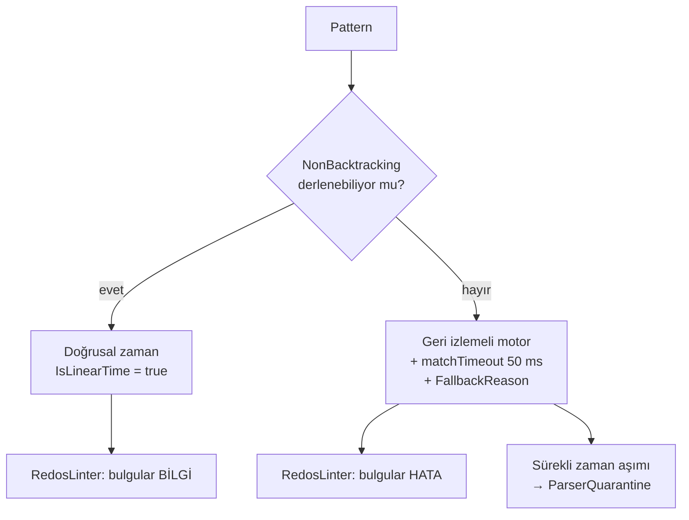

# T05 — parser motorunda alınan kararlar

> **Bu belge geriye dönük yazıldı:** kaynağı kod, commit geçmişi ve F1
> kapanışı. Ticket koşulurken tutulmuş bir karar günlüğü **değil**. Burada
> yazan gerekçeler kodun bugünkü hâlinden çıkarıldı; o an tartışılıp reddedilen
> alternatifler kayıtta yok.

Uygulanan yer: `src/Bizigo.Parsing/` (`Grok`, `Schema`, `Engine`, `Testing`) +
`src/Bizigo.Cli/`. Yöneten kararlar: [K3](../mimari-kararlar/index.md) (deklaratif
YAML + grok birinci sınıf), K4 (çok dillilik), K15 (format "her adım tek iş"i
zorlar).

## 1 · Motorun taşıyıcı kararı: ReDoS savunması üç kademeli

Kodda görünen yapı şu — ve üç kademenin **her biri** ayrı bir soruya cevap
veriyor:

**Kademeler arasındaki asıl karar, bulgu şiddetinin motora göre değişmesi.**
`NonBacktracking` ile derlenen bir ifade zaten doğrusal; orada `(a+)+` için hata
vermek gerçek bulguları gürültüde boğardı. Bu ayrım olmasa linter ya çok
gürültülü ya yanlış güven verici olurdu — ikisi de onu kullanılmaz yapar.

**Kayıtta olmayan:** `NonBacktracking`'in ilk sırada denenmesi ile
`matchTimeout`'un 50 ms seçilmesi kodda sabit duruyor; 50 ms'in nasıl seçildiği
(ölçüm mü, tahmin mi) **koddan okunmuyor** ve gerekçesi kayıtta yok.

## 2 · Bugün duran bekçiler ve ne tuttukları

| Bekçi | Ne tutuyor |
| --- | --- |
| `GrokPatternLibraryTests` | Upstream setlerin **tamamı** derleniyor. Logstash yükseltmesi bir pattern'i bozarsa CI'da görünüyor — sessizce eksik yüklenmiyor |
| `RedosTests` | Linter'ın gerçek desenleri yakaladığı. T08'de üretimde işe yaradı: `CISCO_REASON`'daki `(?:%{WORD}\s*)*` GROK001 ile yakalandı |
| `GrokCompilerTests` | Upstream'in .NET'in kabul etmediği yapıları (`X?*`, `\h`, `[[:alnum:]]`) çevriliyor — pattern dosyasına dokunmadan |
| `ParserQuarantineTests` | Sürekli zaman aşımı veren parser karantinaya giriyor |
| `ParserYamlLoaderTests` | Bilinmeyen anahtar **hata** ve öneri üretiyor |
| `ParserEngineTests` | Adım tiplerinin davranışı, `on_failure` yolları |

### `GrokPropertyTests` — bu turda düzeltilen bekçi

Test 5 000 rastgele pattern üretip **tek bir iddia** sınıyor: motor ya çalışır ya
`GrokCompilationException` ile reddeder. Başka istisna tipi çıkarsa ingest süreci
düşer; o istisna yalnızca parser'ı reddeder.

Düzeltmeden önce test, doğrusal olmayan her ifadeyi `Stopwatch` ile **2 saniyelik
mutlak bir bütçeye** karşı ölçüyordu. O bütçe pattern'in davranışını değil
**makinenin hızını** ölçüyordu: test tek başına geçiyor, eşzamanlı bir Release
build varken düşüyordu — yani sağlıklı bir eşleşme "bozuk pattern" diye
raporlanıyordu.

Düzeltme iddiayı **süreden yapıya** çevirdi: doğrusal zaman garantisi olmayan her
ifade, **neden olmadığını söyleyebilmeli** (`FallbackReason` dolu olmalı). Bu,
ürünün gerçek sözleşmesi — `parser lint` çıktısı ve yayın kapısı tam olarak o
alana bakıyor. Ölçülen etki: **2 dk 36 sn → 6 sn**.

Sonsuz döngü bu değişiklikle görünmez olmuyor: bir asılma zaten asılmadır ve
koşum zaman aşımına uğrar. Kaybolan tek şey, yüklü bir makinede sağlıklı kodu
suçlayan bir bütçe.

**Testin kendi bekçileri var** ve bunlar iddianın boş geçmesini engelliyor:
`compiled > 100`, `rejected > 100`, `backtracking > 0`. Üreteç bir gün yalnızca
doğrusal ifadeler üretmeye başlarsa "doğrusal olmayan ifade sebebini söylüyor"
iddiası her durumda doğru olur ve **hiçbir şey sınamaz**.

## 3 · Formatın kendisi hakkında alınan kararlar

Bunların hepsi kodda görünüyor; gerekçeleri ticket'ın kapanış notundan ve
davranıştan çıkarıldı.

| Karar | Kodda nerede | Neden |
| --- | --- | --- |
| `on_failure` varsayılanı **`fail`** | `PipelineStep.OnFailure` | Dispatcher'ın "ilk `ok` kazanır" kuralı ancak eşleşmeyen parser açıkça başarısız olunca anlam kazanıyor. `continue` varsayılan olsaydı her parser her satırı sahiplenirdi |
| Şablon çözülemezse **atama yapılmaz** | `TemplateRenderer` | Boş string, olayda "kaynak IP boş" gibi görünüp sorguyu sessizce kirletirdi. T08'de RouterOS kuralın sonucunu içermeyen satırlarda bunun karşılığını verdi |
| Bilinmeyen YAML anahtarı **hata** + öneri | `ParserYamlLoader.RejectUnknownKeys` | `seperator` yazan kişinin parser'ının neden çalışmadığını saatlerce aratmamak |
| Eşleme tabloları **veri**, bilinmeyen tablo derleme hatası | `MappingTableCatalog` | Şema `map.ocsf.activity_id`'yi kabul edip motor çözemezse alan sessizce boş kalırdı |
| Koşul/döngü **yok** | Şemada karşılığı yok | K15. Bedeli T08'de ölçüldü: 4 vendor → 8 parser |

## 4 · Açıkta kalanlar

| # | Ne | Durum |
| --- | --- | --- |
| T08 #5 | `map` dallanamıyor → `extends:` | **Açık.** F2'ye ertelendi, T19 kapsamına alınmadı: parser'lar arası kalıtım motor işi ve tasarımı tek başına bir tartışma |
| T08 #10 | `matchTimeout` duvar saati ölçüyor | **Açık.** Yük altında sağlıklı satır `failed` düşüyor; öneriler (`engine_busy` statüsü, karantinanın orana bakması, doğrusal ifadede `InfiniteMatchTimeout`) yazıldı, uygulanmadı |
| — | 50 ms `matchTimeout` değerinin gerekçesi | **Kayıtta yok** |
| T08 #4 | `match` bir doğruluk garantisi değil | **Kısmen.** Katalog kuralı "kapı adımı" oldu; formatta yazılı değil. T19'un editör iskeleti bunu yorumla öğretiyor |

**Kapanan:** T08 #6 (`expect` "alan yok" diyemiyor) T19'da kapandı — düz
`null`/`~` skaleri artık gerçek `null`. Ayrıntısı
[T19 kararları](../t19-kararlar/index.md)'nda.

## 5 · Sonraki ticket'lara devredilen ve ne oldu

| Devir | Sonucu |
| --- | --- |
| T06 · `match.contains` literalleri şemada hazır | Aho-Corasick otomatı ve `specificity` sıralaması dispatcher'da kuruldu |
| T07 · `catalog/mappings` başlangıç seti | OCSF/OTel türetmesi ClickHouse görünümüne taşındı (K30) — motor `core`'u dolduruyor, görünüm türetiyor |
| T12 · `ParserQuarantine` motorda hazır | Sıcak yolda `ParseResult.TimedOut`'a bağlandı |
| F2 · `parser try` UI editörünün temeli | T19: `POST /v1/parsers/try` taslak YAML kabul ediyor, kapı kararı satır numarasıyla dönüyor |
