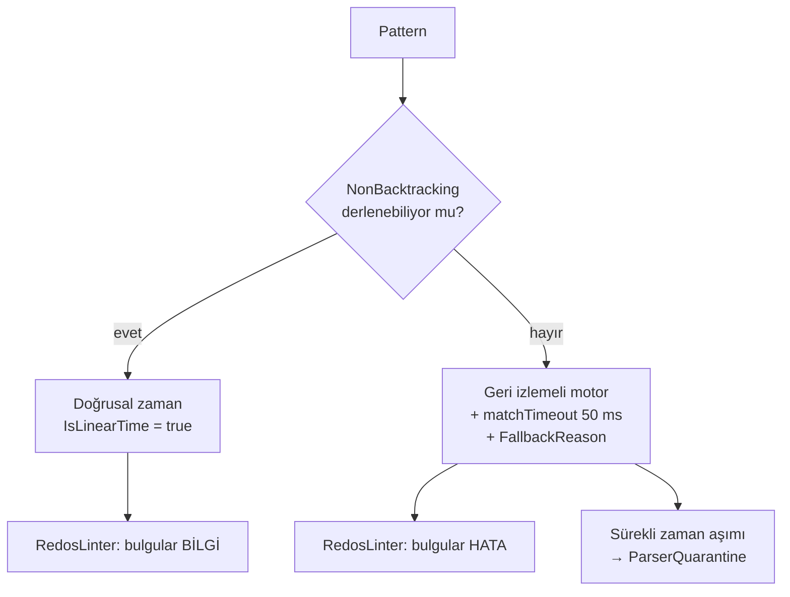

# T05 — parser motorunda alınan kararlar

> **Bu belge geriye dönük yazıldı:** kaynağı kod, commit geçmişi ve F1
> kapanışı. Ticket koşulurken tutulmuş bir karar günlüğü **değil**. Burada
> yazan gerekçeler kodun bugünkü hâlinden çıkarıldı; o an tartışılıp reddedilen
> alternatifler kayıtta yok.

Uygulanan yer: `src/Bizigo.Parsing/` (`Grok`, `Schema`, `Engine`, `Testing`) +
`src/Bizigo.Cli/`. Yöneten kararlar: [K3](../mimari-kararlar/index.md) (deklaratif
YAML + grok birinci sınıf), K4 (çok dillilik), K15 (format "her adım tek iş"i
zorlar).

## 1 · Motorun taşıyıcı kararı: ReDoS savunması üç kademeli

Kodda görünen yapı şu — ve üç kademenin **her biri** ayrı bir soruya cevap
veriyor:



**Kademeler arasındaki asıl karar, bulgu şiddetinin motora göre değişmesi.**
`NonBacktracking` ile derlenen bir ifade zaten doğrusal; orada `(a+)+` için hata
vermek gerçek bulguları gürültüde boğardı. Bu ayrım olmasa linter ya çok
gürültülü ya yanlış güven verici olurdu — ikisi de onu kullanılmaz yapar.

**Kayıtta olmayan:** `NonBacktracking`'in ilk sırada denenmesi ile
`matchTimeout`'un 50 ms seçilmesi kodda sabit duruyor; 50 ms'in nasıl seçildiği
(ölçüm mü, tahmin mi) **koddan okunmuyor** ve gerekçesi kayıtta yok.

## 2 · Bugün duran bekçiler ve ne tuttukları

| Bekçi | Ne tutuyor |
| --- | --- |
| `GrokPatternLibraryTests` | Upstream setlerin **tamamı** derleniyor. Logstash yükseltmesi bir pattern'i bozarsa CI'da görünüyor — sessizce eksik yüklenmiyor |
| `RedosTests` | Linter'ın gerçek desenleri yakaladığı. T08'de üretimde işe yaradı: `CISCO_REASON`'daki `(?:%{WORD}\s*)*` GROK001 ile yakalandı |
| `GrokCompilerTests` | Upstream'in .NET'in kabul etmediği yapıları (`X?*`, `\h`, `[[:alnum:]]`) çevriliyor — pattern dosyasına dokunmadan |
| `ParserQuarantineTests` | `ParserQuarantine` **sınıfının** eşik/pencere mantığı. Sınıfın sıcak yola bağlı olduğunu **tutmuyor** — bağlı değil, bkz. §4 ölçüm 4 |
| `DispatcherTests.Zaman_asimina_ugrayan_parser_…` | Zaman aşımına uğrayan parser'ın kimliği, kazanan başkası olsa bile `DispatchResult`'tan okunabiliyor |
| `RedosTests.Geri_izleme_bulgusu_karantina_iddiasinda_…` | `GROK003` mesajı bağlı olmayan bir mekanizmayı "devrede" diye duyurmuyor |
| `ParserYamlLoaderTests` | Bilinmeyen anahtar **hata** ve öneri üretiyor |
| `ParserEngineTests` | Adım tiplerinin davranışı, `on_failure` yolları |

### `GrokPropertyTests` — bu turda düzeltilen bekçi

Test 5 000 rastgele pattern üretip **tek bir iddia** sınıyor: motor ya çalışır ya
`GrokCompilationException` ile reddeder. Başka istisna tipi çıkarsa ingest süreci
düşer; o istisna yalnızca parser'ı reddeder.

Düzeltmeden önce test, doğrusal olmayan her ifadeyi `Stopwatch` ile **2 saniyelik
mutlak bir bütçeye** karşı ölçüyordu. O bütçe pattern'in davranışını değil
**makinenin hızını** ölçüyordu: test tek başına geçiyor, eşzamanlı bir Release
build varken düşüyordu — yani sağlıklı bir eşleşme "bozuk pattern" diye
raporlanıyordu.

Düzeltme iddiayı **süreden yapıya** çevirdi: doğrusal zaman garantisi olmayan her
ifade, **neden olmadığını söyleyebilmeli** (`FallbackReason` dolu olmalı). Bu,
ürünün gerçek sözleşmesi — `parser lint` çıktısı ve yayın kapısı tam olarak o
alana bakıyor. Ölçülen etki: **2 dk 36 sn → 6 sn**.

Sonsuz döngü bu değişiklikle görünmez olmuyor: bir asılma zaten asılmadır ve
koşum zaman aşımına uğrar. Kaybolan tek şey, yüklü bir makinede sağlıklı kodu
suçlayan bir bütçe.

**Testin kendi bekçileri var** ve bunlar iddianın boş geçmesini engelliyor:
`compiled > 100`, `rejected > 100`, `backtracking > 0`. Üreteç bir gün yalnızca
doğrusal ifadeler üretmeye başlarsa "doğrusal olmayan ifade sebebini söylüyor"
iddiası her durumda doğru olur ve **hiçbir şey sınamaz**.

## 3 · Formatın kendisi hakkında alınan kararlar

Bunların hepsi kodda görünüyor; gerekçeleri ticket'ın kapanış notundan ve
davranıştan çıkarıldı.

| Karar | Kodda nerede | Neden |
| --- | --- | --- |
| `on_failure` varsayılanı **`fail`** | `PipelineStep.OnFailure` | Dispatcher'ın "ilk `ok` kazanır" kuralı ancak eşleşmeyen parser açıkça başarısız olunca anlam kazanıyor. `continue` varsayılan olsaydı her parser her satırı sahiplenirdi |
| Şablon çözülemezse **atama yapılmaz** | `TemplateRenderer` | Boş string, olayda "kaynak IP boş" gibi görünüp sorguyu sessizce kirletirdi. T08'de RouterOS kuralın sonucunu içermeyen satırlarda bunun karşılığını verdi |
| Bilinmeyen YAML anahtarı **hata** + öneri | `ParserYamlLoader.RejectUnknownKeys` | `seperator` yazan kişinin parser'ının neden çalışmadığını saatlerce aratmamak |
| Eşleme tabloları **veri**, bilinmeyen tablo derleme hatası | `MappingTableCatalog` | Şema `map.ocsf.activity_id`'yi kabul edip motor çözemezse alan sessizce boş kalırdı |
| Koşul/döngü **yok** | Şemada karşılığı yok | K15. Bedeli T08'de ölçüldü: 4 vendor → 8 parser |

## 4 · Açıkta kalanlar

| # | Ne | Durum |
| --- | --- | --- |
| T08 #5 | `map` dallanamıyor → `extends:` | **Açık.** F2'ye ertelendi, T19 kapsamına alınmadı: parser'lar arası kalıtım motor işi ve tasarımı tek başına bir tartışma |
| T08 #10 | `matchTimeout` duvar saati ölçüyor | **Açık, ama artık ölçülebilir.** Üç öneriden biri zaten uygulanmıştı; kalan ikisinin **önkoşulu** bu turda kapandı (aşağıdaki dört ölçüm) |
| — | Zaman aşımı bilgisi dispatcher'da düşüyordu | **Kapandı** (bu tur). `DispatchResult.TimedOutParsers` |
| — | Karantina hiçbir yerde sıcak yola bağlı değil | **Açık.** Bu turda **bulundu**, kapsam dışı bırakıldı — yazma yolu ve operatör yüzeyi kararı gerektiriyor |
| — | 50 ms `matchTimeout` değerinin gerekçesi | **Kayıtta yok.** Bilerek ikinci sırada |
| T08 #4 | `match` bir doğruluk garantisi değil | **Kısmen.** Katalog kuralı "kapı adımı" oldu; formatta yazılı değil. T19'un editör iskeleti bunu yorumla öğretiyor |

### T08 #10 hakkında iki ölçüm (T05 borcu alınırken)

**1 · Üçüncü öneri kapalı — liste bayattı.**

*"Doğrusal ifadede `InfiniteMatchTimeout`"* önerisi **uygulanmış**:
`GrokCompiler:93` doğrusal (`NonBacktracking`) yolda `Regex.InfiniteMatchTimeout`
kullanıyor ve gerekçesi yanında yazılı. `matchTimeout` yalnızca **geri izlemeli
geri düşüş** yolunda (`GrokCompiler:104`) uygulanıyor — Logstash'in `IPV4`
pattern'i lookbehind kullandığı için o yol "nadir değil, olağan".

Açık sanılan bir kalemin kapalı olması, kapalı sanılan bir kalemin açık olması
kadar pahalı: ikisi de "liste boşaldı mı" sorusunun cevabını bozuyor.

**2 · Zaman aşımı kayda HİÇ girmiyor — ve bu, tarif edilenden ağır.**

```csharp
// StepExecutors.cs — zaman aşımı yakalanıyor
context.MarkTimedOut();

// ParseContext.cs — ama Status onu HİÇ okumuyor
public ParseStatus Status => Aborted ? Failed : Degraded ? Partial : Ok;
```

`MarkTimedOut()` `parse_status`'ü etkilemiyor: zaman aşımının hangi statüye
yansıdığı **adım türüne** bağlı (zorunlu adımsa `Aborted` üzerinden `Failed`,
değilse `Partial` ya da `Ok`). `TimedOut` bayrağı `ParseResult`'a çıkıyor,
`EventComposer` onu **yalnızca logluyor**, `Dispatcher` yalnızca
`Status != Failed` diye bakıyor.

Sonuç: **zaman aşımı bilgisi ClickHouse'a hiç ulaşmıyor.** Operatör *"bu 400
satır neden `failed`"* diye sorduğunda cevap üründe **yok** — yalnızca bir log
satırında.

Bu, ticket'ın yazdığı *"sağlıklı satır `failed` düşüyor"* cümlesinden geniş bir
sorun ve `50` sayısının gerekçesinden **bağımsız yaşıyor**. Bu depoda sık
kurulan *"veri var, yüzey yok"* ayrımının bir adım ötesi: veri kayda hiç
girmiyor.

**Sıra bu yüzden tersine çevrildi:** önce *"bu ne ölçmeli"*, sonra *"kaç
olmalı"*. Bugün ölçtüğü şey belirsiz — ne `parse_status`'e tutarlı yansıyor, ne
kayda giriyor. O belirsizlik dururken `50`'nin gerekçesini aramak, yanlış
sorunun cevabını aramak olur.

**3 · Zaman aşımı `Ok` üretemiyor — ve `Failed` kolunda bayrak dispatcher'da
düşüyordu.**

`MarkTimedOut()` yalnızca grok adımında çağrılıyor ve **hemen `false` dönüyor**;
`false` dönen her adım `OnFailure`'a giriyor ve üç dalın hepsi `Abort` ya da
`Degrade` çağırıyor. Yani bayrak daima biriyle birlikte geliyor:

| Grok adımının `on_failure`'ı | Statü |
| --- | --- |
| `fail` (**varsayılan**) | `Failed` |
| `continue` / `tag` | `Partial` |

`Ok` **imkânsız** — belgenin eski tahmini (*"`Partial` ya da `Ok`"*) yanlıştı.

Ve sevk edilen katalogda dağılım tek yönlü: **8 parser, 14 grok adımı,
`on_failure` yazan grok adımı sıfır.** Depodaki dört `on_failure: tag`'ın dördü
de `date` adımında, `date` ise zaman aşımına uğrayamıyor. Yani üretimde zaman
aşımı **daima `Failed`**; `Partial` kolu teoride var, katalogda yok.

`Failed` ise dispatcher'ın "bu satır bu parser'a uymadı" kefesi:
`Dispatcher.Dispatch` `Failed` sonucu eleyip sıradakine geçiyor ve **elenen
sonucun içindeki `TimedOut` bayrağı da onunla gidiyordu**. Sonuç:
`EventComposer`'ın zaman aşımı uyarısı sevk edilen konfigürasyonda **hiç
ateşlenmiyordu**. Belge *"yalnızca logluyor"* diyordu; ölçüm bundan bir kademe
kötüsünü buldu — **log satırı bile yoktu**.

Bayrağın hayatta kalabildiği tek yol üç koşulun kesişimiydi: elle yazılmış
`on_failure: continue|tag` **ve** o kısmi sonucun dispatcher'daki ilk `partial`
olması **ve** sonrasında hiçbir adayın `Ok` dönmemesi. Katalogda o yolu açan tek
parser yok — yani "teorik olarak mümkün", pratikte kapalı.

**Kapatıldı:** `DispatchResult.TimedOutParsers` zaman aşımına uğrayan parser'ı
kimliğiyle taşıyor, kazanan başkası olsa bile. **Yalnızca bilgi taşınıyor:**
dispatcher'ın kimi seçtiği, hangi sayacı arttırdığı ve ürettiği statü
değişmedi — *"zaman aşımına uğramış bir aday nasıl ele alınmalı"* ayrı bir
davranış kararı ve bu turda verilmedi. Ancak bu bilgi taşındıktan sonra
ölçülebilir hâle geliyor.

**4 · Karantina hiçbir yerde bağlı değil — iki ayrı karantina var, ikisi de
beslenmiyor.**

- **`ParserQuarantine` (bellek içi).** Mantığı okundu: kayan pencere, `Window`
(5 dk) dışındaki damgaları atıyor, `Threshold`'a (5) ulaşınca karantinaya
alıyor. **Üretimde hiç örneklenmiyor** — `ReportTimeout` ve `IsQuarantined`'in
tüm çağıranları test.
- **`parsers.quarantined` (Postgres).** `PublishedParserLoader` yayınlanmış
taslakları `!p.Quarantined` ile süzüyor ve kolon API'ye çıkıyor. **Kolona
hiçbir yerde `true` yazılmıyor** — migration'lar dışında atama yok,
`ExecuteUpdate`/`SetProperty` deseni `src/` genelinde hiç kullanılmıyor.

İkisi arasında da hiçbir bağ yok. Yani süzgeç **kimsenin yazmadığı** bir kolona
bakıyor.

Bunun operatöre bakan yüzü vardı ve düzeltildi: `RedosLinter` geri izlemeye
düşen her pattern için *"50 ms zaman aşımı **ve karantina** devrede"* diyordu.
Karantina cümlesi kaldırıldı — yerine *"karantina devrede değil"* konmadı:
**bir linter bulgusu, olmayan bir mekanizmanın yokluğunu duyurmak için değil**,
ve karantina bağlandığı gün o cümle yeniden yanlışlaşırdı. En az iddia eden hâl
en dayanıklısı.

> ⚠️ §5'teki *"T12 · `ParserQuarantine` motorda hazır — sıcak yolda
> `ParseResult.TimedOut`'a bağlandı"* satırı **yanlıştı**; bu turda düzeltildi.
> `t12-kararlar` ve `f1-kapanis` bu bağı **iddia etmiyor** (arandı, yok):
> `f1-kapanis`'teki tek cümle geçmiş zamanda **riski** tarif ediyor. İddiayı
> taşıyan tek yer bu belgenin kendisiydi.

### Öneri seçimi: ikisi de bugün seçilmedi, gerekçeleriyle

**`engine_busy` statüsü — hayır.** İki bağımsız sebep, ikisi de tek başına
yeter:

1. §8: **tüketicisi yok.** Bugün `failed` gören ekran onunla ne yapacak, yazılı
değil.
2. Ondan ağırı: **üretilemezdi.** Ölçüm 3'ten önce zaman aşımı `Failed`
üretiyor ve dispatcher o sonucu atıyordu; yeni statü eklense ClickHouse'da onu
taşıyan **tek satır bile oluşmazdı**.

> **Bu, §8'in simetriği ve bu depoda ilk kez adlandırılıyor:** *"tüketicisi
> olmayan bir tip tahmindir"* kuralının ikizi, **üreticisi hiç ateşlenmeyen bir
> tip**. İkisi de aynı yanılsamayı bırakıyor — şema büyüyor, hiçbir soru
> cevaplanmıyor — ama ikincisi daha sinsi: tüketici eksikliği kod
> incelemesinde görünür, üreticinin ateşlenmediği yalnızca **ölçülünce**
> görünür.

**Karantinanın orana bakması — yazıldığı hâliyle hayır.** Öneri düz sayaç
varsayıyor; ölçülen şey zaten pencere içi sayı, yani bir hız. Ama esas sebep:
**fişi takılı olmayan bir makinenin kadranını çevirmek olurdu.** Eşiği orana
çevirmek hiçbir davranışı değiştirmez ve hiçbir test bunu gösteremez — yani
§6'nın *"kırmızı yanabildiğini ölç"* şartı en baştan karşılanamaz.

Kalan iş, ikisinin de önündeki tek halkaydı ve o kapandı. Karantinanın sıcak
yola bağlanması **ayrı bir ticket**: yazma yolu (kim, hangi süreçte kolona
yazacak) ve operatör yüzeyi (karantinaya girmiş parser'ı kim çıkarır) kararları
gerektiriyor ve ikisi de bu ticket'ın sormadığı sorular.

**Kapanan:** T08 #6 (`expect` "alan yok" diyemiyor) T19'da kapandı — düz
`null`/`~` skaleri artık gerçek `null`. Ayrıntısı
[T19 kararları](../t19-kararlar/index.md)'nda.

## 5 · Sonraki ticket'lara devredilen ve ne oldu

| Devir | Sonucu |
| --- | --- |
| T06 · `match.contains` literalleri şemada hazır | Aho-Corasick otomatı ve `specificity` sıralaması dispatcher'da kuruldu |
| T07 · `catalog/mappings` başlangıç seti | OCSF/OTel türetmesi ClickHouse görünümüne taşındı (K30) — motor `core`'u dolduruyor, görünüm türetiyor |
| T12 · `ParserQuarantine` motorda hazır | **Sınıf hazır, bağlanmadı.** Bu satır eskiden *"sıcak yolda `ParseResult.TimedOut`'a bağlandı"* diyordu ve yanlıştı — ölçüldü, bkz. §4 ölçüm 4. Sıcak yolun taşıdığı bilgi bu turda kazanıldı (`TimedOutParsers`); onu karantinaya bağlamak ayrı ticket |
| F2 · `parser try` UI editörünün temeli | T19: `POST /v1/parsers/try` taslak YAML kabul ediyor, kapı kararı satır numarasıyla dönüyor |
