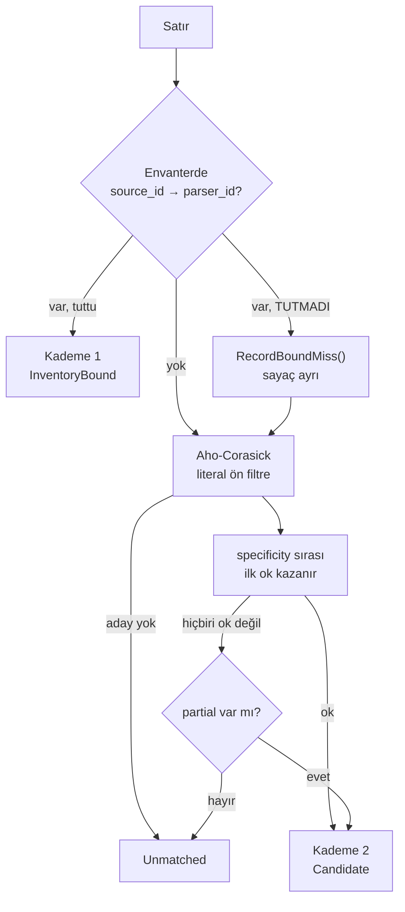

# T06 — dispatcher ve envanterde alınan kararlar

> **Bu belge geriye dönük yazıldı:** kaynağı kod, commit geçmişi ve F1
> kapanışı. Ticket koşulurken tutulmuş bir karar günlüğü **değil**. Burada
> yazan gerekçeler kodun bugünkü hâlinden çıkarıldı; o an tartışılıp reddedilen
> alternatifler kayıtta yok.

Uygulanan yer: `src/Bizigo.Parsing/Dispatch/` + `src/Bizigo.ControlPlane/SourceDirectory.cs`.
Yöneten kararlar: [K17](../mimari-kararlar/index.md) (kapsam kaynak/cihaz grubu
bazlı), K23 (kontrol düzlemi PostgreSQL).

## 1 · Kademelerin sırası performans için değil **doğruluk** için

Koddaki yorumun kendi cümlesi bu ve kademelerin anlamını belirliyor:

**Envanter bağı aynı anda hem en hızlı hem en güvenilir yol**, çünkü cihazın ne
gönderdiğini tahmin etmek yerine biliyoruz. Literal filtre yalnızca envanteri
eksik kaynaklar için bir güvenlik ağı — üretimde trafiğin büyük kısmının oraya
düşmesi bir **arıza belirtisi**, normal çalışma değil.

Bu karar F2'ye kadar taşındı: T19'un editörü deneme sonucunda kademeyi
gerekçesiyle gösteriyor, çünkü envanter bağı yerine literal filtreye düşen satır
**parser doğru olsa bile envanterin eksik olduğunu** söylüyor.

## 2 · Sessiz kalabilecek üç yer, üçü de sayaçla açıldı

`DispatchStats`'ın alanları rastgele değil; her biri sessiz kalabilecek bir hâlin
karşılığı.

| Sayaç | Hangi sessizliği kırıyor |
| --- | --- |
| `BoundMisses` | Bağlı parser tutmadı ve satır aday taramasına düştü. Sonuç yine `ok` olabilir, yani **hiçbir belirti yok** — ama cihaz yazılımı güncellenmiş olabilir |
| `BoundRatio` | Kademe 1'in payı. Düşüyorsa envanter bakımsız; F1 §4.2 hedefi >%95 |
| `UnmatchedRatio` | Hiçbir parser tutmayan oran |
| `UnassignedSources` | Envanterde eşleşmeyen kaynak — olay **reddedilmiyor**, `_unassigned`'a düşüyor |
| `Attempts` | Kaç parser denendi. Kademe 2'de büyük bir sayı, ön filtrenin daralmadığını söylüyor |

`BoundMisses` bu listenin en anlamlısı: sonucu değiştirmeyen, yalnızca **yolu**
değiştiren bir olay. Sayaç olmasa hiç görülmezdi.

### Sayaç yetmedi, eşik de kondu

`bound_ratio`'nun bir sayı olarak durması "düşüyorsa uyarı üretir" kabul
kriterini karşılamıyordu: kimse bakmazsa sayı hiçbir şey söylemiyor. Hedef
`GET /v1/health/pipeline`'da **koda gömülü** (`BoundRatioTarget = 0.95`,
F1 §4.2'nin sayısı) ve yanıt üç alanı birden taşıyor — oran, hedef ve
`bound_ratio_healthy`.

Karşılaştırmayı sunucunun yapması bilinçli: ekran kendi eşiğini tutsaydı iki
yerde iki farklı "sağlıklı" tanımı olurdu. Uç dosyasının yorumu sebebi tek
cümlede söylüyor — *"envanter bakımsız kalırsa bu oran düşer ve sistem hâlâ
çalışıyor görünür."*

Hiç trafik yokken (`Total == 0`) sağlıklı sayılıyor: sıfır bölme yerine "henüz
ölçecek bir şey yok". Aksi hâlde her yeniden başlatma sağlıksız açılırdı.

## 3 · Kaynak eşleşmezse olay reddedilmiyor

`SourceDirectory.Resolve` eşleşme bulamazsa `OwnerGroups.Unassigned` dönüyor ve
`ParsingSink` `RecordUnassignedSource()` çağırıyor.

Karar açık: **veri kaybı, eksik envanterden kötüdür.** Reddetmek envanteri
düzeltmeye zorlardı ama bu arada gelen loglar kaybolurdu — ve bir SIEM'de
kaybolan log, geri getirilemeyen tek şey.

Bunun bedeli: `_unassigned` grubu kapsam kapısının (K17) dışında değil, **içinde**
ayrı bir grup. Yani o olayları yalnızca o gruba eşlenmiş biri görüyor.

## 4 · Sıcak yeniden yükleme atomik — ve bozuk katkı sistemi bozamıyor

`ParserCatalog` yeni kataloğu **tamamen kurup derleyene kadar** eskisini yerinde
tutuyor, sonra tek referans değişimi yapıyor. Koşan boru hattı ya tamamen eski ya
tamamen yeni kataloğu görüyor; yarı yüklü ara durum yok.

Dispatcher'ın ilk satırı bu kararın ikinci yarısı: anlık görüntü **başta**
alınıyor, dolayısıyla yeniden yükleme tam o sırada olsa bile satır tutarlı tek
bir katalogla işleniyor.

Hiç parser derlenemezse katalog **hiç değişmiyor**. Bu, T18'in "bozuk bir katkı
çalışan sistemi bozamaz" kabul kriterinin altyapısı — o ticket eksik olan
"taslaktan besleme" kısmını ekledi, atomikliği değil.

Aynı `id` iki sürümde varsa en yüksek sürüm kazanıyor; aynı `id@version` iki kez
tanımlıysa bu **hata** ve ikincisi yok sayılıyor. Sessizce üzerine yazmak, hangi
parser'ın koştuğunu takip edilemez yapardı — T05'in pattern kütüphanesinde aynı
kural (`MCOLLECTIVEAUDIT`) zaten konmuştu.

## 5 · Literal ön filtre: Aho-Corasick, satır **bir kez** taranıyor

Bütün parser'ların `match.contains` literalleri tek otomata derleniyor. Alternatif
— her parser için ayrı arama — parser sayısıyla doğrusal büyürdü ve katalog
yüzlerce parser'a çıkacak (K12).

`LiteralFree` ayrı tutuluyor: hiç literali olmayan parser'ı ön filtre eleyemez,
dolayısıyla **her zaman** aday listesine ekleniyor. Bu, filtreyi "eleme" değil
"daraltma" yapan şey — sessizce atlanan parser olmuyor.

## 6 · Açıkta kalanlar

| Ne | Durum |
| --- | --- |
| `match` kademe 1'de doğrulanmıyor | T08 raporu #4. İki öneriden hiçbiri uygulanmadı; katalog kuralı "kapı adımı" oldu ama format bunu zorlamıyor |
| Kademe 1 hedefi >%95 | Üretim trafiği olmadığı için **ölçülmedi**. Bugüne kadar yalnızca testlerde koştu |
| NetBox entegrasyonu | F1'de bilerek dışarıda; envanter CSV + API ile yükleniyor |

**Kayıtta olmayan:** `specificity` sıralamasının nasıl belirlendiği — kim hangi
değeri neye göre veriyor — koddan okunmuyor. Şema alanı kabul ediyor, katalog
dolduruyor, dispatcher sıralıyor; **seçim ölçütü kayıtta yok**.
