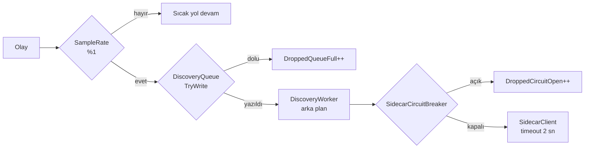

# T12 — sidecar ve şablon keşfinde alınan kararlar

> **Bu belge geriye dönük yazıldı:** kaynağı kod, commit geçmişi ve F1
> kapanışı. Ticket koşulurken tutulmuş bir karar günlüğü **değil**. Burada
> yazan gerekçeler kodun bugünkü hâlinden çıkarıldı; o an tartışılıp reddedilen
> alternatifler kayıtta yok.

Uygulanan yer: `src/Bizigo.Ingest/Discovery/` + `sidecar/`. Yöneten karar:
[K14](../mimari-kararlar/index.md) — şablon madenciliği **Python sidecar**
(Drain3), port yazılmayacak.

## 1 · Taşıyıcı iddia ve neden sınanması zor

T12'nin tek cümlelik vaadi: **sidecar arızalıyken ingest throughput'u
düşmüyor.** Bunun zor tarafı, arızanın *sessiz* olması — sidecar sıcak yolda
değil, dolayısıyla çöktüğünde hiçbir alarm çalmıyor. Tek belirti
`template_id`'nin sessizce boş kalması (F1 §9).

Savunma bu yüzden **dört katmanlı** ve dördü de kodda görünüyor:

Sıcak yol hiçbir noktada beklemiyor: örnekleme, sınırlı kuyruk ve devre kesici
üç ayrı "hayır" cevabı ve üçü de **sayılıyor**.

## 2 · `DropWrite` kullanılmadı — çünkü düşen sayılamıyor

Kuyruk `BoundedChannelFullMode.Wait` ile kuruluyor ama yazma **daima**
`TryWrite` ile yapılıyor. Kodun kendi gerekçesi:

> `DropWrite` kullanılmıyor çünkü o sessizce düşürüyor ve **düşen sayılamıyor**;
> sayılamayan bir düşüş, olmayan bir düşüş gibi görünür.

Bu, bu deponun "hata ne demek" tanımının tam merkezinde: bir şey ölçülmediyse
çalıştığı varsayılmıyor. `DroppedQueueFull` ve `DroppedCircuitOpen` ayrı ayrı
sayılıyor — ikisi farklı arıza, tek sayaçta toplansalar hangisinin olduğu
bilinemezdi.

## 3 · Devre kesici **görünür olmak zorunda**

`/internal/discovery/stats` devre durumunu, açılma sayısını ve son hatayı
döndürüyor. Sebep F1 §9'da yazılı ve kodda tekrarlanıyor: sidecar sıcak yolda
olmadığı için arızası hiçbir alarmı tetiklemiyor.

Varsayılanlar (`SidecarOptions`): `FailureThreshold = 5`, `BreakDuration = 5 dk`,
`Timeout = 2 sn`, `QueueCapacity = 2048`, `SampleRate = %1`,
`TemplateCacheCapacity = 50 000`.

**Kayıtta olmayan:** bu altı sayının hiçbirinin gerekçesi koddan okunmuyor.
Örnekleme oranının %1 seçilmesi bir ölçüme mi dayanıyor, tahmine mi — bilinmiyor.

## 4 · İmza yerelde, maskeleme iki yerde — ve ayrışabilirler

Kuyruğa giren kayıt hem yerel imzayı (`Signature`) hem ham gövdeyi (`Text`)
taşıyor. Sidecar **kendi** maskelemesini uyguluyor.

İki maskeleme demek, ikisinin ayrışabilmesi demek — ve o ayrışma
`SignatureDrift` sayacıyla açıldı: sıfırdan büyükse .NET ile Python maskeleri
farklı sonuç veriyor. Sayaç olmasa iki taraf sessizce farklı şablonlar üretir ve
`template_id` anlamını yitirirdi.

`MasksVersion` de aynı sebeple var: maske kataloğu değiştiğinde iki tarafın aynı
sürümde olduğu doğrulanabilsin diye.

## 5 · Açıkta kalanlar — **bu ticket'ın en önemli bölümü**

| # | Ne | Durum |
| --- | --- | --- |
| D3 | `SidecarLiveTests` | **Hiç koşmadı.** `BIZIGO_SIDECAR_LIVE=1` + `sidecar/.venv` gerekiyor; CI'da ikisi de yok |
| — | `HotPathCostMeasurement` | Aynı şekilde atlanıyor |
| — | Altı yapılandırma sabitinin gerekçesi | Kayıtta yok |

**D3 neden ciddi:** T12'nin taşıyıcı iddiası — *sidecar arızalıyken throughput
düşmüyor* — yalnızca bu testle kanıtlanabiliyor. Diğer testler
`HttpMessageHandler` seviyesinde sahte; gerçek TCP, gerçek asılma
(`SIGSTOP` — bağlantı kabul ediliyor, cevap gelmiyor) ve gerçek ölüm
(`SIGKILL`) yalnızca canlı testte var.

Yani bugün **iddia mantıklı ama ölçülmemiş.** Kod dört savunma katmanı taşıyor;
bunların birlikte çalıştığı gösterilmedi.

Testin dürüstlüğü ayrıca kayda değer: `Assert.SkipUnless` ile **açıkça**
atlanıyor, "koşuma giriyor ama ortam hazır değil" hâline düşmüyor. §7'nin
uyardığı üçüncü hâl — sessizce kırmızı yanan CI — burada yok.

### T29 bunun üstüne kuruldu

K35'in sıcak yol ölçümü (`signature_hash`) T12'nin bıraktığı ölçüm boşluğunun
üstüne geldi ve **kendi sayısını üretti**. Yani sıcak yol maliyeti hakkında
bugün elimizde olan sayı T12'den değil T29'dan geliyor — ve o ölçüm de F1'in
"yüklü makinede yanlış sayı çıkar" dersini taşıyor: iki koşum kaydedildi,
ajanda 1,46× koordinatörde 1,62×.

## 6 · Sonraki fazlara devreden

| Devir | Durum |
| --- | --- |
| Canlı ölçümün koşturulması | Koordinatörde, faz sonu (D3) |
| `template_id`'nin replay'de yeniden üretilememesi | Kabul edilmiş: sidecar gerekiyor. `signature_hash` bunun aksine yeniden üretilebiliyor ve replay onu koruyor (K35) |
| Şablon önbelleğinin çok kopyada paylaşılması | F1'de tek süreç varsayımı; dağıtımda yeniden bakılacak |
