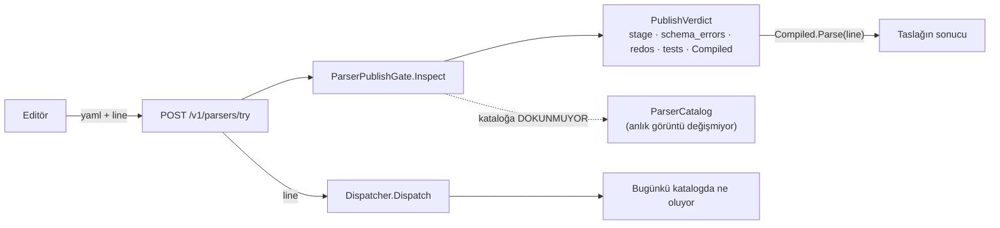

# T19 — parser editöründe alınan kararlar

Dal `t19-parser-editoru`. `main` (`5f657f6`) birleştirildi — `0639ad5`.

**Ölçülen durum (merge sonrası):** 17 proje 0 uyarı · **677** birim testi ·
**188** UI testi · `tsc` temiz · `api:check` birebir · `next build` geçiyor,
`/parserlar` 10.9 kB.

## 1 · Ucun şekli: tek istek, üç cevap

`POST /v1/parsers/try` üç modu isteğin **içeriğinden** seçiyor. Ayrı bir `mode`
alanı istemek, içerikle çelişebilen ikinci bir gerçek kaynak açardı.

| İstek | Mod | Dönen |
| --- | --- | --- |
| `yaml` dolu | `draft` | kapı kararı + taslağın sonucu + **ayrıca** dispatcher |
| `parser_id` dolu | `forced` | o parser'ın sonucu |
| ikisi de boş | `dispatch` | kademe + gerekçe + sonuç |

Taslak modunda dispatcher'ın **yine de** koşması bilinçli: "taslağım bu satırı
çözüyor ama canlıda satır hiçbir parser'a düşmüyor" ile "zaten başka bir parser
çözüyor" bambaşka iki durum ve ikisi de yalnızca yan yana bakınca görünüyor.



## 2 · Ad-hoc derleme, ucun güvenli olmasının tek sebebi

Taslak denemesi kataloğa yazsaydı herhangi bir `author` **tek bir istekle**
çalışan boru hattının davranışını değiştirebilirdi — üstelik inceleme ve yayın
kapılarının tamamını atlayarak.

İki testle sabitlendi (`ParserTryTests`, `ParserAuthoringTests`): dolu bir
katalogda kapı bir taslağı denetliyor ve **aynı anlık görüntü nesnesi**
(`Assert.Same`) yerinde kalıyor. Sayı testi yetmezdi — yeniden yüklenip aynı
sayıda parser üreten bir katalog da onu geçerdi.

## 3 · Editör kendi linter'ını yazmıyor

Taslağı **yayın kapısının kendisi** denetliyor. "Editör için hafif bir lint" iki
ayrı denetleyici demekti: editörde yeşil yanan bir taslak yayında reddedilir ve
kullanıcı hangisine inanacağını bilemez.

Bunun bedeli `PublishVerdict`'in zenginleşmesiydi:

| Alan | Neden |
| --- | --- |
| `Stage` | Hangi kapıda durdu. Hata metninden çıkarmak, mesajı biçimlendiren ilk katkıda sessizce yanlışlaşırdı |
| `SchemaErrors` | Satır **ve sütun**. Kabul kriteri satır numarası istiyor; biçimlendirilmiş metinden geri ayrıştırmak kırılgan |
| `RedosFindings` | Şiddet + `blocking`. `GROK003` şiddet olarak *uyarı* ama yayında **hata**; yalnızca şiddeti göstermek "bu sadece uyarı" dedirtirdi |
| `TestResults` | Geçenler de dahil. Yalnızca düşenler, "kaç test var" sorusunu cevapsız bırakırdı |
| `Compiled` | Önizlemenin koşturduğu parser = kapının onayladığı parser. İki ayrı derleme bir gün ayrışırsa önizleme yalan söyler |

Düz metin `Errors`/`Warnings` duruyor — CLI onları kullanıyor.

**Kapı, ReDoS bulgusu varken de testleri koşuyor.** "Yayınlanamaz" ile
"denenemez" aynı şey değil: geri izleyen bir pattern'i düzelten kişi,
düzeltmeden önce parser'ın doğru ayrıştırdığını görebilmeli.

## 4 · Uç sahipliği — T20 ile sınır

Koordinatörün çizdiği bölünme yetki tablosundan türetildi.

| Uç | Sahip | Bu turda |
| --- | --- | --- |
| `POST /v1/parsers/try` | T19 | ✅ tip aldı, listeden çıktı |
| `POST /v1/parsers/drafts` | T19 | ✅ |
| `PUT /v1/parsers/drafts/{id}` | T19 | ✅ |
| `POST /v1/parsers/drafts/{id}/submit` | T19 | ✅ |
| `GET /v1/parsers`, `GET /v1/parsers/{id}` | T20 | ✅ T20 ile indi |
| `GET /v1/parsers/drafts`, `drafts/{id}`, `return`, `publish`, `rollback` | T20 | ✅ T20 ile indi |

Sınır çakışma üretmeden tuttu: merge'de bu satırlardan hiçbiri iki kez
silinmedi. `Parser_editorunun_uclari_yanit_tipi_tasiyor` T19'un dördünü
sabitliyor; uç adları elle yazılı, `Pending`'den türetilmiyor — türetilseydi
test kendi kendini onaylardı.

**Taslak listesi ekranda yok** — "benim taslaklarım" ile "inceleme kuyruğu"
zaten aynı liste ve T20'de. İki ekranda iki kez çizmek T28'in denetleyeceği
tutarsızlığın kendisi olurdu.

## 5 · Kendini yok eden bekçi — ve yok oldu

Editörün bir taslağı yeniden açması `GET /v1/parsers/drafts/{id}`'ye bağlıydı;
uç T20'nindi ve bu dalın üretilen şemasında yoktu. Elle tip **yazılmadı**: gövde
`unknown` alınıp çalışma zamanında tek bir alan için doğrulandı. Geçici çözümün
kalıcılaşmaması bir yoruma bırakılmadı:

```ts
type DraftGetLanded = "/v1/parsers/drafts/{id}" extends PathsWith<"get"> ? true : false;
const DRAFT_ENDPOINT_STILL_MISSING: DraftGetLanded = false;
```

Yolun *varlığına* değil `GET` yöntemine bakıyordu: `/v1/parsers/drafts/{id}`
anahtarı `PUT` yüzünden zaten vardı ve anahtarı sınayan bir bekçi ilk günden
yeşil yanardı, yani hiçbir şey ölçmezdi.

**Bekçi işini yaptı.** T20 merge'iyle uç indi, `tsc` düştü
(`draft.ts(44,7): Type 'false' is not assignable to type 'true'`) ve
`lib/parsers/draft.ts` üretilen tipi tüketen hâline geçti — çalışma zamanı alan
kontrolü ve elle yazılmış alan adı kalmadı. Yorum bırakılsaydı bugün hâlâ
`fetch` ile okuyor olurduk.

## 6 · T08 raporu #6 kapandı

`expect` artık "bu alan hiç olmamalı" diyebiliyor: düz `null`/`~` skaleri gerçek
`null`'a dönüyor. Tırnaklı `"null"` **metin** kalıyor.

Koordinatörün iki koşulu karşılandı:

1. **Anlam sessizce kaymadı.** Katalogda ve `tests/` altında bugünkü (yanlış)
davranışa yaslanan tek bir `expect` yok — arama boş döndü. Tek iz,
`mikrotik.routeros/system.yaml`'daki boşluğu anlatan yorumdu; yorum kaldırıldı,
yerine `core.user_name: null` beklentisi kondu ve katalog testi geçiyor.
2. **Üç durum ayrı sınandı:** alan yok (`null` ve `~` yazımlarıyla ayrı ayrı),
alan atanmış (beklenti **düşüyor**), alanın değeri `"null"` metni (tırnaklı
beklenti geçiyor, tırnaksız düşüyor).

**Ölçüldü:** düzeltme kapatılınca 5 test kırmızı yanıyor (2 theory + 2 yeni +
RouterOS katalog testi) — sonra geri alındı.

**#5 (`map` dallanamıyor → `extends:`) alınmadı.** Parser'lar arası kalıtım
motor işi ve tasarımı tek başına bir tartışma; bu ekranı geciktirirdi.

## 7 · Ekranın kararları

| Karar | Gerekçe |
| --- | --- |
| **Editör kütüphanesi yok** | Saydam metinli `<textarea>` + vurgulanmış `<pre>`. CodeMirror/Monaco yüzlerce kilobayt ve kendi erişilebilirlik yüzeyi. `/parserlar` toplam 10.9 kB |
| **Tokenizer saf fonksiyon** | DOM'a dokunmuyor, tam sınanabiliyor. İskeletin her satırında karakter kaybı olmadığı test ediliyor — bir karakter düşse imleç yazının yanına kayar ve kimse fark etmez |
| **Tamamlama saf fonksiyon** | `suggest(text, caret)`. Değer yazarken (imlecin solunda `:`) öneri **yok** — yazdığını bozardı |
| **Şema listesi istemcide** | Her tuşta ağ isteği olmazdı. Ayrışma riski kabul edildi: bedeli "öneri görünmüyor", sessiz yanlış davranış değil |
| **Zaman aşımı rozet değil, paragraf** | "Uymadı" ile "ölçülemedi" karıştırıldığında sağlıklı parser karantinaya giriyor. Bir rozet bu ayrımı taşıyamaz |
| **Satıra gitme `<button>`** | Sayfa değiştirmiyor. `<a href="#">` ekran okuyucuya "bağlantı" der |
| **Hata işareti renk + `●` + liste** | Kırmızı satır numarası, kırmızıyı göremeyen için hiçbir şey söylemiyor (WCAG 1.4.1) |
| **Gezinme bağlantısı herkese görünür** | Gizlemek, yetkisi olmayana ekranın **var olduğunu** saklardı; "neden göremiyorum" hiç sorulamazdı. Girince sebebi yazan bir ekran çıkıyor |
| **Kaydetme kapıya takılmıyor** | Yarım kalmış parser kaydedilebilmeli, yoksa kullanıcı işini kaybeder. Kapı kararı yine gövdede |

## 8 · Ortak kite eklenenler

- `components/ui/CodeEditor.tsx` — satır numaralı, vurgulu, işaretli, tamamlamalı.
- `lib/api/numbers.ts` — `toNumber` (şemanın `number | string` alanları).
- `lib/api/errors.ts` — `describeError` buraya taşındı.

`lib/alerts/errors.ts` ve `lib/alerts/types.ts` yeniden dışa aktarıyor;
çağıranlar kırılmadı, davranış değişmedi.

## 9 · Kapsam dışı bırakılanlar

| Ne | Neden |
| --- | --- |
| Taslak listesi / sürüm geçmişi | T20 |
| Yayınlama, geri alma, incelemeden döndürme | `admin` yetkisi, T20 |
| `extends:` (T08 #5) | Motor işi, ayrı tasarım |
| LLM ile parser üretimi | F4 |

## 10 · Merge — yedi çakışma ve bir kusur

### Aynı yüzeyin iki modeli

T20 ile T19 parser yazarlık yüzeyini **iki kez** modelledi:

| T20 | T19 | Kalan |
| --- | --- | --- |
| `ParserDraftResponse` (liste satırı) | — | T20'ninki |
| `ParserAuthoringResponse` (yazma sonucu) | `ParserDraftResponse` (aynı iş) | **T20'nin adı, T19'un şekli** |
| `PublishVerdictResponse` (düz `errors[]`) | `ParserGateResponse` (yapılandırılmış) | **T20'nin adı, T19'un şekli** |

Yapılandırılmış kapı kararı düzün **üst kümesi** (`ok`, `passing_tests`,
`errors`, `warnings` yerinde), dolayısıyla katalog ekranı kırılmadan daha
fazlasını görüyor. İki tanım bırakmak, aynı kapının iki farklı özetini
üretirdi: biri "hangi satır" diyebilen, diğeri diyemeyen.

`ui/src/lib/parsers/types.ts` iki ajan tarafından **aynı yola** yazılmıştı;
bölmek yerine birleştirildi — katalog ve editör aynı yüzeyin iki yarısı.

`ErrorResponse` isteğe bağlı `hint` kazandı: BFF vekili F1'den beri
`{ error, hint }` üretiyor ve `ErrorState` ikisini ayrı yerlere koyuyor, ama
tip yalnızca ilk yarısını taşıyordu.

### İzin listesi tek satıra indi

T19'un dördü çıktı. Kalan tek satır `POST /v1/replay` ve **atfı yanlıştı** —
"T19 — replay ekranı" yazıyordu, oysa T19 parser editörü ve F2'de replay
ekranının ticket'ı yok. Tüketicisi olmayan bir uca tip yazmak listenin var olma
sebebini boşa çıkarır; `Exempt`'e taşımak da "hiç ekranı olmayacak" iddiası
olurdu. Sahibi belli olana kadar `Pending`'de duruyor ve
`Bekleyen_listede_yalnizca_sahipsiz_replay_kaldi` testi listeyi o tek satırda
sabitliyor. **F2'nin kapanışında karar verilmesi gereken tek kalem bu.**

### Merge'in ortaya çıkardığı kusur — T26, benim değil

`DeviceConfigRunner` **singleton** kaydedilmiş ve scoped `IScopedQuery`
alıyordu; o da `ControlPlaneDbContext` taşıyor. Sonucu tek bir EF bağlamının
sürecin ömrü boyunca paylaşılması: bağlam iş parçacığı güvenli değil ve
değişiklik izleyicisi hiç boşalmıyor.

**Neden bugüne kadar görünmedi:** üretimde `ValidateScopes` kapalı. Gerçek
doğrulamayı koşturan tek şey T14'ün OpenAPI belge üretimi — `Main`'i gerçekten
çalıştırıyor. T26 indikten sonra kimse tipleri yeniden üretmediği için kusur
sessiz kaldı ve ancak bu merge'de, ona hiç dokunmamış bir dalda görüldü.

| | |
| --- | --- |
| Düzeltme | Yazma başına kapsam (`IServiceScopeFactory`) |
| Bekçi | `ArchitectureTests.Uretim_DI_grafi_kapsam_dogrulamasindan_geciyor` — üretim servis grafiğini doğrulama açıkken kuruyor |
| Ölçüm | Düzeltme geri alınınca test kırmızı yanıyor ve tam mesajı basıyor |

Asıl değer bekçide: bir sonraki captive dependency, birinin şemayı yeniden
üretmesini beklemeden birim testinde düşüyor.

### Kendini yok eden bekçi işini yaptı

`GET /v1/parsers/drafts/{id}` main ile indi ve
`"/v1/parsers/drafts/{id}" extends PathsWith<"get">` koşulu derlemeyi kırdı.
`lib/parsers/draft.ts` artık üretilen tipi tüketiyor — çalışma zamanı alan
kontrolü ve elle yazılmış alan adı kalmadı.

### Gezinme

`/katalog` T20 ile indi ama ana gezinmeye girmemişti; gezinmede olmayan bir
ekran yalnızca adresini bilenin ekranıdır. Parser editörünün yanına eklendi —
ikisi aynı işin iki yarısı.
