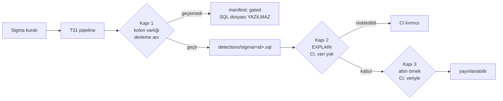

# T32 tasarım turu

Uygulamadan önceki tasarım turu. T31'in **kapsamı** ölçüme bağlı olduğu için
uygulama beklerken, kapsamdan **bağımsız** olan üç şey burada karara bağlandı:
kabul kriterlerinin bölünmesi, "derlendi ama koşmuyor"un hangi anda yakalanacağı,
ve üretilen SQL'in nasıl versiyonlanacağı.

§6'daki beş soru koordinatöre soruldu ve **cevaplandı**; kararlar aşağıda
gerekçeleriyle duruyor.

---

## 1 · `compiled = 24, runs = 14` — sebebi statik olarak bulundu

İlk brief bu farkın sebebini `ocsf_pipeline`'ın `type_uid` eklemesi olarak
veriyordu. **Bu koşumda o sebep işlemiyor:** `measure.py` ve `test_measure.py`
içinde `ocsf_pipeline` geçmiyor — ölçülen zincir yalnızca `bizigo_pipeline()`.
`type_uid` T30'un doğru tespit ettiği bir tuzak ama **bu on kuralın sebebi
değil.** Koordinatör düzeltmeyi kabul etti: sebep doğrulanmadan aktarılmıştı.

Ayrım önemli, çünkü ikisi T31'e farklı iş yazdırıyor: `type_uid` "zincire koyma"
der, aşağıdaki bulgu "eksik bir dönüşüm yaz" der.

### Gerçek sebep — `UNMAPPED_FIELDS` bir belge, bir dönüşüm değil

`bizigo_pipeline.py` iki liste tutuyor: `FIELD_MAP` (28 alan) ve
`UNMAPPED_FIELDS` (9 alan). Birincisi `FieldMappingTransformation`'a veriliyor.
**İkincisi hiçbir yere verilmiyor.** `unmapped_expression()` fonksiyonu tanımlı
ama depo genelinde **hiç çağrılmıyor** (`prototypes/t30-sigma/` içinde sıfır
referans). Yani o dokuz alan `unmapped['X']` olmuyor; pipeline'dan **olduğu gibi
geçiyor** ve backend `url = '…'`, `dns_query_name = '…'` gibi görünümde
karşılığı olmayan çıplak kolon adları üretiyor.

Bu, depoda tekrarlayan bir sınıfın örneği: **kod bir şeyi hazırlamış ama
bağlamamış, ve bağlanmamış olması hiçbir yerde belirti üretmiyor.**

24 kuralın alanları `FIELD_MAP`'ten geçirilip `events_ocsf`'in gerçek kolon
kümesine (`db/clickhouse/0003_ocsf_otel_views.sql`, 21 kolon) karşı sayıldı:

| Kural | Var olmayan kolon |
| --- | --- |
| `fortigate_blocked_category` | `url` |
| `fortigate_dns_tunnel` | `dns_query_name` |
| `nginx_admin_path` | `url` |
| `nginx_dns_rebind` | `query` |
| `nginx_large_upload` | `http_method`, `url` |
| `nginx_scanner_agent` | `user_agent` |
| `nginx_sqli_probe` | `url` |
| `routeros_dns_request` | `dns_query_name` |

**8 kural.** Kalan 16'nın kolonları gerçekten var.

### Dokuzuncu kural: farklı bir hata sınıfı

`fortigate_high_port_scan.yml` şunu yazıyor:

```yaml
proto: 6
dstport|gte: 30000
```

`proto` → `connection_info_protocol_name`, tipi `LowCardinality(String)`
(`0001_events.sql`: `proto LowCardinality(String)`). Tamsayı `6` ile String
karşılaştırması ClickHouse'ta **kolon var olmasına rağmen** düşer. Örneklemde
tamsayı `proto` yazan tek kural bu; diğer dördü `'ICMP'`, `'TCP'`, `'udp'`,
`'tcp'`.

**Bu ayrı bir sınıf ve §3'ün tasarımını doğrudan belirliyor:** kolon varlığı
kontrolü bunu yakalayamaz. Tip uyuşmazlığı ancak gerçek bir ClickHouse'a
sorularak görülür.

### Onuncusu bulunamadı

8 (kolon yok) + 1 (tip uyuşmazlığı) = **9**. Onuncu kuralı bu iki yöntemle
**aradım, bulamadım.** Aramadığım yer: pySigma'nın gerçek çıktısı — alan
adlarını YAML'dan regex ile çıkardım, derlemedim, modifier'ların ürettiği ifade
farkını görmedim.

`runs=14` üreten koşumun JSON çıktısı **artık yok**: koordinatör temizlik
sırasında sildi ve bunu hatası olarak kaydetti (ölçüm çıktısı veriydi, geçici
dosya değil). Ölçüm altın örnek yükleyicisi geldiğinde yeniden koşacak ve
saklanacak; onuncu kural oradan gelecek.

---

## 2 · Kabul kriterleri — hangisi ölçümü bekliyor

| # | Kriter | Ölçüme bağlı mı | Not |
| --- | --- | --- | --- |
| A | Tek komut, tekrarlanabilir çıktı: aynı girdi → aynı SQL | **Hayır** | Hattın özelliği, kapsamın değil. Sabit bir korpusla kurulur ve ölçülür |
| B | CI kapısı sürüklenmeyi yakalıyor; kırmızı yanabildiği ölçüldü | **Hayır** | Kapı mekanizması kapsamı bilmiyor |
| C | Derlenemeyen kural sayısı görünür | **Kısmen** | Mekanizma bağımsız; kapıya **çivilenen sayı** ölçümden geliyor |
| D | Üretilen SQL'in en az biri canlı ClickHouse'ta doğru sonuç veriyor | **Evet** | Canlı ClickHouse + yüklü altın örnek ister → koordinatör koşturur |

Kapsam maddelerinden:

| Madde | Ölçüme bağlı mı |
| --- | --- |
| SigmaHQ kurallarını çeken hat (commit SHA'sına sabitli) | **Hayır** — mekanizma bağımsız |
| Hangi vendor/kategori çekilecek | **Evet** — T30'un karar tablosu |
| T31'in pipeline'ıyla derleme | **T31'e bağlı** (ölçüme değil) |
| Versiyonlu SQL biçimi (kural kimliği, kaynak sürümü, tarih) | **Hayır** — §4 |
| Başarısız derleme eski dosyayı silmeli | **Hayır** — §4 |
| Sidecar'da Python 3.13+ | **Zaten sağlanmış** — `sidecar/Dockerfile` iki katmanda da `python:3.13-slim`, `requirements.txt` `pySigma==1.5.0` + `pysigma-backend-clickhouse==1.1.1` sabitli. Bu kriter bugün doğru; T32'nin yapacağı iş **onu kırmamak** |

**Sonuç:** A, B, C'nin mekanizması ve tüm §4 ölçüm beklemeden yazılabilir. Bekleyen
tek şey D ve korpus seçimi.

---

## 3 · "Derlendi ama koşmuyor" nerede yakalanır

Sorunun cevabı **üç ayrı yerde, üçü farklı şey yakaladığı için.** Tek yere
koymak, yakalayamadığı sınıfı sessizce geçirir.



| Kapı | Nerede koşar | Yakaladığı | Yakalayamadığı |
| --- | --- | --- | --- |
| **1 · kolon varlığı** | Derleme anında, hattın içinde. Docker yok, ClickHouse yok | §1'deki 8 kural: görünümde olmayan kolona referans | Tip uyuşmazlığı, fonksiyon yanlış kullanımı, sürüme özgü sözdizimi |
| **2 · `EXPLAIN`** | CI, **kendi işinde**, şema yüklü / veri yok | §1'deki 9. kural: `proto: 6` tip hatası. Sözdizimi. Ad çözümlemesi | Kuralın gerçekten bir şey eşleştirip eşleştirmediği |
| **3 · altın örnek** | CI, veri yüklü | Yanlış pozitif, sıfır eşleşme | — |

**Çalışma zamanı bu tablonun dışında ve öyle kalmalı.** T33'te bir kuralın
sessizce hiçbir şey yakalamaması, `CLAUDE.md` §7'nin adını koyduğu sınıf.
Kapı 1 ve 2 birlikte, o sınıfı derleme/CI'ya taşıyor.

### KARAR · Kapı 2 kendi CI işinde koşar

Var olan `integration` işi zaten Testcontainers kaldırıyor ve oraya eklemek ek
konteyner maliyeti getirmezdi. **Yine de ayrı iş.** Gerekçe: derleme kapısını
entegrasyon işine bağlamak, o iş **ilgisiz bir sebeple** düştüğünde derleme
kapısının da körleşmesi demek. Bu depoda "başkasının hatası yüzünden sessizleşen
bekçi" deseninin bedeli zaten ödendi. Konteyner maliyeti, kapının kendi ayakları
üstünde durmasından ucuz.

### KARAR · Kapı 2 `EXPLAIN` soruyor — ve ilk hâli kapıyı sessizce yeşil bırakıyordu

İlk yazımda `EXPLAIN SYNTAX` seçilmişti. **Ölçüldü, yanlıştı:** o biçim tip
denetimi yapmıyor, yalnızca AST'yi yeniden yazıyor. Bilinen iki kırık sorgunun
ikisine de 200 dönüyordu, yani kapı 24 kuralın hepsini geçirecek ve ikisi
üretimde patlayacaktı — `KIND_TYPE_MISMATCH` kolu o yoldan **asla**
tetiklenemezdi. Kapı 2'nin kapatmak için var olduğu sınıf, kapının içinde.

Bunu `--self-test` buldu. Kip olmasaydı kusur, kural seti üretime çıkana kadar
görünmeyecekti — ve "sıfır sorgu soran kapı" her iki hâlde de yeşil yanardı.

#### Ölçülen tablo — canlı 26.7.3, üç sorgu, üç tur

| Biçim | Ayırt ediyor mu | Sonuçlar |
| --- | --- | --- |
| `EXPLAIN` | ✓ | `red, red, kabul` |
| `EXPLAIN PLAN` | ✓ | `red, red, kabul` |
| `EXPLAIN ESTIMATE` | ✓ | `red, red, kabul` |
| `EXPLAIN QUERY TREE` | ✗ | `kabul, red, kabul` — **kısmen** |
| `EXPLAIN SYNTAX` | ✗ | `kabul, kabul, kabul` |

**Maliyet ayırt edici değil.** Isınma çıkarıldığında üç doğru biçim de
~12–13 ms/sorgu bandında; 269 kural × ~13 ms ≈ **3,5 saniye**. Geriye tek ölçüt
olarak doğruluk kalıyor ve o da üçünde eşit — bu yüzden en açık olanı, `EXPLAIN`,
duruyor. **Biçim seçimi maliyetle gerekçelendirilemez** ve bunu bilmek de bir
ölçüm sonucu.

⚠️ **Süre sütunu bir kez yalan söyledi.** İlk ölçüm ısınmasızdı ve `EXPLAIN`'i
`EXPLAIN PLAN`'in 2,3 katı gösterdi. Çıplak `EXPLAIN` zaten `EXPLAIN PLAN`'in
kendisi olduğu için bu fiziksel olarak imkânsız — K35'te "yalnız ayrıştırma,
ayrıştırma+etiketlemeden yavaş" çıktığındaki durumun aynısı. Ölçülen şey biçim
değil **listedeki sıraydı**; sıra ters çevrildiğinde fark biçimi değil ilk sırayı
takip etti. `probe_forms` artık her biçimden önce sayılmayan bir ısınma turu
atıyor ve turların en hızlısını raporluyor (§6).

#### `EXPLAIN QUERY TREE` — tablodaki en değerli satır

`ILIKE ↔ IPv6`'yı **yakalıyor**, `tamsayı ↔ LowCardinality(String)`'i
**kaçırıyor**. Kısmen çalışıyor, ve **kısmen çalışan bir kapı hiç çalışmayandan
tehlikeli**: biri "daha ucuz ve tip hatasını yakalıyor" diye ona geçseydi kapı
`ILIKE` hatalarını yakalamaya devam edeceği için *çalışıyor görünürdü* ve
sessizce geçen tek sınıf tamsayı uyuşmazlıkları olurdu. `EXPLAIN SYNTAX` en
azından her şeye "kabul" diyerek kendini ele veriyordu.

Bu yüzden probe'un ölçütü *"üç sonucun **üçü de** beklenen mi"* — *"en az bir red
üretti mi"* değil. Gevşek kriter tam bu satırı kaçırırdı.

İki başarısız biçim de aday listesinde **duruyor**: "denedik, olmadı" bilgisini
silmek, bir sonraki kişinin aynı seçimi aynı gerekçeyle yapmasına kapı açardı.
Probe CI'da kapı değil **ölçüm** olarak koşuyor — bir ClickHouse yükseltmesi
`QUERY TREE`'yi düzeltebilir ya da `PLAN`'i bozabilir, ve o gün bu tablo söyler.

### KARAR · Kapı 2 bugün boş dönüyor — ve bu bir **başarı göstergesi**

T31 ölçüldü: `compiled == runs == 21`. Eşlenemeyen kuralları derleme aşamasında
düşürdüğü için ClickHouse'a koşmayan tek bir SQL çarpmıyor. Yani Kapı 2 bugün
hiçbir şey yakalamıyor.

**Bu, kapının gereksiz olduğu anlamına gelmiyor; tam tersi.** Kapı 2'nin bugünkü
işi, T31'in sınıflandırmasının **ClickHouse ile aynı fikirde olduğunu**
doğrulamak. İkisi ayrışırsa — T31 "eşlendi" der, ClickHouse reddeder — bunu
başka hiçbir şey görmez: Kapı 1 kolon adlarına bakıyor, T31 kendi eşleme
tablosuna, ve ikisi de ClickHouse'a sormuyor.

Bu not buraya **biri bir gün "hiçbir şey yakalamıyor" diye kaldırmasın diye**
yazıldı. Boş dönen bir bekçinin iki sebebi olabilir: korunan şey sağlam, ya da
bekçi kör. Kapı 2 için ikisini ayıran şey `--self-test` — ve o kip zaten bir kez
kapının kendi körlüğünü buldu (`EXPLAIN SYNTAX`).

### KARAR · Kapı 3 iki soruyu **iki ayrı yere** koyuyor

Kapı 3 iki şey ölçebilirdi ve ikisini tek kapıya koymak, hangisinin kırıldığını
belirsiz bırakırdı:

| Soru | Nerede | Neden orada |
| --- | --- | --- |
| **Derleme doğruluğu** — beyan edilmiş bir kural beklediği şeyi buluyor mu | **Kapı** | Kural başına; verinin şeklinden bağımsız, ya bulur ya bulmaz |
| **Kapsam** — kaç kural bir şey yakalıyor | **Ölçüm** | Verinin şekline bağlı |

§6'nın "mutlak bütçe yerine oran" maddesinin buradaki karşılığı daha sert:
**kapsam hiç kapı değil.** *"En az N kural eşleşmeli"* diyen bir kapı, bir
vendor'ın payı kaydığında kırmızı yanar ve o kırmızının sebebi kural setinde
değil **veride** olur — yani kapı yanlış soruyu sormuş olur.

Beyanlar `catalog/sigma/expectations.json` içinde, kural başına
`at_least_one` ya da `none` ve **zorunlu bir gerekçe**. Gerekçe alanı boş
bırakılamıyor: gerekçesiz bir beklenti, kırıldığı gün "herhâlde veri
değişmiştir" diye gevşetilir.

`none` beklentisi yalnızca yanlış pozitif bekçisi değil, **kapının ayırt
edebildiğinin kanıtı**: yalnızca `at_least_one` beyanlarından oluşan bir listeyi,
her şeyi eşleştiren bozuk bir kapı da geçerdi. Kapı bu yüzden listede iki yönün
de bulunmasını **istiyor**.

Veri yoksa kapı **hiç koşmuyor** (çıkış 3) — T30'un ön kontrol protokolü, üç
durumu ayrı raporlayarak: sorgu hata verdi (kurulum), tablo boş (yükleyici
koşmamış), vendor eksik (o vendor'ın kuralları ölçülemez). Gerekçesi T30'da
ölçülmüş: tabloda önceki turdan kalma tek vendor'lı veri varken "boş mu"
sorusunun cevabı hayırdı, ölçüm geçti ve **%0 eşleşme** üretti — o sıfır
eşlemenin değil verinin sonucuydu.

**Kapı bugünden CI'da ama ilk gün kırmızı yanmıyor.** Koşul "üretilen her kural
beyanlı olmalı"; sıfır kural üretiliyorsa sıfır beyan gerekiyor. Bu bir gevşetme
değil koşulun kendisi, ve iki tuzağın arasından geçiyor: kapıyı "kural seti
gelince bağlarız" diye ertelemek **hazırlanmış ama bağlanmamış** desenini
kurardı; bugün koşulsuz zorlamak ise ilgisiz bir işi bekleyen ve o yüzden ilk
günden kırmızı yanan — dolayısıyla gevşetilecek — bir kapı yaratırdı. İlk kural
üretildiği anda kapı **kendiliğinden** diş kazanıyor.

Kapının canlı yarısı koordinatörde koşuyor (§2); CI'da koşan yarı beyan
listesinin şekli ve ClickHouse'a hiç bağlanmıyor.

### Ölçüldü · Kapı 3 ilk koşumda gerçek bir eşleme kusuru buldu

`routeros_forward_new` beyanı **düştü** ve düşmesi doğru. Üretilen SQL
`activity_name='forward'` arıyor; veride `class_uid=4001` var, `tcp` var
(150 satır), eksik olan `activity_name` — ve boş olması bir kaza değil:
`catalog/parsers/mikrotik.routeros/firewall.yaml` `action`'ı **bilerek** boş
bırakıyor, çünkü RouterOS kaydı kuralın eşleştiğini bildiriyor, `accept`/`drop`
yazmak uydurma olurdu. Zincir adı `fields.fw_chain`'e gidiyor.

Yani parser doğru, kuralın **eşlemesi** yanlış: `forward` bir eylem değil bir
zincir adı. Beyan da yanlış değildi — örnek dosyada gerçekten `forward:` +
`proto TCP` taşıyan üç satır var. Kayıp **boru hattında**, dosyanın söylediği ile
ClickHouse'a inen arasında.

**Bunu ancak bu kapı gösterebilirdi.** Ne derleme, ne birim testi, ne Kapı 2 bu
soruyu soruyor. Beyan bugün kırmızı ve öyle kalmalı; düzeltme T31'in
`FIELD_MAP`'inde.

### Beyan yazılmayan iki kural — ve ikisinin de sebebi kayıtlı

**`nginx_dns_rebind`:** örneklerde `localhost` yalnızca referrer alanında,
`127.0.0.1` yalnızca remote_ip konumunda, ve combined format Host başlığı
taşımıyor. `device_hostname`'in ne olduğu okunamadı, beyan yazılmadı. `--discover`
koşumu kuralı **boş** buldu — okuma ölçümle doğrulandı. Tahminle beyan yazılsaydı
kapı yanlış sebeple kırmızı yanardı.

**`asa_teardown_rst`:** `--discover` bunu **eşleşti** diye buldu ve tam bu yüzden
beyan yazılmadı. Üretilen SQL `raw_data ILIKE '%RST%'` ve ASA örneklerinde harf
duyarsız `rst` geçen tek yerler **"first"** ve **"burst"** sözcüklerinin içi —
gerçek bir TCP RST yok. Yani kural **yanlış sebeple** eşleşiyor.

`at_least_one` yazılsaydı kapı yeşil yanar ve bir **yanlış pozitifi kutsardı**.
"Eşleşti" ile "doğru sebeple eşleşti" farklı şeyler, ve bu ayrımı `--discover`
sayısı değil örnek dosyanın içeriği veriyor — beyanların gerekçesinin
ClickHouse sayısından değil dosyadan gelmesinin sebebi bu.

Kuralın ikinci bir kusuru daha var (aşağıda) ve ikisi birbirini gizliyordu.

#### Düzeltildi — ve cevap örneklerin satır sonundaydı

`Teardown` satırlarının kuyruğu ASA'nın sözlüğünü söylüyor: **`TCP Reset-I`**,
iki satırda. ASA sıfırlamayı `Reset-I`/`Reset-O` diye yazıyor, `RST` diye **hiç
yazmıyor**. Yani kusur iki katmanlıydı ve ikisi de tekrarlanan anahtarın
arkasındaydı: `RST` vendor'ın kullanmadığı bir kısaltma, ve tekrarlanan anahtar
`Teardown`'ı düşürdüğü için kural iki koşuldan **hiçbirini** doğru soramıyordu.

```yaml
message|contains|all:
  - 'Teardown'
  - 'Reset'
```

`|all` şart: **düz bir liste Sigma'da OR'dur** ve burada AND isteniyor. İki
koşulu listeye almak, tekrarlanan anahtarın yaptığının kardeşi olurdu — metinsel
olarak geçerli, anlamsal olarak sessizce başka bir kural. Üretilen SQL doğrulandı:
`raw_data ILIKE '%Teardown%' AND raw_data ILIKE '%Reset%'`.

`Reset-I` değil `Reset`: `-I`/`-O` yön eki ve kural yönü umursamıyor. Yöne
bağlamak bugün çalışırdı — örneklemde `Reset-I` 2, `Reset-O` 0 — ama kuralın
sormadığı bir şeyi sormak olurdu.

**Ölçüldü (örnek dosya üzerinden, canlı doğrulama koordinatörde):**

| Aranan dizge | `Teardown` ile aynı satırda | Kapı |
| --- | --- | --- |
| `Reset` | 2 | geçer |
| `Reset-I` | 2 | geçer — yöne bağlamak bugün fark etmiyor |
| `Reset-O` | 0 | **düşer** — kuralın gerçekten veriye baktığının kanıtı |
| `RST` (eski hâl) | 0 | `Teardown` ile hiç kesişmiyor; eski eşleşme `first`/`burst`'tendi |

#### Not · Kural adı vendor'ın sözlüğünü değil bizim varsayımımızı taşıyor

Dosya adı hâlâ `asa_teardown_rst.yml` ve kural artık `RST` aramıyor. Ad
değiştirilmedi — çivi ve UUID ona bağlı — ama adın yanlış şey söylediği burada
kayıtlı. Bu, kuralın kusurunun **kaynağı**: adı yazan kişi ASA'nın `RST` yazdığını
varsaymış, örneklere bakmamıştı.

### Bulgu · Sigma kuralları tekrarlanan YAML anahtarına karşı korumasızdı

`asa_teardown_rst.yml` aynı eşlemede `message|contains` anahtarını **iki kez**
taşıyor:

```yaml
    message|contains: 'Teardown'
    message|contains: 'RST'
```

YAML sonuncuyu alıyor, yani `Teardown` koşulu **sessizce düşüyor** ve kural
başlığının söylediğinden başka bir şey yapıyor.

Depoda bu sınıfın bekçisi zaten var — `compose-lint` işi `yamllint`in
`key-duplicates` kuralını `deploy/docker-compose.yml` ve `.github/workflows/`
üzerinde koşturuyor. Sigma kuralları kapsamda **değildi**; eklendi.

Bir detection kuralında bu sınıf compose dosyasındakinden **daha pahalı**: kural
yayınlanır, çalışır, hiçbir sayaç artmaz ve daraltılmış hâliyle "çalışıyor"
görünür.

⚠️ Bekçi eklendiği anda **kırmızı yanıyor** — ölçüldü, `exit=1`. Bu bilinçli:
bekçinin gerçek bir kusuru yakaladığı böyle gösteriliyor (önce bekçi, sonra
düzeltme). Kuralın nasıl düzeltileceği bir **detection kararı** (iki koşul
listeye mi alınmalı, `RST` alt dizgi araması yeterli mi) ve tek başıma
vermedim.

### KARAR · `none` beyanı iki farklı iddia taşıyor

`none` beklentilerinin hepsi "sıfır satır dönmeli" diyor ama **aynı şeyi
söylemiyorlar**, ve kırmızı yandıklarında zıt haberler veriyorlar:

| `kind` | İddia | Kırmızı ne demek |
| --- | --- | --- |
| `invariant` | Bu kural bu veride **asla** eşleşmemeli | **Kötü haber** — yanlış pozitif doğdu |
| `corpus_gap` | Bu desen örneklemde **henüz** yok | **İyi haber** — korpus genişledi |

Tek kutuda dursalardı kırmızının anlamı okunamazdı, ve sayıları da karışırdı:
biri sabit kalması beklenen, diğeri **azalması** beklenen taraf. `none`
beklentileri bu yüzden zorunlu bir `kind` taşıyor; `at_least_one`'da `kind`
reddediliyor (orada süs olurdu).

Bu, T32 boyunca aynı ayrımın **dördüncü** kuruluşu: `gated_closeable` /
`gated_upstream` → `EXPECTED_GATED_*` → beyanlı / bilerek beyansız → ve bu.
Tekrar eden tek desen bu.

### Ölçüldü · Kapsam `%25` değil `%43` — payda hatası

24 kuralın **10'unun deseni altın örneklerde hiç yok**. Yani bu korpusla tavan
14 ve 6'sı eşleşiyor: `6/14 = %43`. `6/24 = %25` **paydayı yanlış alıyor**.

T30'un protokolü bunu zaten yazıyordu — *"verisi olmayan kural oranın paydasından
düşülüyor"*, ve o bölüm iki farklı payda için "iki farklı dal" diyor. Protokol
vardı, bu turda uygulanmamıştı. Kuralın **cümle** olarak durması ile
**mekanizma** olarak durması arasındaki farkın bu turdaki üçüncü örneği.

### Bulgu · "Vendor'ın sözcüğü" ailesinin dördüncü üyesi — ve farklı bir katman

Dört kural, kolonun/vendor'ın **gerçekte ne tuttuğuna** bakılmadan yazılmış:

| Kural | Aranan | Gerçekte |
| --- | --- | --- |
| `asa_teardown_rst` | `RST` | `Reset-I` / `Reset-O` |
| `routeros_forward_new` | `action` | `fw_chain` |
| `fortigate_user_auth_fail` | `failure` | `failed` |
| `nginx_5xx_burst` | `status` = `'5…'` | `success` / `failure` |

**Dördüncüsü farklı bir katman ve bu yüzden ayrı yazılıyor.** İlk üçünde dizge
*vendor'ın sözlüğünde* yoktu; `nginx_5xx_burst`'te dizge **kolonun sözlüğünde**
yok: `status` → `outcome`, ve `catalog/mappings/http_status_outcome.yaml` HTTP
kodunu `success`/`failure`'a çeviriyor. Kolonda hiçbir zaman sayı durmuyor, yani
`status|startswith: '5'` **asla** doğru olamaz — örneklemde 5xx olsa bile.

Önerilen katalog kuralı bu yüzden iki yarımlı: *bir kuraldaki her sabit dizge,
(a) o vendor'ın örneğinde geçtiği **ve** (b) gittiği kolonun o değeri
tutabildiği görülerek yazılmalı.* İkinci yarım eşleme tablosuna bakmayı
gerektiriyor ve ilk üç örnek onu göstermiyordu.

### KARAR · Üç beyan **bilerek kırmızı** — eşleme boşluğu bir iş kalemi

`asa_acl_hit`, `routeros_login_failure`, `fortigate_high_port_scan`: deseni
örneklemde **var**, kural derleniyor, koşuyor ve **sıfır** dönüyor. `at_least_one`
beyanı bugün kırmızı yanıyor ve yanması **doğru** — kapının var olma sebebi tam
olarak bu boşluğu göstermek.

Kırmızının okunabilir olması için her birinin kanıtı gerekçede: kırmızı "bir
şeyler bozuk" demiyor, "**şu** satırlar var ama kural bulmuyor" diyor.
`fortigate_high_port_scan`'in sebebi zaten biliniyor (tamsayı ↔
`LowCardinality(String)`, Kapı 2'nin `--self-test`'inde duruyor); diğer ikisinin
sebebi **ölçülmedi** ve bu da gerekçede yazılı.

### KARAR · Kapı 1'den geçemeyen kural dosya üretmez

Manifest'e `gated` olarak sebebiyle yazılır (`unknown_column: url`). Böylece
`detections/` altındaki dosya sayısı `compiled` değil `runs`'a yaklaşır — ve
ticket'ın merkez cümlesi ("derleme başarısı, koşabilirlik değildir") kod
düzeyinde bir davranış hâline gelir, yorum satırı değil.

Taşıyıcı ilke: **var olan bir dosya "bu kural çalışıyor" iddiasıdır.**

### KARAR · Kolon listesi elle yazılmaz, göçlerden **sırayla** türetilir

`CLAUDE.md` §7'de bunun bedeli ödenmiş: `Produces<T>` kapısı uçları **elle
yazılmış** bir listeden topluyordu; üç uç dosyası listede olmadığı için 16 uç
kapıya hiç görünmedi ve üç test yeşil kaldı.

Kolon kümesi aynı tuzağa açık ve **asimetrik**:

| Sürüklenme | Sonuç |
| --- | --- |
| Görünüme kolon eklendi, liste güncellenmedi | Yeni kolona giden kural yanlışlıkla reddedilir — **gürültülü**, fark edilir |
| Görünümden kolon çıktı, liste güncellenmedi | O kolona giden kural kapıdan **geçer** ve çalışma zamanında kırılır — **sessiz** |

Küme `db/clickhouse/*.sql` göçlerinden **sırayla uygulanarak** türetiliyor.
Sıra şart: `0004` `events_otel`'i `DROP` + `CREATE` ile yeniden yaratıyor, yani
"en son tanım kazanır" bu depoda zaten işleyen bir kural ve yarın `events_ocsf`
için de işleyebilir. Yalnızca `0003`'ü okuyan bir çıkarıcı o gün sessizce
bayatlar.

Türetimin kendisi de bir bekçi ister: **entegrasyon testinde** (koordinatör
koşturur) türetilen küme canlı `events_ocsf`'in `DESCRIBE` çıktısıyla
karşılaştırılıyor. Ayrıştıkları gün kırmızı yanar. Türetici bayatlarsa bekçi
yine kör olurdu.

### KARAR · Kırmızı yanabilirlik iki bilerek kırık fixture ile ölçülür

| Fixture | Beklenen red | Hangi kapıyı sınar |
| --- | --- | --- |
| `type_uid` şart koşan kural | `unknown_column: type_uid` | Kapı 1 |
| `proto: 6` (String kolona tamsayı) | `EXPLAIN` reddi | Kapı 2 |

İkisi de **beklenen başarısızlık**; sayıları `ExpectedGatedCount` ile sabit —
§8'in muafiyet deseni. Negatif fixture eklemek **iki ayrı bilinçli hareket**
gerektirir, yoksa bir gün kapı bozulur ve "korpus büyüdü" diye okunur.

---

## 4 · Versiyonlama — iki olay, iki farklı görünüm

İki değişiklik türü var ve incelemede **karışmamaları** gerekiyor:

| Olay | Diff'te görünen | Gözden geçirenin sorusu |
| --- | --- | --- |
| Kaynak kural değişti | Birkaç `.sql` dosyası | "Bu kuralın anlamı ne oldu?" |
| Pipeline değişti | **Bütün** `.sql` dosyaları | "269 dosyadan hangisinin anlamı değişti?" |

İkincisi tek başına okunamaz bir diff. Ayrım şuradan geliyor:

### KARAR · Kural dosyasında derleme tarihi **yok**

```
detections/sigma/<rule_id>.sql
```

Başlık yorumu: kural kimliği, başlık, kaynak dosya yolu, kaynak kuralın
`sha256`'sı, kural setinin commit SHA'sı. **Derleme tarihi burada değil.**

Gerekçe mekanik, estetik değil: kabul kriteri A "aynı girdi, aynı SQL" diyor ve
B "çıktı depodakiyle aynı değilse CI düşsün" diyor. Kural dosyasına derleme
tarihi yazarsak her koşum farklı bayt üretir; kapı **yapısal olarak** birebir
karşılaştırma yapamaz hâle gelir ve ya kaldırılır ya da tarihi görmezden gelen
bir istisnayla yumuşatılır. İkisi de kapıyı öldürür.

**Düzeltme (uygulama sırasında bulundu):** ilk hâli "tarih manifest'in koşum
başlığında dursun" diyordu. Yanlıştı — **manifest de karşılaştırılan çıktının
parçası**, yani tarihi oraya koymak manifest'in kendi kapısını öldürüyor. Kalan
tek yol kapının o alanı görmezden gelmesi, yani yumuşatmak.

Tarih **hiçbir yerde yok**. Kaybedilen bilgi de yok: manifest commit'li, yani
`git log detections/sigma/manifest.json` "ne zaman derlendi" sorusunun cevabı ve
git bunu daha güvenilir tutuyor. Kaybedilen tek şey aynı bilginin ikinci,
sürüklenebilir kopyası.

Ticket'ın "derleme tarihi" maddesi **yanlış değil, eksik düşünülmüş**: yazıldığı
sırada sürüklenme kapısı henüz tasarımda yoktu. İkisi aynı anda var olamıyor ve
kapı daha değerli.

Girdinin parçası olan sürümler duruyor: `ruleset_commit`, `pipeline_version`,
`pipeline_sha`. Onlar koşumun değil girdinin özelliği, ve değiştiklerinde çıktı
da değişiyor.

### `manifest.json` — iki katmanlı

**Koşum başlığı** (koşum başına bir kez): kural seti commit SHA'sı, pipeline
sürümü + pipeline kaynağının `sha256`'sı, `pySigma` ve backend sürümleri,
derleme tarihi, sayılar (`compiled` / `written` / `gated` / `failed`).

**Kural girdisi** (kural başına): kimlik, kaynak yolu, `source_sha`, `output_sha`,
logsource, durum (`written` | `gated` | `failed`) ve sebep.

Böylece iki olay farklı okunuyor:

- **Kaynak değişti:** bir girdinin `source_sha` + `output_sha`'sı değişir, başlıktaki `pipeline_sha` **aynı** kalır.
- **Pipeline değişti:** `pipeline_sha` değişir; hangi kuralların anlamının gerçekten oynadığı, `output_sha` değişen girdilerin listesinden **mekanik olarak** okunur.

### KARAR · `pipeline_sha` değişince `pipeline_version` de değişmeli

Kapı bunu zorluyor. 269 dosyanın aynı etiket altında yeniden anlamlanması,
sessiz ayrışmanın ders kitabı hâli; sürtünme tek satır, bedeli ise "bu SQL hangi
eşlemeyle üretildi" sorusunun bir daha cevaplanamaması olurdu.

### KARAR · `gated` ≠ `failed`, ve ikisi de **eşik değil sabit**

`gated` bir kural *derleniyor* — koşmuyor. `failed` bir kural **derlenemiyor**,
yani pipeline kırık. Tek sayıda toplamak, ticket'ın ayırmak için var olduğu şeyi
geri birleştirirdi; manifest'te ayrılar.

CI'ya **uyarı eşiği konulmuyor.** Eşik "şu kadara kadar normal" der ve o rakam
bir gün kimsenin bakmadığı bir sayıya döner. `ExpectedGatedCount` sabit: artış
**ve azalış** testi kırar, incelemede tek başına göze çarpar. `failed` için
sabit sıfır.

### KARAR · Başarısız derleme eski dosyayı bırakmaz

Ticket'ın işaret ettiği `clicksiem/sigma_rules` tuzağı: dönüşüm başarısız
olduğunda eski çıktı depoda kalıyor ve dosya sayıları %100 uyum gibi görünüyor.

Çözüm "işaretle" değil **"hiç bırakma"**: hat çıktıyı geçici dizine üretir,
bittiğinde hedef dizinle **takas eder**. Bayat dosyanın hayatta kalabileceği bir
kod yolu yok — "silmeyi unutma" diye bir yol olmadığı için unutulamaz. Kaybolan
kural manifest'te `gated`/`failed` sebebiyle durur ve git'te **silinme** olarak
görünür; sessiz değil.

---

## 4b · `gated` kurallar üründe görünür — manifest bunu taşıyor

Bu bölüm T33 ajanının bulduğu yapısal bir çelişkiden doğdu ve tasarımın bir
kusurunu kapatıyor.

**Çelişki:** `gated` kurallar dosya üretmiyor (§3), T33'ün kural kaydı üretilmiş
SQL'den besleniyor, dolayısıyla `gated` bir kural üründe **görünemiyordu**. Bu
bir tercih değildi, kararın yan etkisiydi.

**Neden ölümcül:** ölçek küçük değil — `compiled=24, runs=14`, yani derlenenlerin
%40'ı. Görünmediğinde kullanıcının modeli *"SigmaHQ'da X için kural var, biz
Sigma koşturuyoruz, demek ki X'i yakalıyoruz"* oluyor. Yakalamıyor. Bu, §7'nin
sınıfının güvenlik ürünündeki hâli: **sahip olmadığın tespit kapsamına sahip
olduğunu sanmak.** Yanlış çalışan bir alarm fark edilir; hiç var olmayan bir
alarm fark edilmez.

Kabul kriteri C zaten "görünür olmalı" diyordu — ama o görünürlüğü **CI
çıktısına** koymuştu, yani koşumdan sonra kimsenin okumadığı yere. Görünürlük,
görülebildiği yerde olmalı.

### Manifest kaydının biçimi

```json
{
  "rule_id": "34775915-0000-4000-8000-000000000000",
  "title": "FortiGate: yüksek porta tarama",
  "source_path": "rules/fortigate/high_port_scan.yml",
  "source_sha": "sha256:9f2c…",
  "logsource": { "category": "network_connection", "product": "fortigate" },
  "status": "gated",
  "gate": "column_existence",
  "blockers": [
    {
      "kind": "unknown_column",
      "column": "url",
      "message": "kolon yok: `url` (events_ocsf)",
      "remedy": "schema"
    }
  ]
}
```

`status`: `written` · `gated` · `failed` — `gate`: `column_existence` ·
`explain` · `golden_sample`.

| `kind` | Taşıdığı | `remedy` |
| --- | --- | --- |
| `unknown_column` | `column` | `schema` ya da `pipeline` |
| `type_mismatch` | `column`, `column_type`, `literal_type` | `pipeline` |
| `unsupported_construct` | `detail` | `pipeline` |
| `no_golden_sample` | `logsource` | `data` |

### KARAR · `blockers` bir liste, tekil alan değil

T33 ajanının cümlesi tasarımı değiştirdi: **"manifest yalnızca dürüstlük değil,
F3'ün kendi yol haritası."** `gated` azalabilen bir sayı — şemaya bir kolon
eklenince kapı açılıyor.

Yol haritası olacaksa sayısı **yanlış tarafta hata yapmamalı.** Bir kural birden
fazla sebeple takılabiliyor: örneklemdeki `nginx_large_upload` hem `http_method`
hem `url` istiyor. Tekil bir sebep alanı, *"`url` eklersek kaç kural açılır"*
sorusuna **fazla** cevap verirdi — o kural `url` gelince açılmıyor. Liste, "bu
kuralın açılması için **hepsi** gerekli" diyor.

### KARAR · Sebep yapısal, yalnızca metin değil

`"kolon yok: url"` bir cümle; `{"kind":"unknown_column","column":"url"}` bir
**gruplanabilir kayıt**. *"31'i eşlemesi olmayan alan kullanıyor, 11'i
desteklenmeyen bir yapı taşıyor"* bir `group by kind`; *"`url` eklersek dört
kural açılır"* bir `group by column`. Metin ayrıştırarak değil mekanik olarak.
`message` insan için, yanında duruyor.

`remedy` iş kaleminin nereye gideceğini söylüyor: aynı `unknown_column` bazen
şema kararı (kolona terfi), bazen pipeline eşlemesi (`unmapped['url']`).

### Üç doğrulama sorusu — cevaplar

**1 · `gated` kural bazında, teşhis alan bazında. Kısmi derleme yok.**

Sigma kuralının `detection`'ı bir boole ağacı. Eşlenemeyen bir alanı düşürmek
kuralın anlamını değiştiriyor ve **hangi yöne değiştirdiği ağaçtaki yerine
bağlı**: bir `and` kolunu düşürmek eşleşmeyi *genişletiyor* (yanlış pozitif),
bir `or` kolunu düşürmek *daraltıyor* (yanlış negatif). İkisinde de başlığı
söylediğinden başka bir şey yapan bir kural yayınlanmış olur — yani kısmi
derleme, bu ticket'ın kapatmak için var olduğu sınıfın kendisini üretir.

Kapı bu yüzden kural bazında: geçer ya da geçmez. Ama `blockers` **alan
bazında**, ve yol haritasının çözünürlüğü oradan geliyor.

**2 · Evet, makine-okunur** — yukarıdaki `kind` sayımı bunun için var.

**3 · Her derlemede yeniden hesaplanıyor; geçiş `git diff`'ten okunuyor.**

`gated` türetilmiş durum. Kalıcılaştırmak ikinci bir gerçek kaynak yaratırdı ve
bu depoda o desenin bedeli ödendi.

Ama geçiş gerçekten bir olay ve söylenmeye değer: *"42 kuraldan 7'si artık
derleniyor."* Ayrı bir duruma gerek yok — **manifest commit'li** (sürüklenme
kapısı zaten bunu zorluyor), yani önceki koşumun manifest'i git'te duruyor. İki
koşum arasındaki fark, manifest'in kendi diff'i. Hat bunu ayrıca özetliyor:
`--summary` `HEAD`'deki manifest ile yeni üretileni karşılaştırıp açılan ve
kapanan kuralları basıyor.

Bu, tasarımın "iki olay iki farklı görünüm" ilkesinin (§4) `gated` tarafındaki
karşılığı: kapsamın büyümesi de küçülmesi de bir commit'te görünüyor.

### KARAR · `gated` tek sayı değil, iki sayı

T36 ajanının bulduğu boşluk: `remedy`'nin bütün değerleri *"birinin
yapabileceği bir iş"* adlandırıyordu ama **"kimse yapamaz"** için değer yoktu.
Yukarı akış ya da backend değişmeden derlenmeyecek bir kural zorla `pipeline`'a
yazılırsa, `gated` listesinin **%100'ü kapanabilir görünür ve hiç kapanmaz** —
`Pending` ile `Exempt`'in tek listede durması hâli (§8).

İki yeni `remedy` değeri ve iki sayı:

| Değer | Anlamı | Sayıda |
| --- | --- | --- |
| `upstream` | Yukarı akış/backend değişmeden kapanmaz | `gated_upstream` |
| `unknown` | Sınıflandırıcı karar veremedi | `gated_closeable` |

`unknown`'ın kapanabilirler tarafında durması bilinçli: *"kapanamaz"* ile
*"kapanır mı bilmiyoruz"* aynı şey değil, ve bilinmeyeni muafiyete yazmak işi
listeden gizlerdi. `upstream` hiçbir sınıflandırıcı tarafından
**kendiliğinden** atanmıyor — muafiyet gibi, bilinçli bir hareketle konuluyor.

Bir kural, engellerinden **hepsi** kapanabiliyorsa kapanabilir sayılıyor.
"En az biri" demek iyimser tarafa yanılmak olurdu ve bu sayı yol haritası
olarak kullanılacak.

### Not · T33'ün kriterinde bir olay eksik

T33'ün *"kaynak kural sürümü değiştiğinde"* kriteri **bir** olay tanıyor; bu
tasarım **iki** tanımlıyor (§4). `pipeline_sha` değişip `source_sha` aynı
kaldığında kullanıcının **etkin** kuralının anlamı oynuyor ve o kriter sessiz
kalıyor.

Manifest'te veri zaten var **ve artık hesaplanıyor**: `transition_summary`'nin
`output_changed_without_source_change` alanı tam olarak bu kümeyi veriyor
(`python -m sigma_build.compile --summary`). Düzeltme T33 tarafında; veri
buradan geliyor.

### Ürün tarafı — T33'ün alanı, buradan gelen kısıtlar

Üç karar onaylandı: **ayrı görünüm** (listeye karışmıyor), **etkinleştirme
düğmesi yok** (*"olmayan bir şeyi açmaya davet eden bir düğme kırık bir
yüzey"*), ana görünümde **sıfırken de görünen tek sayı**.

İki kısıt bu taraftan geliyor:

1. **`gated` üçüncü bir durum, "pasif" değil.** `etkin`/`pasif` **kullanıcının**
   kararı; `gated` bir **yetenek sınırı**. İkisini tek "kapalı" değerine
   indirgemek *"kullanıcı istemedi"* ile *"biz yapamadık"*ı karıştırmak olur.
   Manifest bu yüzden `status` alanında kullanıcı tercihi taşımıyor — o T33'ün
   kaydında duruyor ve iki eksen ayrı.
2. **Ana görünümdeki tek sayı `counts.gated`'den okunsun**, kayıtları saymaktan
   değil. `gated` kayıtlar bir gün sayfalanır ya da filtrelenir; o gün sayfadaki
   sayı toplamdan ayrışır ve hangisinin doğru olduğunu kimse bilmez. Sayının
   kaynağı tek olsun.

---

### KARAR · Kural seti sabit SHA'ya çivilenir, elle yükseltilir

`clicksiem` günlük cron kullanıyor. **Biz kullanmıyoruz** — bilinçli sapma.

Kriter A "aynı girdi, aynı SQL" diyorsa, kural setinin sürümü **girdinin
tanımına** giriyor. Günlük cron derlemeyi tekrarlanamaz yapar ve kapı bir
sabahtan diğerine kendi kendine kırmızı yanar: kimsenin bir şey değiştirmediği
bir günde düşen bir kapı, kısa sürede görmezden gelinen bir kapıdır.

Yükseltme elle ve tek satır: kural setinin SHA'sı değişir, hat koşar, üretilen
diff incelenir. Sürüklenme o an görünür — bir sabah değil, bir commit'te.

### KARAR · Kurallar depoya kopyalanıyor, koşum anında indirilmiyor

Çivi tek başına yetmiyor: çivilenmiş bir SHA'dan **her koşumda indirmek** de
mümkündü. Kopyalama seçildi, üç gerekçeyle:

1. **Ağ, kapının gerekçesi olamaz.** `ci.yml` bunu zaten anlatıyor:
   `actions/setup-dotnet` `codeload.github.com`'dan iniyordu ve GitHub orayı
   sınırlandırdığında iş **kurulumda** ölüyordu — tek test koşmadan, ilgisiz bir
   hata mesajıyla, tek oturumda üç kez. Kural setini indiren bir kapı aynı şeyi
   yapar.
2. **Ticket'ın kendi gerekçesi yarım kalırdı.** Build-time derlemenin üçüncü
   sebebi "proje terk edilse bile mevcut kurallar çalışmaya devam eder" idi.
   Kaynak kurallar yalnızca yukarı akıştaysa SQL depoda kalır ama **yeniden
   üretilemez** — yani sürüklenme kapısı da koşamaz.
3. **Kapsam bir liste olmalı, bir filtre değil.** Yukarı akışa karşı
   değerlendirilen bir filtre, yukarı akış kural eklediğinde korpusu **sessizce**
   değiştirir. Kopyalanmış listede kural eklemek bir commit.

Yerleşim: `catalog/sigma/rules/` (girdi, `catalog/patterns/` ile aynı desen —
kopyalanmış üçüncü taraf içerik) ve `catalog/sigma/ruleset.json` (çivi).
`detections/` yalnızca çıktı için.

Ağ **yalnızca yükseltmede**, elle. CI'nın yaptığı tek şey kopyanın çiviye
uyduğunu doğrulamak, ve doğrulama üç sürüklenme yönünü ayrı raporluyor: eksik
dosya (kopyalama yarım), fazla dosya (**çiviye girmemiş kural — derlenir ama
nereden geldiği kayıtsız**), değişmiş içerik (elle düzenlenmiş).

**Lisans:** SigmaHQ kuralları Detection Rule License altında. `catalog/patterns/`
zaten aynı deseni izliyor ve `THIRD-PARTY-NOTICES.md`'de kayıtlı; kural seti
çivilendiğinde oraya bir bölüm daha gerekiyor.

### KARAR · Yükseltme de bir olay — ve üç olay birbirinden ayrılıyor

`ruleset_commit` değiştiğinde `output_sha`'ların çoğu değişiyor. Bu, "pipeline
değişti, kaynak değişmedi" olayının kardeşi ve ikisi karışmamalı. Manifest
üçünü ayırıyor:

| Olay | Manifest'te | Gözden geçirenin sorusu |
| --- | --- | --- |
| Kural seti yükseltildi | `ruleset_changed`, `source_changed` dolu | "Hangi kuralların kaynağı oynadı?" |
| Pipeline değişti | `pipeline_changed`, `source_changed` **boş** | "Hangi kuralın anlamı oynadı?" |
| İkisi de değişmedi ama çıktı değişti | `output_changed_without_source_change` | **"Ne oldu?"** |

Üçüncü satır asıl bekçi. Bir kural seti yükseltmesinde o kümenin **boş olması
beklenir**; dolu çıkarsa yükseltmeyle birlikte başka bir şey daha değişmiş
demektir ve iki değişiklik tek diff'in içinde saklanmıştır.

Aynı küme T33'ün kriter boşluğunu da kapatıyor (aşağıdaki not).

### `.gitignore` tuzağı — yol seçimi bilinçli

`.gitignore`'da `artifacts/` satırı var (.NET derleme çıktısı için, `CLAUDE.md`
§11'de de anılıyor). Üretilen SQL'i adında `artifacts` geçen bir yola koymak,
**üretilen çıktının sessizce commitlenmemesi** demek olurdu. `detections/sigma/`
seçildi; `.gitignore`'un hiçbir deseniyle kesişmiyor.

---

## 5 · Sıra

| Sıra | İş | Bloklayan |
| --- | --- | --- |
| 1 | Kolon kümesi çıkarıcısı + göç sırası + entegrasyon bekçisi | — |
| 2 | Kapı 1 (kolon varlığı) + negatif fixture'lar + kırmızı ölçümü | — |
| 3 | Manifest şeması, takaslı yazım, sürüklenme kapısı (`--check` kipi, `api:check` deseni) | — |
| 4 | Kapı 2 (`EXPLAIN`) — yazılır, **koşturulmaz** | — |
| 5 | Kural seti çekme (sabit SHA) | Korpus kararı |
| 6 | Gerçek derleme | T31 |
| 7 | Kriter D | Canlı ClickHouse + altın örnek (koordinatör) |

1–4 ölçümü beklemiyor: sabit bir korpusla kurulur, T31 gelince **korpus değişir,
hat değişmez.**
