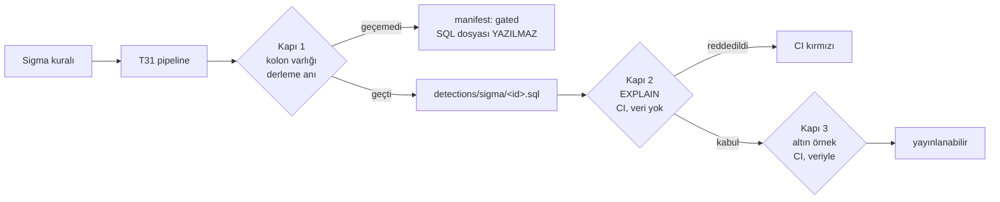

# T32 tasarım turu

Uygulamadan önceki tasarım turu. T31'in **kapsamı** ölçüme bağlı olduğu için
uygulama beklerken, kapsamdan **bağımsız** olan üç şey burada karara bağlandı:
kabul kriterlerinin bölünmesi, "derlendi ama koşmuyor"un hangi anda yakalanacağı,
ve üretilen SQL'in nasıl versiyonlanacağı.

§6'daki beş soru koordinatöre soruldu ve **cevaplandı**; kararlar aşağıda
gerekçeleriyle duruyor.

---

## 1 · `compiled = 24, runs = 14` — sebebi statik olarak bulundu

İlk brief bu farkın sebebini `ocsf_pipeline`'ın `type_uid` eklemesi olarak
veriyordu. **Bu koşumda o sebep işlemiyor:** `measure.py` ve `test_measure.py`
içinde `ocsf_pipeline` geçmiyor — ölçülen zincir yalnızca `bizigo_pipeline()`.
`type_uid` T30'un doğru tespit ettiği bir tuzak ama **bu on kuralın sebebi
değil.** Koordinatör düzeltmeyi kabul etti: sebep doğrulanmadan aktarılmıştı.

Ayrım önemli, çünkü ikisi T31'e farklı iş yazdırıyor: `type_uid` "zincire koyma"
der, aşağıdaki bulgu "eksik bir dönüşüm yaz" der.

### Gerçek sebep — `UNMAPPED_FIELDS` bir belge, bir dönüşüm değil

`bizigo_pipeline.py` iki liste tutuyor: `FIELD_MAP` (28 alan) ve
`UNMAPPED_FIELDS` (9 alan). Birincisi `FieldMappingTransformation`'a veriliyor.
**İkincisi hiçbir yere verilmiyor.** `unmapped_expression()` fonksiyonu tanımlı
ama depo genelinde **hiç çağrılmıyor** (`prototypes/t30-sigma/` içinde sıfır
referans). Yani o dokuz alan `unmapped['X']` olmuyor; pipeline'dan **olduğu gibi
geçiyor** ve backend `url = '…'`, `dns_query_name = '…'` gibi görünümde
karşılığı olmayan çıplak kolon adları üretiyor.

Bu, depoda tekrarlayan bir sınıfın örneği: **kod bir şeyi hazırlamış ama
bağlamamış, ve bağlanmamış olması hiçbir yerde belirti üretmiyor.**

24 kuralın alanları `FIELD_MAP`'ten geçirilip `events_ocsf`'in gerçek kolon
kümesine (`db/clickhouse/0003_ocsf_otel_views.sql`, 21 kolon) karşı sayıldı:

| Kural | Var olmayan kolon |
| --- | --- |
| `fortigate_blocked_category` | `url` |
| `fortigate_dns_tunnel` | `dns_query_name` |
| `nginx_admin_path` | `url` |
| `nginx_dns_rebind` | `query` |
| `nginx_large_upload` | `http_method`, `url` |
| `nginx_scanner_agent` | `user_agent` |
| `nginx_sqli_probe` | `url` |
| `routeros_dns_request` | `dns_query_name` |

**8 kural.** Kalan 16'nın kolonları gerçekten var.

### Dokuzuncu kural: farklı bir hata sınıfı

`fortigate_high_port_scan.yml` şunu yazıyor:

```yaml
proto: 6
dstport|gte: 30000
```

`proto` → `connection_info_protocol_name`, tipi `LowCardinality(String)`
(`0001_events.sql`: `proto LowCardinality(String)`). Tamsayı `6` ile String
karşılaştırması ClickHouse'ta **kolon var olmasına rağmen** düşer. Örneklemde
tamsayı `proto` yazan tek kural bu; diğer dördü `'ICMP'`, `'TCP'`, `'udp'`,
`'tcp'`.

**Bu ayrı bir sınıf ve §3'ün tasarımını doğrudan belirliyor:** kolon varlığı
kontrolü bunu yakalayamaz. Tip uyuşmazlığı ancak gerçek bir ClickHouse'a
sorularak görülür.

### Onuncusu bulunamadı

8 (kolon yok) + 1 (tip uyuşmazlığı) = **9**. Onuncu kuralı bu iki yöntemle
**aradım, bulamadım.** Aramadığım yer: pySigma'nın gerçek çıktısı — alan
adlarını YAML'dan regex ile çıkardım, derlemedim, modifier'ların ürettiği ifade
farkını görmedim.

`runs=14` üreten koşumun JSON çıktısı **artık yok**: koordinatör temizlik
sırasında sildi ve bunu hatası olarak kaydetti (ölçüm çıktısı veriydi, geçici
dosya değil). Ölçüm altın örnek yükleyicisi geldiğinde yeniden koşacak ve
saklanacak; onuncu kural oradan gelecek.

---

## 2 · Kabul kriterleri — hangisi ölçümü bekliyor

| # | Kriter | Ölçüme bağlı mı | Not |
| --- | --- | --- | --- |
| A | Tek komut, tekrarlanabilir çıktı: aynı girdi → aynı SQL | **Hayır** | Hattın özelliği, kapsamın değil. Sabit bir korpusla kurulur ve ölçülür |
| B | CI kapısı sürüklenmeyi yakalıyor; kırmızı yanabildiği ölçüldü | **Hayır** | Kapı mekanizması kapsamı bilmiyor |
| C | Derlenemeyen kural sayısı görünür | **Kısmen** | Mekanizma bağımsız; kapıya **çivilenen sayı** ölçümden geliyor |
| D | Üretilen SQL'in en az biri canlı ClickHouse'ta doğru sonuç veriyor | **Evet** | Canlı ClickHouse + yüklü altın örnek ister → koordinatör koşturur |

Kapsam maddelerinden:

| Madde | Ölçüme bağlı mı |
| --- | --- |
| SigmaHQ kurallarını çeken hat (commit SHA'sına sabitli) | **Hayır** — mekanizma bağımsız |
| Hangi vendor/kategori çekilecek | **Evet** — T30'un karar tablosu |
| T31'in pipeline'ıyla derleme | **T31'e bağlı** (ölçüme değil) |
| Versiyonlu SQL biçimi (kural kimliği, kaynak sürümü, tarih) | **Hayır** — §4 |
| Başarısız derleme eski dosyayı silmeli | **Hayır** — §4 |
| Sidecar'da Python 3.13+ | **Zaten sağlanmış** — `sidecar/Dockerfile` iki katmanda da `python:3.13-slim`, `requirements.txt` `pySigma==1.5.0` + `pysigma-backend-clickhouse==1.1.1` sabitli. Bu kriter bugün doğru; T32'nin yapacağı iş **onu kırmamak** |

**Sonuç:** A, B, C'nin mekanizması ve tüm §4 ölçüm beklemeden yazılabilir. Bekleyen
tek şey D ve korpus seçimi.

---

## 3 · "Derlendi ama koşmuyor" nerede yakalanır

Sorunun cevabı **üç ayrı yerde, üçü farklı şey yakaladığı için.** Tek yere
koymak, yakalayamadığı sınıfı sessizce geçirir.



| Kapı | Nerede koşar | Yakaladığı | Yakalayamadığı |
| --- | --- | --- | --- |
| **1 · kolon varlığı** | Derleme anında, hattın içinde. Docker yok, ClickHouse yok | §1'deki 8 kural: görünümde olmayan kolona referans | Tip uyuşmazlığı, fonksiyon yanlış kullanımı, sürüme özgü sözdizimi |
| **2 · `EXPLAIN`** | CI, **kendi işinde**, şema yüklü / veri yok | §1'deki 9. kural: `proto: 6` tip hatası. Sözdizimi. Ad çözümlemesi | Kuralın gerçekten bir şey eşleştirip eşleştirmediği |
| **3 · altın örnek** | CI, veri yüklü | Yanlış pozitif, sıfır eşleşme | — |

**Çalışma zamanı bu tablonun dışında ve öyle kalmalı.** T33'te bir kuralın
sessizce hiçbir şey yakalamaması, `CLAUDE.md` §7'nin adını koyduğu sınıf.
Kapı 1 ve 2 birlikte, o sınıfı derleme/CI'ya taşıyor.

### KARAR · Kapı 2 kendi CI işinde koşar

Var olan `integration` işi zaten Testcontainers kaldırıyor ve oraya eklemek ek
konteyner maliyeti getirmezdi. **Yine de ayrı iş.** Gerekçe: derleme kapısını
entegrasyon işine bağlamak, o iş **ilgisiz bir sebeple** düştüğünde derleme
kapısının da körleşmesi demek. Bu depoda "başkasının hatası yüzünden sessizleşen
bekçi" deseninin bedeli zaten ödendi. Konteyner maliyeti, kapının kendi ayakları
üstünde durmasından ucuz.

### KARAR · Kapı 1'den geçemeyen kural dosya üretmez

Manifest'e `gated` olarak sebebiyle yazılır (`unknown_column: url`). Böylece
`detections/` altındaki dosya sayısı `compiled` değil `runs`'a yaklaşır — ve
ticket'ın merkez cümlesi ("derleme başarısı, koşabilirlik değildir") kod
düzeyinde bir davranış hâline gelir, yorum satırı değil.

Taşıyıcı ilke: **var olan bir dosya "bu kural çalışıyor" iddiasıdır.**

### KARAR · Kolon listesi elle yazılmaz, göçlerden **sırayla** türetilir

`CLAUDE.md` §7'de bunun bedeli ödenmiş: `Produces<T>` kapısı uçları **elle
yazılmış** bir listeden topluyordu; üç uç dosyası listede olmadığı için 16 uç
kapıya hiç görünmedi ve üç test yeşil kaldı.

Kolon kümesi aynı tuzağa açık ve **asimetrik**:

| Sürüklenme | Sonuç |
| --- | --- |
| Görünüme kolon eklendi, liste güncellenmedi | Yeni kolona giden kural yanlışlıkla reddedilir — **gürültülü**, fark edilir |
| Görünümden kolon çıktı, liste güncellenmedi | O kolona giden kural kapıdan **geçer** ve çalışma zamanında kırılır — **sessiz** |

Küme `db/clickhouse/*.sql` göçlerinden **sırayla uygulanarak** türetiliyor.
Sıra şart: `0004` `events_otel`'i `DROP` + `CREATE` ile yeniden yaratıyor, yani
"en son tanım kazanır" bu depoda zaten işleyen bir kural ve yarın `events_ocsf`
için de işleyebilir. Yalnızca `0003`'ü okuyan bir çıkarıcı o gün sessizce
bayatlar.

Türetimin kendisi de bir bekçi ister: **entegrasyon testinde** (koordinatör
koşturur) türetilen küme canlı `events_ocsf`'in `DESCRIBE` çıktısıyla
karşılaştırılıyor. Ayrıştıkları gün kırmızı yanar. Türetici bayatlarsa bekçi
yine kör olurdu.

### KARAR · Kırmızı yanabilirlik iki bilerek kırık fixture ile ölçülür

| Fixture | Beklenen red | Hangi kapıyı sınar |
| --- | --- | --- |
| `type_uid` şart koşan kural | `unknown_column: type_uid` | Kapı 1 |
| `proto: 6` (String kolona tamsayı) | `EXPLAIN` reddi | Kapı 2 |

İkisi de **beklenen başarısızlık**; sayıları `ExpectedGatedCount` ile sabit —
§8'in muafiyet deseni. Negatif fixture eklemek **iki ayrı bilinçli hareket**
gerektirir, yoksa bir gün kapı bozulur ve "korpus büyüdü" diye okunur.

---

## 4 · Versiyonlama — iki olay, iki farklı görünüm

İki değişiklik türü var ve incelemede **karışmamaları** gerekiyor:

| Olay | Diff'te görünen | Gözden geçirenin sorusu |
| --- | --- | --- |
| Kaynak kural değişti | Birkaç `.sql` dosyası | "Bu kuralın anlamı ne oldu?" |
| Pipeline değişti | **Bütün** `.sql` dosyaları | "269 dosyadan hangisinin anlamı değişti?" |

İkincisi tek başına okunamaz bir diff. Ayrım şuradan geliyor:

### KARAR · Kural dosyasında derleme tarihi **yok**

```
detections/sigma/<rule_id>.sql
```

Başlık yorumu: kural kimliği, başlık, kaynak dosya yolu, kaynak kuralın
`sha256`'sı, kural setinin commit SHA'sı. **Derleme tarihi burada değil.**

Gerekçe mekanik, estetik değil: kabul kriteri A "aynı girdi, aynı SQL" diyor ve
B "çıktı depodakiyle aynı değilse CI düşsün" diyor. Kural dosyasına derleme
tarihi yazarsak her koşum farklı bayt üretir; kapı **yapısal olarak** birebir
karşılaştırma yapamaz hâle gelir ve ya kaldırılır ya da tarihi görmezden gelen
bir istisnayla yumuşatılır. İkisi de kapıyı öldürür.

Tarih **manifest'in koşum başlığında** durur — orada tek bir satır olur, 269
dosyada 269 satır değil.

### `manifest.json` — iki katmanlı

**Koşum başlığı** (koşum başına bir kez): kural seti commit SHA'sı, pipeline
sürümü + pipeline kaynağının `sha256`'sı, `pySigma` ve backend sürümleri,
derleme tarihi, sayılar (`compiled` / `written` / `gated` / `failed`).

**Kural girdisi** (kural başına): kimlik, kaynak yolu, `source_sha`, `output_sha`,
logsource, durum (`written` | `gated` | `failed`) ve sebep.

Böylece iki olay farklı okunuyor:

- **Kaynak değişti:** bir girdinin `source_sha` + `output_sha`'sı değişir, başlıktaki `pipeline_sha` **aynı** kalır.
- **Pipeline değişti:** `pipeline_sha` değişir; hangi kuralların anlamının gerçekten oynadığı, `output_sha` değişen girdilerin listesinden **mekanik olarak** okunur.

### KARAR · `pipeline_sha` değişince `pipeline_version` de değişmeli

Kapı bunu zorluyor. 269 dosyanın aynı etiket altında yeniden anlamlanması,
sessiz ayrışmanın ders kitabı hâli; sürtünme tek satır, bedeli ise "bu SQL hangi
eşlemeyle üretildi" sorusunun bir daha cevaplanamaması olurdu.

### KARAR · `gated` ≠ `failed`, ve ikisi de **eşik değil sabit**

`gated` bir kural *derleniyor* — koşmuyor. `failed` bir kural **derlenemiyor**,
yani pipeline kırık. Tek sayıda toplamak, ticket'ın ayırmak için var olduğu şeyi
geri birleştirirdi; manifest'te ayrılar.

CI'ya **uyarı eşiği konulmuyor.** Eşik "şu kadara kadar normal" der ve o rakam
bir gün kimsenin bakmadığı bir sayıya döner. `ExpectedGatedCount` sabit: artış
**ve azalış** testi kırar, incelemede tek başına göze çarpar. `failed` için
sabit sıfır.

### KARAR · Başarısız derleme eski dosyayı bırakmaz

Ticket'ın işaret ettiği `clicksiem/sigma_rules` tuzağı: dönüşüm başarısız
olduğunda eski çıktı depoda kalıyor ve dosya sayıları %100 uyum gibi görünüyor.

Çözüm "işaretle" değil **"hiç bırakma"**: hat çıktıyı geçici dizine üretir,
bittiğinde hedef dizinle **takas eder**. Bayat dosyanın hayatta kalabileceği bir
kod yolu yok — "silmeyi unutma" diye bir yol olmadığı için unutulamaz. Kaybolan
kural manifest'te `gated`/`failed` sebebiyle durur ve git'te **silinme** olarak
görünür; sessiz değil.

### KARAR · Kural seti sabit SHA'ya çivilenir, elle yükseltilir

`clicksiem` günlük cron kullanıyor. **Biz kullanmıyoruz** — bilinçli sapma.

Kriter A "aynı girdi, aynı SQL" diyorsa, kural setinin sürümü **girdinin
tanımına** giriyor. Günlük cron derlemeyi tekrarlanamaz yapar ve kapı bir
sabahtan diğerine kendi kendine kırmızı yanar: kimsenin bir şey değiştirmediği
bir günde düşen bir kapı, kısa sürede görmezden gelinen bir kapıdır.

Yükseltme elle ve tek satır: kural setinin SHA'sı değişir, hat koşar, üretilen
diff incelenir. Sürüklenme o an görünür — bir sabah değil, bir commit'te.

### `.gitignore` tuzağı — yol seçimi bilinçli

`.gitignore`'da `artifacts/` satırı var (.NET derleme çıktısı için, `CLAUDE.md`
§11'de de anılıyor). Üretilen SQL'i adında `artifacts` geçen bir yola koymak,
**üretilen çıktının sessizce commitlenmemesi** demek olurdu. `detections/sigma/`
seçildi; `.gitignore`'un hiçbir deseniyle kesişmiyor.

---

## 5 · Sıra

| Sıra | İş | Bloklayan |
| --- | --- | --- |
| 1 | Kolon kümesi çıkarıcısı + göç sırası + entegrasyon bekçisi | — |
| 2 | Kapı 1 (kolon varlığı) + negatif fixture'lar + kırmızı ölçümü | — |
| 3 | Manifest şeması, takaslı yazım, sürüklenme kapısı (`--check` kipi, `api:check` deseni) | — |
| 4 | Kapı 2 (`EXPLAIN`) — yazılır, **koşturulmaz** | — |
| 5 | Kural seti çekme (sabit SHA) | Korpus kararı |
| 6 | Gerçek derleme | T31 |
| 7 | Kriter D | Canlı ClickHouse + altın örnek (koordinatör) |

1–4 ölçümü beklemiyor: sabit bir korpusla kurulur, T31 gelince **korpus değişir,
hat değişmez.**
