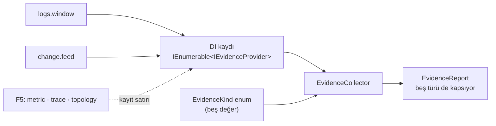

# T34 — Kanıt sağlayıcı sözleşmesi

`Bizigo.Evidence` projesi, `t34-kanit-sozlesmesi` dalı. Beş kanıt türü tanımlı,
ikisi uygulanıyor.

Bu belgenin asıl konusu tek bir tasarım kararı: **boş sonuç tek bir şey değil.**

## 1 · Boşluğun dört cinsi

RCA'nın tek gerçek riski inandırıcı ama yanlış rapor. Bu katmanda o risk şu
biçimde beliriyor: **raporun, bakmadığı bir şeye bakmış gibi görünmesi.** Dört
farklı olgu aynı boş listeye düşerse rapor iyimser yanılır ve bunu hiçbir hata
mesajı bozmaz.

| Durum | Ne demek | Kanıt mı? |
| --- | --- | --- |
| `Gathered` | Koştu, kanıt buldu | ✅ |
| `Empty` | Koştu, **bu pencerede** eşleşme yok | ✅ — "hiçbir şey değişmedi" kurulabilir bir cümle |
| `NeverFed` | Kaynakta **hiç** kayıt yok; besleme bağlı değil | ❌ ölçümün yokluğu |
| `Unavailable` | Sağlayıcı kayıtlı ama koşamıyor | ❌ |
| `Failed` | Koştu ve patladı | ❌ kanıt **eksik** |
| `NotRegistered` | Bu tür için sağlayıcı yok (F5) | ❌ hiç bakılmadı |

`NeverFed` doğrudan RCA artifact'ının 4. riskinin karşılığı: *"change beslemesi
boşsa 'değişiklik yok' diyen bir sağlayıcı olur."* O cümle, ölçülmemiş bir şeyi
ölçülmüş gibi gösterir. Ayrım ucuz: boş sonuç yolunda tek bir ek sorgu, akış
doluysa maliyeti sıfır.

`NotRegistered`'ı **sağlayıcı üretmiyor** — toplayıcı, `EvidenceKind` enum'unu
gezip karşılığı olmayan türü kendisi işaretliyor. F5 türleri için boş bir
sağlayıcı kaydetmek onları "var ama sonuç yok" gibi gösterirdi.

## 2 · "Yeni sağlayıcı eklendiğinde motor değişmiyor"

Kabul kriteri buydu ve bugün **sınanabilir** hâlde.

Toplayıcı sağlayıcıları **listeden** alıyor ve türleri **enum'dan**. F5'te trace
sağlayıcısı geldiğinde yapılacak tek şey bir `AddScoped` satırı.
`EvidenceCollectorTests.Yeni_saglayici_eklendiginde_toplayici_degismiyor` o günü
bugünden koşuyor: testin uydurduğu `Trace` sağlayıcısı toplayıcıda hiçbir
değişiklik olmadan rapora giriyor.

## 3 · Kapsam dışı sayım — ve sayamadığını sıfır sanmamak

Sağlayıcı, kapsam dışında kaç eşleşme olduğunu döndürüyor; **içeriğini değil**
(K17, RCA §3.2).

Olay tarafında `CountOutOfScopeEventsAsync` zaten vardı. **Değişiklik tarafında
yoktu** ve bu bir seçim gerektiriyordu: `0` dönmek mi, eklemek mi.

`0` dönmek sessiz bir yalan olurdu — rapor "kapsamınız dışında ilişkili
değişiklik yok" cümlesini kurar. Kök neden başka grubun cihazındaki bir config
değişikliğiyse rapor bunu **bilmeden** yanlış sonuca varır. O yüzden
`CountOutOfScopeChangesAsync` eklendi (`IScopedQuery` + `ChangeEventReader`).

**Sözleşme genişledi:** `IScopedQuery`'ye bir metot eklendi. Alarm motorunun
davranışı değişmedi.

## 4 · Bilerek yapılmayanlar

| Ne | Neden |
| --- | --- |
| Beş korelasyon | **T35.** Bu ticket sözleşme; `logs.window` referans uygulama |
| Kanıt paketi deposu, rapor | **T36** |
| Metric / trace / topology sağlayıcıları | **F5** — sözleşme tanıyor, uygulama yok |
| REST ucu | Tüketicisi T36'da; uç açmak kullanılmayan yüzey olurdu |

### `logs.window` neden T35'in beşinden biri değil

Log türünün bir referans uygulaması gerekiyordu: sözleşmeyi gerçek kapıya karşı
uçtan uca koşturan bir sağlayıcı — kapsam, kapsam dışı sayım, bütçe kırpması,
boş/dolu ayrımı, ham loga inen yol. Beş sinyalden birini seçmek T35'in işini
bölerdi.

Seçilen iş: **penceredeki ayrıştırma sorunlu satırlar**. Kanıt paketinin zaman
çizelgesi ve drilldown'u zaten pencerenin ham satırlarına ihtiyaç duyuyor, ve
`parse_status != ok` filtresi onu okunabilir boyutta tutuyor. Filtresiz bir
pencere dökümü kanıt değil, veri yığınıdır.

**Bu bir yorum, ticket'ta yazmıyordu.** Koordinatörün onayına açık.

## 5 · Drilldown ham SQL değil

Kanıt satırındaki "ham loga in" yolu bir `EventQuery` — SQL dizgisi değil.

Kanıt paketi **saklanıyor** (T36). SQL dizgisi yazmak, kapsam kapısını atlayan
bir yolu diske yazmak olurdu; yapılandırılmış sorgu tıklandığında
`IScopedQuery`'den geçiyor ve K17 yeniden uygulanıyor.

## 6 · İki kusur — yazarken çıktı, ikisi de sessiz olurdu

**1 · Çağıranın iptali "sağlayıcı patladı" diye raporlanıyordu.** Genel
`catch (Exception)` `OperationCanceledException`'ı da yakalıyordu, yani iptal
edilmiş bir RCA tam bir rapor üretiyordu. `Caginin_iptali_butce_asimi_sayilmiyor`
testi yazılırken çıktı.

**2 · Sağlayıcılar singleton kaydedilmişti — esir bağımlılık.** `IScopedQuery`
scoped (kontrol düzlemi DbContext'i + denetim kaydı). Singleton bir sağlayıcı
onu esir alır ve ilk isteğin DbContext'i sürecin ömrü boyunca kullanılırdı.
Belirtisi geç ve yanlış yere işaret eden bir arıza olurdu. `ValidateScopes` ile
kuran `EvidenceCompositionTests` yakaladı.

İkisi de tam olarak bu ticket'ın karşı durduğu sınıftan: hata vermeyen, yalnızca
sonucu sessizce bozan kusurlar.

## 7 · Bekçiler — kırmızı yanabildiği ölçüldü

Dördü de hata geri konularak sınandı, sonra geri alındı.

| Kırılan | Kırmızı yanan |
| --- | --- |
| Toplayıcı kayıtsız türleri raporlamıyor | `EvidenceCollectorTests` — 9'da 2 |
| `NeverFed` ayrımı kalkıyor (boş = `Empty`) | `EvidenceProviderTests` — 11'de 1 |
| Sağlayıcılar singleton | `EvidenceCompositionTests` — 3'te 3 |
| Kanıt katmanına `ClickHouse.Driver` | `ArchitectureTests` — K17 mesajıyla |

Ölçülen durum: 18 proje **0 uyarı**, **680** birim testi geçti / 3 atlandı
(626'ydı).

Entegrasyon tarafında yazıldı, koşturulmadı (faz sonu):
`ChangeOutOfScopeCountTests` — sayının doğruluğu, filtrenin kapsam dışına da
uygulanması, ve sınırsız kapsamda "dışarısı"nın olmaması.

## 8 · T35'e devredilenler

- **Beş korelasyon** ayrı sağlayıcılar olarak; toplayıcıda değişiklik
  gerekmiyor.
- **Baseline penceresi uzunluğu** — `RcaWindow`'da bilerek varsayılan **yok**.
  Ölçülüp gerekçesiyle seçilecek; ölçüm aracı bende, sayı koordinatörde.
- `ChangeFeedProvider.Lead` (30 dk) de ölçülmüş değil, **varsayılan**. Baseline
  ölçümüyle birlikte gözden geçirilmeli.
- **`signature_hash = 0` satırları korelasyondan hariç tutulmalı** (T29
  bulgusu): `0`'ı gerçek imza sanan bir `GROUP BY`, 16 KB sınırını aşan satırları
  tek sahte imzada toplar ve "hacim sapması" üretir.
- **Sessizlik sinyali** `GetSourceActivityAsync`'i kullanacak — üçüncü kopya
  yazılmayacak.
