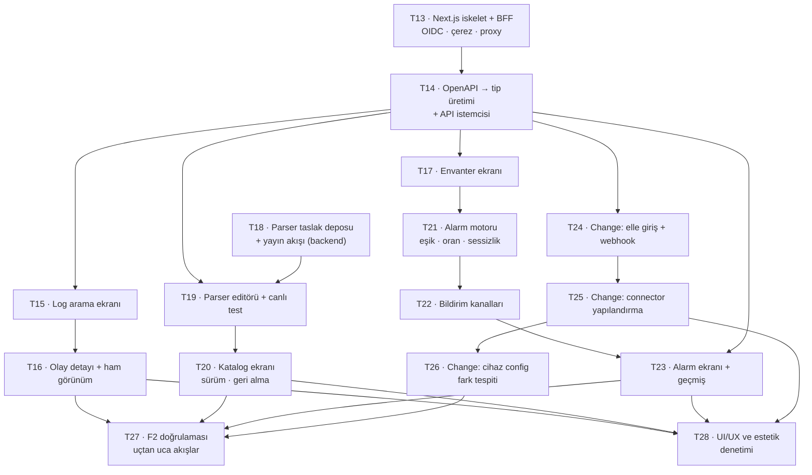

# F2 Implementasyon Ticket'ları

[F2 teknik plan](../f2-teknik-plan/index.md) on beş ticket'a bölündü.
Yöneten kararlar: K31–K34 (F2 planı) ve [mimari kararlar](../mimari-kararlar/index.md) K1–K30.

**Giriş noktası:** [F1 kapanışı](../f1-kapanis/index.md). Özellikle iki ölçüm F2'nin
arayüzünü doğrudan bağlıyor — kısa sorgu eşiği ve keyset'in kaynak filtresi kısıtı.

## Dilimleme mantığı

Üç bağımsız kol var ve **kasten paralel**: arayüz (T13–T17), parser yayını
(T18–T20), alarm (T21–T23). Change feed (T24–T26) en sona konuldu çünkü üçüncü
parçası — cihaz config fark tespiti — kendi başına bir alt sistem ve ondan
önceki her şeyin çalışır durumda olması gerekiyor.

T13 ve T14 kilit taşları: BFF ve tip üretimi olmadan hiçbir ekran yazılamaz.

## Sıra ve bağımlılıklar

## Ticket listesi

| # | Ticket | Özü | Bağımlılık |
| --- | --- | --- | --- |
| T13 | [Next.js iskelet ve BFF](nextjs-iskelet-bff/index.md) | OIDC authorization code + PKCE, oturum çerezi, API proxy, `Bizigo.Api`'den OIDC'nin çıkarılması | — |
| T14 | [OpenAPI tip üretimi](openapi-tip-uretimi/index.md) | Şemadan TypeScript tipleri, tiplenmiş istemci, CI'da sürüklenme kapısı | T13 |
| T15 | [Log arama ekranı](log-arama-ekrani/index.md) | Filtreler, keyset sayfalama, kısa sorgu kısıtı, kaynak filtresi teşviki | T14 |
| T16 | [Olay detayı ve ham görünüm](olay-detayi/index.md) | Alan görünümü, `time_source`, etiketler, ham baytlar + indirme | T15 |
| T17 | [Envanter ekranı](envanter-ekrani/index.md) | Kaynak listesi, grup ataması, CSV yükleme, sağlık göstergeleri | T14 |
| T18 | [Parser taslak deposu ve yayın akışı](parser-yayin-akisi/index.md) | Taslak tabloları, lint kapısı, atomik yayın, sürümleme, geri alma | — |
| T19 | [Parser editörü ve canlı test](parser-editoru/index.md) | YAML editörü, `POST /v1/parsers/try`, örnek satırla önizleme, dispatch kademesi | T14, T18 |
| T20 | [Katalog yönetim ekranı](katalog-ekrani/index.md) | Parser listesi, sürüm geçmişi, inceleme kuyruğu, geri alma | T19 |
| T21 | [Alarm motoru](alarm-motoru/index.md) | Kural modeli, değerlendirici, eşik/oran/**sessizlik**, kapsam altında koşum | T17 |
| T22 | [Bildirim kanalları](bildirim-kanallari/index.md) | Slack, Teams, e-posta, webhook; yeniden deneme ve susturma | T21 |
| T23 | [Alarm yönetim ekranı](alarm-ekrani/index.md) | Kural CRUD, önizleme, tetiklenme geçmişi | T14, T22 |
| T24 | [Change: elle giriş ve webhook](change-webhook/index.md) | UI formu, imzalı webhook alıcısı, sağlayıcı yük eşlemesi | T14 |
| T25 | [Change: connector yapılandırma](change-connector/index.md) | Connector tablosu, CRUD API, ekran, şifreli kimlik bilgisi | T24 |
| T26 | [Change: cihaz config fark tespiti](change-config-diff/index.md) | Periyodik çekim, fark alma, vendor başına yöntem | T25 |
| T27 | [F2 doğrulaması](f2-dogrulamasi/index.md) | Uçtan uca akışlar, kapsam ayrışması, bekçiler | T16, T20, T23, T26 |
| T28 | [UI/UX ve estetik denetimi](ui-ux-denetimi/index.md) | Tutarlılık, dört durum, çok dilli gövde, erişilebilirlik, kanıt | T16, T20, T23, T25 |

## Bitti tanımı

F2, şu cümleler doğru olduğunda biter:

1. Kullanıcı tarayıcıdan giriş yapıp **kendi grubunun** loglarını arayabiliyor;
başka grubun verisi hiçbir ekranda görünmüyor.
2. Erişim token'ı tarayıcıya **hiç** ulaşmıyor.
3. Bir parser üründe yazılıp denenip yayınlanabiliyor; bozuk parser yayına
çıkamıyor ve yayın hatası çalışan kataloğu bozmuyor.
4. Susan bir cihaz alarm üretiyor ve alarm bir kanala ulaşıyor.
5. `change_events` tablosu üç kaynaktan da gerçek veriyle doluyor ve
yapılandırma ekrandan yapılabiliyor.
6. Her ticket kendi kapsam ayrışması testini taşıyor — sona bırakılmış bir
doğrulama listesi **yok**.
7. Ekranlar **birlikte bir ürün gibi** görünüyor: aynı işi yapan bileşenler aynı,
her ekranın boş/yükleniyor/hata/çok-veri durumu tanımlı, ve tablolar Türkçe,
Arapça, Çince uzun gövdelerde bozulmuyor.

Altıncı madde F1'in dersinden: doğrulanmamış her katman kırıktı ve hiçbiri
kendini belli etmedi. Yedincisi ise şundan: yedi ekran tek tek çalışıp yedi ayrı
ürün gibi duruyorsa F2 yarım bitmiş olur.
