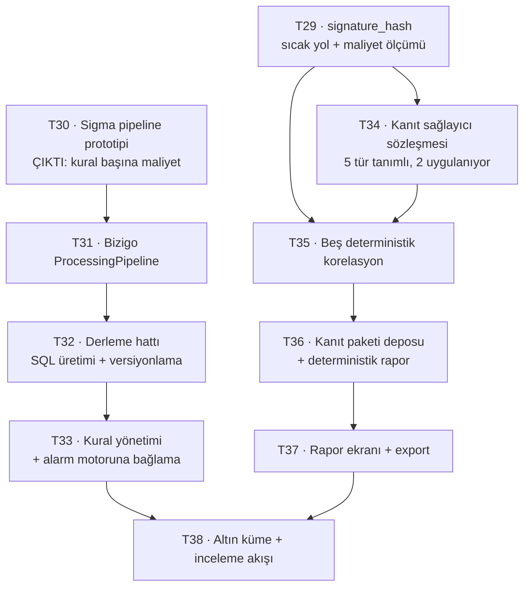

# F3 Implementasyon Ticket'ları

[F3 teknik plan](../f3-teknik-plan/index.md) on ticket'a bölündü.
Yöneten kararlar: K35–K36 (F3 planı) · K19–K22 (RCA) · [mimari kararlar §3.1](../mimari-kararlar/index.md).

## Dilimleme mantığı

**T29 ve T30 önce ve ölçüm işi** — ikisi de kod teslim etmiyor, sayı teslim
ediyor. F1'in dersi bunu zorunlu kılıyor: doğrulanmamış her katman kırıktı.
K35'in sıcak yol maliyeti ve Sigma'nın kural başına maliyeti bilinmeden
sonrasını planlamak tahmin olur.

Sonrası iki bağımsız kol: **detection** (T31–T33) ve **kanıt** (T34–T37).
İkisi T38'de buluşuyor.

## Sıra ve bağımlılıklar

## Ticket listesi

| # | Ticket | Özü | Bağımlılık |
| --- | --- | --- | --- |
| T29 | [signature_hash ve sıcak yol maliyeti](signature-hash/index.md) | Her olayda imza hash'i; maliyet **ölçülüyor** | — |
| T30 | [Sigma pipeline prototipi](sigma-prototip/index.md) | 20-30 kural, atılabilir; **çıktı bir sayı** | — |
| T31 | [Bizigo ProcessingPipeline](sigma-pipeline/index.md) | Kendi alan eşlememiz; kapsam T30'un sonucuna göre | T30 |
| T32 | [Derleme hattı](sigma-derleme/index.md) | Build-time SQL üretimi, repoda versiyonlama, CI kapısı | T31 |
| T33 | [Kural yönetimi](kural-yonetimi/index.md) | Etkin/pasif, kapsam, gürültü; F2'nin alarm motoruna bağlama | T32 |
| T34 | [Kanıt sağlayıcı sözleşmesi](kanit-sozlesmesi/index.md) | Beş tür tanımlı, log + change uygulanıyor | T29 |
| T35 | [Beş deterministik korelasyon](korelasyonlar/index.md) | İlk-görülen, hacim sapması, sessizlik, lift, yayılma | T29, T34 |
| T36 | [Kanıt paketi ve rapor](kanit-paketi/index.md) | Depo, deterministik rapor, kapsam dışı dürüstlük | T35 |
| T37 | [Rapor ekranı ve export](rapor-ekrani/index.md) | UI, export, inceleme düğmeleri | T36 |
| T38 | [Altın küme ve inceleme akışı](altin-kume/index.md) | Alarm kapatmanın zorunlu parçası | T33, T37 |

## Bitti tanımı

1. Bir Sigma kuralı derlenmiş SQL olarak repoda duruyor, alarm motorunda koşuyor
ve tetiklendiğinde bildirim gidiyor.
2. Bir olay için kanıt paketi **LLM olmadan** üretiliyor, saklanıyor ve
okunabiliyor.
3. Rapor, kapsam dışında kaç ilişkili olay olduğunu **sayı olarak** söylüyor —
içeriğini sızdırmadan.
4. Rapor, penceresinde `time_source` güvenilmez olan olay varsa bunu söylüyor.
5. Alarm kapatan kullanıcı "doğru muydu?" sorusunu **atlayamıyor**; altın küme
kendiliğinden birikiyor.
6. T29 ve T30'un ölçümleri artifact'ta yazılı — F3 sonrası kimse "bu ne kadara
mal oldu" diye tahmin yürütmüyor.
