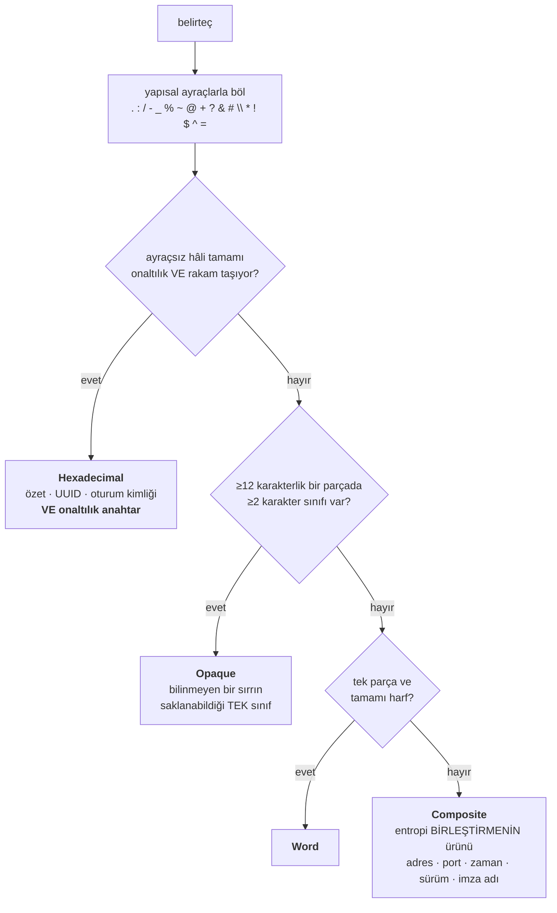

# T60 — Entropi katmanının terfi kararı

> **Cevap: katman A maskelemeye geçmiyor.** Ve bu bir *"henüz değil"* değil:
> gölge sayaç **kalıcı bir ölçüme** dönüyor. Ayrım kodda duruyor
> (`ShadowLayerPurpose`), bir yorumda değil.

**Kaynak:** [T41 §3 — "A neden gölgede"](../prompt-redaksiyon-tabani/index.md) ·
**Yöneten kararlar:** T41 §4 (yanlış pozitiflerin asimetrisi) · `CLAUDE.md` §8
(*"bir gün kapanacak" ile "hiç kapanmayacak" aynı listede duramaz*) · §6 (ölçüm
kültürü) · K6 (veri kurum dışına çıkmaz)

---

## 1 · Soru ve cevap

T41 redaksiyon tabanını üç katman kurdu — **C** (üretici söz dizimi, maskeliyor)
→ **dar B** (PEM · JWT · `Authorization`, maskeliyor) → **A** (entropi,
**yalnızca sayıyor**) — ve A'nın gölgede kalma sebebini yazdı: *ölçülmemiş bir
eşik.* Terfiyi ayrı bir ticket'a bıraktı. Bu o ticket.

| | |
| --- | --- |
| **Terfi ediyor mu** | **Hayır** |
| **Sebep** | Marjinal kazanç **0**; ayıran eşik **yok**; ayıran sınıf geçidi **gerçek bir sır biçimini muaf tutuyor** |
| **Gölge sayaç ne oluyor** | Kalıyor — **kalıcı ölçüm** (`ShadowLayerPurpose.PermanentInstrument`) |
| **Sayacın yayını ne oluyor** | Tek oran yerine **mekanik sınıf dağılımı** |

**Kararın çevirdiği asıl cümle T41'in gerekçesinde:** *"eşik ölçülmedi"* örtük
olarak **doğru bir eşiğin var olduğunu** varsayıyordu. T60 o varsayımı ölçtü ve
yanlışladı. Sorun eşikte değil **eksende**: Shannon entropisi bir belirtecin
**kodlamasını** ölçüyor, hassasiyetini değil. Hassasiyet bağlamda yazılı — ve
bağlam katman C'nin ekseni.

## 2 · Ölçüldü — dört ölçüm, kararı üçü birden veriyor

Hepsi `tests/Bizigo.UnitTests/ShadowPromotionMeasurementTests.cs`, konteynersiz
(§2). Korpuslar: **altın korpus** (`catalog/parsers/**/*.log`, 87 satır,
**sırsız**) ve **sır taşıyan fixture'lar**
(`catalog/simulators/profiller/*/sir-tasiyan.log`, **11 bildirilen sahte sır**).

### 2.1 · Marjinal kazanç sıfır

Terfinin tek meşru gerekçesi *"C+B'nin kaçırdığı bir sırrı A yakalıyor"*
olabilirdi.

| Ölçüm | Sonuç |
| --- | --- |
| Bildirilen sahte sır | **11** |
| C+B'nin maskelediği | **11** |
| **A'nın ek olarak yakaladığı** | **0** |
| A'nın tek başına görebileceği (uzunluk + entropi) | 10 |
| A'nın **hiçbir eşikte** göremeyeceği | 1 — `SAHTE-p9Wz`, ASA'nın 4 karakterlik SNMP community'si |

Son satır kayda değer: katman A'nın kaçırdığı sınıfın örneği fixture'da **zaten
duruyor**. Minimum belirteç uzunluğu 20; dört karakterlik gerçek bir sır entropi
ekseninde görünmez ve bu, eşikle çözülebilecek bir şey değil — kısa belirteçte
Shannon entropisi anlamsız.

**Bu sayının sınırı yazılı olmalı ve sınır dar:** fixture'lar *C ve B için*
yazıldı, yani her satır bir üretici anahtar kelimesi ya da kendini tarif eden
bir biçim taşıyor. `0/11` kısmen fixture'ın şeklinin sonucu. Ama T41 §4 hâlâ
geçerli: **kaçırma yalnızca sırrın ne olduğu önceden biliniyorsa ölçülebiliyor**,
ve bu bilindiği tek küme. Altın korpusta ölçülemiyor, çünkü içinde sır yok.

### 2.2 · Ayıran bir eşik yok — süpürüldü

Izgara: eşik `3.0–6.0` (0.1 adım) × minimum uzunluk `8–40`. Aranan nokta:
*entropiyle görülebilen 10 sır aday **ve** altın korpusta hiç aday yok.*
**Böyle bir nokta yok.**

**Ölçüt 11 değil 10 sır üzerinden ve bu bir zayıflatma değil, tam tersi:**
11'inci sır (`SAHTE-p9Wz`) ancak ızgaranın en alt köşesinde aday oluyor, yani
*"11'ini yakala"* diye kurulmuş bir ölçüt entropi diğer 10'u **kusursuz ayırsa
bile** yeşil kalırdı — bekçi doğru sebeple değil ulaşılmaz bir eşik yüzünden
tutardı.

En keskin hâli tek satırda: sahte sırların **en düşük entropisi 4.28
bit/karakter**, ve o eşikte altın korpusta hâlâ **5 aday** kalıyor. Beşi de
RCA'nın raporlamak istediği şey:

| Belirteç | Entropi | Ne |
| --- | --- | --- |
| `http://lessons.example.com/A%20Beka…elephants.mp4` | 4.80 | istek URL'i |
| `/A%20Beka%20G1%20Howe/029_AND_30/15%20reading%20elephants.mp4` | 4.65 | yol |
| `http://www.fortinet.com/ids/VID23305` | 4.37 | imza referansı |
| `http://172.16.200.55/virus/eicar.com` | 4.28 | indirilen dosyanın adresi |
| `SAHTE-Hj3nR8vQ2wE5tY7u` | 4.28 | **gerçek sır** |

Son iki satır aynı entropide. **İşaret de ters dönebiliyor:** korpusun en yüksek
entropili belirteci bir URL, en yüksek entropili sır ondan **daha düşük**.

### 2.3 · Sınıf ayrımı var — ve bedeli ölçülemeyen yönde

Eşik ayıramıyorsa *sınıf* ayırabilir mi? Ayırıyor: mekanik bir sınıflandırıcı
(§3) sahte sırların entropiyle görülebilen **10'unun 10'unu** `Opaque` sınıfına
koyuyor, altın korpusun 59 adayının yalnızca **3'ünü**.

Ama "yalnızca `Opaque` maskelenir" kuralı iki **gerçek** sır biçimini muaf
tutuyor ve ikisi de ağ cihazı alanının tam ortasında:

| Biçim | Sınıfı | Neden orada |
| --- | --- | --- |
| Onaltılık kodlanmış anahtar — 64 karakterlik WPA PSK, Cisco `key-string`, `ENC` blob'u | `Hexadecimal` | Bir sha256 özetiyle **aynı** alfabe, aynı uzunluk, ayırt edilemez entropi |
| Sözcüklerden kurulu parola ifadesi (`…Uzun.Parola.Ifadesi…`) | `Composite` / `Word` | İmza adlarıyla aynı kutuda |

Birincisi ölçüldü ve *iddia edilmedi*: test bir onaltılık anahtar ile bir sha256
özetini yan yana koyup **aynı sınıfa düştüklerini** ve entropi farkının bir
işaret taşımadığını (< 0.3 bit/krk) gösteriyor.

**Sınıf geçidini kurmak, ölçülemeyen yöne bir kapı açmak demek** — T41 §4'ün tam
olarak yasakladığı hareket. Bugün ölçülen bir yanlış pozitif (3/96) yerine, hiç
ölçülemeyecek bir kaçırma yolu satın alınırdı.

### 2.4 · Sınıf ekseninde de temiz bir nokta yok

Sınıflandırıcının kendi eşiği (`OpaqueRunLength`) süpürüldü. **İlk hâlinde test
*"eşik taşıyıcı değil"* diye yazıldı ve DÜŞTÜ** — ölçüm eşiğin taşıyıcı olduğunu
gösterdi:

| `L` | Altın korpusun opak sayısı | 10 sırdan opak kalan |
| --- | --- | --- |
| 4 | 17 | 10 |
| 8 | 9 | 10 |
| **12** (ürünün değeri) | **3** | **10** |
| 14 | 2 | 10 |
| **15** | **0** | **9** |

Altın gürültünün sıfıra indiği ilk nokta (15), **sırların düşmeye başladığı
nokta**. Aralarında boşluk yok. Yani entropi ekseninde bulunmayan şey burada da
bulunmuyor.

**Eşiğin taşıyıcı olması bugün bir sorun değil, yarın olurdu:** sınıf bir
*rapor etiketi* olduğu sürece kayan bir eşik yalnızca etiketi kaydırıyor, hiçbir
metin kaybolmuyor. Bir *maskeleme kapısına* bağlanırsa aynı eşik, ölçülmemiş bir
bilginin üstüne kurulmuş bir muafiyet hâline gelir — T60'ın var olma sebebinin
(ölçülmemiş bir eşik) tekrarı.

### 2.5 · Bugünkü dağılım — çivili

Altın korpus, eşik 3.50 bit/krk, minimum uzunluk 20: **aday 59, payda 96.**

| Sınıf | Sayı | İçinde ne var |
| --- | --- | --- |
| `Composite` | **48** | ASA `arayüz:ip/port` üçlüleri (20+), URL'ler, zaman damgaları, `Chrome/81.0.4044.138`, `Adobe.Flash.newfunction.Handling.Code.Execution`, `HTTP.BROWSER_Firefox` |
| `Hexadecimal` | **7** | 3 UUID, 1 sha256, **3 zaman damgası** (§6'daki kusur) |
| `Word` | **1** | `someotherrouteridagain` |
| `Opaque` | **3** | `0.8.16~exp12ubuntu10.21`, `1765de8-5a13-765da73fdsfa1c`, `2345de-b143-52134d8-6654f-4654sdfg16f431` |

**Koordinatörün bulgusundan bir adım öte:** listenin başında imza adları
yok — **adresler ve portlar** var. 59'un yarısından çoğu `outside:192.168.80.32/53`
biçiminde, yani ağ olayının **beş bileşenli anahtarı**. Terfi ettirilseydi
maskelenecek ilk şey saldırının adı değil, **kimin kime hangi porttan
konuştuğu** olurdu.

Sayılar **çivili** (`GoldenCandidates`, `GoldenEvaluatedTokens` ve dört sınıf
sabiti). Düşerse yapılacak şey sayıyı güncellemek değil: yeni dağılımı okumak ve
**kararın hâlâ aynı olup olmadığına bakmak.** Opak sayısı yükseldiyse terfi
sorusu yeniden açılabilir.

## 3 · Mekanik ayrım — sözcük listesi yok

Sınıflandırıcı sözcüklere hiç bakmıyor; **ayraç yapısına ve karakter sınıflarına**
bakıyor. Bir imza adı listesi tanımı gereği eskiyen bir liste olurdu (yeni imza
her gün doğuyor) ve bu depo elle tutulan listelerin bekçiyi körleştirdiğini beş
kez ölçtü.

Ayrımın kavramsal özü tek cümlede: **`Composite`'ın entropisi belirtecin
kendisinden değil, kısa parçaların yan yana gelmesinden geliyor.**
`outside:192.168.80.32/53` yüksek entropi veriyor çünkü altı ayrı parçadan
kurulu; parçaların hiçbiri rastgele değil.

**Sıra gerekçeli:** onaltılık kontrolü `Opaque`'tan önce, çünkü bir UUID'nin son
grubu (`d1d2ce663f4b`) opak dizi ölçütünü de karşılıyor. Onaltılık daha **dar**
bir iddia — alfabesi yazılı — ve dar iddia geniş olanı yutmamalı. Yutulursa bir
sha256 ile bir WPA PSK'nın **ayırt edilemezliği görünmez olur**, ve o
ayırt edilemezlik bu kararın belkemiği.

### Sınıflandırma neden güvenli

Tek cümle: **hiçbir maskeleme kararını kapatmıyor.** Katman A maskelemediği için
sınıflandırıcının kör noktaları **bugün hiçbir şeye mal olmuyor** — yanlış
etiketlenen bir belirteç yine prompt'ta duruyor. A terfi ederse aynı sınıflar
birden **muafiyet** olur; bu yüzden sınıflandırma ile terfi aynı ticket'ta
kararlaştırılıyor ve terfi reddediliyor.

## 4 · Sayaç ne için duruyor — `Pending` ≠ `Exempt`, üçüncü kez

T41 sayacı *"sayı kabul edilebilir çıkarsa terfi eder"* diye bıraktı; yani sayaç
bir **bekleyen kalem**di. Terfi reddedildikten sonra sayacın durması iki bambaşka
şey anlatabiliyor ve ikisi tek gösterimde duramaz:

| Değer | Anlamı | Sonucu |
| --- | --- | --- |
| `PromotionCandidate` | Bir gün terfi için bekliyor | Kapanmamış iş var; *"gölge katman ne oldu"* her faz sonunda yeniden sorulur |
| **`PermanentInstrument`** | **Kalıcı ölçüm** | Kapanacak iş yok; sayaç kendi başına bir ürün özelliği |

Aynı ayrım bu depoda üç kez daha kuruldu: `ProducesContractTests.Pending` ≠
`Exempt`, `EvidenceStatus.NotRegistered` ≠ `OutOfScope`,
`EpicStatusTests.KnownDivergence` ≠ `StructurallyUnaligned`.

**Neden bir yorum yetmezdi.** Yorum okunmadan da doğru kalır. Değer kanıt
paketine `redaction_shadow_purpose` olarak yazılıyor, yani sayıyı altı ay sonra
okuyan taraf onun **hangi soruyu cevapladığını sayının yanında** görüyor. Alan
olmasaydı okuyan varsayılanı seçerdi, ve varsayılan T41'in bıraktığı hâl —
*terfi bekliyor* — olurdu.

**`PromotionCandidate` neden silinmedi.** Karar bir korpusa ve bir kanıt kümesine
dayanıyor (§2.1'in sınırı). Gerçek müşteri verisinde katman A'nın C+B'nin
kaçırdığı bir sırrı yakaladığı **ölçülürse** karar yeniden açılır. Değerin var
olması, o dönüşün bir **kod değişikliği** olarak görünmesini sağlıyor.

### Sayacın yeni işi

Tek bir oran yerine **sınıf dağılımı** yayılıyor. Gerekçe ölçüldü: `0.6146`
yükseldiğinde okunacak şey *"sır riski arttı"* değil *"prompt'ta daha çok adres
geçti"*ydi — yani sayı ölçtüğü şeyi söylemiyordu.

| Alan | Ne |
| --- | --- |
| `redaction_shadow_purpose` | `permanentinstrument` — sayının hangi soruyu cevapladığı |
| `redaction_shadow_class_opaque` | **Okunacak sayı bu.** Bilinmeyen bir sırrın saklanabildiği tek sınıf |
| `redaction_shadow_class_hexadecimal` · `_composite` · `_word` | Gürültünün nereden geldiği |

Dördü de **sıfırken de** yazılıyor (T41'in kuralı), ve toplamları
`redaction_shadow_candidates`'a **eşit** — beşinci bir sınıf eklenip
yayılmazsa eşitlik bozulur ve ölçüm testi kırmızı yanar. Sessiz genişleme
kapatıldı.

### Nerede duruyor

| Parça | Yer |
| --- | --- |
| Sınıflar + sınıflandırıcı | `src/Bizigo.Contracts/Security/ShadowTokenClassifier.cs` |
| Kararın kendisi | `src/Bizigo.Contracts/Security/ShadowLayerPurpose.cs` |
| Sayaç, dağılım, kanıt alanları | `RedactedPrompt` — `ShadowTokens`, `ShadowClasses`, `ShadowPurpose` |
| Ölçümler | `tests/Bizigo.UnitTests/ShadowPromotionMeasurementTests.cs` (7 test) |
| Ortak korpus okuyucusu | `tests/Bizigo.UnitTests/RedactionFixtures.cs` |
| Kırmızı ölçümü | `tools/t60-kirmizi-olcumu.py` |

İki küçük yapısal karar:

- **`RedactedPrompt.ShadowTokens` eşiksiz.** Eşik bir *okuma* parametresi,
belirteçlemenin parçası değil. Ayrılmasının sebebi ölçüm: *"ayıran bir eşik var
mı"* sorusu aynı belirteç listesi üzerinde çok sayıda eşik denemeyi gerektiriyor
ve ikinci bir belirteçleyici yazmak §9'un yasakladığı şey.
- **`ShadowTokensOf` C+B uygulamıyor.** *"C+B bu sırrı kaçırsaydı A görür
müydü"* sorusu başka türlü cevaplanamıyordu: JWT gibi bir değer B tarafından
maskelendiği için ölçüm *"A görmedi"* diye okunuyordu. Kapıyı devre dışı
bırakarak ölçmek bir **kusur** ölçümü olurdu, bir ölçüm değil. Prompt'a giden yol
hâlâ tek (`Redact`); bu metot bir `RedactedPrompt` üretmiyor.

## 5 · Fixture'a ne konmadı ve neden

İki sır biçimi (§2.3) `sir-tasiyan.log`'a **konmadı**, ve sebep konvansiyonun
kendisi: o dosyanın adı *"bu dosyadaki her satırda bir sır var ve kapı onu
**BULMALI**"* diyor. Bu iki biçim, kapının anahtar kelime olmadan **yapısal
olarak** bulamadığı biçimler; oraya konsa fixture'ın kendi adı yalan olur ve
`Kapi_sir_tasiyan_fixturelarda_sirri_buluyor` haklı olarak kırmızı yanardı.

Ölçüm bu yüzden testin içinde ve değerler **hesaplanıyor**: onaltılık bir dizge
`SAHTE` işaretini taşıyamıyor, ama işaretin sha256'sı olarak üretilen bir değer
gerçek bir anahtar **olamaz** — kaynağı testin kendisi. Kriter 10'un istediği
güvence böyle sağlanıyor.

**Düşünülen ve seçilmeyen alternatif:** *"kapının bulamadığı sırlar"* için ayrı
bir fixture dosyası (`sir-tasiyan-bulunamayan.log`). Negatif bir iddia listesi
olurdu ve küçülmesi beklenmeyen bir liste — §8'in *"bir gün kapanacak ile hiç
kapanmayacak"* ayrımını üçüncü bir yere taşırdı. Bugünkü hâl iki biçimi
ölçülmüş tutuyor ve listeyi doğurmuyor.

## 6 · Sınıflandırıcının kör noktaları — ölçüldü, kaydedildi

**Ay adı onaltılık sanılabiliyor.** `07/Dec/2016:10:43:18` → ayraçlar
çıkarıldığında kalan her karakter onaltılık (`Dec`'in üç harfi de) ve belirteç
`Hexadecimal` sayılıyor. `25/Oct/2016:14:49:33` aynı şeyi yapmıyor, çünkü `t`
onaltılık değil. Dağılımdaki 7 onaltılıktan **3'ü** bu.

Düzeltilmedi ve gerekçesi yazılı: "ay adı" tanımak bir **sözcük listesi** ister,
ve bu ticket'ın ölçtüğü şeylerden biri elle tutulan listelerin bekçiyi
körleştirdiği. Bir kusuru sözcük listesiyle kapatmak, kusurun **sınıfını**
değiştirmek olurdu. Bugün bedeli yok (etiket kayıyor, metin kaybolmuyor); A
terfi ettiği gün bedeli olan bir muafiyete dönüşürdü — ve kararın gerekçesi tam
olarak bu satır.

**Opak dizi eşiği taşıyıcı** (§2.4). Yazılı olması gereken sınır: eşik 15'e
çıkarsa sahte sırlardan biri sınıf değiştiriyor, 4'e inerse altın korpusun 17
belirteci opak sayılıyor. Ürünün değeri (12) uçurumun üç birim altında.

**`Opaque` sınıfı "sır" demiyor.** Bugünkü üç opak adayın üçü de sır değil: bir
Debian sürüm dizgesi ve iki FortiGate kimliği. Sınıfın iddiası tek yönlü —
*"sır buradaysa buradadır"*, *"burada olan sırdır"* değil.

## 7 · Kırmızı yanabildiği ölçüldü

`tools/t60-kirmizi-olcumu.py` — yedi kusur, her biri için dört adım: kusuru yaz →
**dosyayı oku ve kusurun orada olduğunu iddia et** → koştur → yedek dosyadan geri
al. Sonda tam paket bir kez daha koşuyor (T44'te kusuru yakalayan şey bir bekçi
değil o koşumdu).

| # | Kusur | Beklenen kırmızı | Sonuç |
| --- | --- | --- | --- |
| 1 | Katman A sessizce maskelemeye başlıyor | `Golge_katman_ciktiyi_degistirmiyor`, `Golge_sayac_kalici_olcum_olarak_yayiliyor`, `Altin_korpusta_yanlis_pozitif_yok` | **3/3 kırmızı** |
| 2 | **Karar geri alınıyor:** sayaç yine terfi bekliyor | `Golge_sayac_kalici_olcum_olarak_yayiliyor` | **kırmızı** — ve `Golge_katman_ciktiyi_degistirmiyor` **yeşil kaldı** |
| 3 | Sınıf dağılımı kanıt paketine yayılmıyor | `Golge_sayac_kalici_olcum_olarak_yayiliyor` | **kırmızı** |
| 4 | Onaltılık sınıfı `Opaque` içine yutuluyor | Sınıf geçidi ölçümü, dağılım, ay adı kusuru | **3/3 kırmızı** |
| 5 | Karakter sınıfı koşulu kaldırılıyor | Dağılım | **kırmızı** |
| 6 | Minimum belirteç uzunluğu 20 → 8 | Dağılım (payda çivisi) | **kırmızı** |
| 7 | **Ölçüm korpusu sessizce boşalıyor** | Dağılım, `Altin_korpusta_yanlis_pozitif_yok`, sınıf süpürmesi | **3/3 kırmızı** |

Geri alındıktan sonra tam paket: **1482 geçti / 0 düştü / 2 atlandı.**

**2 ve 7 bu ticket'a özel ve ikisi de bir sınıf ölçüyor.** 2, kararın bir yorum
değil bir **değer** olmasının sınavı: yorum olsaydı bu kusur diye bir şey
olmazdı — ve aynı kusurda T41'in davranış bekçisinin **yeşil kalması** ikisinin
farklı şeyler ölçtüğünün kanıtı. 7, çivili sayıların **boş küme üzerinde** de
tutabilmesine karşı: o kusurla yeşil kalan bir bekçi hiçbir şey ölçmüyor
demektir (§7).

## 8 · Ne ölçülmedi, ne arandı

**Ölçüldü:** §2'nin dört ölçümü, dağılım, iki eşik süpürmesi, sınıflandırıcının
ay-adı kusuru.

**Arandı, bulunamadı** — *"aramadım"* ile aynı şey değil:

- Depoda `RedactedPrompt`'un gölge sayılarını **okuyan** bir karar yolu yok:
`redaction_shadow_*` alanları `ModelRequest.AuditFields()` üzerinden kanıt
paketine yazılıyor, hiçbir eşik karşılaştırmasına girmiyor. Yani sınıf
dağılımını eklemek hiçbir davranışı değiştirmiyor (aranan: `src`, `tests`,
`sim` — `ShadowCandidates`/`ShadowRatio` tüketicileri).
- Ekranda gölge sayılarını gösteren bir yüzey yok (`ui/` — `shadow`,
`redaction_shadow`: sıfır eşleşme). Yani T60 bir arayüz kalemi doğurmuyor.

**Ölçülemedi ve sebebi eksiklik değil, ölçülemezliğin kendisi:**

- **Katman A'nın gerçek kaçırma oranı.** T41 §4: kaçırma yalnızca sırrın ne
olduğu önceden biliniyorsa ölçülebiliyor. Fixture'lar dışında bilinen bir sır
kümesi yok, ve fixture'lar C+B için yazıldı.
- **Gerçek müşteri verisinde opak aday oranı.** Bugünkü `3/96` altın korpusun
oranı; gerçek trafikte base64 gövde, oturum jetonu ve API yanıtı çok daha bol
olabilir. Bu sayı **kararı değiştirmez** (karar marjinal kazanca ve sınıf
geçidinin bedeline dayanıyor) ama sayacın kendi faydasını belirler.

**Aranmadı:**

- Sidecar'ın (Python) tarafında entropi hesabı olup olmadığı bu turda yeniden
taranmadı; T41 taramıştı ve sonuç sıfır eşleşmeydi.
- Dış sır-tanıma kütüphanelerinin entropi eşikleri karşılaştırılmadı. Karar
eksenin yanlış olduğunu ölçtüğü için başka bir eşiğin değeri kararı
değiştirmiyor.
- **Katman C'nin anahtar kelime listesinin genişletilmesi** — T60'ın ölçümü
*"hassasiyet bağlamda"* diyor, yani doğal devam C'nin ekseni. Bu ticket'ın
kapsamına girmedi ve bir öneri olarak §10'da duruyor.

## 9 · Ölçülen sayılar

| Ölçüm | Sonuç |
| --- | --- |
| `dotnet build` | 0 hata, 0 uyarı |
| `dotnet test tests/Bizigo.UnitTests` | **1482 geçti / 0 düştü / 4 atlandı** |
| `ShadowPromotionMeasurementTests` | 7/7 |
| Kırmızı ölçümü (`tools/t60-kirmizi-olcumu.py`) | 7 kusur, **13 beklenen kırmızının 13'ü yandı**, 1 "yeşil kalmalı" tuttu |
| Altın korpus: aday / payda | **59 / 96** (eşik 3.50 bit/krk, min uzunluk 20) |
| Sınıf dağılımı | `Composite` 48 · `Hexadecimal` 7 · `Word` 1 · `Opaque` **3** |
| Marjinal kazanç | **0/11** |
| Sırların en düşük entropisi ↔ o eşikte altın aday | **4.28 bit/krk ↔ 5** |

Arayüzde ve OpenAPI belgesinde değişiklik yok (§8'de aranmış hâli), dolayısıyla
`npm run api:check` kapsamına giren bir şey doğmadı.

## 10 · Bu kararın kapatmadığı şey

**Anahtar kelimesiz sırlar hâlâ kör noktada** ve T60 bunu kapatmıyor —
kapatamayacağını **ölçüyor**. Entropi ekseni bu boşluk için yanlış araç; doğru
eksen katman C'nin ekseni (bağlam), ve orada yapılabilecek şey listeyi ya da
çapayı genişletmek.

**Bu bir ticket DEĞİL, tetikleyicisi yazılı bir bilinen sınır** (koordinatör,
2026-09-14). Ayrımın sebebi bu ticket'ın kendi kalıbı: bir ticket *"yapılacak
bir iş var"* der, oysa ölçüm ekseni yanlışladı — bugün yazılabilecek şey bir
çözüm değil bir **koşul**:

> Gerçek veride C+B'nin kaçırdığı bir sır **gözlendiğinde** ticket doğar, ve o
> gün doğru eksen katman **C**'dir (çapa ya da anahtar kelime genişletmesi),
> entropi değil.

**Tetikleyici yazılmadan** *"bilinen sınır"* ile *"unutulmuş kalem"* aynı
görünüyor — ve ayıran tek şey koşulun kayıtlı olması. `Pending` ≠ `Exempt`
ayrımının aynısı, bir kat yukarıda: §4 sayacın **hangi soruyu** cevapladığını
çiviliyor, bu paragraf boşluğun **hangi olayla** iş hâline geldiğini.

Yeni bir üretici söz dizimi bir bakım kalemi ve T41 o maliyeti zaten kabul etti;
yani tetikleyici gerçekleştiğinde iş **küçük**. Bugünden açılmış bir ticket ise
kapanmayan bir kalem olurdu: kapanma koşulu bizim elimizde değil, gözlemde.

**Gölge sayacın kendi faydası ölçülmedi.** `redaction_shadow_class_opaque`'ın
gerçek veride bir sürüklenme sinyali olarak işe yarayıp yaramadığı ancak gerçek
prompt akışıyla görülür. Sayaç bugün bir **yatırım**: sıfır maliyetle yayılıyor
ve okunacağı gün için duruyor. Bunun *"kalıcı ölçüm"* olarak işaretlenmesi
faydasının kanıtı değil, **terfi beklemediğinin** kaydı.
