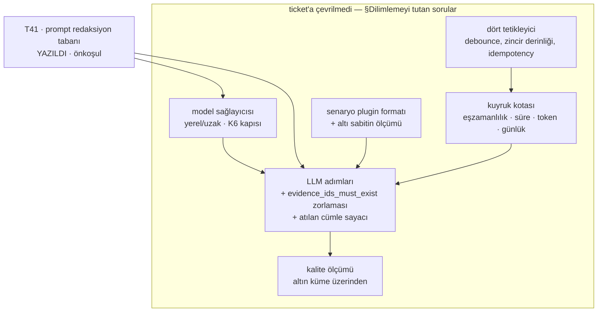

# F4 Implementasyon Ticket'ları

[RCA raporu özelliği](../rca-raporu-ozelligi/index.md) F4'e beş iş kalemi
bırakıyor (o belgenin §9'u): senaryo plugin'i, LLM adımları,
`evidence_ids_must_exist` zorlaması, dört tetikleyicinin tamamı, kuyruk kotası.
Yöneten kararlar: K19–K22 (RCA) · K6/K15 (veri kurumdan çıkmaz, yerel model
kısıtı) · K20 (dört tetikleyici).

## Bu faz henüz dilimlenmedi — ve bu bilinçli

**Yazılmış tek ticket T41**, çünkü o bir önkoşul: prompt'a giden metinden sırrı
söken taban olmadan LLM adımlarının hiçbiri yazılamaz. Sırası tartışmalı
değil, o yüzden diğerlerini beklemeden yazıldı.

Geri kalanı ticket'a çevirmeyi **üç açık soru** tutuyor (§ *Dilimlemeyi tutan
sorular*). Onlar cevaplanmadan yazılacak ticket'lar tahmin olur — ve bu depoda
tahminin maliyeti ölçüldü: [gerekçesi kayıtta olmayan
sabit](../../wiki/concepts/olcum-gerekcesiz-sabit.md) sayfasının anlattığı
şeyin bir spec örneğindeki karşılığı, RCA belgesinin §8.1'inde altı sayı
hâlinde duruyor.

## Verilmiş kararlar

| # | Karar | Nerede |
| --- | --- | --- |
| 1 | **Referanssız cümle rapora hiç girmiyor — ama atıldığı sayılıyor ve gösteriliyor.** *"Model 12 cümle üretti, 3'ü kanıta bağlanamadı ve çıkarıldı."* İçerik atılır, **sayı kalır**, ve o sayı F4'ün kalite göstergesi | [RCA §2](../rca-raporu-ozelligi/index.md) |
| 2 | **Prompt içerik seviyesi ayarlanabilir bir parametre** (`summary` · `masked` · `raw`), ama **ayarlanamayan bir tabanı var**: hiçbir seviyede sır prompt'a girmez | [RCA §2.1](../rca-raporu-ozelligi/index.md) |
| 3 | Spec örneğindeki her sayı ya ölçülmüş, ya gerekçeli, ya **açıkça işaretli** olmalı; altı sabitin altısı da işaretlendi ve `baseline: 7d` **aksi ölçüldüğü için** formattan çıkacak | [RCA §8.1](../rca-raporu-ozelligi/index.md) |

Karar 2'nin tabanı T41'in konusu. Karar 1'in sayacı ise T41'in kendi kalitesini
ölçen düzenek: fazla maskeleme atılan cümle oranını yükseltir, yani
**görünür**. Kaçırma görünmez. Bu asimetri T41 §4'te yazılı.

## Sıra ve bağımlılıklar

## İş kalemleri

| Kalem | Özü | Ticket | Neden henüz yazılmadı |
| --- | --- | --- | --- |
| **Redaksiyon tabanı** | Log metninde sır tanıma; `SecretRedactor` genişletilir, kopyalanmaz | [T41](prompt-redaksiyon-tabani/index.md) | — **yazıldı**, keşif yaklaşımı seçimi bekliyor (§3) |
| Model sağlayıcısı | Yerel/uzak seçimi; K6'nın kapısı — log verisi kurumdan çıkmaz | ⬜ | Sağlayıcı kararı T41'in seviyesine bağlı |
| Senaryo plugin formatı | [RCA §8](../rca-raporu-ozelligi/index.md)'in YAML'ı; üç adım, her biri tek iş | ⬜ | **Açık soru 3** |
| LLM adımları | `evidence_ids_must_exist` **motorda** zorlanır, prompt'ta rica edilmez; bir kez yeniden denenir | ⬜ | Plugin formatına bağlı |
| Dört tetikleyici | Alarm · kullanıcı · anomali zinciri · dış API; tek kuyrukta buluşur | ⬜ | **Açık soru 1** |
| Kuyruk kotası | Eşzamanlılık, koşu süresi, token bütçesi, grup başına günlük RCA | ⬜ | **Açık soru 2** |
| Kalite ölçümü | Altın küme üzerinden; atılan cümle oranı + çelişen kanıt tiyatrosu | ⬜ | F3'ün altın kümesi (T38) açık |

## Dilimlemeyi tutan sorular

1. **Anomali tetikleyicisi hangi sinyalden doğuyor?** [RCA §5](../rca-raporu-ozelligi/index.md) "senaryo → senaryo" diyor ve zincir derinliğini ≤ 2 ile sınırlıyor, ama zinciri **başlatan** ilk anomalinin kaynağı yazılı değil. F3'ün beş deterministik korelasyonu mu, Sigma mı, ayrı bir eşik mi — üçünün kuyruk yükü farklı.
2. **Kota neyi koruyor?** Dört kısıt sayılı (eşzamanlılık, süre, token, günlük) ama hangisinin hangi riski kapattığı ayrışmamış. Maliyet koruması ile gürültülü komşu koruması aynı sayıyla ayarlanamaz.
3. **Plugin formatı dört senaryo yazılmadan çivilenebilir mi?** Bir format tek tüketiciyle çivilenirse o tüketicinin şekli olur. [§8](../rca-raporu-ozelligi/index.md)'de sayıları belirsiz bir format örneği zaten var ve §8.1 onun altı sabitini işaretledi.

Bunlar cevaplandığında bu belge ticket tablosuna dönüşür — f1/f2/f3'ün
`index.md`'lerindeki gibi.

## Bitti tanımı

1. Bir RCA raporu **kanıt paketinden** üretiliyor ve her cümlesi bir
`evidence_id`'ye bağlı; bağlanamayan cümle rapora **girmiyor**.
2. Rapor, kaç cümlenin atıldığını **sayı olarak** söylüyor.
3. Prompt'a giden metinde sır yok, ve bu bir **kırmızı yanabildiği ölçülmüş**
bekçiyle tutuluyor — altın korpus bu ölçümü yapamaz, çünkü içinde sır yok
(T41 §5).
4. Dört tetikleyicinin dördü de **tek kuyruktan** geçiyor; kota kuyrukta
uygulanıyor, senaryonun insafına bırakılmıyor.
5. `POST /api/v1/rca` aynı `Idempotency-Key` ile çağrıldığında **aynı raporu**
döndürüyor, yeni koşu başlatmıyor.
6. Plugin spec'indeki her sabit ya ölçülmüş ya gerekçeli; işaretsiz sabit
kalmadı ve `baseline: 7d` formatta değil.
