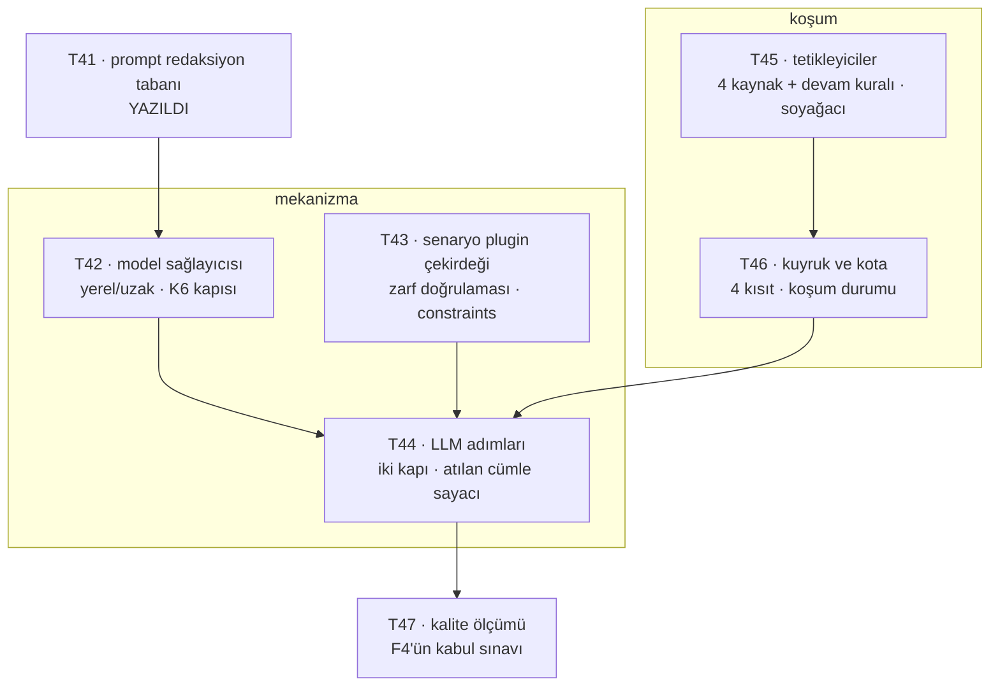

# F4 Implementasyon Ticket'ları

[RCA raporu özelliği](../rca-raporu-ozelligi/index.md) §9 F4'e beş iş kalemi
bırakıyordu. Dilimlemeyi tutan **üç açık soru 2026-08-25'te cevaplandı** ve
faz artık ticket'a bölünebiliyor.
Yöneten kararlar: K19–K22 (RCA) · K6/K15 (veri kurumdan çıkmaz, yerel model
kısıtı) · K20 (tetikleyiciler).

## Dilimleme mantığı

**T41 önce ve tek başına.** Prompt'a giden metinden sırrı söken taban olmadan
LLM adımlarının hiçbiri yazılamaz; `masked` ve `raw` düzeyleri o tabana kadar
kapalı. Sırası tartışmalı değildi, o yüzden diğerleri beklenmeden yazıldı.

**Sonrası iki kol.** *Mekanizma* (T42–T44) modelin ne gördüğünü ve ne
üretebildiğini kuruyor; *koşum* (T45–T46) o mekanizmanın ne zaman ve kaç kez
çalıştığını. İkisi T47'de buluşuyor — kalite ancak ikisi de ayaktayken
ölçülebiliyor.

**Kalite ölçümü sona bırakılmadı, sonda duruyor.** Farkı önemli: T47 bir
"cilalama" ticket'ı değil, F4'ün kabul sınavı. Karar 1'in sayacı ölçülemezse
faz kapanmıyor.

## Üç sorunun cevabı — F4'ün kapsamını bunlar belirledi

| Soru | Cevap | Kapsama etkisi |
| --- | --- | --- |
| [Anomali tetikleyicisi hangi sinyalden doğuyor?](../f4-tetikleyici-karari/index.md) | **Doğmuyor — bir kaynak değil, bir devam kuralı.** Zincirin ilk halkası her zaman diğer kaynaklardan biri | F4 **küçüldü**: yeni bir dedektör yazılmıyor |
| [Kota neyi koruyor?](../f4-kota-karari/index.md) | Dört kısıt **dört ayrı riski** tutuyor, ve üç hücre boş kalıyor | Kota tek sayı değil; T46 dört kapıyı ayrı ayrı kuruyor |
| [Plugin formatı çivilenebilir mi?](../f4-plugin-format-karari/index.md) | **Kısmen** — adım makinesi çivilenir, kanıt adresleme ve tetikleyici sözcük dağarcığı çivilenemez | T43 çekirdeği çiviliyor, uzantı noktasını açık bırakıyor |

Yan çıktı: `AlertRaised` **kodda hiç yoktu** — yalnızca tasarım belgesinde.
Bağlanma noktası bir tablo satırı (`alert_triggers`), olay veri yolu değil.
Bu bir *"henüz yazılmadı"* değil; tasarım var olmayan bir şeyi varsayıyordu ve
F4 planlamasına sıfır maliyetli görünüyordu.

İkinci yan çıktı: **`schedule` beşinci tetikleyici olarak K20'ye girdi.**
Plugin formatı ajanının taslakladığı iki senaryonun ikisi de takvimle
tetikleniyordu; bir formatın ilk iki gerçek tüketicisinin çekirdeği değiştirmek
zorunda kalması, formatın değil **K20'nin** eksikliğiydi.

## Verilmiş kararlar

| # | Karar | Nerede |
| --- | --- | --- |
| 1 | **Referanssız cümle rapora hiç girmiyor — ama atıldığı sayılıyor ve gösteriliyor.** İçerik atılır, **sayı kalır**, ve o sayı F4'ün kalite göstergesi | [RCA §2](../rca-raporu-ozelligi/index.md) |
| 2 | **Prompt içerik seviyesi ayarlanabilir** (`summary` · `masked` · `raw`), ama **ayarlanamayan bir tabanı var**: hiçbir seviyede sır prompt'a girmez | [RCA §2.1](../rca-raporu-ozelligi/index.md) |
| 3 | Redaksiyon tabanı **üç katman**: üretici söz dizimi ve dar bir bilinen-biçim kümesi (PEM · JWT · `Authorization`) **maskeler**, entropi **yalnızca sayar** | [T41 §3](prompt-redaksiyon-tabani/index.md) |
| 4 | `evidence_ids_must_exist` **tek kapı değil iki kapı**: kısıt doğrulama adımı reddeder (1 tekrar), cümle bağlama cümleyi atar (sayaç artar) | [Plugin formatı §2](../f4-plugin-format-karari/index.md) |
| 5 | Girişte **reddedilen** koşum kotadan düşülmez ama **sayılır**; süre/token tavanına takılan koşum **düşülür** — o maliyet gerçekten ödendi | [Kota kararı](../f4-kota-karari/index.md) |
| 6 | Spec örneğindeki her sayı ya ölçülmüş, ya gerekçeli, ya **açıkça işaretli** olmalı | [RCA §8.1](../rca-raporu-ozelligi/index.md) |

## Sıra ve bağımlılıklar

## Ticket listesi

| # | Ticket | Özü | Bağımlılık |
| --- | --- | --- | --- |
| T41 | [Prompt redaksiyon tabanı](prompt-redaksiyon-tabani/index.md) | Log metninde sır tanıma; `SecretRedactor` genişletilir, kopyalanmaz. Ölçüm korpusu FS·S01'den | — |
| T42 | Model sağlayıcısı soyutlaması | Yerel/uzak seçimi; K6'nın kapısı — log verisi kurumdan çıkmaz. `masked`/`raw` düzeylerini T41 açıyor | T41 |
| T43 | Senaryo plugin çekirdeği | Format, **yükleme anında zarf doğrulaması**, `constraints` listesi + `constraints_waived` gerekçesi + sabit muaf sayısı | — |
| T44 | [LLM adımları ve iki kapı](llm-adimlari-ve-iki-kapi/index.md) | Kısıt doğrulama (adım reddi, 1 tekrar) ve cümle bağlama (atma, sayaç) ayrı; doğrulama **adımın gördüğü** kanıta karşı | T42, T43, T46 |
| T45 | Tetikleyiciler | Dört kaynak (alarm · UI · dış API · `schedule`) + devam kuralı; soyağacı (`root_run_id`, `depth`, ata tekrarı); debounce | — |
| T46 | Kuyruk ve kota | Dört kısıt dört ayrı riske; koşum durumu **kapalı küme** (`Empty` ≠ `QuotaExceeded` ≠ `Cancelled`); ret sayacı grup bazında görünür | T45 |
| T47 | [Kalite ölçümü](kalite-olcumu/index.md) | Altın küme üzerinden atılan cümle oranı ve çelişen kanıt tiyatrosu | T44 |
| T51 | [RCA raporu kalıcılığı ve rapor yüzeyi](rca-report-kaliciligi/index.md) | Üretilen raporun `rca_reports`'ta kalıcılığı ve atılan cümle sayacının ekranda görünmesi. Üç hâl ayrı çiziliyor: model hiç koşmadı · koştu ama üretmedi · üretti ve **hepsi atıldı** | T44 |
| T54 | [Model muafiyetinin kaydı](model-muafiyeti-kaydi/index.md) | `model_boundary_override_reason` rapora bağlanıyor. Muafiyetin **yokluğu** da yazılıyor: yalnız `true` iken görünen bir rozet, muafiyetsiz koşumu *"bu soru sorulmamış"* hâline sokardı | T51 |

Sahipler ticket verilirken atanıyor.

T44'ün, T51'in ve T47'nin bağları bu tabloya `EpicStatusTests` onları hiçbir yol
haritasında bulamadığı için eklendi — bekçi ilk iki merge'inde de iş yaptı.

T47'ninki ayrıca kaydedilmeye değer: ilk düzeltmeyi yazarken *"T47'nin ticket
dosyası hâlâ yok"* dedim ve **bir merge sonra yanlış oldu** — dosya T47'nin
dalında yazılmıştı, main'de yoktu. Bu tablonun tuttuğu şey tam olarak bu:
birleşmemiş bir dalda var olan belge, main'e bakan için yok sayılıyor ve o
yokluk hakkında yazılan cümle bayatlıyor. Kimsenin okumadığı bir yerde
bayatlasaydı fark edilmezdi; bekçi okuyor.

## Bitti tanımı

1. Bir RCA raporu **kanıt paketinden** üretiliyor ve her cümlesi bir
`evidence_id`'ye bağlı; bağlanamayan cümle rapora **girmiyor**.
2. Rapor, kaç cümlenin atıldığını **sayı olarak** söylüyor.
3. Prompt'a giden metinde sır yok, ve bu **kırmızı yanabildiği ölçülmüş** bir
bekçiyle tutuluyor — altın korpus bu ölçümü yapamaz, içinde sır yok (T41 §5).
4. Dört kaynağın dördü de **tek kuyruktan** geçiyor; kota kuyrukta uygulanıyor,
senaryonun insafına bırakılmıyor.
5. `POST /api/v1/rca` aynı `Idempotency-Key` ile **aynı raporu** döndürüyor.
6. **Kota yüzünden RCA üretilmemiş bir alarm, RCA'sı boş çıkmış alarmdan
ayırt edilebiliyor** — ve bu ayrım ekranda görünüyor, yalnızca kayıtta değil.
7. `constraints` yazmayan bir senaryo **sessizce geçerli sayılmıyor**;
muafiyet gerekçe **ve** sabit sayı değişikliği istiyor.
8. Plugin spec'inde işaretsiz sabit kalmadı.

## Bu belgenin bilmediği şey

**Ölçülemeyen iki kısıt var ve sebebi eksiklik değil sıra:** token bütçesi LLM
çağrısı yazılmadan, günlük kota debounce yazılmadan ölçülemez. İkisi de F4'ün
**kendi çıktısına** bağlı, yani F4 başlarken ikisi de tahmin olacak. Kota
kararı bunu *"açıkça geçici"* işaretiyle çözüyor — işaret kalkana kadar o
sayılara dayanan **kapasite iddiası yapılmaz**.

**Ve F4'ün kapsamında olmayan, ama F4 bittiğinde hâlâ açık kalacak bir soru:**
[korelasyonlar zamanlanmış bir değerlendiriciye bağlanacak mı?](../f4-tetikleyici-karari/index.md)
Bugün beş korelasyon **çekme** modelinde — bir RCA koşumu sorduğunda cevap
veriyorlar, kendiliğinden *"bir şey oldu"* diyemiyorlar. Ürünün push modda
anomali tespiti yok. Burada yazılı olması onu bir eksiklik olmaktan çıkarıp
**bilinen bir sınır** yapıyor; yazılmasaydı ikisi ayırt edilemezdi.
