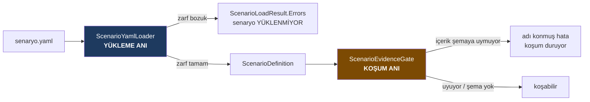

# T43 · Senaryo plugin çekirdeği

[F4 plugin formatı kararı](../../f4-plugin-format-karari/index.md)'nın
*"çivilenebilir"* dediği kısım kuruldu; *"açık kalsın"* dediği kısım
uzantı noktası olarak duruyor.

Yeni derleme: `src/Bizigo.ScenarioPlugin`. Sevk edilen senaryolar
`catalog/scenarios/`.

---

## 1 · Ne kuruldu



| Kapı | Kim biliyor | Neye bakıyor |
| --- | --- | --- |
| **Yükleme anı** | Çekirdek — **zarf** | Sağlayıcı adı kayıtlı mı · blok iyi biçimli mi · her adımın `constraints` ya da `constraints_waived`'ı var mı · adım grafiği ileri atıf içeriyor mu |
| **Koşum anı** | Sağlayıcı — **içerik** | `evidence` bloğunun alanları sağlayıcının şemasına uyuyor mu |

Çekirdeğin **şekli** bilmesi gerekmiyor; **zarfı** bilmesi yeterli.

---

## 2 · Dört kararın karşılığı

**1 · `constraints` liste, ve boş liste gerekçesiz kabul edilmiyor.**

```yaml
output:
  schema: hypothesis_list
  constraints: []
  constraints_waived: "Çıktı hipotez metni; kanıt kimliğine atıf yapmıyor."
```

Üç ret, üçü de ölçüldü: ikisi de yoksa **yüklenmiyor**; `constraints_waived: ""`
**reddediliyor**; dolu bir liste ile muafiyet **birlikte yazılamıyor**.

Üçüncüsü brief'te istenmemişti ve eklendi: dolu bir listeyle yazılmış bir
muafiyet, uygulanan bir kapıyı muaf gösterirdi ve muaf sayısı sabitini
anlamsızlaştırırdı.

**İkinci hareket** `ScenarioCatalogContractTests`'te: muaf adım kümesi ve
`ExpectedWaivedCount`. Gerekçe **dosyada**, sayı **testte** — gerekçeyi teste
de kopyalamak iki metin üretir ve ikisi sessizce ayrışırdı.

> **Sayım adım düzeyinde, senaryo düzeyinde değil.** Brief "muaf senaryo
> sayısı" diyordu. Senaryo düzeyinde sayılsaydı, üç adımının ikisi muaf olan
> RCA senaryosu "muaf senaryo" diye görünür ve `bind-evidence`'ın gerçekten
> kapattığı kapı sayımdan kaybolurdu — sayaç, ölçmek istediği şeyin tersini
> gösterirdi.

**2 · İki kapı modele yazıldı.** T43 birincisini (kısıt doğrulama) *taşıyor*:
`ScenarioOutput.Constraints` bir liste ve motorun zorlayacağı şey o. İkincisi
(cümle bağlama, sayaç) T44'ün ve bu çekirdekte **hiçbir yeri yok** — birleşmiş
bir alan bırakılmadı.

**3 · Adımın gördüğü kanıt.** İleri atıf ve kendine atıf **reddediliyor**:
`input: steps.<id>` yalnızca daha önce tanımlanmış bir adıma bakabiliyor. Bu bir
söz dizimi titizliği değil — henüz koşmamış bir adımın çıktısına atıf yapan
adım, görmediği bir şeye dayanmış olurdu.

**4 · Yükleme/koşum bölmesi** yukarıdaki tabloda; `IScenarioEvidenceSchema`
koşum anının arayüzü ve yükleme anında **çağrılmıyor** (ölçüldü).

---

## 3 · Uzantı noktası olarak açık bırakılanlar

| Ne | Nasıl açık kaldı |
| --- | --- |
| `evidence.*` **şekli** | `providers` dışındaki her anahtar `ScenarioValue` ağacına taşınıyor; bilinmeyen anahtar **reddedilmiyor**. `window` · `horizon` · `sample` üçü de geçiyor |
| Kısıt **adları** | Kapalı küme yok; `pattern_must_compile` da bugün olmayan bir ad da geçiyor |
| `trigger.on` **değer kümesi** | **Kapalı** ve `ScenarioTriggers.Known`'da; kümenin sahibi T45 |

`ScenarioValue` bilerek YamlDotNet tipi taşımıyor: bir sağlayıcının kendi
alanlarını doğrulamak için YAML kütüphanesine bağımlı olması gerekmemeli.

---

## 4 · Sabitler — §8.1'in kuralı

Formata **yeni sayı girmedi**. `catalog/scenarios/builtin.rca.network.yaml`
RCA §8'den alındı ve dört işaretli sabiti (`lead: 30m`, `max_items: 400`,
`max_duration: 60s`, `max_items: 3`, `max_items: 2`) `⚠` işaretiyle taşıyor.
`baseline` örneklenmiyor ve sebebi dosyada yazılı.

Çekirdek `max_items`'ı **taşıyor, yorumlamıyor** — zorlaması T44'ün.

---

## 5 · Bilinen borç: `baseline` şartı bugün zorlanmıyor

RCA §8.1 şunu şart koştu: *"`baseline` zorunlu alan olmalı ve eksikse senaryo
YÜKLENMEMELİ."*

Bu şart bugün **zorlanmıyor**, ve sebebi eksiklik değil bölme: `window` içerik,
çekirdek onun şeklini bilmiyor (§6.1). Zorlaması `logs.*` sağlayıcılarının
`IScenarioEvidenceSchema` uygulamasına ait ve o uygulama **henüz yazılmadı**.

Karar 4'ün tablosu bu hâli tanımlı bırakıyor: koşum anı ihlali **adı konmuş bir
hatayla** duruyor, yani §8.1'in asıl korktuğu şey (*"sessizce çalışan bir
senaryo"*) doğmuyor — **varsayılan verilmediği sürece.** Varsayılan bu
çekirdekte yok ve olmamalı.

Borcun görünür kalması için `ScenarioEvidenceGate.Describe` hangi sağlayıcının
**şemasız** geçtiğini söylüyor: *"bakılmadı"* ile *"bakıldı, temiz"* ayrı
cümleler.

---

## 6 · Kesişmeler

| Kime | Ne |
| --- | --- |
| **T45** | `ScenarioTriggers.Known` beş değer taşıyor ve K20'den alıntı. T45 kendi tipini getirdiğinde bu liste **ondan beslenmeli**; ikinci bir enum doğarsa iki liste sessizce ayrışır |
| **T44** | Kısıt **adlarını** kim tanıyacak? Çekirdek küme tutmuyor; bilinmeyen bir kısıt adı yüklemede geçiyor ve koşumda ne olacağı yazılmadı |
| **T44** | `write-actions` muafiyeti **devralınmış**: aksiyonun kendi kanıt atfını taşıyıp taşımayacağı T44'ün kararı |
| **T42/T44** | `output.schema` adları (`hypothesis_list`, …) yalnızca **isimle** anılıyor; tanımlarının nerede duracağı hâlâ açık (format kararı §8'de de açıktı) |
