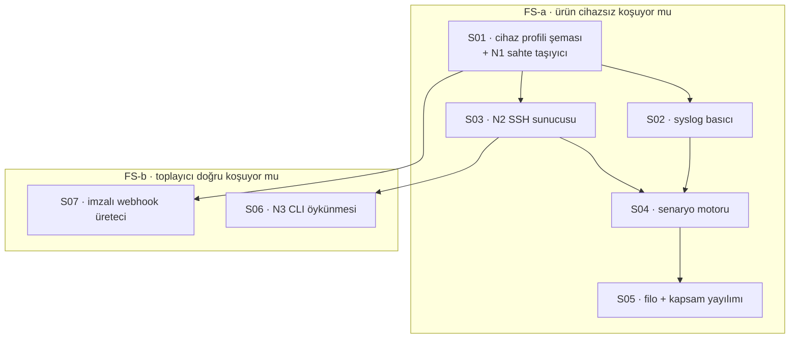

# FS Implementasyon Ticket'ları

[FS teknik plan](../fs-simulatorler/index.md) yedi ticket'a bölündü.
Fazın gerekçesi ölçülmüş bir boşluk: ekip gerçek cihazlara erişmiyor, ve
`SshDeviceTransport` F1'den beri **hiç koşmamıştı** — yani "çalışıyor" diyen
tek şey kodun kendisiydi.

**Faz numarasız** çünkü F1–F5 sırasına girmiyor; diğer fazlara **paralel**
koşuyor ve onların beklediği kapıyı açıyor.

## Dilimleme mantığı

**Faz ikiye bölündü ve ikisi ayrı soru soruyor:**

- **FS-a (S01–S05)** — *ürün gerçek cihaz olmadan uçtan uca koşuyor mu?*
  Diğer fazların beklediği kapı bu. S05 kapanış ticket'ı: uçtan uca
  harness'taki **elle tohumlama silinebiliyorsa** FS-a bitmiştir.
- **FS-b (S06–S07)** — *toplayıcı **doğru** koşuyor mu?* Sayfalama, prompt,
  vendor hata mesajları, imza doğrulaması. FS-a'sız da anlamlı değil, ama
  FS-a'nın kapısını da tutmuyor.

**S01 önce ve tek kaynak işi.** Cihaz profili hem N1 sahte taşıyıcının hem
SSH sunucusunun hem webhook üretecinin okuduğu tek yer; komut listesi iki
yerde durursa ikisi ayrışır ve ayrıştığını kimse görmez.

## Sıra ve bağımlılıklar

## Ticket listesi

| # | Ticket | Özü | Bağımlılık | Durum |
| --- | --- | --- | --- | --- |
| S01 | [Cihaz profili şeması ve N1](cihaz-profili/index.md) | Profil YAML + doğrulayıcı + sahte `IDeviceTransport` | — | ✅ dört profil, `SimulatedDeviceTransport` |
| S02 | [Syslog basıcı](syslog-basici/index.md) | Profilden örnek okuyup TCP/UDP basıyor | S01 | 🔄 çapa `SampleClock`'a taşındı; TTL artık **kapı** |
| S03 | [N2: gerçek SSH sunucusu](ssh-sunucusu/index.md) | Container, komuta göre profil çıktısı | S01 | 🔄 **`SshDeviceTransport` F1'den beri ilk kez koştu ve geçti** |
| S04 | [Senaryo motoru](senaryo-motoru/index.md) | Adlandırılmış geçişler, SSH + syslog tarafında | S02, S03 | ⬜ |
| S05 | [Filo ve kapsam yayılımı](filo-kapsam/index.md) | Beş cihaz, iki `owner_group`, otomatik envanter | S04 | ⬜ FS-a'nın kapanış ticket'ı |
| S06 | [N3: CLI öykünmesi](cli-oykunmesi/index.md) | Etkileşimli kabuk, prompt, sayfalama | S03 | ✅ **bulgu: toplayıcı sayfalama açıkken yarım config'i hatasız alıyor** |
| S07 | [İmzalı webhook üreteci](webhook-ureteci/index.md) | GitHub/GitLab/Jenkins/generic | S01 | ⬜ FS-b |

Sahipler ticket verilirken atanıyor — planda değil.

## Bitti tanımı

1. **Uçtan uca harness'ta elle tohumlama kalmadı** — veriyi simülatör basıyor,
ürün gerçek yolundan alıyor. (FS-a'nın tek ölçütü bu.)
2. `SshDeviceTransport` bir testte koşuyor; yanlış parola
`DeviceCommandResult.Ok=false` **ve** kimlik doğrulama hatası üretiyor.
Ölçüt HTTP durum koduna yazılmadı — SSH'ın öyle bir şeyi yok, yazılsaydı hiç
gerçekleşemezdi.
3. §7'deki yedi senaryonun her biri için bir test var ve her biri **kırmızı
yanabildiği ölçülmüş**.
4. Profil bozuksa derleme/lint kırmızı; komut iki yerde tanımlıysa bekçi düşer.
5. Aynı webhook teslimatı iki kez gönderilince **tek** kayıt oluşuyor.

## Bu fazın ilk gününde ölçtüğü şey

S02 yazıldı, koşturuldu ve **ürün tarafında bir boşluk gösterdi** — fazın
gerekçesi buydu, kanıtı da bu oldu. Ayrıntısı planın
[§10.5'inde](../fs-simulatorler/index.md); orada bir *arıza raporu* değil bir
*bulgu* olarak duruyor, çünkü kaybı üreten şey simülatör değil ürünün kendi
yoluydu.
