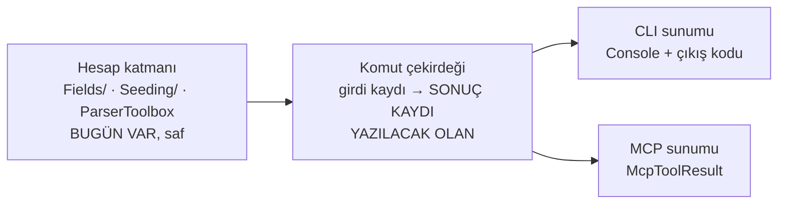

# CLI komut envanteri ve *"ortak çekirdek"* neyi ortaklaştırmalı

M02'nin bitti tanımı bir **paydaya** dayanıyor:

> *Komut çekirdeğindeki her komut ya MCP aracı ya gerekçeli muafiyet; sayı
> sabitle tutuluyor.*

O payda hiçbir yerde yazılı değildi. Bu belge onu ölçüyor, ve ölçerken çekirdek
kararının **kendiliğinden** çıktığı bir olgu buluyor.

> **Bu belgenin ilk hâli kod değiştirmiyordu** — ölçüm ve öneriydi. Öneri
> onaylandı ve uygulandı; §7 uygulamanın ne yaptığını ve ölçüm sırasında neyin
> değiştiğini yazıyor. Ölçüm bölümleri **olduğu gibi duruyor**: kararın hangi
> sayıdan çıktığı, kararın kendisinden daha uzun ömürlü.

---

## 1 · Envanter — **11 uç komut, 7 grup**

Taban `3ac1a8d` (M01). `src/Bizigo.Cli/Program.cs` yedi grup kaydediyor ve
gruplar toplam on bir **çalıştırılabilir** komut taşıyor. Grup düğümlerinin
kendi eylemi yok; sayım uçlardan.

**Sayı türetilebilir, elle sayılmadı:** `SetAction` çağrısı = **11**. Bir
bekçinin dayanacağı sayı bu olmalı — elle yazılmış bir liste bu depoda üç kez
kör etti.

| # | Komut | Ne yapıyor | Yan etki |
| --- | --- | --- | --- |
| 1 | `parser lint` | Şema doğrulaması + ReDoS taraması | **yok** |
| 2 | `parser test` | YAML'ın gömülü `tests` bloğunu koşturur | **yok** |
| 3 | `parser try` | Tek satırı dener, çözülen alanları gösterir | **yok** |
| 4 | `parser coverage` | Katalog kapsamı | **yok** |
| 5 | `fields coverage` | Altın örneklerin ne kadarının kolona indiği (T39) | **yok** (ClickHouse'u okur) |
| 6 | `fields values` | Kolon değer uzayı | **yok** (ClickHouse'u okur) |
| 7 | `sigma sync` | Manifesti alarm kurallarına yazar | **kontrol düzlemine YAZAR** (`--dry-run` var) |
| 8 | `fleet apply` | Filo tanımını kontrol düzlemine yazar | **kontrol düzlemine YAZAR** |
| 9 | `seed golden` | Ölçüm ve geliştirme verisi yükler | **veri YAZAR** |
| 10 | `schema migrate` | ClickHouse göçlerini uygular | **şema DEĞİŞTİRİR** |
| 11 | `mcp serve` | MCP sunucusunu stdio üzerinden koşturur (M01, `3ac1a8d`) | **süreç açar** |

**Altısı okuma, beşi yazma/çalıştırma.** Ayrım muafiyet tartışmasının ekseni (§4).

---

## 2 · Ölçülen olgu: çekirdek **zaten var**, ama beyan edilmemiş

Asıl soru *"ortak çekirdek neyi ortaklaştırıyor — iş mantığı mı, girdi
doğrulaması mı, çıktı şekli mi"* idi. Ölçüm cevabı kendisi verdi.

`Console` çağrılarının dağılımı:

| Katman | Dosyalar | `Console.` çağrısı |
| --- | --- | --- |
| **Sunum** — `*CommandHandlers.cs` | 5 dosya | **117** |
| **Hesap** — `Fields/`, `Seeding/`, `ParserToolbox` | 9 dosya, ~2.100 satır | **0** |

Yani hesap katmanı **bugün zaten saf**. Ayrım eksik değil — **beyan edilmemiş
ve zorlanmıyor**.

Bunun iki sonucu var ve ikisi de kararın kendisi:

**(a) Ortaklaştırılacak şey iş mantığı DEĞİL — o zaten ortak.** Ortaklaşamayan
şey **sonucun kendisi**: bugün bir komutun çıktısı bir *değer* değil, bir **yan
etki**. `FieldsCommandHandlers.Coverage` ölçümü yapıyor, sonucu `Console`'a
yazıyor ve `int` döndürüyor. Bir MCP aracı bunu **tüketemez**: yapılandırılmış
çıktı istiyor, konsol metni değil; hata olarak `McpToolError` istiyor, çıkış
kodu 1 + stderr değil.

**(b) Saflık ölçülmüyor.** Hesap katmanında `Console` yasağı **hiçbir mimari
testte yok** — bugünkü sıfır bir tesadüf. Bu deponun kuralı net: *bir şey
ölçülmediyse çalıştığı varsayılmaz.*

**Ve M01'in uyarısı bu maddeyi bir üslup tercihinden bir kapıya çeviriyor:**

> *stdout protokolün kendisi. Oraya düşen tek bir satır JSON-RPC akışını bozuyor
> ve istemci bunu ayrıştırma hatası olarak görüyor — ürün hakkında hiçbir şey
> söylemeyen bir arıza.*

Yani hesap katmanına sızacak tek bir `Console.WriteLine`, MCP yüzeyinde
**sunucuyu bozar** ve arıza ürünü değil ayrıştırıcıyı işaret eder. Ölçülen 117
`Console` çağrısı sunum katmanında duruyor ve orada **kalmalı**; onları ayıran
şey bugün bir yorum, bekçi değil. Paritenin en ince yeri burası.

### Ve ayrım bu depoda **bir kez zaten yapılmış**

`SigmaSyncCommandHandler` iki parçalı:

```csharp
public static IReadOnlyList<SigmaSyncDecision> Plan(SigmaManifest manifest)  // saf, veritabanına dokunmuyor
public static async Task<int> RunAsync(...)                                   // Console + çıkış kodu
```

`Plan` tam olarak önerilen şeklin kendisi: **karar bir değer**, sunum ayrı.
Öneri yeni bir kalıp icat etmiyor; **var olanı ondan çıkarıp onuna** genelliyor.

---

## 3 · Öneri — üç katman, ikisi zaten yazılı



**Yazılacak olan tek şey ortadaki halka**, ve içeriği şu: her komut için bir
**sonuç kaydı** (`record`) ve o kaydı üreten saf bir fonksiyon.

| Ne | Nerede | Bugün |
| --- | --- | --- |
| İş mantığı | Hesap katmanı | **var, saf** |
| Girdi doğrulaması | Bugün `System.CommandLine` yapıyor | **CLI'ya bağlı** — MCP tarafında karşılığı yok, çekirdeğe taşınmalı |
| **Çıktı şekli** | Bugün `Console` | **yok** — asıl iş bu |
| Hata | `int` + stderr | İki sunum iki farklı şey istiyor; çekirdek **sebebi** taşımalı, kodu değil |

**İkinci kopya yazılmıyor** (§9). MCP aracı hesap katmanını **yeniden
uygulamıyor**; çekirdeğin döndürdüğü kaydı okuyor. Bugünkü hâlde bir MCP aracı
yazmak *"aynı girdinin iki kopyası"* sınıfını doğururdu: iki uygulama ayrışır ve
**sürüklenmeyi hiçbir şey göremez**, çünkü çıktıyı girdiye tutan bir şey yok.

### Bekçi önerisi — üç tane, üçü de kırmızı yanabilir

1. **Hesap katmanında `Console` yasak.** Mimari testle; bugünkü sıfırı bir
   ölçüme çeviriyor.
2. **Her çekirdek komutu ya araç ya gerekçeli muafiyet**, ve muafiyet listesi
   **keşfedilen** kümeye karşı sınanıyor — elle yazılmış bir liste değil.
   Gerekçesi ölçüldü: bu depoda elle tutulan liste bekçiyi **üç kez** kör etti
   (`Produces<T>`'nin 16 ucu · kayıt uzantıları · MCP öncesi kapılar).
3. **Muaf sayısı sabitle çivili** (`ExpectedExemptCount` kalıbı) — muafiyet
   eklemek **iki ayrı bilinçli hareket**: gerekçeyi yazmak **ve** sabiti
   değiştirmek. T43'ün `constraints_waived`'ı ve T44'ün 2→1 düşüşü aynı kalıp.

---

## 4 · Muafiyet adayları ve **gerekçeleri**

Muafiyet *"araç yapmaya üşendik"* değil, **"araç olması yanlış olur"** demek.
Ölçüt tek soru: **bir dil modelinin bu komutu kendi kararıyla çağırması
kabul edilebilir mi?**

| Komut | Öneri | Gerekçe |
| --- | --- | --- |
| `schema migrate` | **MUAF** | Şema göçü geri alınamaz ve sırası anlamlı. Bu depoda en pahalı **önlenmiş** hata bir göçtü — pasif kuralları sessizce açıyordu. Bir modelin göç uygulaması, o hatayı insan onayı olmadan mümkün kılar |
| `seed golden` | **MUAF** | Ölçüm/geliştirme verisi **yazıyor**. Üretim verisinin yanına test verisi karışması sessiz bir yanlış: sonraki her ölçüm kirlenir ve kirlendiği görünmez |
| `fleet apply` | **MUAF** | Kontrol düzlemine filo tanımı yazıyor; simülasyon altyapısını değiştiriyor. M03'ün simülatör kolu ayrı bir yüzey ve bu komut oraya ait, ürün yüzeyine değil |
| `sigma sync` | **KARARSIZ — koordinatöre** | Yazıyor **ama** `--dry-run`'ı var, yani okuma yarısı zaten ayrılmış (`Plan`). *Öneri:* `sigma.plan` araç (okuma), `sigma sync` muaf (yazma). Ayrım komutu ikiye bölmek demek; **kapsam kararı** |
| `mcp serve` | **MUAF** | Sunucunun kendisi (M01, `3ac1a8d`). Bir aracın sunucuyu başlatması özyineleme; ayrıca stdout'u protokol olarak sahipleniyor |

**Araç olmaya uygun altı komut:** `parser lint` · `parser test` · `parser try` ·
`parser coverage` · `fields coverage` · `fields values`. Altısı da **yan
etkisiz** ve altısı da bir modelin *"şu parser'ı sına"* / *"bu alan kapsanıyor
mu"* diye sorabileceği şeyler.

**Sayı, `sigma sync` kararına bağlı:** 6 araç + 5 muafiyet, ya da 7 araç
(`sigma.plan` ile) + 5 muafiyet. Toplam 11 — `SetAction` sayısıyla birebir, ve
bekçi bu eşitliği tutmalı: **keşfedilen komut = araç + muaf.**

### İki liste var ve ayrışabilirler — koordinatöre bildirim

M01'in `McpComplianceTests.Sunucunun_ilan_ettigi_araclar` testi beklenen araç
kümesini **elle** taşıyor (`["server.info"]`), ve M02'nin muafiyet sabiti
**ayrı** bir liste olacak. İkisi aynı şeyi iki yerden söylüyor:

| Liste | Neyi sayıyor | Sahibi |
| --- | --- | --- |
| `Sunucunun_ilan_ettigi_araclar` | Sunucunun **ilan ettiği** araçlar | M01 |
| Muafiyet listesi + sabit | Komutların **araç olmayanları** | M02 |

Bir komut araç yapıldığında **ikisi birden** değişmeli. Değişmezse: araç ilan
edilir ama muafiyet listesinde de kalır, ya da tersi — ve iki liste de kendi
içinde tutarlı olduğu için **hiçbir test kırmızı yanmaz**. Bu, S04'te ölçülen
*"baseline'ın iki gösterimi"* deseninin aynısı.

**Öneri:** M02'nin bekçisi kendi listesini `McpToolDiscovery`'nin bulduğu
kümeden **okusun**, elle yazmasın — o zaman ayrışma yapısal olarak imkânsız
olur. M01'in listesi ilan tarafını, benimki kapsama tarafını tutar ve ikisi
**aynı kaynaktan** beslenir.

---

## 4.1 · M01'in bıraktığı ve doğrudan M02'ye düşen eksik

> `McpCommandHandlers.ServeAsync` **boş bir `ServiceCollection`** kuruyor.
> `server.info` bağımlılık istemediği için yetiyor; ürün araçları geldiğinde
> oraya gerçek servis grafiği gerekecek.

Bu, çekirdek kararının **ikinci** tüketicisi ve tesadüf değil: komut çekirdeği
zaten bir servis grafiği kuracak, stdio host da onu kullanacak. M01 girişi açtı,
çekirdeği değil.

Yazılmazsa bedeli adı konmuş: **ilk araç eklendiğinde `Instantiate`
"bağımlılığı DI'ya kaydedilmemiş" diye patlar ve sebep aranır** — yani arıza
M04'ün ilk aracında görünür, sebebi burada durur. M02'nin çıktısı bu yüzden
yalnızca bir çekirdek değil, **o çekirdeği kuran kompozisyon**.

`CompositionRootTests` (T50) bunu ayrıca tutuyor: keşfedilen her kayıt uzantısı
kompozisyon kökünden erişilebilir olmalı. Yeni bir `Add*` yazarsam
`Program.cs`'e bağlanacak.

## 4.2 · Şemalar elle yazılıyor — çekirdeğin sonuç kaydı şema DEĞİL

M01 şemaları yansımayla üretmiyor ve gerekçesi §8: *yansımayla üretilen şema,
domain tipine eklenen her alanı kimse karar vermeden protokole sızdırır — ve
MCP'de sızan alan doğrudan modelin bağlamına giriyor.*

Bunun M02'ye etkisi: önerilen **sonuç kaydı** bir taşıyıcı, bir sözleşme değil.
Her araç kendi `OutputSchema`'sını elle yazacak ve kaydın alanlarından
**hangilerinin** protokole çıktığına ayrıca karar verilecek. Yani çekirdek
"ne hesaplandı"yı, araç "ne ilan edildi"yi taşıyor — ve ikisi bilerek aynı şey
değil.

## 5 · Bu belgenin bilmediği

- ~~M01'in araç kayıt sözleşmesi.~~ **Geldi** (`3ac1a8d`) ve §4.1/§4.2'ye
  işlendi. Bu belgenin ilk hâli sözleşmeyi beklerken yazılmıştı ve hiçbir
  önerisi M01'in tip adlarına dayanmıyordu; sözleşme geldiğinde **hiçbir öneri
  değişmedi** — yalnızca ikisi eklendi (servis grafiği, şema ayrımı).
- **Bağlam maliyeti.** MCP ticket belgesi *"on beş aracın şeması her bağlamda
  taşınıyor; bugün sayısı yok"* diyor ve ölçümü M01'e bırakıyor. Altı aracın
  şema boyutu da o bütçeye giriyor; **ölçmedim**.
- **Girdi doğrulamasının çekirdeğe taşınma maliyeti.** Bugün
  `System.CommandLine` yapıyor; kaç kuralın taşınacağını **saymadım**.
- **Hesap katmanının gerçekten yeterli olduğu.** `Console` sayısı sıfır, ama bu
  *"MCP'nin ihtiyacı olan her şey burada"* demek değil — yalnızca *"burada
  konsola yazan yok"* demek. İkisi farklı iddialar ve ikincisi ölçüldü,
  birincisi **ölçülmedi**.

---

## 6 · İlk bakılacak yer

> **İlk bakılacak yer:** `SigmaSyncCommandHandler.Plan` — önerilen şeklin bu
> depodaki tek örneği, ve genelleme ondan türüyor.
>
> **Aradım ve elemedim:** on uç komutun tamamı (Program.cs'ten sayıldı, grup
> düğümleri hariç) · hesap katmanının `Console` bağımsızlığı (9 dosyada sıfır) ·
> hesap katmanının görünürlüğü (8/9 `public`, yalnız `ParserToolbox` `internal`).
>
> **Aramadım:** hesap katmanının MCP için yeterli olup olmadığı · şema bağlam
> maliyeti · `System.CommandLine` doğrulama kurallarının sayısı · M01'in
> yüzeyi (bilerek — sözleşme beklenecek).


---

## 7 · Uygulandı — ve ölçüm sırasında değişen üç şey

Öneri onaylandı (üç madde de) ve uygulandı. Bu bölüm **önerinin ne olduğunu
değil, uygulamanın neyi değiştirdiğini** yazıyor.

### 7.1 · Kurulan yapı

| Katman | Nerede | Ne taşıyor |
| --- | --- | --- |
| Hesap | `Bizigo.Commands/Fields`, `/Seeding`, `Bizigo.Parsing` | Zaten saftı; **taşındı, yeniden yazılmadı** |
| **Çekirdek** | `Bizigo.Commands` | `CommandOutcome<T>` · `CommandCatalog` · yedi komut ailesi |
| Sunum · CLI | `Bizigo.Cli/*CommandHandlers.cs` | Konsol + çıkış kodu |
| Sunum · MCP | `Bizigo.Commands.Mcp` | Yedi `BizigoMcpTool` |

**`Bizigo.Commands.Mcp` ayrı bir proje ve sebebi bir tercih değil bir mekanik:**
`McpToolDiscovery.ProductAssemblies` yalnızca adı `Bizigo.` ile başlayan
referansları geziyor. `Bizigo.Cli`'nin derleme adı **`bizigo`**, dolayısıyla
oraya yazılan bir araç **keşfe hiç görünmezdi** — ve kapı yanlış sebeple yeşil
yanardı.

### 7.2 · `sigma sync --dry-run` → `bizigo sigma plan`

Bayrak kendi komutu oldu; `SetAction` sayısı **11 → 12**, katalog 12 satır
(7 araç + 5 muafiyet). Bayrak olarak kalsaydı MCP tarafında ilan edilebilecek
tek şey **yazan** komut olurdu.

### 7.3 · Değişen üç şey — ölçüm bunları önceden söylemiyordu

**(a) ~~Her araç yapıcısında `McpSurface` almak zorunda.~~ — ölçüm doğruydu,
ölçtüğü şey bir KUSURDU ve M08 düzeltti.**

M01'in yorumu *"yüzeyi sabit olan araçlar argümanı hiç kullanmıyor"* diyordu;
niyet oydu ama mekanik öyle değildi:
`ActivatorUtilities.CreateInstance(services, type, surface)` fazladan argümanı
**reddediyordu**. Ölçüldü — yüzeysiz yapıcıyla yedi aracın yedisi kurulamadı ve
uyum kapısının **21 testi** düştü.

M08 `Instantiate`'i düzeltti: `surface` artık **koşullu** veriliyor. Parametre
kaldırıldı. Kayıt duruyor çünkü ölçümün kendisi yanlış değildi — **geçersiz
oldu**, ve ikisi farklı şeyler: bırakılsaydı gerekçesiz bir tören kalıbı
yerleşir, M03/M04/M05 onu kopyalardı.

**(b) Bağlam bütçesi bir sabit olmaktan çıktı — yapı değişti.**

Yedi araç `tools/list` yükünü **2.484** belirtece çıkardı ve M01'in **400**'lük
toplam tavanını 6 katına aştı. İlk tepkim tavanı 2.400'e çekmekti; koordinatör
onu reddetti ve gerekçesi eğilimin kendisiydi:

> Bir sonraki ajan aynı sabiti 4.500'e çeker, sonraki 6.000'e — ve o noktada
> kapı bir **kayıt** olmaktan çıkıp **güncellenmesi rutinleşen bir sabite**
> döner.

Yerine konan: **araç başına tavan** (600), toplam ondan **türetiliyor**
(`araç sayısı × tavan`). Yeni araç eklemek sabiti düzenlemeyi **gerektirmiyor**
ve kapı hâlâ gerçek bir şey ölçüyor — *"bir aracın bütçesi şunu aşamaz"*.

| | Belirteç |
| --- | --- |
| İlk hâl (8 araç toplam) | 2.484 |
| `description` metinleri kırpıldıktan sonra | **2.248** (%10 ↓) |
| Araç başına ortalama | ~280 |
| En pahalı — `fields.coverage` | 481 |
| En ucuz — `server.info` | 194 |
| **Araç başına tavan** | **600** (en pahalıya %25 pay) |

600'ün gerekçesi dar tavanın kendi kusuru: 500 seçilseydi `fields.coverage`
%96 dolulukta olur, gürültüyle kırmızı yanar ve **rutin olarak yükseltilirdi**
— yani kaldırmaya çalıştığımız hâle geri dönerdi.

> **Eğilim, ve bu not bir sonraki kararın girdisi.** Plan ~15 araç öngörüyor;
> araç başına ~280 sürerse `tools/list` **~4.500** belirtece çıkıyor ve bu
> **her istekte** taşınıyor. **Araçları yüzeye göre bölmek** bir seçenek ama
> karar bugün verilmedi ve sebebi ölçüm: gerçek sayı M04'ün dört araç ailesi
> geldiğinde belli olacak. Bugün bölmek, henüz alınmamış bir ölçüme göre yapı
> değiştirmek olurdu.

**(c) Uyum kapısında bir ayrışma bulundu.**
`Ornek_cagri_cikti_semasina_uyuyor` argümansız bir `tools/call` yapıyordu, ama
`SampleAsync`'in belgesi *"uyum kapısının koşturduğu örnek çağrı"* diyor.
**`server.info` ile ikisi aynı şeyi üretiyor**, dolayısıyla tek araçla kapı
hangisini denetlediğini söyleyemiyordu. Zorunlu argümanı olan araçlar gelince
ayrıştılar ve test ikiye bölündü: telde **iyi biçimli araç hatası**, süreç
içinde **örnek ↔ şema uyumu**.

### 7.4 · `parser.try` aracı CLI'dan DAR — bilerek

CLI çözülen alan **değerlerini** yazdırıyor; araç yalnızca **alan adlarını**
döndürüyor. Sebep: bir araç sonucundaki her şey doğrudan modelin bağlamına
giriyor ve çözülmüş alan değerleri **log içeriğidir**. Log içeriğinin menteşesi
`McpLogText` ve onu **M06 takacak**.

Seçenek *"kapıyı beklemek"* ile *"kapısız bir yüzey açıp sonra kapatmak"*
arasındaydı; ikincisi arada bir sürüm boyunca redaksiyonsuz bir log yolu
bırakırdı. MCP ticket'ının kendi cümlesi bunu yasaklıyor: *araçlar yazılır, kapı
takılır, ikisi birlikte açılır.*

`fields.values` aynı daraltmaya **tabi değil** ve ayrım anlamlı: oradaki
değerler eşleme tablolarından türüyor — ürünün kendi yapılandırması, müşteri
verisi değil.

### 7.5 · İkinci asimetri: `fields values --rules`

CLI'nin `--rules` birleştirmesi araçta **yok**. Girdisi depo dışından gelen bir
JSON (`explain_misses.py` çıktısı) ve bir modelin onu üretmesinin yolu yok.
Araç komutun **çekirdek sorusunu** cevaplıyor; `--rules` bir CLI analiz eki.

---

## 8 · Bekçiler

| Bekçi | Ne tutuyor |
| --- | --- |
| `Katalog_CLI_yaprak_komutlariyla_ayni_sayida` | `SetAction` sayısı = katalog satırı. **İki taraf da sayılıyor**, sabit yazılmadı |
| `Katalogdaki_her_komut_CLI_da_var` | Ad kontrolü — sayı eşitliğinin iki hatanın birbirini götürmesine açık olduğu boşluk |
| `Araclar_katalogla_birebir` | İlan edilen araçlar ↔ katalog. Küme **keşfediliyor** |
| `Muaf_sayisi_sabitle_tutuluyor` | `ExpectedExemptCount = 5` — muafiyet iki bilinçli hareket |
| `Her_muafiyetin_gerekcesi_dolu` | Gerekçesiz muafiyet yok |
| `Ucuncu_bir_hal_yok` | Araç + muaf = tamamı (§8) |
| `Komut_cekirdeginde_Console_kullanimi_yok` | stdout protokolün kendisi |

**Kapı tek yönlü ve bu bir eksiklik değil.** Tuttuğu şey *"her komut ya araç ya
muaf"*; tersi — *"her araç bir komuttan doğar"* — bir şart **değil**:
M03/M04/M05'in araçlarının hiçbirinin CLI komutu yok. Simetriyi bir eksiklik
sanıp tamamlamak, kapıyı ilk yeni araç ailesinde kıracak bir şart eklemek olur.

**Sabit sayı yalnızca muafiyette.** Komut sayısı sayılıyor, çünkü bu dal M01'in
üstünde duruyor ve `mcp serve` orada doğdu: ana ağaçta `SetAction` **10**,
burada **12**. Bugünkü ağaca göre çivilenmiş bir sabit, M01 merge olduğu gün
kapıyı kırmızı yakar ve sebebi **yanlış dalda** aranırdı.


---

## 9 · Merge sonrası — üç şey daha ölçüldü

Dal main'e alınırken **metinsel merge temiz, derleme kırıktı**: §5'in birebir
tarif ettiği sınıf. Üç ayrı bulgu çıktı.

### 9.1 · `Empty()` → `Production()` körlemesine yapılamazdı

M08 aynı sırada `McpIdentityTests`'i yazıp `McpTestServices.Empty()` çağırdı.
İkisi de kendi dalında haklıydı; git ikisini temiz birleştirdi, derleyici
konuştu.

**Üç çağrı yeri ölçüldü ve üçü aynı değildi:**

| Çağrı | Karar | Gerekçe |
| --- | --- | --- |
| `Kapsam_cozucusu_kayitli_degilse_kurulum_patliyor` | `Production()` | Boş grafla `CreateOptions` `ParserToolbox`'ta patlıyor ve `IAccessScopeResolver`'a **hiç gelmiyor** — iddia **yanlış sebeple** yeşil kalırdı |
| `ProductionTools()` | `Production()` | Bütün araçları keşfediyor |
| `Kesif_yuzeyini_yapicidan_almayan_araci_da_kurabiliyor` | **`Empty()` kaldı** | Belirli iki tipi kuruyor, ikisi de bağımlılık istemiyor. Dolu bir graf *"gizli bağımlılık yok"* iddiasını zayıflatırdı |

Yani **ikinci fabrika gerçekten gerekti**. İkisini tek fabrikaya indirmek, iki
farklı soruyu aynı yere sormak olurdu.

### 9.2 · Dördüncü derleme hatası bir KASKAD'dı

`Assert.Throws<T>(Func<Task>)` uyarısı M08'in kodunda değil: `Empty()`
çözülemeyince değişken hata tipine düşüyor ve aşırı yükleme çözümlemesi obsolete
aşırı yüklemeye kayıyor. İlk hata düzeltilince **kendiliğinden kayboldu**.

Ve *"neden benim dalımda görünmedi"* sorusunun cevabı ortam farkı değil:
**`McpIdentityTests.cs` o dalda yoktu.** Ayrım önemli — birincisi analizör
sürümü arattırır.

### 9.3 · `fields.coverage` aracının ClickHouse yarısı ÇIKARILDI

M08'in kimlik kapısı doğru soruyu sordu ve bir K17 ihlali buldu: araç
`owner_group`'u **argümandan** alıp ClickHouse'u sorguluyordu — yani
**çağıran kendi kapsamını seçiyordu**. Bir model istediği grubun satır sayısını
sayabilirdi; hata yok, sayaç yok, belirti yok.

Doğru çözüm bağlantıyı gizlemek değil kapsamı **kimlikten** almak, ve o yol
M04/M08'in. O gelene kadar **yarım bir kapı yerine kapalı bir kapı**: araç
yalnızca katalog yarısını ilan ediyor (*"ne üretilebiliyor"*), ClickHouse yarısı
CLI'da duruyor. `parser.try` daraltmasının aynı gerekçesi.

**Yedi aracın yedisi de kimlik muafiyeti alıyor** (`RequiresCallerIdentity =>
false`) ve gerekçeleri `McpIdentityTests`'in listesinde **tek tek** yazılı —
*"hepsi aynı sebeple muaf"* diyen bir satır, biri ürün verisine uzandığında da
doğru görünürdü. `ExpectedExemptCount` 1 → 8.
