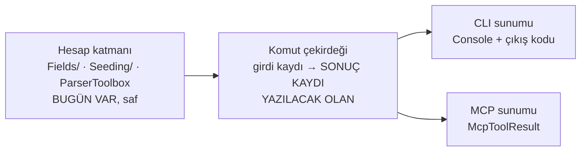

# CLI komut envanteri ve *"ortak çekirdek"* neyi ortaklaştırmalı

M02'nin bitti tanımı bir **paydaya** dayanıyor:

> *Komut çekirdeğindeki her komut ya MCP aracı ya gerekçeli muafiyet; sayı
> sabitle tutuluyor.*

O payda hiçbir yerde yazılı değildi. Bu belge onu ölçüyor, ve ölçerken çekirdek
kararının **kendiliğinden** çıktığı bir olgu buluyor.

> **Bu belge kod değiştirmiyor.** Ölçüm ve öneri; uygulama koordinatörün onayı
> ve M01'in araç kaydı sözleşmesi geldikten sonra.

---

## 1 · Envanter — **11 uç komut, 7 grup**

Taban `3ac1a8d` (M01). `src/Bizigo.Cli/Program.cs` yedi grup kaydediyor ve
gruplar toplam on bir **çalıştırılabilir** komut taşıyor. Grup düğümlerinin
kendi eylemi yok; sayım uçlardan.

**Sayı türetilebilir, elle sayılmadı:** `SetAction` çağrısı = **11**. Bir
bekçinin dayanacağı sayı bu olmalı — elle yazılmış bir liste bu depoda üç kez
kör etti.

| # | Komut | Ne yapıyor | Yan etki |
| --- | --- | --- | --- |
| 1 | `parser lint` | Şema doğrulaması + ReDoS taraması | **yok** |
| 2 | `parser test` | YAML'ın gömülü `tests` bloğunu koşturur | **yok** |
| 3 | `parser try` | Tek satırı dener, çözülen alanları gösterir | **yok** |
| 4 | `parser coverage` | Katalog kapsamı | **yok** |
| 5 | `fields coverage` | Altın örneklerin ne kadarının kolona indiği (T39) | **yok** (ClickHouse'u okur) |
| 6 | `fields values` | Kolon değer uzayı | **yok** (ClickHouse'u okur) |
| 7 | `sigma sync` | Manifesti alarm kurallarına yazar | **kontrol düzlemine YAZAR** (`--dry-run` var) |
| 8 | `fleet apply` | Filo tanımını kontrol düzlemine yazar | **kontrol düzlemine YAZAR** |
| 9 | `seed golden` | Ölçüm ve geliştirme verisi yükler | **veri YAZAR** |
| 10 | `schema migrate` | ClickHouse göçlerini uygular | **şema DEĞİŞTİRİR** |
| 11 | `mcp serve` | MCP sunucusunu stdio üzerinden koşturur (M01, `3ac1a8d`) | **süreç açar** |

**Altısı okuma, beşi yazma/çalıştırma.** Ayrım muafiyet tartışmasının ekseni (§4).

---

## 2 · Ölçülen olgu: çekirdek **zaten var**, ama beyan edilmemiş

Asıl soru *"ortak çekirdek neyi ortaklaştırıyor — iş mantığı mı, girdi
doğrulaması mı, çıktı şekli mi"* idi. Ölçüm cevabı kendisi verdi.

`Console` çağrılarının dağılımı:

| Katman | Dosyalar | `Console.` çağrısı |
| --- | --- | --- |
| **Sunum** — `*CommandHandlers.cs` | 5 dosya | **117** |
| **Hesap** — `Fields/`, `Seeding/`, `ParserToolbox` | 9 dosya, ~2.100 satır | **0** |

Yani hesap katmanı **bugün zaten saf**. Ayrım eksik değil — **beyan edilmemiş
ve zorlanmıyor**.

Bunun iki sonucu var ve ikisi de kararın kendisi:

**(a) Ortaklaştırılacak şey iş mantığı DEĞİL — o zaten ortak.** Ortaklaşamayan
şey **sonucun kendisi**: bugün bir komutun çıktısı bir *değer* değil, bir **yan
etki**. `FieldsCommandHandlers.Coverage` ölçümü yapıyor, sonucu `Console`'a
yazıyor ve `int` döndürüyor. Bir MCP aracı bunu **tüketemez**: yapılandırılmış
çıktı istiyor, konsol metni değil; hata olarak `McpToolError` istiyor, çıkış
kodu 1 + stderr değil.

**(b) Saflık ölçülmüyor.** Hesap katmanında `Console` yasağı **hiçbir mimari
testte yok** — bugünkü sıfır bir tesadüf. Bu deponun kuralı net: *bir şey
ölçülmediyse çalıştığı varsayılmaz.*

**Ve M01'in uyarısı bu maddeyi bir üslup tercihinden bir kapıya çeviriyor:**

> *stdout protokolün kendisi. Oraya düşen tek bir satır JSON-RPC akışını bozuyor
> ve istemci bunu ayrıştırma hatası olarak görüyor — ürün hakkında hiçbir şey
> söylemeyen bir arıza.*

Yani hesap katmanına sızacak tek bir `Console.WriteLine`, MCP yüzeyinde
**sunucuyu bozar** ve arıza ürünü değil ayrıştırıcıyı işaret eder. Ölçülen 117
`Console` çağrısı sunum katmanında duruyor ve orada **kalmalı**; onları ayıran
şey bugün bir yorum, bekçi değil. Paritenin en ince yeri burası.

### Ve ayrım bu depoda **bir kez zaten yapılmış**

`SigmaSyncCommandHandler` iki parçalı:

```csharp
public static IReadOnlyList<SigmaSyncDecision> Plan(SigmaManifest manifest)  // saf, veritabanına dokunmuyor
public static async Task<int> RunAsync(...)                                   // Console + çıkış kodu
```

`Plan` tam olarak önerilen şeklin kendisi: **karar bir değer**, sunum ayrı.
Öneri yeni bir kalıp icat etmiyor; **var olanı ondan çıkarıp onuna** genelliyor.

---

## 3 · Öneri — üç katman, ikisi zaten yazılı



**Yazılacak olan tek şey ortadaki halka**, ve içeriği şu: her komut için bir
**sonuç kaydı** (`record`) ve o kaydı üreten saf bir fonksiyon.

| Ne | Nerede | Bugün |
| --- | --- | --- |
| İş mantığı | Hesap katmanı | **var, saf** |
| Girdi doğrulaması | Bugün `System.CommandLine` yapıyor | **CLI'ya bağlı** — MCP tarafında karşılığı yok, çekirdeğe taşınmalı |
| **Çıktı şekli** | Bugün `Console` | **yok** — asıl iş bu |
| Hata | `int` + stderr | İki sunum iki farklı şey istiyor; çekirdek **sebebi** taşımalı, kodu değil |

**İkinci kopya yazılmıyor** (§9). MCP aracı hesap katmanını **yeniden
uygulamıyor**; çekirdeğin döndürdüğü kaydı okuyor. Bugünkü hâlde bir MCP aracı
yazmak *"aynı girdinin iki kopyası"* sınıfını doğururdu: iki uygulama ayrışır ve
**sürüklenmeyi hiçbir şey göremez**, çünkü çıktıyı girdiye tutan bir şey yok.

### Bekçi önerisi — üç tane, üçü de kırmızı yanabilir

1. **Hesap katmanında `Console` yasak.** Mimari testle; bugünkü sıfırı bir
   ölçüme çeviriyor.
2. **Her çekirdek komutu ya araç ya gerekçeli muafiyet**, ve muafiyet listesi
   **keşfedilen** kümeye karşı sınanıyor — elle yazılmış bir liste değil.
   Gerekçesi ölçüldü: bu depoda elle tutulan liste bekçiyi **üç kez** kör etti
   (`Produces<T>`'nin 16 ucu · kayıt uzantıları · MCP öncesi kapılar).
3. **Muaf sayısı sabitle çivili** (`ExpectedExemptCount` kalıbı) — muafiyet
   eklemek **iki ayrı bilinçli hareket**: gerekçeyi yazmak **ve** sabiti
   değiştirmek. T43'ün `constraints_waived`'ı ve T44'ün 2→1 düşüşü aynı kalıp.

---

## 4 · Muafiyet adayları ve **gerekçeleri**

Muafiyet *"araç yapmaya üşendik"* değil, **"araç olması yanlış olur"** demek.
Ölçüt tek soru: **bir dil modelinin bu komutu kendi kararıyla çağırması
kabul edilebilir mi?**

| Komut | Öneri | Gerekçe |
| --- | --- | --- |
| `schema migrate` | **MUAF** | Şema göçü geri alınamaz ve sırası anlamlı. Bu depoda en pahalı **önlenmiş** hata bir göçtü — pasif kuralları sessizce açıyordu. Bir modelin göç uygulaması, o hatayı insan onayı olmadan mümkün kılar |
| `seed golden` | **MUAF** | Ölçüm/geliştirme verisi **yazıyor**. Üretim verisinin yanına test verisi karışması sessiz bir yanlış: sonraki her ölçüm kirlenir ve kirlendiği görünmez |
| `fleet apply` | **MUAF** | Kontrol düzlemine filo tanımı yazıyor; simülasyon altyapısını değiştiriyor. M03'ün simülatör kolu ayrı bir yüzey ve bu komut oraya ait, ürün yüzeyine değil |
| `sigma sync` | **KARARSIZ — koordinatöre** | Yazıyor **ama** `--dry-run`'ı var, yani okuma yarısı zaten ayrılmış (`Plan`). *Öneri:* `sigma.plan` araç (okuma), `sigma sync` muaf (yazma). Ayrım komutu ikiye bölmek demek; **kapsam kararı** |
| `mcp serve` | **MUAF** | Sunucunun kendisi (M01, `3ac1a8d`). Bir aracın sunucuyu başlatması özyineleme; ayrıca stdout'u protokol olarak sahipleniyor |

**Araç olmaya uygun altı komut:** `parser lint` · `parser test` · `parser try` ·
`parser coverage` · `fields coverage` · `fields values`. Altısı da **yan
etkisiz** ve altısı da bir modelin *"şu parser'ı sına"* / *"bu alan kapsanıyor
mu"* diye sorabileceği şeyler.

**Sayı, `sigma sync` kararına bağlı:** 6 araç + 5 muafiyet, ya da 7 araç
(`sigma.plan` ile) + 5 muafiyet. Toplam 11 — `SetAction` sayısıyla birebir, ve
bekçi bu eşitliği tutmalı: **keşfedilen komut = araç + muaf.**

### İki liste var ve ayrışabilirler — koordinatöre bildirim

M01'in `McpComplianceTests.Sunucunun_ilan_ettigi_araclar` testi beklenen araç
kümesini **elle** taşıyor (`["server.info"]`), ve M02'nin muafiyet sabiti
**ayrı** bir liste olacak. İkisi aynı şeyi iki yerden söylüyor:

| Liste | Neyi sayıyor | Sahibi |
| --- | --- | --- |
| `Sunucunun_ilan_ettigi_araclar` | Sunucunun **ilan ettiği** araçlar | M01 |
| Muafiyet listesi + sabit | Komutların **araç olmayanları** | M02 |

Bir komut araç yapıldığında **ikisi birden** değişmeli. Değişmezse: araç ilan
edilir ama muafiyet listesinde de kalır, ya da tersi — ve iki liste de kendi
içinde tutarlı olduğu için **hiçbir test kırmızı yanmaz**. Bu, S04'te ölçülen
*"baseline'ın iki gösterimi"* deseninin aynısı.

**Öneri:** M02'nin bekçisi kendi listesini `McpToolDiscovery`'nin bulduğu
kümeden **okusun**, elle yazmasın — o zaman ayrışma yapısal olarak imkânsız
olur. M01'in listesi ilan tarafını, benimki kapsama tarafını tutar ve ikisi
**aynı kaynaktan** beslenir.

---

## 4.1 · M01'in bıraktığı ve doğrudan M02'ye düşen eksik

> `McpCommandHandlers.ServeAsync` **boş bir `ServiceCollection`** kuruyor.
> `server.info` bağımlılık istemediği için yetiyor; ürün araçları geldiğinde
> oraya gerçek servis grafiği gerekecek.

Bu, çekirdek kararının **ikinci** tüketicisi ve tesadüf değil: komut çekirdeği
zaten bir servis grafiği kuracak, stdio host da onu kullanacak. M01 girişi açtı,
çekirdeği değil.

Yazılmazsa bedeli adı konmuş: **ilk araç eklendiğinde `Instantiate`
"bağımlılığı DI'ya kaydedilmemiş" diye patlar ve sebep aranır** — yani arıza
M04'ün ilk aracında görünür, sebebi burada durur. M02'nin çıktısı bu yüzden
yalnızca bir çekirdek değil, **o çekirdeği kuran kompozisyon**.

`CompositionRootTests` (T50) bunu ayrıca tutuyor: keşfedilen her kayıt uzantısı
kompozisyon kökünden erişilebilir olmalı. Yeni bir `Add*` yazarsam
`Program.cs`'e bağlanacak.

## 4.2 · Şemalar elle yazılıyor — çekirdeğin sonuç kaydı şema DEĞİL

M01 şemaları yansımayla üretmiyor ve gerekçesi §8: *yansımayla üretilen şema,
domain tipine eklenen her alanı kimse karar vermeden protokole sızdırır — ve
MCP'de sızan alan doğrudan modelin bağlamına giriyor.*

Bunun M02'ye etkisi: önerilen **sonuç kaydı** bir taşıyıcı, bir sözleşme değil.
Her araç kendi `OutputSchema`'sını elle yazacak ve kaydın alanlarından
**hangilerinin** protokole çıktığına ayrıca karar verilecek. Yani çekirdek
"ne hesaplandı"yı, araç "ne ilan edildi"yi taşıyor — ve ikisi bilerek aynı şey
değil.

## 5 · Bu belgenin bilmediği

- ~~M01'in araç kayıt sözleşmesi.~~ **Geldi** (`3ac1a8d`) ve §4.1/§4.2'ye
  işlendi. Bu belgenin ilk hâli sözleşmeyi beklerken yazılmıştı ve hiçbir
  önerisi M01'in tip adlarına dayanmıyordu; sözleşme geldiğinde **hiçbir öneri
  değişmedi** — yalnızca ikisi eklendi (servis grafiği, şema ayrımı).
- **Bağlam maliyeti.** MCP ticket belgesi *"on beş aracın şeması her bağlamda
  taşınıyor; bugün sayısı yok"* diyor ve ölçümü M01'e bırakıyor. Altı aracın
  şema boyutu da o bütçeye giriyor; **ölçmedim**.
- **Girdi doğrulamasının çekirdeğe taşınma maliyeti.** Bugün
  `System.CommandLine` yapıyor; kaç kuralın taşınacağını **saymadım**.
- **Hesap katmanının gerçekten yeterli olduğu.** `Console` sayısı sıfır, ama bu
  *"MCP'nin ihtiyacı olan her şey burada"* demek değil — yalnızca *"burada
  konsola yazan yok"* demek. İkisi farklı iddialar ve ikincisi ölçüldü,
  birincisi **ölçülmedi**.

---

## 6 · İlk bakılacak yer

> **İlk bakılacak yer:** `SigmaSyncCommandHandler.Plan` — önerilen şeklin bu
> depodaki tek örneği, ve genelleme ondan türüyor.
>
> **Aradım ve elemedim:** on uç komutun tamamı (Program.cs'ten sayıldı, grup
> düğümleri hariç) · hesap katmanının `Console` bağımsızlığı (9 dosyada sıfır) ·
> hesap katmanının görünürlüğü (8/9 `public`, yalnız `ParserToolbox` `internal`).
>
> **Aramadım:** hesap katmanının MCP için yeterli olup olmadığı · şema bağlam
> maliyeti · `System.CommandLine` doğrulama kurallarının sayısı · M01'in
> yüzeyi (bilerek — sözleşme beklenecek).
