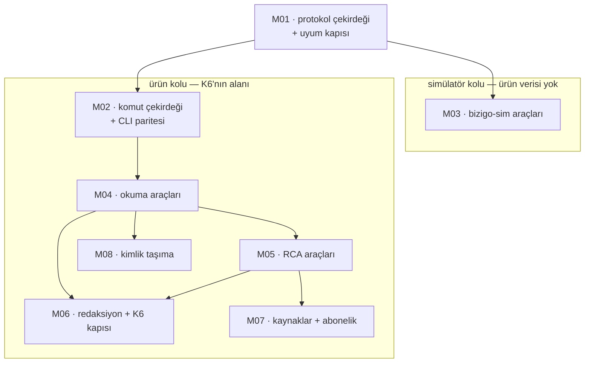

# MCP Implementasyon Ticket'ları

[MCP teknik plan](../mcp-teknik-plan/index.md) sekiz ticket'a bölündü.
Yöneten kararlar: **K6** (log verisi kurumdan çıkmaz) · **K15** (yerel model
kısıtı) · **K20** (dış API tetikleyicisi) · T41 (redaksiyon tabanı) · T42
(model sınırı kapısı).

## Dilimleme mantığı

**M01 önce ve tek başına.** Protokol çekirdeği ile uyum kapısı aynı ticket'ta,
çünkü ayrılırlarsa kapı ikinci sıraya düşer ve *"sonra ekleriz"* olur. Bu
depoda bir kapının **eklenmesi** ile **okunması** ayrı olaylar; kapıyı
çekirdekle birlikte sevk etmek o ayrımı doğmadan kapatıyor.

**Sonrası iki kol.** *Simülatör* (M03) FS'e bağlı ve ürün verisine hiç
dokunmuyor; *ürün* (M02, M04, M05, M07, M08) K6'nın ve redaksiyonun alanında.
İki kol **farklı risk taşıyor** ve bu yüzden ayrı: M03'ün en kötü hâli yanlış
bir simülatör durumu, M04'ün en kötü hâli **log verisinin kurumdan çıkması**.

**M06 sona bırakılmadı, sonda duruyor.** Redaksiyon ve K6 kapısı M04/M05'in
**sevk şartı**: araçlar yazılır, kapı takılır, ikisi birlikte açılır. Kapıyı
önce yazmak tüketicisi olmayan bir tip yazmak olurdu (§8); sonra yazmak ise
arada bir sürüm boyunca kapısız bir yüzey bırakmak.

## Sıra ve bağımlılıklar

## Ticket listesi

| # | Ticket | Özü | Bağımlılık |
| --- | --- | --- | --- |
| M01 | Protokol çekirdeği ve uyum kapısı | `initialize`, yetenek anlaşması, `stdio` + akışlanabilir HTTP, **araçları kendisi bulan** sözleşme testi, iptal | — |
| M02 | Komut çekirdeği ve CLI paritesi | Ortak çekirdek, iki sunum katmanı, gerekçeli muafiyet + sabit sayı | M01 |
| M03 | `bizigo-sim` araçları | Yedi araç; **yüzey hatası** yüzeyi söylüyor, profili değil | M01, FS-a |
| M04 | `bizigo` okuma araçları | `logs.*`, `alerts.*`, `inventory.*`, `catalog.*`; kapsam **tek kapıdan** | M01, M02 |
| M05 | `bizigo` RCA araçları | `rca.trigger` (`Idempotency-Key`), `rca.runs` (üç yönlü ayrım), `evidence.bundle` | M04, T46 |
| M06 | Redaksiyon ve K6 kapısı | `RedactedPrompt` zorunluluğu **derleyicide**; sunucu ağ sınırını beyan ediyor | M04, T41, T42 |
| M07 | Kaynaklar ve abonelik | Belge kaynakları, `rca.runs` durum bildirimi | M05 |
| M08 | Kimlik taşıma | Keycloak kimliği MCP oturumundan uca; servis hesabı **yasak** | M04 |

## Bitti tanımı

1. `initialize` **iki taşımada da** çalışıyor; desteklenmeyen yetenek
kullanılmıyor.
2. İlan edilen **her** aracın şeması geçerli, örnek çağrısı `outputSchema`'ya
uyuyor — ve bekçi araçları **kendisi buluyor**.
3. `notifications/cancelled` uzun bir ClickHouse sorgusunu **gerçekten**
iptal ediyor; ölçüldü.
4. Komut çekirdeğindeki her komut ya MCP aracı ya **gerekçeli muafiyet**;
sayı sabitle tutuluyor.
5. Log içeriği döndüren hiçbir araç `RedactedPrompt` kapısını atlamıyor, ve
bu **derleyiciye** bağlı.
6. MCP sunucusu ağ sınırını **beyan ediyor**; `Unspecified` reddediliyor.
7. Kapsam filtresi MCP yüzeyinde de **tek kapıdan** geçiyor.
8. Simülatör senaryosu yanlış yüzeye uygulandığında hata **yüzeyi** söylüyor.

## M06'nın verdiği kararlar

Bitti tanımının 5. ve 6. maddeleri M06'da kapandı. Üç karar, üçü de bir
gözlemden doğdu ve gözlemler hiçbir belgede yazılı değildi.

### stdio'nun ağ sınırı ÇIKARILMIYOR, beyan ediliyor

İlk mekanik cevap şuydu: *stdio istemcisi aynı makinede bir süreç, demek ki iç
ağ.* Çıkarım doğru görünüyor ve **K6 açısından tam ters olabiliyor**: bu
taşımanın en olası gerçek istemcisi bir masaüstü MCP istemcisi (Claude Desktop
gibi) ve o, aldığı her şeyi **buluta** gönderiyor. Sınırı koda çivilemek,
ürünün en büyük sözünü **bayrak yeşilken** boşa çıkaran bir hâl yazmak
olurdu — §7'nin tarif ettiği sınıf.

Sonuç: `bizigo mcp serve --data-boundary internal|external`, **varsayılanı
yok**. `--surface`'in varsayılanı var çünkü yüzeyin makul bir varsayılanı var;
sınırın yok. `--data-boundary external --surface bizigo` reddediliyor.

Bu gözlemin yazılı olması gerekiyordu çünkü **bir sonraki kişi aynı mekanik
çıkarımı yapacak** ve o çıkarımın nerede kırıldığı koddan görünmüyor.

### K6 ekseni tek tip, ama MCP'de çıplak dolaşmıyor

`ModelDataBoundary` `Bizigo.Contracts.Security.DataBoundary`'ye **taşındı**:
K6 tek bir eksen çiziyor ve o eksenin iki tipi olamaz (§9). Ama tipi paylaşmak
tek başına yeni bir tehlike doğuruyordu — T42'nin kapısında `Internal`
**adrese karşı doğrulanmış**, MCP'de **yalnızca beyan edilmiş** demek, ve aynı
enum değeri iki farklı garanti gücü taşıyordu.

Ayrım silinmedi, **tipten okunur hâle getirildi**: MCP tarafında beyan
`McpBoundaryDeclaration` içinde dolaşıyor ve `Basis` boş olamıyor. Yani bu
üründe `Internal` hiçbir yerde gerekçesiz görünmüyor. Aynı ayrımın üçüncü
örneği (T36 `Measured=false` ↔ `Unreliable=0`, T47 `Unspecified` ↔
`NotPresent`).

Farkın kaynağı yön: model ucu **egress** — biz ona bağlanıyoruz, adresi
biliniyor. MCP yüzeyi **ingress** — istemci bize bağlanıyor ve kim olduğu
bağlanana kadar bilinmiyor; stdio'da hiç adres yok.

### `External` + `bizigo-sim` geçiyor

İki yüzeyin ayrı olmasının **sebebi** o risk ayrımı: `bizigo-sim` ürün verisi
değil simülatör durumu döndürüyor. Kurum dışı bir istemciye açılması K6'yı
ihlal etmiyor.

Bu yol bugün ürün kurulumunda **ulaşılamaz** — `BizigoMcpSetup` yalnızca ürün
yüzeyini kuruyor ve `bizigo-sim`'in HTTP yüzeyi M03'ün kararı. Kararı
daraltmak (her yüzeyde `External` reddi) bugün ölçülemeyen bir kararı
ölçülemeyen bir başkasıyla değiştirirdi ve M03 gerekçesiz bir kapı bulurdu.

## Bu belgenin bilmediği şey

**MCP 2.0'ın hangi revizyonu** — spesifikasyon sürümlü ve tarih damgalı.
M01 uyduğu revizyonu **yazacak** ve sözleşme testi ona karşı koşacak.
*"En güncel"* bir hedef değil, bir kaymadır.

**Araç sayısının bağlam maliyeti ölçülmedi.** On beş aracın şeması her
bağlamda taşınıyor; bu bir bütçe kalemi ve bugün sayısı yok. M01 ölçsün.
