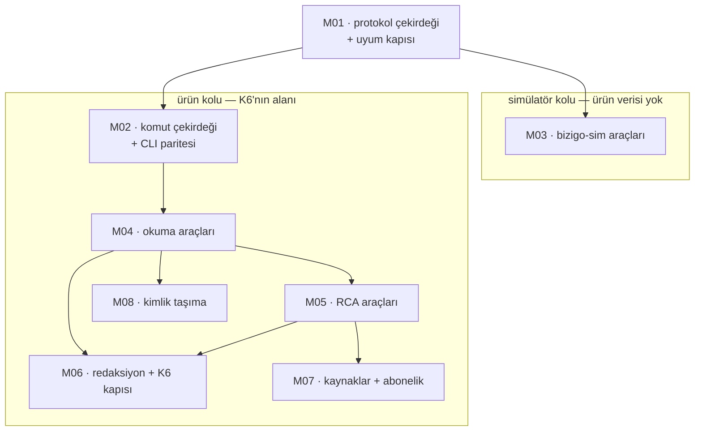

# MCP Implementasyon Ticket'ları

[MCP teknik plan](../mcp-teknik-plan/index.md) sekiz ticket'a bölündü.
Yöneten kararlar: **K6** (log verisi kurumdan çıkmaz) · **K15** (yerel model
kısıtı) · **K20** (dış API tetikleyicisi) · T41 (redaksiyon tabanı) · T42
(model sınırı kapısı).

## Dilimleme mantığı

**M01 önce ve tek başına.** Protokol çekirdeği ile uyum kapısı aynı ticket'ta,
çünkü ayrılırlarsa kapı ikinci sıraya düşer ve *"sonra ekleriz"* olur. Bu
depoda bir kapının **eklenmesi** ile **okunması** ayrı olaylar; kapıyı
çekirdekle birlikte sevk etmek o ayrımı doğmadan kapatıyor.

**Sonrası iki kol.** *Simülatör* (M03) FS'e bağlı ve ürün verisine hiç
dokunmuyor; *ürün* (M02, M04, M05, M07, M08) K6'nın ve redaksiyonun alanında.
İki kol **farklı risk taşıyor** ve bu yüzden ayrı: M03'ün en kötü hâli yanlış
bir simülatör durumu, M04'ün en kötü hâli **log verisinin kurumdan çıkması**.

**M06 sona bırakılmadı, sonda duruyor.** Redaksiyon ve K6 kapısı M04/M05'in
**sevk şartı**: araçlar yazılır, kapı takılır, ikisi birlikte açılır. Kapıyı
önce yazmak tüketicisi olmayan bir tip yazmak olurdu (§8); sonra yazmak ise
arada bir sürüm boyunca kapısız bir yüzey bırakmak.

## Sıra ve bağımlılıklar

## Ticket listesi

| # | Ticket | Özü | Bağımlılık |
| --- | --- | --- | --- |
| M01 | Protokol çekirdeği ve uyum kapısı | `initialize`, yetenek anlaşması, `stdio` + akışlanabilir HTTP, **araçları kendisi bulan** sözleşme testi, iptal | — |
| M02 | [Komut çekirdeği ve CLI paritesi](komut-cekirdegi/index.md) | Ortak çekirdek, iki sunum katmanı, gerekçeli muafiyet + sabit sayı | M01 |
| M03 | [`bizigo-sim` araçları](sim-araclari/index.md) | Yedi araç; **yüzey hatası** yüzeyi söylüyor, profili değil | M01, FS-a |
| M04 | [`bizigo` okuma araçları](okuma-araclari/index.md) | `logs.*`, `alerts.*`, `inventory.*`, `catalog.*`; kapsam **tek kapıdan** | M01, M02 |
| M05 | [`bizigo` RCA araçları](rca-araclari/index.md) | `rca.trigger` (`Idempotency-Key`), `rca.runs` (üç yönlü ayrım), `evidence.bundle` | M04, T46 |
| M06 | [Redaksiyon ve K6 kapısı](redaksiyon-kapisi/index.md) | `RedactedPrompt` zorunluluğu **derleyicide**; sunucu ağ sınırını beyan ediyor | M04, T41, T42 |
| M07 | [Kaynaklar ve abonelik](kaynaklar-ve-abonelik/index.md) | Belge kaynakları, `rca.runs` durum bildirimi | M05 |
| M08 | [Kimlik taşıma](kimlik-tasima/index.md) | Keycloak kimliği MCP oturumundan uca; servis hesabı **yasak** | M04 |
| M09 | [Kimliğin bulunması ve kaynağa bağlanması](kimlik-kesfi/index.md) | RFC 9728 keşif + RFC 8707 kaynak kimliği; **adlandırılmış şema**, 45 uç etkilenmiyor | M01 |
| M10 | [Üç ertelenmiş ürün aracı](yeni-urun-araclari/index.md) | `logs.get` · `rca.quality` · `alerts.maintenance`; **MCP'de yazma yok** ve IL'de tutuluyor | M04, M06, T47 |
| M11 | [Kestrel'in kör noktası: beyanın topolojisi](kestrel-kor-noktasi/index.md) | Dinleyici adresi kapının görüşüne alınıyor; joker bağlama **kanıt değil**, gerekçeli muafiyet | M06, T42 |

**M10 ticket'ı iş bittikten SONRA yazıldı** ve bunu T61'in bekçisi zorladı:
merge edilmiş bir kimlik hiçbir tabloda anılmıyordu, kapı kırmızı yandı. Kaydın
geç olması bir kusur, kapının onu yakalaması kapının işi — ve bu satır o
kapının ilk gerçek yakalayışı.

**M01'in ticket dosyası yok** ve bu bilinçli: koşuyor, kararları raporlarında,
ve verdiği kararlar (revizyon `2026-07-28`, araç sözleşmesi, yüzey beyanı,
bağlam maliyeti ölçümü) yukarıdaki yedi belgeye **kaynağı gösterilerek**
taşındı. M01 kapandığında kendi belgesi yazılacaksa
[T53](../tickets-f3/ticket-statusu-bekcisi/index.md)'ün bekçisi onu isteyecek.

## Bitti tanımı

1. `initialize` **iki taşımada da** çalışıyor; desteklenmeyen yetenek
kullanılmıyor.
2. İlan edilen **her** aracın şeması geçerli, örnek çağrısı `outputSchema`'ya
uyuyor — ve bekçi araçları **kendisi buluyor**.
3. `notifications/cancelled` uzun bir ClickHouse sorgusunu **gerçekten**
iptal ediyor; ölçüldü.
4. Komut çekirdeğindeki her komut ya MCP aracı ya **gerekçeli muafiyet**;
sayı sabitle tutuluyor.
5. Log içeriği döndüren hiçbir araç `RedactedPrompt` kapısını atlamıyor, ve
bu **derleyiciye** bağlı.
6. MCP sunucusu ağ sınırını **beyan ediyor**; `Unspecified` reddediliyor.
7. Kapsam filtresi MCP yüzeyinde de **tek kapıdan** geçiyor.
8. Simülatör senaryosu yanlış yüzeye uygulandığında hata **yüzeyi** söylüyor.

## M06'nın verdiği kararlar

Bitti tanımının 5. ve 6. maddeleri M06'da kapandı. Üç karar, üçü de bir
gözlemden doğdu ve gözlemler hiçbir belgede yazılı değildi.

### stdio'nun ağ sınırı ÇIKARILMIYOR, beyan ediliyor

İlk mekanik cevap şuydu: *stdio istemcisi aynı makinede bir süreç, demek ki iç
ağ.* Çıkarım doğru görünüyor ve **K6 açısından tam ters olabiliyor**: bu
taşımanın en olası gerçek istemcisi bir masaüstü MCP istemcisi (Claude Desktop
gibi) ve o, aldığı her şeyi **buluta** gönderiyor. Sınırı koda çivilemek,
ürünün en büyük sözünü **bayrak yeşilken** boşa çıkaran bir hâl yazmak
olurdu — §7'nin tarif ettiği sınıf.

Sonuç: `bizigo mcp serve --data-boundary internal|external`, **varsayılanı
yok**. `--surface`'in varsayılanı var çünkü yüzeyin makul bir varsayılanı var;
sınırın yok. `--data-boundary external --surface bizigo` reddediliyor.

Bu gözlemin yazılı olması gerekiyordu çünkü **bir sonraki kişi aynı mekanik
çıkarımı yapacak** ve o çıkarımın nerede kırıldığı koddan görünmüyor.

### K6 ekseni tek tip, ama MCP'de çıplak dolaşmıyor

`ModelDataBoundary` `Bizigo.Contracts.Security.DataBoundary`'ye **taşındı**:
K6 tek bir eksen çiziyor ve o eksenin iki tipi olamaz (§9). Ama tipi paylaşmak
tek başına yeni bir tehlike doğuruyordu — T42'nin kapısında `Internal`
**adrese karşı doğrulanmış**, MCP'de **yalnızca beyan edilmiş** demek, ve aynı
enum değeri iki farklı garanti gücü taşıyordu.

Ayrım silinmedi, **tipten okunur hâle getirildi**: MCP tarafında beyan
`McpBoundaryDeclaration` içinde dolaşıyor ve `Basis` boş olamıyor. Yani bu
üründe `Internal` hiçbir yerde gerekçesiz görünmüyor. Aynı ayrımın üçüncü
örneği (T36 `Measured=false` ↔ `Unreliable=0`, T47 `Unspecified` ↔
`NotPresent`).

Farkın kaynağı yön: model ucu **egress** — biz ona bağlanıyoruz, adresi
biliniyor. MCP yüzeyi **ingress** — istemci bize bağlanıyor ve kim olduğu
bağlanana kadar bilinmiyor; stdio'da hiç adres yok.

### `External` + `bizigo-sim` geçiyor
İki yüzeyin ayrı olmasının **sebebi** o risk ayrımı: `bizigo-sim` ürün verisi
değil simülatör durumu döndürüyor. Kurum dışı bir istemciye açılması K6'yı
ihlal etmiyor.

Bu yol bugün ürün kurulumunda **ulaşılamaz** — `BizigoMcpSetup` yalnızca ürün
yüzeyini kuruyor ve `bizigo-sim`'in HTTP yüzeyi M03'ün kararı. Kararı
daraltmak (her yüzeyde `External` reddi) bugün ölçülemeyen bir kararı
ölçülemeyen bir başkasıyla değiştirirdi ve M03 gerekçesiz bir kapı bulurdu.

### M06'nın yazdığı kör noktalardan biri M11'de kapandı

M06 kapısının kendi belgesinde üç tutamadığı yazılıydı ve üçüncüsü şuydu:
*"HTTP taşımasında dinlenen adresi doğrulamıyor."* Yani `internal` beyanı
kabul ediliyor, sunucu `0.0.0.0` üzerinde koşuyor olabiliyordu — ve sevk edilen
container imajı **tam olarak öyle** bağlıyor (ölçüldü,
`src/Bizigo.Api/Dockerfile:85`).

[M11](kestrel-kor-noktasi/index.md) o boşluğu **ikinci bir kapıyla** kapattı
(kalkışta, `IServerAddressesFeature` üzerinden) ve joker bağlamayı *"dışa
açık"* değil ***"bilinmiyor"*** saydı — süreç içinden publish kuralını,
container ağını ve güvenlik duvarını görmenin yolu yok. Sonuç: joker bağlama
**yazılı bir gerekçe** istiyor, ve M06'nın kendi kalıbı ikinci kez uygulanmış
oldu — mekanik çıkarımı beyanla değiştirmek.

Kapatılmayan kalem de yazılı ve M11'in belgesinde duruyor: ters vekil arkasında
`127.0.0.1` dinleyen bir sunucu dışa açık olabilir ve kapı ona `Verified` der.

## Bu belgenin bilmediği şey — **ikisi de cevaplandı**

~~**MCP 2.0'ın hangi revizyonu.**~~ **Cevaplandı:** `2026-07-28`, ve *"MCP
2.0"* diye bir revizyon **zaten yoktu** — spesifikasyon yayınlarının tamamı
tarih damgalı. [Teknik plan §2](../mcp-teknik-plan/index.md) düzeltmeyi
gerekçesiyle taşıyor. M01 sabiti yazdı (`McpRevision.Supported`), ve yanına
bir **bekçi** koydu: SDK'nın ilan ettiği sürüm sabitten ayrıştığı gün kırmızı.

~~**Araç sayısının bağlam maliyeti ölçülmedi.**~~ **Ölçüldü (M01):** araç
başına **194 belirteç**, ve en pahalı kalem şema değil **`description`
metni**. On beş araç bugünkü ortalamayla **≈2900 belirteç** eder ve bu **her
bağlamda** taşınıyor — yani açıklama uzunluğu bir üslup tercihi değil bir
bütçe kalemi. Sayı M03/M04/M05/M07 belgelerine tasarım kısıtı olarak girdi.

> Bu iki satır M01'in **birleşmemiş** dalından geliyor; sabitler değişirse
> buradaki sayılar da değişir.

## Bu belgenin hâlâ bilmediği şey

**`notifications/cancelled` bugün var mı.** Bitti tanımı §3 ona bağlı. M01'in
`BizigoMcpServer.cs`'inde arandı ve **bulunamadı** — ama *"yok"* ile *"başka
dosyada"* ayırt **edilmedi**. M01'e soruldu, cevap bekleniyor.
