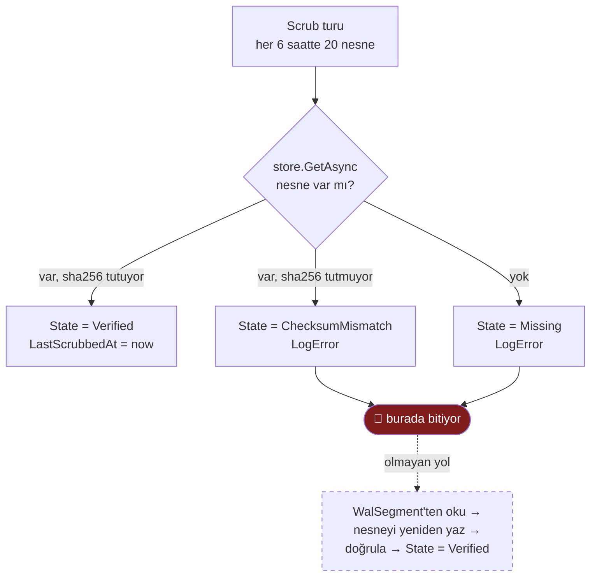

# T40 — Kayıp nesnenin yerel segmentten geri yüklenmesi

**Kaynak:** T04 karar belgesi, açık kalem #4
([`docs/epic/t04-kararlar`](../../t04-kararlar/index.md)) ·
**Yöneten kararlar:** K25, F1 §7.0 koruma #3 ve #5, risk #13

## Neden bu ticket var

T04 object storage'ın veri kaybetmesini **varsayarak** kuruldu — RustFS
1.0-beta, üretim tavsiyesi yok. Buna karşı beş koruma tasarlandı. Üçüncüsü şu:

> Segment, yüklendiği doğrulandıktan sonra 48 saat daha tutulur. RustFS bu
> pencerede veri kaybederse **yerelden yeniden yüklenebilir**.
> — `RawStoreOptions.SegmentRetention`

Manifest kaybı **görüyor**: scrub nesneyi indiremezse
`RawObjectState.Missing` yazıyor ve hata seviyesinde loglayıp *"replay bu
aralığı eksik dönecek"* diyor. Kayıp nesnenin geldiği WAL segmentinin adı da
duruyor — `RawManifestEntity.WalSegment`, ve o alanın kendi XML yorumu ikinci
işini açıkça söylüyor: *"nesne kaybolursa hangi yerel segmentten geri
yükleneceği."*

**Bağ kurulmuş, veri yerinde, mekanizma yok.** `Missing` yazılıyor ve orada
bitiyor. Saklama süresi, var olmayan bir mekanizmanın gereksinimine göre
seçilmiş.

Bu, F1'in ders listesindeki şekil: belgelenmiş bir iddianın kodda karşılığı yok
ve sonuç sessiz. Fark şu ki burada iddia bir **koruma** — yani sessizliğin
bedeli ancak veri gerçekten kaybolduğunda ödeniyor.

## Bugün nerede bitiyor



Kesik çizgili kutu bu ticket'ın işi.

## İki bulgu — mekanizma yazılmadan önce okunmalı

Belgeyi yazarken kod okundu ve iki şey çıktı. İkisi de mekanizmanın **tasarımını
değiştiriyor**, o yüzden kapsamın başında duruyorlar.

### 1 · Kayıp tespiti segmenti korumuyor

`RawArchiveUploader.DeleteExpiredSegmentsAsync` silme kararını **yalnızca**
`VerifiedAt`'e bakarak veriyor:

```csharp
.Select(m => new { m.VerifiedAt })
...
if (rows.Any(r => r.VerifiedAt is null || r.VerifiedAt > cutoff)) continue;
segments.Delete(segment.Id);
```

`State` sorguya hiç girmiyor. Bir nesne önce doğrulanıp (`VerifiedAt` dolu)
sonra kaybolduysa (`State = Missing`), o satır silme kararında hâlâ *"doğrulanmış
ve süresi dolmuş"* görünüyor — yani **kaybın tespit edilmiş olması, kurtarma
kaynağının silinmesini engellemiyor.**

Mekanizma yazılsa bile bu satır düzeltilmeden yarış açık kalır.

### 2 · Tespit hızı, kurtarma penceresinden bağımsız

Sayılar bugünkü yapılandırmadan **hesaplandı**, ölçülmedi:

| Değer | Kaynak |
| --- | --- |
| Scrub turu | 6 saatte bir (`ScrubInterval`) |
| Tur başına nesne | 20 (`ScrubSampleSize`) |
| Kurtarma penceresi | 48 saat (`SegmentRetention`) |

Scrub en eski doğrulanandan başlıyor (`OrderBy(LastScrubbedAt)`), yani arşivi
baştan sona tarıyor. 48 saatte taranan nesne sayısı: **8 tur × 20 = 160.**
Hedef nesne boyutu ~64 MB, yani pencere içinde kapsanan arşiv ~**10 GB**.

Arşiv bundan büyükse tam tur 48 saatten uzun sürüyor ve kayıp, kurtarma
kaynağı silindikten **sonra** fark ediliyor. Yani koruma, arşiv belli bir
boyutu geçtiğinde — mekanizma yazılsa bile — aritmetik olarak erişilemez hale
geliyor.

Üç sayının hiçbirinin gerekçesi kayıtta yok (T04 açık kalem #2 ve #3). Bu
ticket onları **birbirine bağlı** hale getirmek zorunda: pencere, tam tarama
süresinden kısa olamaz.

## Kapsam

### İçinde

1. **Silme kapısını `State`'e duyarlı yap.** `Missing` ya da
   `ChecksumMismatch` durumundaki bir satırın WAL segmenti silinmez. Bu, 1.
   bulgunun düzeltmesi ve mekanizmanın ön koşulu.

2. **Kurtarma yolu.** Kayıp/bozuk nesne için:
   - `WalSegment` alanından yerel segmenti bul; yoksa (silinmişse) durumu
     **kurtarılamaz** olarak işaretle ve ayrı bir sayaç/log üret — sessizce
     geçme.
   - Segmentten nesneyi **yeniden kur**. Kurulan nesnenin sha256'sı manifest'te
     yazan değere eşit olmalı; **eşit değilse yazma**. Manifest'in kaydı
     doğrudur, yeniden üretim ondan sapıyorsa sorun kurtarmadadır.
   - Nesneyi yaz, geri oku, doğrula, `State = Verified` ve `VerifiedAt`
     güncelle.

3. **Kurtarma tespitten tetiklenir, ayrı bir zamanlamadan değil.** Scrub bir
   nesneyi `Missing` işaretlediği anda kurtarma **kuyruğa girer**; aradaki süre
   sıfıra yakın olmalı.

   Gerekçe doğrudan 2. bulgudan geliyor: bağlayıcı kısıt **pencere**. Kurtarma
   kendi takvimiyle koşarsa tespit ile kurtarma arasına ikinci bir gecikme
   girer ve 48 saatlik bütçe iki bağımsız periyot arasında bölünür — yani
   kimsenin toplamını tutmadığı bir bütçe. Tetikleme tespite bağlıysa pencerenin
   tamamı tespite kalıyor ve tek bir sayı (tam tarama süresi) bütçeyi belirliyor.

   **Elle tetiklenen uç ikincil olarak durur** — operatör bildiği bir kaybı
   scrub'ın sırası gelmeden kurtarabilsin diye. Ama birincil yol o değil:
   birincil olsaydı koruma yine bir insanın bakmasına bağlanırdı ve bu depoda
   tam o sınıfta bir kalem patladı — CI dört birleştirme boyunca kırmızıydı,
   kimse bakmadı.

   Otomatik tetiklemenin bilinen riski, bozuk bir S3 yapılandırmasında sonsuz
   yeniden yazma döngüsü. Kurtarma denemesi sayılmalı ve nesne başına bir üst
   sınırdan sonra durup **kurtarılamaz** işaretlenmeli — sessizce yeniden
   denemeye devam etmemeli.

4. **Kapsam sınırları arasındaki ilişkiyi yapılandırmada görünür kıl.**
   `SegmentRetention` ile `ScrubInterval × (arşiv boyutu / ScrubSampleSize)`
   arasındaki bağ bugün hiçbir yerde yazmıyor. En azından açılışta hesaplanıp
   loglanmalı: *"bu yapılandırmada tam tarama ~N saat sürüyor, kurtarma
   penceresi 48 saat."* N > 48 ise **uyarı**.

### Dışında

- Scrub örnekleme oranının ve saklama süresinin **ölçümle** kesinleştirilmesi
  (T04 açık kalem #2, #3). Bu ticket ilişkiyi görünür kılıyor; doğru sayıları
  gerçek arşiv boyutuyla seçmek ayrı iş.
- Object storage'ın kendi çoğaltması / lifecycle politikası (T04'te "v2").
- ClickHouse tarafındaki satırların yeniden işlenmesi — kurtarılan nesne
  replay'in girdisi, replay ayrı yol (T11).

## Kabul kriterleri

Kayıp nesnenin WAL segmenti, State = Missing olduğu sürece silinmiyorScrub bir nesneyi Missing işaretlediğinde kurtarma aynı turda kuyruğa giriyor; ayrı bir zamanlayıcı beklenmiyorKayıp nesne yerel segmentten yeniden kurulup yazılıyor ve State = Verified oluyorYeniden kurulan nesnenin sha256'sı manifest'le uyuşmuyorsa yazma yapılmıyorSegment artık yoksa "kurtarılamaz" ayrı bir durum olarak görünüyor; sessizce geçilmiyorTekrarlanan başarısız kurtarma denemesi üst sınırda duruyor; sonsuz döngü yokTam tarama süresi kurtarma penceresinden uzunsa açılışta uyarı loglanıyorReplay, kurtarılmış nesneyi eksik saymıyor (409 üretmiyor)

## Bekçiler

Hangi testin neyi kanıtladığı, §6: **her biri kırmızı yanabildiği ölçülerek**
teslim edilir.

| Bekçi | Ne kanıtlar | Konteyner? |
| --- | --- | --- |
| `Kayip_nesnenin_segmenti_silinmiyor` | 1. bulgunun düzeltmesi. Bugünkü kodla **kırmızı yanmalı** — yazılırken önce bu ölçülür | ❌ sahte depo yeter |
| `Kayip_nesne_segmentten_geri_yukleniyor` | Ana yol: `Missing` → yeniden kur → `Verified` | ❌ sahte depo |
| `Sha256_tutmayan_yeniden_kurulum_yazilmiyor` | Kurtarmanın kendisi bozuksa arşivi bozmuyor | ❌ |
| `Segment_yoksa_kurtarilamaz_isaretleniyor` | Sessiz geçiş yok | ❌ |
| `Kayip_tespit_edilince_kurtarma_ayni_turda_kuyruga_giriyor` | 3. maddenin kararı: tetikleme tespite bağlı, ayrı zamanlamaya değil | ❌ |
| `Tekrarlanan_basarisiz_kurtarma_ust_sinirda_duruyor` | Bozuk S3 yapılandırmasında sonsuz döngü yok | ❌ |
| `Tam_tarama_penceresi_asiyorsa_uyari_veriyor` | 2. bulgunun görünür kılınması | ❌ |
| `RawArchiveTests` genişletmesi | Gerçek S3 üzerinde uçtan uca kurtarma | ✅ **koordinatör koşturur** |

Sonuncusu dışında hiçbiri konteyner istemiyor: `IRawObjectStore` zaten arayüz ve
`RawArchiveTestDoubles` var. Bu bilerek böyle — F1 kapanışının notu, beş
hatanın dördünün konteyner gerektirmeden yakalanabildiğiydi.

## Notlar

- `RawArchiveTestDoubles.cs` bellek içi bir depo taşıyor; kayıp senaryosu
  oradan nesne silinerek üretilebilir.
- Kurtarma yazarken **`RawObjectBuilder`'ın ikinci kopyası yazılmamalı** (§9).
  Yükleyicinin nesne kurma yolu neyse kurtarma da onu çağırmalı; iki ayrı
  kurulum yolu, sha256'ların ayrışması demek — ve o ayrışma tam olarak
  kurtarmanın yakalayamayacağı yerde ortaya çıkar.
- Bu ticket'ın ürettiği en değerli şey muhtemelen kod değil, 2. bulgunun
  yapılandırmada görünür hale gelmesi: bugün üç sayı birbirinden habersiz
  duruyor ve üçünün birlikte anlamı hiçbir yerde yazmıyor.
