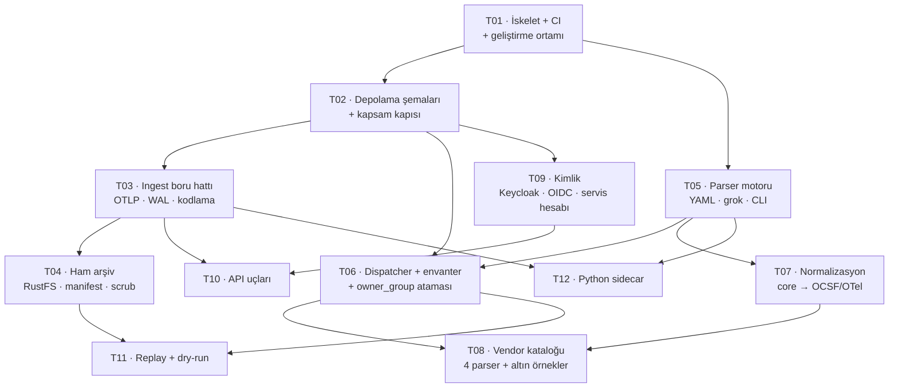

# F1 Implementasyon Ticket'ları

[F1 teknik plan](../f1-teknik-plan/index.md) 12 ticket'a bölündü.
Yöneten kararlar: [mimari kararlar](../mimari-kararlar/index.md) K1–K26.

**Hedef çatı:** .NET 10 (`net10.0`, LTS) — arm64 SDK 10.0.302 `~/.dotnet` altında.
İlk taramada görülmemişti; `dotnet` PATH'te SDK 8/9 taşıyan `/usr/local/share/dotnet`'e
çözülüyor (README).

**İlerleme:** on iki ticket da kapandı. Sonuç, ölçümler ve doğrulanmayanlar:
[F1 kapanışı](../f1-kapanis/index.md).

## Sıra ve bağımlılıklar

## Ticket listesi

| # | Ticket | Özü | Bağımlılık |
| --- | --- | --- | --- |
| T01 | [İskelet, geliştirme ortamı ve CI](iskelet-ve-ci/index.md) | Çözüm düzeni, docker-compose, Testcontainers, göç altyapısı, CI | — |
| T02 | [Depolama şemaları ve kapsam kapısı](depolama-ve-kapsam-kapisi/index.md) | ClickHouse `events`/`change_events`, Postgres kontrol düzlemi, `IScopedQuery`, mimari testler | T01 |
| T03 | [Ingest boru hattı](ingest-boru-hatti/index.md) | OTLP/HTTP uç, WAL, backpressure, kodlama tespiti + NFC | T02 |
| T04 | [Ham arşiv](ham-arsiv/index.md) | RustFS yazıcı, manifest, scrub, WAL kuyruk politikası | T03 |
| T05 | [Parser motoru](parser-motoru/index.md) | YAML şema, grok derleyici, pipeline adımları, CLI `lint/test/try` | T01 |
| T06 | [Dispatcher, envanter ve owner_group](dispatcher-ve-envanter/index.md) | Dört kademeli dispatcher, Aho-Corasick, kaynak→grup ataması | T02, T05 |
| T07 | [Normalizasyon](normalizasyon/index.md) | `core` alanları, OCSF/OTel türetme, eşleme tabloları | T05 |
| T08 | [Vendor parser kataloğu](vendor-katalogu/index.md) | FortiGate, Cisco ASA, MikroTik, nginx + altın örnekler | T06, T07 |
| T09 | [Kimlik ve yetkilendirme](kimlik/index.md) | Keycloak realm-as-code, OIDC/BFF, collector servis hesabı, audit | T02 |
| T10 | [API uçları](api-uclari/index.md) | `/v1/events`, `/raw`, `/sources`, `/changes`, `/health` | T03, T09 |
| T11 | [Replay](replay/index.md) | Bölüm değiştirmeli replay, `--dry-run` fark raporu | T04, T06 |
| T12 | [Python sidecar](sidecar/index.md) | Drain3 + pySigma imajı, HTTP sözleşmesi, devre kesici | T03, T05 |

## Dilimleme mantığı

Her ticket bittiğinde depo **çalışır** durumda kalıyor ve gösterilebilir bir şey
üretiyor:

- **T01–T04** bittiğinde: ham veri kaybolmadan iniyor ve kaybolursa haber veriyor.
Henüz parse yok — ama dayanıklılık omurgası ayakta.
- **T05–T08** bittiğinde: gerçek vendor logu normalize olarak ClickHouse'ta.
- **T09–T12** bittiğinde: [F1 planı §0](../f1-teknik-plan/index.md)'daki bitti
tanımının tamamı.

**T08 kasten sona yakın değil, ortada.** Motor tamamlanmadan gerçek vendor logu
görülmezse formatın eksikleri en pahalı anda ortaya çıkar.

## Kapsam dışı (F1 değil)

Sigma/detection (F3), React/Next UI (F2), agent senaryo motoru (F4), metrik/trace/
topoloji (F5), alert bildirim kanalları (F2), dağıtım/monitoring otomasyonu.
